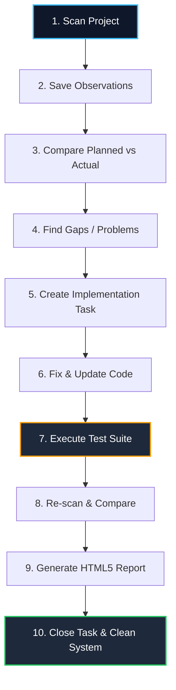

# PrimeCare Governance Development Lifecycle

This document defines the mandatory architectural workflow for adding new features, screens, and data logic to the PrimeCare platform. Compliance is enforced programmatically.

---

## 1. The "Four-Pillar" Workflow
Every new screen or major code change must involve these four systems in order. Bypassing any step will trigger a **Governance Violation** in the UI.

### Pillar 1: Registry Definition
*   **Location**: Relational SQLite Database (`.agents/governance/governance.db` -> `pages` table)
*   **Action**: Register the screen using `dart run .agents/governance/feature_cli.dart` to define the route name, role permissions, and localization labels.
*   **Rule**: Titles must be written as keys (e.g., `clinical.patient_intake.title`), never as raw text.

### Pillar 2: Architectural Layout (Blueprints)
*   **Location**: `packages/factory_system/primecare_ui/lib/src/registry/offices/`
*   **Action**: Map the route to a `PrimeCareScreenConfiguration`. 
*   **System Involved**: `UniversalScreenEngine`.
*   **Constraint**: All `componentLabels` must be localized keys.

### Pillar 3: Data Hydration (Adapters)
*   **Location**: `packages/primecare_adapters/`
*   **Action**: Ensure the `ViewModel` uses `LocaleKeys` for all dynamic text (KPI titles, labels, button text).
*   **System Involved**: `primecare_adapters`.

### Pillar 4: Smart Sync (i18n)
*   **Action**: Run `python apps/primecare_corporate/assets/translations/gen_translations.py`.
*   **Result**: Automatically populates `en.json` and `fr.json` and regenerates `LocaleKeys.dart`.

---

## 2. Verification System (The Guardrail)

To ensure high performance, we use an **Incremental Verification Engine**.

### How it works:
1.  **Scan**: The `lint_loose_text.py` script scans for hardcoded `Text('')` or `title: ''`.
2.  **Cache**: A `.lint_cache` file stores the MD5 hash of every "Clean" file.
3.  **Delta Rule**: If a file's hash matches the cache, it is skipped. Only new/changed code is verified.
4.  **Enforcement**: 
    - **Development**: Violations appear as red banners in the UI.
    - **Commit**: The Pre-Commit Hook blocks the push if any new "Loose Text" is found.

---

## 3. Converting Existing Code (Migration)

To convert the remaining "Loose Text" from older parts of the system:
1.  **Identify**: Run `python .agents/governance/lint_loose_text.py --full-scan`.
2.  **Register**: Insert identified raw text into the SQLite pages table (using `feature_cli.dart`).
3.  **Sync**: Run the translation engine.
4.  **Replace**: Update the code to use `LocaleKeys.[key].tr()`.

---

## 4. Platform Skill Integration
This system is not just for localization; it is a **Development Skill**.
- **Aura HUD Compliance**: New code must use the Aura HUD for telemetry.
- **Blueprint Compliance**: Screens must follow the structural blueprints defined in the Registry.
- **Factory Compliance**: All UI must be rendered via the `UniversalScreenEngine` to ensure global updates (like theme changes or font scaling) work instantly across all 251 screens.

---

## 5. Step-by-Step Testing + Completing Development

To achieve perfect platform architectural parity and complete new/existing features, developers and AI agents must follow this strict **Development Completion Loop**:

1.  **Scan full project**: Scan all folders, files, routes, screens, APIs, database schema, and test suites across the PrimeCare workspace.
2.  **Save scan result into governance DB**: Persist structural observations inside the relational SQLite database (`governance.db`), specifically tables:
    *   `code_files`
    *   `screens`
    *   `api_endpoints`
    *   `db_schema_tables`
    *   `db_schema_columns`
    *   `test_cases`
3.  **Compare planned vs actual**: Reconcile expectations:
    *   Does the planned screen exist?
    *   Does the real file exist?
    *   Does the route work?
    *   Does the API exist?
    *   Does the database table exist?
    *   Does the test exist?
4.  **Create drift findings**: Identify any structural gaps and record them in the `drift_findings` table:
    *   Missing files or route registrations
    *   Missing APIs or mismatching endpoints
    *   Missing security role permissions
    *   Missing test coverage
    *   Broken navigation links
    *   Naming/casing mismatches
5.  **Create implementation tasks**: Break findings down into actionable tasks:
    *   Map exactly one issue to one task record in `implementation_tasks`.
    *   Assign appropriate priorities (`low`, `medium`, `high`, `critical`).
    *   Link to related screen, API, or file identifiers.
    *   Assign the task to a specific AI agent or developer.
6.  **Fix task one by one**: Sequentially update code, routes, APIs, database schemas, access control list (ACL) permissions, and associated tests.
7.  **Run tests**: Run the fully comprehensive validation suite:
    *   Lint checks & formatting rules
    *   TypeScript (web) / Dart (app) static analysis
    *   Unit test suites
    *   API controller integration tests
    *   Cypress / widget end-to-end screen tests
    *   Role permission & route guard tests
    *   Database schema migration integrity tests
8.  **Save test result**: Log the test execution outcomes into:
    *   `test_runs` (run metadata, duration, summary)
    *   `test_results` (individual case status, error message, duration, timestamp)
9.  **Re-scan project**: Verify that the implemented fixes are real and compare findings against the governance database state again.
10. **Close task only if**: The validation criteria are fully satisfied:
    *   File exists on disk
    *   Route resolves and renders successfully
    *   API responds with correct payloads
    *   Database schema exactly matches blueprints
    *   RBAC/Role permissions are properly enforced
    *   All relevant test cases pass
    *   No new architectural or security drifts are created
11. **Generate HTML5 report**: Generate a visually stunning status summary including:
    *   Completed vs. failed tasks
    *   Remaining backlog
    *   Evidence/screenshots when possible
    *   Next-priority action items list
12. **Repeat until system is clean**: Continue this loop until the platform contains zero unresolved drifts or failed checks.

---

## 6. Governance Database Schema Additions

To track test runs, individual results, and task-level verification evidence, the governance database contains the following structural tables:

### 1. Test Runs (`test_runs`)
Tracks the overall metadata of an automated verification run.
```sql
CREATE TABLE test_runs (
  id INTEGER PRIMARY KEY AUTOINCREMENT,
  app_id INTEGER NOT NULL,
  run_name TEXT,
  run_type TEXT,
  status TEXT DEFAULT 'running',
  started_at TEXT DEFAULT CURRENT_TIMESTAMP,
  completed_at TEXT,
  summary_json TEXT,

  FOREIGN KEY (app_id)
    REFERENCES apps(id)
    ON DELETE CASCADE
);
```

### 2. Test Results (`test_results`)
Logs outcomes for individual test cases belonging to a run.
```sql
CREATE TABLE test_results (
  id INTEGER PRIMARY KEY AUTOINCREMENT,
  test_run_id INTEGER NOT NULL,
  test_case_id INTEGER,
  status TEXT NOT NULL,
  error_message TEXT,
  duration_ms INTEGER,
  created_at TEXT DEFAULT CURRENT_TIMESTAMP,

  FOREIGN KEY (test_run_id)
    REFERENCES test_runs(id)
    ON DELETE CASCADE,

  FOREIGN KEY (test_case_id)
    REFERENCES test_cases(id)
    ON DELETE SET NULL
);
```

### 3. Task Verification Checks (`task_completion_checks`)
Maintains granular evidence verification steps for implementation tasks.
```sql
CREATE TABLE task_completion_checks (
  id INTEGER PRIMARY KEY AUTOINCREMENT,
  task_id INTEGER NOT NULL,
  check_name TEXT NOT NULL,
  check_status TEXT DEFAULT 'pending',
  evidence TEXT,
  checked_at TEXT,

  FOREIGN KEY (task_id)
    REFERENCES implementation_tasks(id)
    ON DELETE CASCADE
);
```

---

## 7. Completion Rules & Final Governance Flow

### The Completion Rule
> [!IMPORTANT]
> **Do not mark any task as completed until testing proves it.**
> Any implementation task marked completed without associated passing records in `test_results` and positive sign-offs in `task_completion_checks` constitutes a major governance violation.

### Final Governance Flow
All developments must flow sequentially through this architectural pipeline:



$$\text{Scan} \longrightarrow \text{Save} \longrightarrow \text{Compare} \longrightarrow \text{Find Problem} \longrightarrow \text{Create Task} \longrightarrow \text{Fix} \longrightarrow \text{Test} \longrightarrow \text{Re-scan} \longrightarrow \text{Report} \longrightarrow \text{Close}$$
