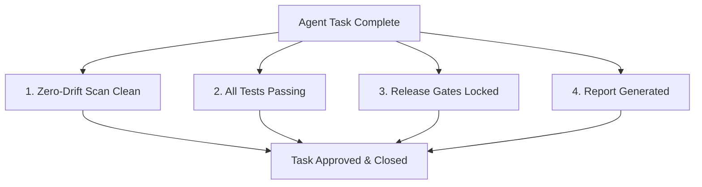

# Strict Agent Completion Rules

To enforce software governance standards across the PrimeCare platform, **no agentic task or PR is considered complete** until it satisfies the following strict verification gates:



---

## 1. Zero-Drift Scan Clean
* **Requirement**: Running the compliance delta scanner must yield a completely clean report with `100% COMPLIANT` status.
* **Verification Command**:
  ```bash
  python scripts/run_governance_guardian.py
  ```
* **Constraint**: Any schema drift, filesystem drift, or plaintext credentials must fail the pipeline immediately.

---

## 2. All Tests Passing
* **Requirement**: The test suite must execute cleanly with zero failed assertions.
* **Verification Table**: The `test_results` table in `governance.db` must have zero rows with `status = 'failed'`:
  ```sql
  SELECT COUNT(*) FROM test_results WHERE status = 'failed'; -- Must equal 0
  ```

---

## 3. Release Gates Locked
* **Requirement**: The release gates for the target release version must be programmatically locked and evaluated as `is_passed = 1` based on active database telemetry.
* **Verification Tables**:
  * `tests_pass`: No failed test results.
  * `security_clean`: Zero unresolved security findings.
  * `drift_resolved`: Zero open drift findings.
  * `migrations_complete`: Database migrations applied successfully.
  * `performance_acceptable`: Latency metrics verified below 500ms bounds.

---

## 4. Report Generated & Published
* **Requirement**: Synthesize the full 34-table HTML audit report documenting current compliance stats and save proof in the `reports/governance/` directory.
* **Verification Command**:
  ```bash
  python .agents/governance/generate_html_report.py
  ```

---

> [!IMPORTANT]
> **Enforcement Check**: These rules are active and verified by the CI/CD pipeline and the daily Zero-Drift Guardian cron job. Any commit bypassing these gates will be automatically rejected.
