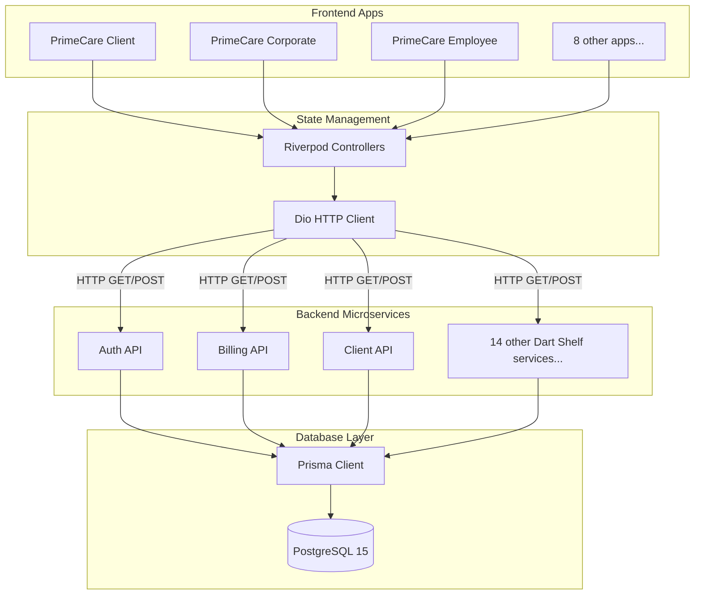

# PrimeCare Enterprise Platform

[](https://github.com/shaikhrais/primecare-platform/actions)
[](https://flutter.dev)
[](https://dart.dev)
[](https://www.prisma.io)

Welcome to the **PrimeCare Enterprise Platform**! This is a massive, highly-scalable monorepo housing 11 Flutter applications, 17 Full-Stack Dart microservices, and a PostgreSQL database synchronized via Prisma.

---

## 🏛️ Architecture Overview

The platform uses a unified language ecosystem (Dart) across both the frontend and the backend.



### Key Technologies
- **UI Framework:** Flutter
- **State Management:** Riverpod (`ConsumerWidget`)
- **Backend Framework:** Dart Shelf (`shelf_router`)
- **Networking:** Dio
- **Database ORM:** Prisma
- **Orchestration:** Docker Compose

---

## 🚀 Quick Start Guide

### Prerequisites
- Install [Docker Desktop](https://www.docker.com/products/docker-desktop/)
- Install [Flutter SDK](https://docs.flutter.dev/get-started/install)
- Install [Node.js](https://nodejs.org/) (for Prisma tooling)

### 1. Boot up the Backend Infrastructure
We have fully Dockerized the 17 microservices and the PostgreSQL database. Open your terminal at the root of the project and run:

```bash
docker-compose up --build -d
```
*This spins up the database on port `5432` and all 17 microservices sequentially from ports `3001` to `3017`.*

### 2. Synchronize the Database
Ensure your PostgreSQL database is fully hydrated with our modular schema logic:

```bash
cd packages/database
npm install
npx prisma db push
```

### 3. Run a Flutter App
Navigate to any of the 11 apps and launch it:

```bash
cd apps/primecare_client
flutter run
```

---

## 🛠️ Monorepo Structure

- `/apps/` - The 11 Flutter frontend applications.
- `/services/` - The 17 Full-Stack Dart backend microservices.
- `/packages/database/` - Centralized Prisma schemas and database configurations.
- `/scripts/` - Automated DevOps and Code Generation scripts.

---

## 🤝 Contributing
Please see the [CONTRIBUTING.md](./CONTRIBUTING.md) guide for detailed instructions on how to add new Riverpod controllers, Prisma schemas, and Backend Routes.

## 📄 License
Proprietary & Confidential. All rights reserved by PrimeCare.
