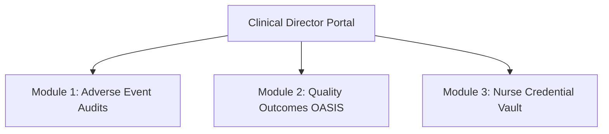

# Blueprint: Real-World Clinical Director Operations & Portal Modules

This blueprint outlines the professional responsibilities of a healthcare **Clinical Director** in modern medical facilities and shows how these clinical duties are mapped to screens, controllers, and database models in the PrimeCare system.

---

## 1. Professional Profile: What a Clinical Director Does

In the real world, a Clinical Director is a senior medical officer (typically an experienced RN, MD, or Nurse Practitioner) responsible for bridging the gap between clinical healthcare delivery and business management. Their primary responsibilities consist of:

1. **Quality Assurance & Care Standard Standardization**: Establishing evidence-based clinical protocols (e.g., standard wound care, infection management) and ensuring caregivers adhere to them.
2. **Clinical Incident Investigations & Safety Reviews**: Acting as the regulatory authority to investigate slips/falls, medication errors, and clinical complications.
3. **Regulatory Auditing & Inspection Compliance**: Maintaining facility licensing standards, audit logs, and professional clinical credentials.
4. **Care Authorization & Approvals**: Legally reviewing and signing off on patient admission criteria, complex medication changes, and hospice or pediatric referrals.
5. **Outcome Metric Monitoring**: Reviewing clinical outcome indicators (like MDS-HC or OASIS health scores) to evaluate treatment success rates.

---

## 2. Proposed Modules: Expanding the Director's Capabilities

To fully support these real-world responsibilities, we propose implementing three high-fidelity operational modules within the PrimeCare Clinic Portal:

### Module 1: Adverse Drug Event (ADE) Alert & Auditing Panel
* **Real-World Value**: Prevents medical errors and monitors controlled substance distribution. The Director reviews alerts where nurses flags medication discrepancies, patient allergies, or negative drug interactions.
* **Component Composition**:
  - **Medication Reconciliation Table**: Lists patient, prescribed drug, dosage, and administering clinician.
  - **Drug-Allergy Alert Grid**: Highlights active allergy conflicts in red.
  - **Clinical Override Button**: Allows the Director to review medical exceptions and authorize custom drug administration routes.
* **Controller State**: `StateNotifierProvider` listening to `/v1/clinical/medication/audits`.

### Module 2: OASIS / MDS-HC Quality Outcomes Center
* **Real-World Value**: Healthcare platforms must report patient recovery and rehabilitation outcomes to government bodies for funding and billing audits.
* **Component Composition**:
  - **Clinical Performance Trend Chart**: A multi-series line chart tracking patient pain management, mobility recovery, and clinical healing index averages across branches.
  - **National Benchmark Contrast Bar**: Compares local clinic performance with national averages.
  - **Quality Improvement Plan Dispatcher**: A form to assign training tasks to underperforming care team branches.
* **Controller State**: `StateNotifierProvider` bound to `/v1/clinical/metrics/outcomes`.

### Module 3: Caregiver Competency & Licensing Vault
* **Real-World Value**: Protects the clinic against legal liabilities by ensuring no caregiver (RN, RPN, PSW) is dispatched to patients without active licenses, CPR certificates, or background checks.
* **Component Composition**:
  - **Credential Registry Grid**: Lists staff name, license number, license type, verified status, and expiration count.
  - **Expiration Warning HUD**: Displays yellow/red cards for licenses expiring within 30 days.
  - **Instant Dispatch Suspension Toggle**: Disables dispatch matching for caregivers with expired credentials.
* **Controller State**: `StateNotifierProvider` syncing with `/v1/clinical/staff/credentials`.
