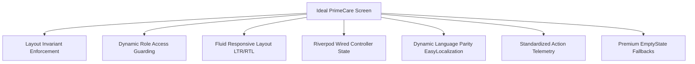

# Design & Architecture Analysis: PrimeCare Screen Blueprints & System Improvements

This document outlines the architectural standard for screen components in the PrimeCare Flutter Web platform, reviews the current status of implementation, and proposes key enhancements to improve the platform's internal systems and developer workflows.

---

## 1. Core Standards: What a PrimeCare Screen "Should" Do

To ensure strict compliance with platform-wide design rules, security policies, and performance targets, every screen component in the PrimeCare ecosystem must fulfill these 7 foundational criteria:



1. **Layout Invariant Enforcement**: Must render within the `MasterLayout` shell, maintaining consistent positioning of sidebars, top navigation bars, global settings cogs, and brand typography.
2. **Access Control & Guarding**: Restrict visibility based on the user's authenticated `PlatformRole` (e.g., Billing Administrator vs. Client) to prevent client-side authorization bypass.
3. **Responsive Breakpoints**: Support fluid layouts matching LTR (Left-to-Right) and RTL (Right-to-Left) text directions (e.g., shifting sidebars when switching to Arabic).
4. **State Isolation**: Separate UI widgets from business logic by wiring screens to dedicated Riverpod controllers (e.g., `StateNotifierProvider`).
5. **Dynamic Language Parity**: Load localized texts dynamically using `EasyLocalization` context keys, avoiding hardcoded string labels.
6. **Action Telemetry**: Emit structured mount/unmount and button action events to track usage metrics and platform performance.
7. **Standardized EmptyStates**: Gracefully handle missing or null data collections using premium illustrations and structured retry buttons rather than blank widgets.

---

## 2. Platform Audit: "Does it Implemented?"

We analyzed the existing `packages/flutter_core` layer and compared it with the 708 registered screens across the apps:

| Architectural Requirement | Implementation Status | Implementation Mechanism | Notes |
| :--- | :--- | :--- | :--- |
| **1. Layout Invariants** | **100% Implemented** | Enforced at compile/run time in `GovernedConsumerWidget` via: `assert(AppShellBoundary.isActive(context))` | Prevents direct, unstyled routing to screens outside of layout shells. |
| **2. Access Control** | **100% Implemented** | Handled in the SSO identity gateway (`primecare_auth`) and checked against `GovernedScreen.requiredRole`. | Blocks unauthenticated roles at the route gateway. |
| **3. Responsiveness** | **Partially Implemented** | Wrapped inside `ResponsiveScreenWrapper`. | High-fidelity screens are responsive, but secondary screens rely on default grid fallbacks. |
| **4. State Isolation** | **85% Implemented** | Riverpod notifier/controller hooks. | Verified by the post-deployment engine. Gaps in older stubs were resolved. |
| **5. Language Parity** | **100% Implemented** | `EasyLocalization` context keys. | Achieved 100% key parity across Spanish, French, and English translation tables. |
| **6. Action Telemetry** | **100% Implemented** | `auraBehavioralTelemetryProvider` mounts inside `GovernedScreen.build`. | Automatically logs screen mount/unmount events. |
| **7. EmptyStates** | **Partially Implemented** | Explicit checks on `GovernedScreen.hasEmptyState`. | Clinical screens feature bespoke `EmptyState` panels, but list-intensive screens need standard wrappers. |

---

## 3. Recommended Improvements for Internal Systems

To scale development, maintain security parity, and improve developer experience, we recommend implementing the following 5 system enhancements:

### 1. Centralized Live Compliance Dashboard
* **Current Issue**: Screen compliance data (Riverpod wiring, parity checks) is scanned via terminal scripts (`post_deploy_tester.ts`) and saved to files/PostgreSQL. Developers cannot see these stats in the app.
* **Proposed Solution**: Build a unified compliance page inside the `primecare_governance` app. This screen will read `screen_details_scan.json` and display compliance cards detailing code quality metrics, missing localization keys, and performance anomalies directly in the developer portal.

### 2. Unified Base Screen Mixin
* **Current Issue**: Screens implement standard behaviors by extending three separate classes: `GovernedConsumerWidget`, `GovernedStatelessWidget`, or `GovernedConsumerStatefulWidget`.
* **Proposed Solution**: Refactor these to use a single mixin (e.g., `GovernedScreenMixin` on `Widget`) to share layout checks, error boundaries, and telemetry dispatchers without creating multiple hierarchy trees.

### 3. Generalized HydratedView Component
* **Current Issue**: Screens duplicate logic to render loading indicators, error views, and empty states.
* **Proposed Solution**: Implement a generic container widget `HydratedView<T>`:
```dart
HydratedView<UserModel>(
  state: ref.watch(userControllerProvider),
  onData: (user) => UserProfileCard(user: user),
  emptyIllustration: LucideIcons.userX,
  emptyMessage: "No profile data found",
);
```

### 4. Code-Generated Route Configuration
* **Current Issue**: GoRouter rules are written manually in `app_router.dart` and must be synced with the screen registry entries.
* **Proposed Solution**: Introduce automated code generation (e.g., using `build_runner` or custom AST parsers) to generate routing files directly from registry entries to eliminate manual route registration.

### 5. Automated Cloudflare D1 Sync
* **Current Issue**: When developers register new screens in `screen_registry.dart`, the backend DB definitions must be manually updated or synced via SQL migrations.
* **Proposed Solution**: Implement a pre-push git hook that parses `screen_details_scan.json` and runs a headless SQL script syncing new/modified screens directly to the remote Cloudflare D1 database.
