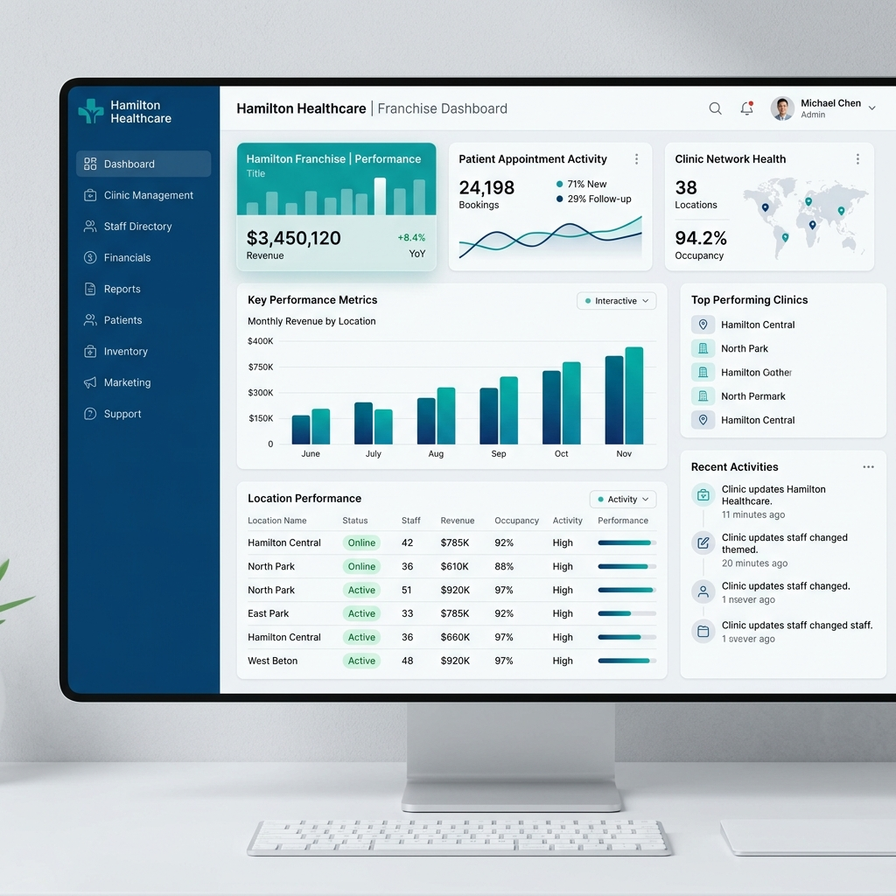
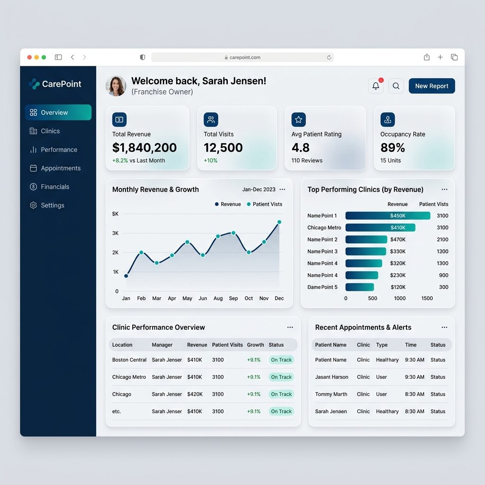
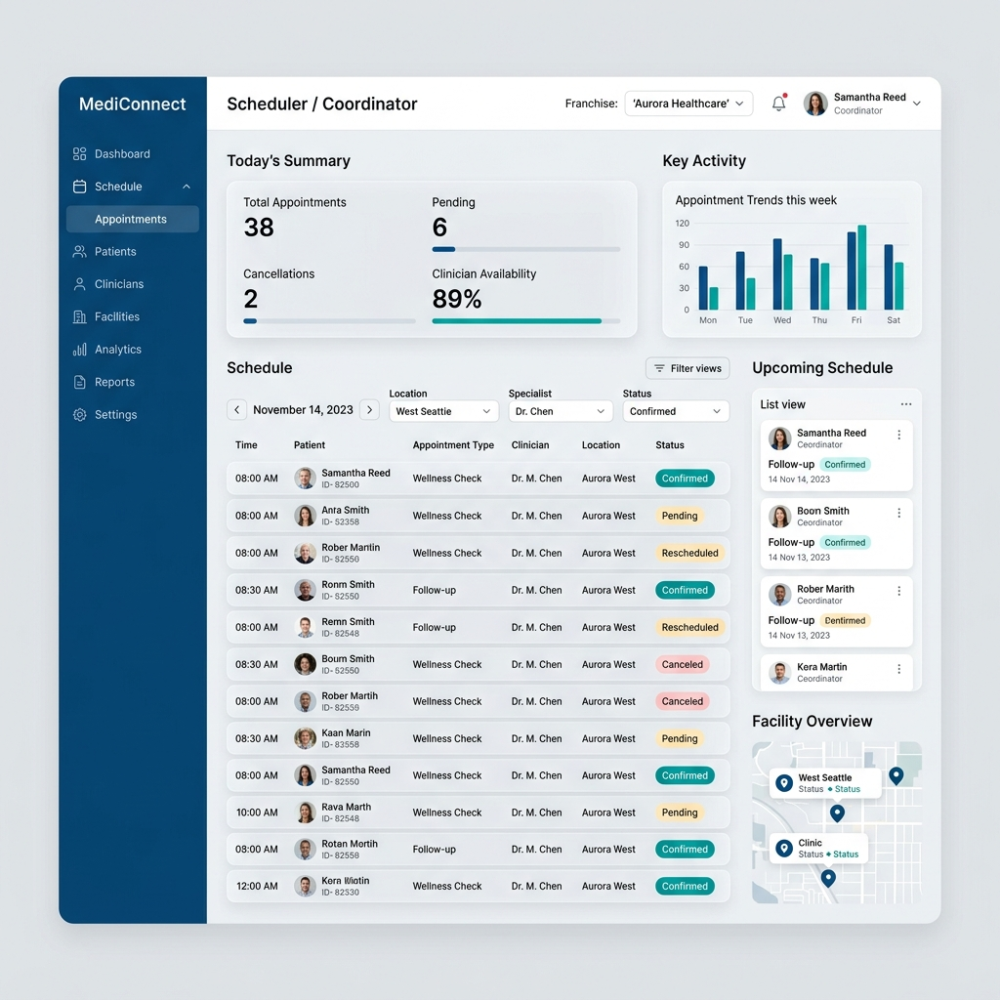

# PrimeCare Role: Franchise Management

This document contains the actual system renders for the **Franchise Management** role.

## Dashboard Billing 1774748718740

## Dashboard Franchise Level 1774748665789

## Dashboard Franchise Owner 1774748681581

## Dashboard Hr 1774748736005

## Dashboard Operations Mgr 1774748695522

## Dashboard Scheduler 1774748707161

