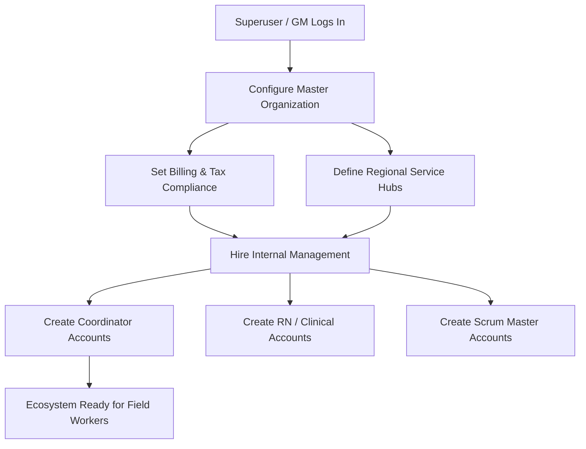
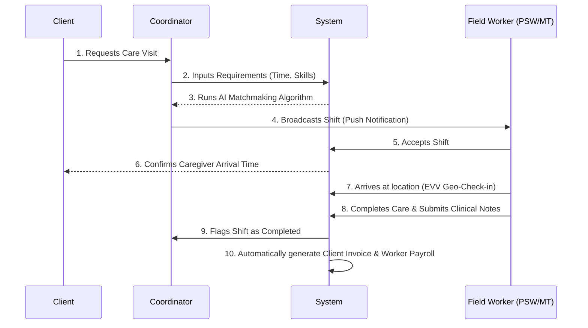
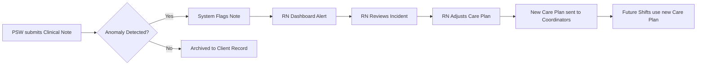

# PrimeCare Ecosystem: Master Business Flows

This document outlines the standard operating procedures and lifecycles of the PrimeCare platform. It maps out exactly how the business boots up from zero, and how the various roles continuously interact in infinite operational loops (the "round and round").

---

## Flow 1: Master Agency Genesis (The "Boot Sequence")
*This is how the business actually starts. The Master Agency (General Manager) provisions the initial ecosystem.*

**Step-by-Step:**
1. **Platform Initialization**: The General Manager configures the core financial parameters (Stripe integration, Tax percentages) and establishes the geographical limits of the business.
2. **Management Procurement**: The GM creates the internal accounts for the Operations team (Coordinators) and Clinical team (RNs).
3. **Ecosystem Activation**: With Management in place, the system is now ready to mass-onboard Field Workers (PSWs, MTs) and accept external Clients.

---

## Flow 2: The Daily Dispatch Loop (The "Round and Round")
*This is the endless engine of the business. It is the infinite loop where demand meets supply, governed by the Coordinator.*

**The Loop Mechanics:**
- This cycle plays out hundreds of times a day. 
- **The Magic:** As the system completes Step 10 (Invoice/Payroll), it cleanly prepares the Field Worker for their very next shift, starting the loop over again continuously.

---

## Flow 3: Clinical Governance & Incident Resolution
*While the Dispatch Loop generates revenue, the Clinical Loop ensures safety, compliance, and quality control.*

**Integration:**
- The RN acts as the safety net over the daily operations. If a PSW reports a patient fall or severe health degradation, the RN intercepts the flow, alters the Master Care Plan, and protects the business from liability.

---

## Flow 4: Platform Telemetry & Growth (Executive Loop)
*How the higher-ups (GM & Scrum Master) monitor the infinite loops to grow the business.*

1. **Scrum Master**: Monitors the Cloudflare Edge API and database architecture to ensure that the "Round and Round" dispatch loop never crashes under heavy load (Surge Pricing triggers).
2. **General Manager**: Reviews the *Macro KPIs* outputted by these loops (Payroll vs. Billables, Total Active Matches) to determine if they need to deploy Marketing Pushes or hire more Field Workers.
