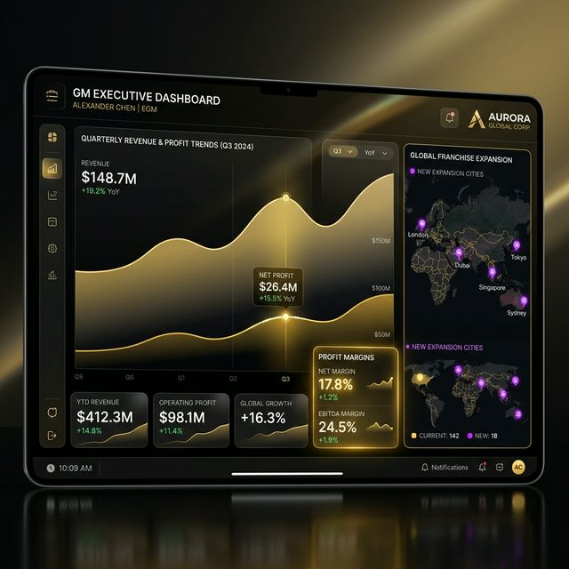
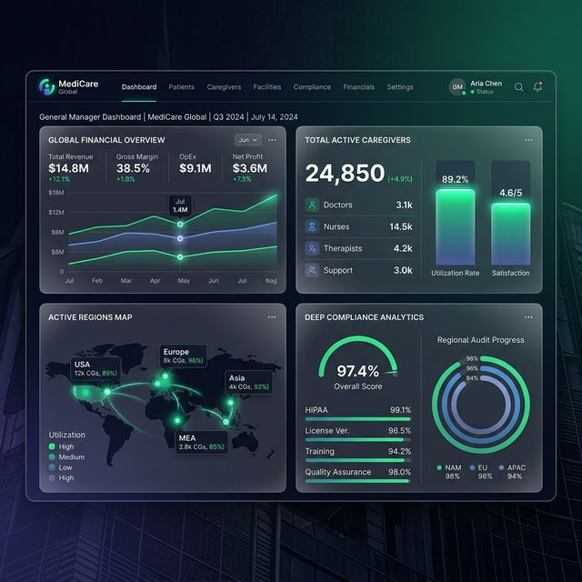
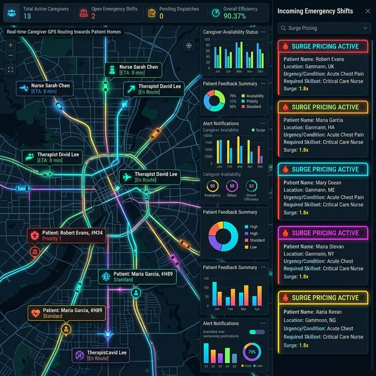
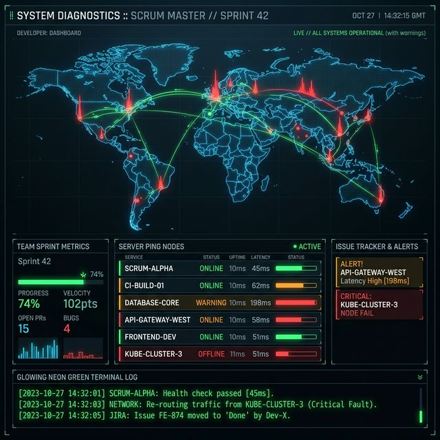
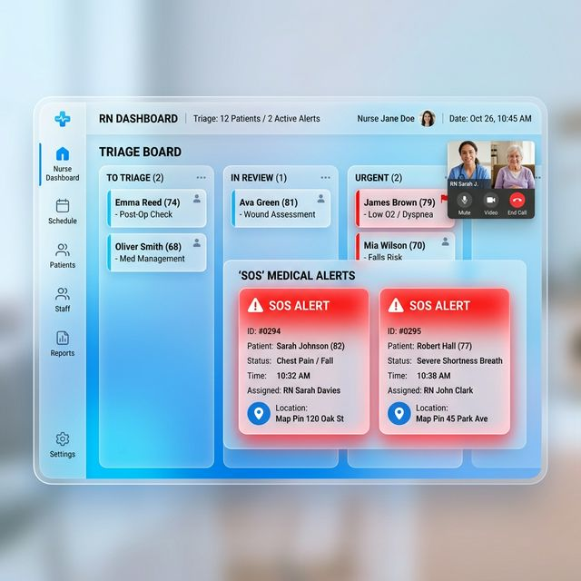
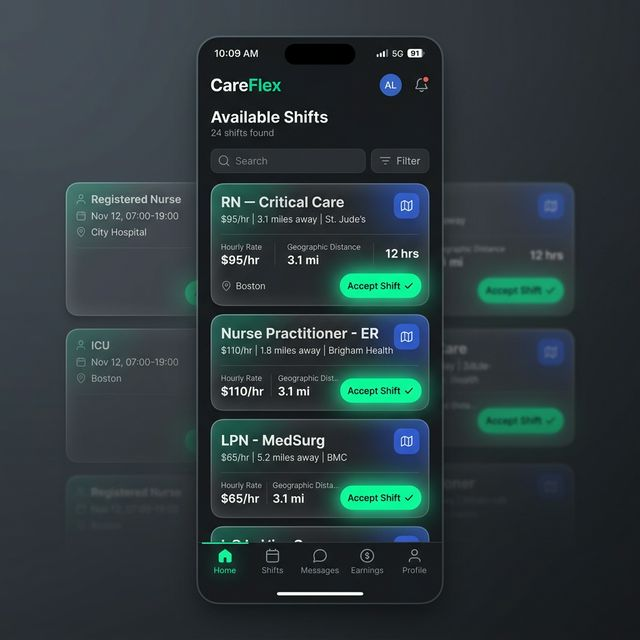
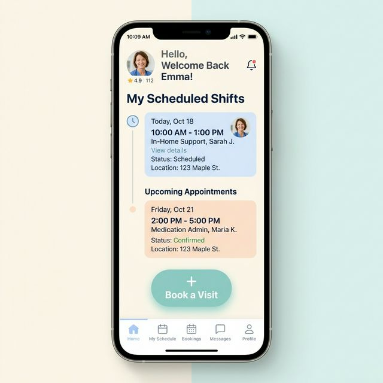

# PrimeCare Master Role UI Showcase
*This gallery visualizes exactly what we have designed for the different Entities across the platform.*

---

## 1. The General Manager (Executive Hub)
*High-level financial telemetry, Franchise Expansion geographic maps, and EBITDA metrics.*

## 2. Master Agency (Superuser Control)
*The root node. Manages Tenant creation, Cloudflare Ecosystem metrics, and global API limits.*

## 3. Coordinator (Logistics & Matchmaking)
*The operational engine. Relies on Geospatial dispatch, surge multi-toggles, and the Jane Matrix.*

## 4. Scrum Master (Tech Diagnostics)
*Dark mode. Raw server pings, Edge Node traffic visualization, database telemetry arrays.*

## 5. Registered Nurse (Medical Oversight)
*Sterile Kanban boards tracking patient incident tickets alongside integrated WebRTC Video Triage hooks.*

## 6. Personal Support Worker (Field Operations)
*Real-time Matchmaking feeds optimized for Thumb-Reach thumb-zones. Geo-fenced Check-ins.*

## 7. Client (Patient App)
*Calming, ultra-accessible UI optimized for non-technical demographics to book and review care.*

