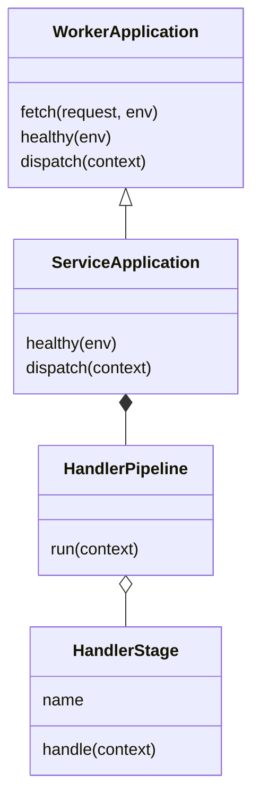

# Central class structure and migration

## Goal and current scope

Centralize shared behavior so one tested change reaches every existing service deployment. Use a shallow inheritance tree for the common HTTP lifecycle and compose feature handlers beneath it. This refactor changes the existing TypeScript Worker service entry point; it does not claim a full repository migration, new endpoints, completed workflows, or a production deployment.

The existing Cloudflare service configurations continue to target `cloudflare/workers/src/service.ts`. That entry now exports a `ServiceApplication` instance. No deployment URLs or binding names change.

## Exact implemented file responsibilities

| File | Responsibility | Central changes affect |
| --- | --- | --- |
| `cloudflare/workers/src/service.ts` | Stable runtime entry and class instance | All Workers using this entry |
| `cloudflare/workers/src/runtime/worker-application.ts` | Base class: service CORS, preflight, root, health response, 404/501 fallback, sanitized 500 response | All inherited service requests |
| `cloudflare/workers/src/service-application.ts` | Derived class: DB health check and explicit handler registration | Handler precedence for existing services |
| `cloudflare/workers/src/runtime/handler-pipeline.ts` | Immutable registration and first-response dispatch | Shared orchestration |
| Existing feature handler files | Validation, session and tenant checks, ownership, projections, SQL transactions, audit and retry rules | Their own approved workflows |
| `cloudflare/workers/src/gateway.ts` | External routing, aliases, forwarding and gateway response policy | Gateway requests; retains its distinct CORS contract |
| `scripts/test-worker-application.mjs` | Base/pipeline behavior and concurrent request isolation | Regression protection |

The order remains legacy domain, auth, client booking lifecycle, provider timesheet items, provider records, provider self, client self, governance, workspace. The auth stage retains source login limiting before auth dispatch. Every handler may decline a request by returning null. The first returned response stops the pipeline. Exceptions reach the existing sanitized service error boundary.

## Central control is split by responsibility

| Concern | Existing home to reuse | Rule |
| --- | --- | --- |
| API runtime | WorkerApplication and ServiceApplication | Shared transport behavior belongs here |
| Business workflows | Existing domain packages and feature handlers | Preserve workflow-specific state transitions and transactions |
| Security and authority | Existing security package, auth helpers and governance.db | No inference of write permission from role names or read access |
| Database | Existing infrastructure/repositories and Worker DB helpers | Parameterized SQL and tenant/resource binding remain enforced |
| API models/contracts | Existing contracts and domain packages | DTOs contain permitted fields, not privileged database rows |
| Flutter transport | `packages/flutter_core/lib/src/network/api_client.dart` | Reuse the shared client; screen files do not own API URLs |
| Flutter visuals | Existing primecare_ui package | Reuse approved components, theme tokens and localization |
| App-specific composition | Existing app bootstrap/shell | Select dependencies and capabilities; do not duplicate business rules |

There is no universal parent model/controller/service/widget. An API application and a Flutter widget have different lifecycles. Each may have its own small base class where shared behavior is real. Dependencies between layers use explicit interfaces and constructor injection rather than deep inheritance.

## File types for future migration

Create these files only when an actual workflow needs them. These are responsibility categories, not a request to create empty files in every app.

| File type | What it contains | What it depends on |
| --- | --- | --- |
| Model or DTO | Validated request/response data | Approved contracts |
| Entity/value object | Business identity and invariants | Domain types |
| Controller/handler | Transport input and result mapping | A use case and security boundary |
| Use-case/service class | One business operation and transaction intent | Policy and repository interfaces |
| Policy class | Explicit business/security decisions | Governed decisions and authenticated context |
| Repository interface | Required persistence operations | Domain types |
| Repository implementation | Database queries and result validation | Infrastructure and the interface |
| UI controller/state | Loading, result, error, cancellation | Shared API client and DTOs |
| Screen/widget | Presentation, accessibility, user input | Approved UI components and state |
| Composition root | Dependency wiring | Concrete adapters and classes |
| Test | Observable contract and deny/failure behavior | The layer under test |

## Policy parameters

Central configuration must not silently expand permission. Reuse governed policy and configuration records. Before making a value configurable, record its source, allowed type/range, scope, default, change authority, audit behavior and enforcement tests. Examples to review include rate limits, body limits, pagination bounds and origin lists. They remain at their existing approved values in this refactor.

Authenticated actor, token, tenant, request headers and transaction state are local to a request. Never store them on the shared application instance. A long-lived class is allowed to hold immutable handler registration and stateless dependencies. Authorization still occurs inside the existing workflow boundary before protected reads or writes.

## Wider rearrangement sequence

1. **Implemented:** stable service entry, base request lifecycle, derived service application, ordered pipeline and behavior tests.
2. **Pending:** recover each existing feature's defined contract and map validation, policy, persistence and presentation responsibilities. Preserve the governance identities and finite checklist.
3. **Pending:** migrate one coherent feature into a use-case class with injected policy/repository interfaces. Keep its old exported function as a compatibility adapter until callers and tests migrate. Avoid classes that merely wrap a function without owning a useful responsibility.
4. **Pending:** extract shared repository/security behavior only after confirming identical contracts. Booking write transactions and read-only timesheet transactions must not be forced into one generic CRUD implementation.
5. **Pending:** move duplicated Flutter state/network behavior into the existing flutter_core package. Keep app screens presentation-only and preserve protected-path caching/error rules.
6. **Pending:** migrate additional feature families after their deny, cross-tenant, replay, malformed result, rollback and client-binding tests pass. Update source-bound generated metadata after every move.
7. **Pending:** deploy and verify the migrated build through the existing release process. CI success alone is not production evidence.

## Future extensions

Register an existing authorized handler in the pipeline when a service needs it. A new feature requires governed API identity, contracts, authority, persistence, audit, idempotency where applicable, tests and caller bindings before activation. Registration creates no permission by itself. Keep the pipeline order explicit because overlaps and aliases can affect behavior. Gateway changes require separate route/method tests.

## Validation and honest accounting

Focused tests cover origin rejection, preflight without DB access, root/health envelopes, unmatched and unimplemented routes, response preservation, sanitized failures, immutable ordered stages and concurrent request isolation. Existing API/gateway and PostgreSQL suites exercise real handlers through the stable entry. Source evidence includes the new runtime files.

This is an architectural refactor with zero new API implementation or retirement credits. The finite baseline remains 1,415 unique operations: 343 with recorded unit evidence, 9 retired with evidence, 1,049 pending and 14 blocked. Generated contract scaffolds remain nonexecutable and do not establish authorization.
