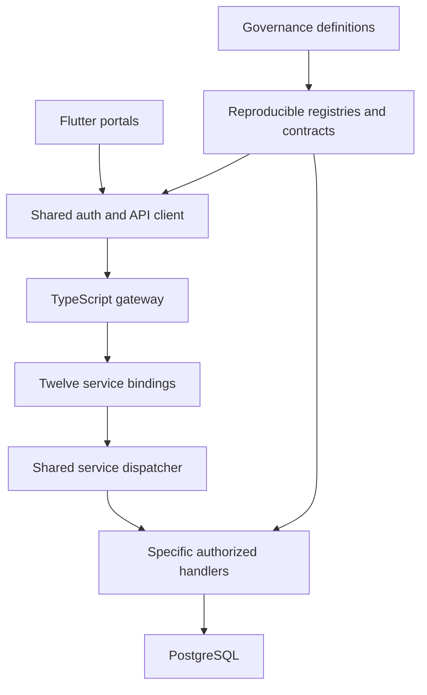

# PrimeCare complete technical manual

Generated from the source-controlled technical chapters. Observed behavior, requirements, proposals and open decisions remain distinct. This manual does not certify API completion or production readiness.

---

## Chapter 1: README.md

<!-- Source: docs/technical/README.md; SHA256: d4ebb7782d1cc659a6aeac50e5ff027312c2790d105ca43c91befa554158111e -->

# PrimeCare technical specification and operating manual

## Purpose and evidence boundary

This documentation baseline describes how to develop, validate, operate, and release PrimeCare, and records the work still required before its unresolved workflows can run. Source baseline: `3979ed1028c8b7dfdb9acca72b1ea53d4d034127`. The documents are technical requirements and operating instructions, not a statement that every requirement is implemented or that production is ready.

The governing repository rules are `.agents/AGENTS.md`. Governance declarations, explicit grants, actual callers, persistence models, handlers, and tests must agree. A generated file, descriptive route name, an `active` database label, or a passing nonblocking aggregate cannot establish that agreement alone.

### Requirement vocabulary

| Label | Meaning | Implementation consequence |
| --- | --- | --- |
| Observed | Verified against the cited source at the baseline commit | Preserve and test the actual behavior; investigate conflicting evidence |
| Required | Repository rule or acceptance criterion for the planned implementation | Work is incomplete until evidence demonstrates it |
| Proposed | An engineering or business choice awaiting a recorded decision | Do not treat it as an approved permission, workflow, or production setting |
| Open | Source does not define the needed rule, or sources conflict | Record the question, owner responsibility, options, and dependent tasks |
| Verified | A specific test or inspection passed against an identified version | State exactly what it proves and what it does not prove |

## Reading order

For a single-file version of all chapters and the family register, open [the complete technical manual](PRIMECARE_TECHNICAL_MANUAL.md).

1. [System requirements](system-requirements.md): product boundaries, project inventory, detailed requirements and acceptance criteria.
2. [Architecture and data](architecture-data.md): runtime topology, bounded contexts, models, transactions and invariants.
3. [Security and authorization](security-authorization.md): observed identity/session behavior, role/tenant/resource boundaries and unresolved policies.
4. [API and workflow contracts](api-workflow-contracts.md): the 16 required contract sections, field-level authoring rules and domain-specific questions.
5. [Runtime operations](runtime-operations.md): prerequisites, local development, configuration, deployment, database operations and incident procedures.
6. [Testing and release](testing-release.md): test layers, evidence requirements, release gates, rollback and artifact validation.
7. [Implementation plan](implementation-plan.md): ordered work packages, dependencies, task breakdown and exit criteria.
8. [Identity work package](identity-work-package.md): a concrete example of reconciling primary evidence, conflicting methods, DTOs and incorrect grant attribution.
9. [Family decision register](family-decision-register.md): exact operation membership and actual outstanding decisions for all 106 reviewed families.
10. [Operation register](operation-register.json): every exact method/path pair, declaration IDs, baseline evidence stage and contract obligations.
11. [Project inventory](project-inventory.json): source-pinned project directories and manifest blob identities.

## Current finite baseline

| Stage | Unique operations | Interpretation |
| --- | ---: | --- |
| Unit evidence recorded | 343 | Evidence of focused tests exists; operation-specific PostgreSQL and production evidence is not mapped |
| Retired with evidence | 9 | Declaration retired with an explicit reason; this is not a new runtime implementation |
| Needs contract and verification | 1,049 | Implementation and/or contract evidence is unresolved |
| Explicitly blocked | 14 | A known blocker prevents progression |
| Total | 1,415 | Fixed method/path baseline; duplicate references never multiply this count |

The 1,063 unresolved operations belong to 106 reviewed families. The earlier contract factory produced 1,063 draft structures with 17,008 missing decision slots. Those counts describe documentation gaps, not the number of independent business approvals necessarily required: a verified shared policy can address several operations, but equivalence must be explicit.

## How to use these specifications

For a selected operation, locate its immutable `API-…` requirement ID in the operation register, then follow its family IDs to the actual decision questions and evidence paths. Recover all defined fields and rules before proposing missing ones. Record any method migration separately from implementation so the historical baseline remains auditable. Never automatically relabel a POST declaration as a GET implementation merely because its URL looks like a read.

For a release, use the runbooks and testing criteria for the selected runtime. Record commit SHA, governance database fingerprint, migration set, configuration names, artifact digests, applicable CI results and rollback version. Do not copy secret values into this book or evidence artifacts.

## Maintaining the baseline

Regenerate operation/family traceability after an approved finite-checklist or review change:

```sh
python3 scripts/build-technical-operation-register.py
python3 scripts/build-technical-operation-register.py --check
python3 scripts/check-technical-docs.py
```

These commands update documentation or validate it; they do not activate routes, approve grants, mutate governance, or complete APIs. The project inventory is a reviewed snapshot; refresh it from Git trees and manifest blobs when project structure changes, rather than inferring project count from old chat messages.

Any claimed implementation completion must link the governing contract, actual code, relevant tests, exact CI head and mapped runtime evidence. Changes to a document's wording or generated fields do not count as completed operations.

## First executed implementation step

P00 grant-evidence recovery was implemented and merged in PR #151, commit `8bea69963c12d73f0c000a2632f41d27acdf76ef`, after two applicable workflows passed against head `208806f588f6688a9faa36c582c850c0178ab8f0`. The audit's 16 tests passed. The tracked governance database was not changed.

The actual report audited all 1,063 unresolved operations, retaining 52,096 raw grant rows across 814 operations. All returned registry correlations had differing method/path identities. This is a concrete integrity problem to investigate; a string/key correlation alone does not prove the original grant's approved business meaning. No endpoint was activated. The detailed source-bound findings and remaining phases are recorded in [execution-state.json](execution-state.json).

---

## Chapter 2: system-requirements.md

<!-- Source: docs/technical/system-requirements.md; SHA256: cadfb80958439ec9e182e0cb599905a155016f77f20c3a75a05e687afb18a625 -->

# PrimeCare system requirements and acceptance specification

## Document control and interpretation

Evidence baseline: repository commit `3979ed1028c8b7dfdb9acca72b1ea53d4d034127`. The working snapshot contains selected audit inputs, not a complete checkout. Statements labelled **verified** describe inspected source or pinned audit artifacts; they do not certify deployed behavior. Statements labelled **required** translate repository engineering rules into acceptance criteria. Statements labelled **decision required** are deliberately unapproved product or operational choices. A requirement is not a new permission grant, route declaration, clinical instruction, or production approval.

Authority: `.agents/AGENTS.md` requires governance-first development, endpoint contracts, least privilege, accessibility, localization, evidence-based implementation tags and backward compatibility. `docs/api/api-delivery-checklist.json` counts exact HTTP method plus path. A different method is a different operation; duplicate callers, generated code, field repairs and test totals earn no additional API completion credit.

Verified baseline: 1,415 unique operations; 343 with recorded unit evidence; 9 retired with evidence; 1,049 needing contract and verification; 14 blocked. The 343 have no operation-specific PostgreSQL or production evidence mapping in this checklist. `docs/api/workflow-contract-plan.json` groups 1,063 unresolved operations into 106 review families. Code-generation outputs are nonexecutable review descriptors. Treat every unresolved operation as unresolved until its own acceptance evidence exists.

## Actors and authority model

| ID | Actor or context | Verified source | Required boundary |
|---|---|---|---|
| ACT-001 | Authenticated user | `User`, `auth_sessions` queries, Flutter `AuthState` | Session subject identifies actor; request body cannot nominate a privileged actor. |
| ACT-002 | Client profile owner | `ClientProfile`, `client-self.ts`, client record registry | Identity-to-profile and tenant match must be demonstrated before disclosing records. |
| ACT-003 | Provider profile owner | `ProviderProfile`, `provider-self.ts`, provider record registry | Ownership does not grant access to all patient or organizational records. |
| ACT-004 | Tenant or administrative operator | Tenant relations, `account-admin.ts`, governance grants | Explicit operation scope and target tenant required; visible administrative UI alone is insufficient. |
| ACT-005 | Family or delegated participant | `FamilyMember`, family models | Relationship model is evidence of storage only; subject consent and delegation policy must be approved. |
| ACT-006 | Automation/integration identity | `ApiKey`, `WebhookEndpoint`, AI models | Separate machine identity, source dataset permission and delegated mutation boundary required. |
| ACT-007 | Anonymous visitor | Login/recovery handlers and public UI context | Access only to explicitly public operations; no default business-data access. |

Role names, role categories and role-to-screen links must be obtained from governance. Do not turn this actor classification into hardcoded role names in screen code. A missing endpoint permission-key column does not by itself prove no authority exists: inspect linked role grants, target scope, ownership constraints and existing policy. Conversely, a screen grant or generic all-role action cannot prove record-level authorization.

## Operation specification: mandatory fields

Every exact operation must have one controlled record containing all fields below. An omitted field is an unresolved decision, not an invitation to infer a permissive default.

| Field | Required detail and validation |
|---|---|
| Identity | Governance declaration IDs; exact method and normalized path; service; version; canonical route and each compatibility alias. |
| Purpose | User goal, permitted actor, business owner, source requirement and exclusion boundaries. |
| Trigger | Caller screen/element/controller or system event; when invoked; whether optional or required. |
| Preconditions | Active session, applicable grant, resource existence, tenant membership, workflow state and relevant consent. |
| Request | Path/query/header/body schema; requiredness; type; enum; precision; length; timezone; maximum collection size; unknown-field policy. |
| Response | Status, content type, field schema, nullability, pagination, ordering, derived-field formula and sample free of real patient data. |
| Validation | Order of structural checks; domain constraints; normalization; contradictory values; malformed identifiers; rejection behavior. |
| Authentication | Credential format; issuer/session store; expiry/revocation handling; ambiguous credential rejection; cookie protections. |
| Authorization | Approved role grant or ownership policy; target selection; scope; branch/tenant/global boundary; explicit denial tests. |
| Data handling | Tables and columns read/written; sensitive fields; minimum disclosure; redaction; retention and deletion decision references. |
| State transition | Allowed source states, resulting state, immutable history, actor, reason, timestamp and conflict response. |
| Transaction | Atomic writes, locks, unique constraints, rollback path, isolation assumptions and concurrent request behavior. |
| Idempotency | Applicable methods; scope and storage; payload hash; replay result; conflicting key response; expiry decision. |
| Audit | Event identity, actor, tenant, target, outcome, correlation ID, redacted change summary and durable recording boundary. |
| Failures | Unauthenticated, forbidden, malformed, absent resource, conflict, throttled, dependency failure and unsupported operation. |
| Rate limits | Subject/source/tenant bucket; approved thresholds; retry metadata; failure behavior when limiter unavailable. |
| Compatibility | Consumers affected; old method/route behavior; migration and retirement evidence; no silent write-to-read aliasing. |
| Verification | Unit, handler, gateway, PostgreSQL, client and release evidence; exact tested commit; owner and known limitations. |

Required implementation tags must distinguish `template_only`, missing API, connected transport, tested workflow and approved release. A passing compile or screenshot cannot change an unresolved operation into implemented.

## Functional requirements

### Identity and session lifecycle

**FR-AUTH-001 — Validate the current actor.** Required: extract supported credentials without ambiguous precedence; verify stored token hash, expiry and active-user state; derive user and tenant from the verified session. Input: session credential and optional tenant-context header. Output: only the approved actor representation. Failure: absent/expired/revoked/malformed credentials deny access; mismatched requested tenant denies access. No state-changing business effect is permitted in an identity read. Evidence: `cloudflare/workers/src/auth.ts` queries join `auth_sessions` to `users`, require future expiry and active status. Acceptance: valid subject, revoked subject, inactive user, no credential, duplicate cookie, conflicting tenant and database failure tests.

**FR-AUTH-002 — Preserve session state under client races.** Verified: `packages/flutter_core/lib/auth_service.dart` uses a session revision and serialized persistence operations. Required: a login result arriving after logout or a replacement login cannot restore the obsolete actor; storage failures cannot poison later cleanup; protected navigation must await initialization. Acceptance: delayed load/login/revoke races, logout-clears-keys, disposal during request, failed preference write and subsequent successful logout.

**FR-AUTH-003 — Recover credentials without disclosure.** Existing password recovery handlers must retain their tested contracts. Required: approved response semantics must avoid exposing whether an account exists; reset tokens and passwords must never appear in telemetry; reset success must follow the defined session invalidation rule. Decision required: policy for tenant ambiguity, reset-token lifetime, notification routing and unavailable mail dependency must be recovered from actual implementation and governance, not invented in this document.

**FR-AUTH-004 — Reconcile identity method mismatch.** Candidate `/v1/auth/whoami` appears in the finite checklist as POST. Before any fix, recover canonical OpenAPI, caller and handler evidence from the current tree; check whether GET exists and whether its response matches consumers; establish read-only active-session ownership authority. Publish no method correction until database declaration, gateway routing, client behavior and negative tests agree. Proposed candidate is not a completed operation.

**FR-AUTH-005 — Privilege-changing operations.** Role switch, impersonation, delegated access, email changes and business onboarding require independent transition rules. Do not substitute account identity for privilege approval. Each requires allowed actor/target combinations, current tenant, next tenant if applicable, session rotation/revocation, audit and failure rollback. These remain decisions unless source-backed rules are recovered.

### Client care and family access

**FR-CLIENT-001 — Owned record retrieval.** Required: verified session to client-profile relation; tenant-qualified selection; explicit field allowlist; stable pagination; empty response distinct from failed retrieval. Never satisfy a missing clinical metric with fabricated values. Acceptance: own record, another client same tenant, other tenant, missing profile, denied session, malformed database row and unavailable database.

**FR-CLIENT-002 — Booking lifecycle.** Verified gateway maps approved client submission aliases to `/booking-requests` and enforces POST. Required: preserve exact canonical lifecycle contract in `client-booking-lifecycle.ts`; approved service and tenant; one idempotent request result; transactional state changes and audit. Tests must exercise aliases through the gateway, payload/key conflicts, repeated requests and competing state transitions. A declaration for a read alias must never forward a write to the lifecycle handler.

**FR-CLIENT-003 — Family/team disclosure.** A family or care-team relation is not sufficient permission to disclose all notes, diagnoses, messages or billing. Required contract names specific subject, relationship, allowed fields, consent status, grant expiry and revocation behavior. Decision required: delegated access policy and minor/guardian rules. Exclude workflow activation until these are recorded.

**FR-CLIENT-004 — Messages and feedback.** Required: participant membership, tenant binding, attachment access if present, allowed message visibility, approved edit/delete behavior and delivery failures. Persistence success must not claim notification delivery success. Decisions include retention, moderation, recipient resolution and notification channels.

### Provider and clinical workflows

**FR-PROVIDER-001 — Self-service data.** Provider-owned availability and timesheet items require session-to-provider binding and tenant qualification; clients cannot choose another provider ID to gain write access. Evidence: provider self/records/timesheet handlers and registries. Acceptance includes same-tenant other provider, foreign tenant, stale session and prohibited field mutation.

**FR-PROVIDER-002 — Attendance and time accounting.** Require approved attendance source, valid start/end interval, timezone normalization, overlap and conflict policy, approval state and exact timesheet-item contract. Reject invalid duration and impossible transition before committing. Decision required: rounding, overtime, payroll conversion, location verification and supervisor delegation. A timestamp field alone does not establish these rules.

**FR-CLINICAL-001 — Assessments, notes, medication and care plans.** Prisma models prove data structures exist; they do not prove clinical write authority. Require assigned-care relationship and permitted professional scope, patient/tenant ownership, approved required fields, draft/sign/amend lifecycle, clinical consent and version conflict policy. Corrections must preserve legally required history according to the approved policy. No automated clinical action or medication decision follows from model existence.

**FR-CLINICAL-002 — Real dashboard data.** Required: source-specific counts, units, timestamps and denominator; visible unavailable/error state when permission or dependency fails; no mock success fallback. Asynchronous responses for an old actor/tenant must be discarded. Accessibility acceptance includes narrow viewport and enlarged text with no concealed action or overflow.

**FR-CLINICAL-003 — Handover and credentials.** Required: outgoing/incoming participants, care subject, tenant, signed acknowledgement or approved transition, immutable attribution and document verification provenance. Decision required: who verifies documents, expiry handling, scope changes and handover acceptance policy.

### Finance, administration and automation

**FR-FIN-001 — Financial reads.** Approved ownership and finance scope; explicit currency and exact decimal representation; documented amount source; minimum payment-data disclosure. Invoice ownership does not grant payroll, ledger or regional summary access.

**FR-FIN-002 — Financial writes.** Payments, payouts, settlement, expenses, reconciliation and ledger operations require approved actor, accounting period, state transitions, idempotency, transaction boundary, external-provider reconciliation and compensating failure behavior. Decision required: tax rules, fee calculation, dual approval, ledger reversal and period sealing. Never invent arithmetic or mutate historical entries silently.

**FR-ADMIN-001 — Administrative scope.** Every operation specifies tenant, branch or global authority, target and operation-specific grant. A parent/child tenant relation does not automatically allow parent users to see all child data. Bulk actions must apply authorization to every item and define atomic versus partial-result behavior.

**FR-ADMIN-002 — Reports and analytics.** Required: source dataset rights, formula, window, timezone, filter semantics, denominator, null/missing behavior and freshness. Clinical cohort output requires approved disclosure/aggregation policy. Missing data is not zero. Predictions require model version and provenance, not fabricated charts.

**FR-AUTO-001 — Integrations and automated actions.** Required: service identity, tenant binding, signature/credential verification, replay defense, approved input schema, retry/dead-letter policy and explicit delegated authority. Inferential or automated output cannot execute clinical, financial or staffing mutations without their separately approved workflow rules.

## Cross-cutting nonfunctional requirements

| ID | Requirement | Verifiable acceptance and unresolved decisions |
|---|---|---|
| NFR-SEC-001 | Least privilege and tenant isolation | Denial matrix covers actor/target/tenant/state; parameterized queries; no UI-only security; machine identities separated from users. |
| NFR-SEC-002 | Credential and secret handling | No secrets committed or logged; rotation and revocation test; appropriate credential storage verified for each client platform. Current use of SharedPreferences is observed, not a security certification. |
| NFR-SEC-003 | Browser boundary | Gateway and service CORS policies reconciled with actual deployed origins; cookies, CSRF requirements and authorization headers tested. Source policies currently differ; see architecture document. |
| NFR-DATA-001 | Sensitive-data minimization | Every output, log, export and backup has classification and approved field allowlist; no patient data in fixtures or generated examples. Retention/residency decisions remain explicit. |
| NFR-REL-001 | Honest failure | Timeouts, dependency errors and unsupported handlers cannot return fabricated success; retries restricted to safe/idempotent operations. |
| NFR-REL-002 | Integrity under concurrency | Real PostgreSQL tests for constraints, concurrent writes, rollback, idempotency and audit; mocked query tests alone insufficient. |
| NFR-OBS-001 | Diagnostic traceability | Correlation identifiers across client/gateway/service/database; redacted failure codes; separate health, business completion and external delivery signals. |
| NFR-PERF-001 | Measurable performance | Owner must approve latency percentiles, load, dataset size, regions, error budget and test duration before numeric targets become policy. Repository names performance categories but supplies no numeric SLO here. |
| NFR-A11Y-001 | Repository accessibility requirement | WCAG 2.2 AA target; keyboard, focus, screen reader, contrast, error announcements and text scaling verified. Flutter Web semantics enabled for tests, URLs include `enable-semantics=true`. |
| NFR-I18N-001 | Governed localization | Resource keys and locale values; pluralization, RTL/LTR, date/number/currency/timezone behavior; no hardcoded user-facing text or tokens in screens. |
| NFR-UI-001 | Shared governed UI | Approved component registry and design tokens; presentation-only screens; controller/service/repository responsibilities separated. |
| NFR-TEST-001 | Evidence-specific status | Unit, integration, API, end-to-end, accessibility and performance evidence tracked separately; exact commit and environment attached. |
| NFR-RELSE-001 | Controlled release | Exact-head applicable CI passes before merge; immutable build provenance; migration/rollback verified; production release is a separate deployment action. |
| NFR-DOC-001 | Traceable feature record | Purpose, business process, screen/section/element, API, permission, validation, tests, dependencies, owner and known limitations documented. |

## Requirement decision register

Each decision entry must name: requirement ID, workflow family, unresolved question, existing evidence, acceptable options, authorized owner, decision date, governance record, affected callers and acceptance tests. Use `unresolved` until an actual decision exists. Do not fill policy cells with general recommendations and call them approved.

Initial unresolved subjects include organizational permission scope; family delegation and consent; clinical signing/amendment; financial approval and tax rules; analytics formulas/cohort disclosure; automation authority; service numeric SLOs; backup/restore objectives; retention, deletion and residency; public-domain CORS reconciliation; complete current project and deployment inventory. These may be resolved by source recovery or by explicit owner policy; they are not all inherently new business decisions.

## Definition of an implemented operation

1. Exact declaration and accepted contract align with current caller, handler and gateway.
2. Authorization is established through verified grants and/or approved ownership policy, including negative cases.
3. Input validation, permitted persistence, transaction behavior, audit and errors satisfy the contract.
4. Focused handler and gateway tests pass; operation-specific PostgreSQL evidence is recorded where persistence applies.
5. Client binding handles loading, success, empty, denial and failure without fake fallback.
6. Relevant accessibility/localization/security checks pass; generated artifacts reproduce from governance.
7. Exact-head CI passes, changes merge and known release limitations are recorded.
8. Checklist transitions once for this unique operation; compilation, scaffolding and field repairs remain separate evidence.

---

## Chapter 3: architecture-data.md

<!-- Source: docs/technical/architecture-data.md; SHA256: dca945a3ea3919178c9aac6b396c2da7e784d02fab0c5942b30476a8c953d679 -->

# PrimeCare architecture, interfaces and data integrity

## Evidence and scope

Baseline `3979ed1028c8b7dfdb9acca72b1ea53d4d034127`. Source references below are repository-relative and must be read at this baseline. `project-inventory.json` contains exact tree/blob evidence for current top-level project directories. Inventory proves existence, not deployability. The source snapshot is partial; deployed bindings, migrations, credentials and runtime capabilities require separate environment evidence.

Architecture constraints are required by `.agents/AGENTS.md`: governance is the implementation source of truth; presentation contains no business rules, SQL, hardcoded permissions or API URLs; artifacts reproduce from governed definitions; dependency injection, repository boundaries and shared UI apply. This document records observed topology and required integrity checks; it does not approve a rewrite.

## Actual directory inventory

| Layer | Inventory at baseline | Interpretation |
|---|---|---|
| Flutter app directories | `primecare_business_development`, `primecare_client`, `primecare_clinic`, `primecare_corporate`, `primecare_enterprise_blueprint`, `primecare_franchise`, `primecare_governance`, `primecare_marketing`, `primecare_support` under `apps/` | Nine app directories with manifest evidence. Their names identify intended portal areas; screen and workflow completeness must come from governance and tests. |
| Additional app directory | `apps/primecare_governance_worker` | Worker project; do not count as a tenth Flutter portal. |
| Service directories | `api_gateway`, `auth_api`, `billing_api`, `client_api`, `compliance_api`, `franchise_reporting_api`, `governance_api`, `notes_api`, `notification_api`, `provider_api`, `scheduling_api`, `verification_api`, `visit_api` under `services/` | Thirteen service directories including the gateway. Twelve business service bindings are observed in the TypeScript gateway. Deployment count must be independently checked. |
| Shared packages | `contracts`, `database`, `database_client`, `domain`, `factory_system`, `flutter_core`, `infrastructure`, `messaging`, `primecare_ui`, `security`, `worker-api` under `packages/` | Eleven package directories. Names do not prove every package is on the active dependency path. |
| TypeScript deployment/runtime source | `cloudflare/workers/src/` | Inspected gateway, shared service dispatcher, auth and specific owned-record workflows. |
| Additional website tree | `websites/typescript` | Identified tree; executable websites and manifests require their own inventory. |

The older 17/19-project estimate is not a verified count. The current inventory is 34 immediate project directories across apps/services/packages, plus the separately identified website tree. These are not 34 independently deployed products. Manifest SDK ranges, locked tool versions and active build commands must be recovered before a clean-room build. Do not infer Flutter or Node versions solely from CI's previous test environment.

## Runtime request topology



Observed gateway: `cloudflare/workers/src/gateway.ts`. Binding names: `AUTH`, `CLIENT`, `PROVIDER`, `VISIT`, `NOTES`, `BILLING`, `SCHEDULING`, `NOTIFICATION`, `VERIFICATION`, `COMPLIANCE`, `GOVERNANCE`, `FRANCHISE_REPORTING`. These are code-required bindings; deployment configuration must prove their actual service destinations and environment. Prefix aliases `providers`, `visits`, `notifications` share canonical service bindings. The gateway matches `/v1/<service>` or `/api/<service>`, rewrites hostname to `service`, strips the service prefix and forwards the original request. Specific compatibility mappings run first.

Observed shared dispatcher: `cloudflare/workers/src/service.ts`. It applies its own origin checks; responds to health with a database `SELECT 1`; dispatches explicit handlers in source order; returns 501 for matched but unimplemented screen business-data/actions; returns 404 for unknown routes; catches exceptions and returns a generic 500. A service-root `status:ok` response is not a business workflow success or readiness certificate.

### Gateway/interface invariants

| ID | Boundary | Required invariant and evidence |
|---|---|---|
| ARC-INT-001 | Public route to canonical handler | Exact method and path must agree with governance and caller; wrong method rejects rather than rerouting to a semantically different operation. |
| ARC-INT-002 | Compatibility aliases | Each alias has canonical target, method, version and retirement policy. Observed read aliases reject non-GET; approved client booking submission aliases require POST. |
| ARC-INT-003 | Forwarded context | Subject/tenant must still be verified by handler; gateway route selection is not authentication or authorization. User headers cannot establish trusted privileges. |
| ARC-INT-004 | Response | Gateway currently adds `cache-control:no-store` and gateway identification. Preserve security headers and approved correlation/retry metadata through wrapping. |
| ARC-INT-005 | Health | Gateway evaluates all twelve unique service health responses and returns 503 for degradation. Separate database availability from business-contract readiness and external-delivery readiness. |
| ARC-INT-006 | CORS | Gateway allows a Pages-origin pattern; service also contains a `primecare.ca` pattern. Actual origin acceptance differs across boundaries; reconcile with approved origins and test OPTIONS plus authenticated requests. |
| ARC-INT-007 | Unsafe retries | Transport cannot retry a business mutation merely because network outcome is unknown. Use approved idempotency semantics and recovery lookup. |

## Logical bounded contexts

The following are review boundaries grounded in existing handlers and model modules, not proposals for new APIs or permission scopes.

| Context | Existing evidence | Ownership responsibility and exclusions |
|---|---|---|
| Identity/access | `auth.ts`, `account-admin.ts`, `account-policy.json`; platform User/Tenant models | Verify active subject, session, applicable grants and tenant. Role-to-screen policy is not automatically endpoint record authority. |
| Client care | `client-self.ts`, `client-records-registry.json`, care/client modules | Client-profile binding, owned retrieval, approved booking lifecycle. Excludes unspecific family consent and cross-client visibility. |
| Provider/workforce | Provider self/records/timesheet handlers; scheduling models | Provider ownership, assignments, availability, timesheet item integrity. Excludes invented payroll approval or clinical privilege. |
| Clinical records | Clinical/PSW models and form registries | Care-subject identity, sensitive fields, professional scope and approved lifecycle. Model/schema presence is not workflow implementation. |
| Billing/accounting | Billing models and `billing_service.ts` | Exact money semantics, invoice/payment relationships, approved accounting transitions. External-provider references require verified configuration. |
| Governance/presentation | `governance-api.ts`, workspace registries, UI/domain registries | Controlled definitions, generated UI metadata and exact traceability. Governed metadata does not supply absent business data. |
| Notifications/integrations | Messaging, webhook, communication models | Delivery attempts, identity, tenant, signatures and retry evidence. Database commit cannot claim successful email/webhook delivery. |
| Reporting/automation | Reporting, AI and analytics model groups | Approved inputs, formulas, provenance and disclosure boundary; no inferred automated write authority. |

Boundary contract ownership requires one named maintainer per canonical workflow. Client and gateway changes cannot independently redefine persistence policy. Shared packages may expose typed contracts and transport, but not unverified permission defaults.

## Two distinct databases of responsibility

**Governance database:** `.agents/governance/governance.db` is the declared design source of truth. Its records define APIs, roles/grants, screens, sections, elements, localization, tokens and implementation evidence. Inspect actual schema and linked records before migration; do not assume table names from this conceptual list. Generated contract artifacts reference source hashes and exact declaration IDs. A governance snapshot is a design authority, not proof that operational data is present or that production is healthy.

**Operational PostgreSQL:** Prisma model files under `packages/database/prisma/schema/` describe operational entities. TypeScript auth/source handlers use parameterized PostgreSQL queries. Their actual SQL, current migrations and deployed tables must reconcile; the generated Prisma client schema is an artifact, not proof that every live table/constraint is up to date. `auth_sessions` appears in inspected SQL; its migration and store configuration must be included in identity verification even where not present in the selected Prisma module.

Observed credential contract in `auth.ts`: opaque 43-character base64url tokens; an explicit invalid Authorization header does not fall back to cookies; cookie authentication requires exactly one `session_token`; stored session lookup uses SHA-256 of the token. This inspected flow is not evidence of JWT issuance. `Env` declares `DB_URL` and `SERVICE_NAME`; `withDb` creates a PostgreSQL client, connects, executes the operation and closes in `finally`. Connection limits, pooling, TLS and Worker compatibility must be checked against actual deployment configuration and load tests; do not call this connection wrapper a verified pool.

Never copy real production clinical records into governance examples or developer fixtures. Never erase or rebuild production tables to align a documentation draft. Migrations require explicit mapping, tested rollback/recovery and approved compatibility behavior.

## Data model evidence and integrity constraints

| Source module | Observed entities or fields | Integrity obligations to verify |
|---|---|---|
| `01_platform.prisma` | User `email` unique, `tenantId`, `roles` string, active status; Tenant slug unique, hierarchy, device/VPN settings, CORS JSON; AuditLog, ApiKey, UserDevice | Global email uniqueness versus tenant login policy must agree. Delimited/string roles require actual parser policy. Tenant hierarchy grants no automatic inheritance. Configuration schema must reject malformed values. |
| `02_care.prisma` | ClientProfile, ProviderProfile, Visit, Booking, ProviderAvailability, VisitNote, Incident, ProviderDocument | Session-to-profile binding; patient/provider/visit tenant agreement; assignment authority; document storage and disclosure policy. |
| `03_scheduling.prisma` | ShiftAssignment status default `offered`; Timesheet draft status/totalMinutes/reviewer; TimesheetItem links timesheet and visit; ShiftHandover tenant/provider/visit; AvailabilityOverride | Child items lacking direct tenant column must authorize through all parent relations. Check provider and visit share tenant and ownership. Default status does not define all allowed transitions. |
| `04_clinical.prisma` | CarePlan, ClinicalRecord, ClinicalAssessment, MedicationRecon, ConsentForm, Prescription, MAR_Entry, EVVRecord | Patient authorization and consent; clinical field validation; sign/amend policy; immutable attribution; record versioning. |
| `05_billing.prisma` | Invoice monetary fields Decimal(20,4), optional CAD currency; Payment belongs to Invoice; Claim amount Float; ledger, journal/reconciliation models | Decimal serialization and rounding contract; child payment tenant via invoice; avoid Float arithmetic for monetary decisions without approved conversion. Schema difference is a risk to review, not authorization to change stored values. |
| `06_extensions.prisma` | FamilyMember, Referral, TrainingAssignment, WebhookEndpoint/Delivery, AIInference, CommunicationLog, AppNotification | Delegation/consent, enrollment scope, webhook signature and retry semantics, model provenance, delivery-versus-enqueue distinction. |
| `09_psw_forms.prisma` | ProviderShiftLog, AdlCareLog, ProviderVitalSign, BehaviorNote, NutritionRecord, MobilityLog, NarrativeProgressNote | Approved provider assignment, patient record scope, valid units/time, professional authority and clinical record lifecycle. |
| `d_*` and `16_remaining_portals.prisma` | Portal/reporting nodes, support tickets, finance records and metrics | Detect duplicate concepts, disconnected reporting stores and undefined source-of-truth formulas. Node existence does not establish real metrics or data lineage. |

### Invariant catalogue

- **DATA-001 Subject:** every record access identifies a verified actor and authorized target; body/header user IDs are input to validate, not trusted identity.
- **DATA-002 Tenant:** parent and child rows used together belong to the authorized tenant. Filtering only the top-level ID is insufficient if joined rows can cross boundaries.
- **DATA-003 Ownership:** self-service targets resolve from session-to-profile relationships; a same-tenant nonowner must still be denied unless an explicit grant exists.
- **DATA-004 State:** permitted transitions are operation-specific; reject stale or terminal state mutations and preserve defined history.
- **DATA-005 Time:** store/compare instants consistently; document source timezone for date-only scheduling and intervals; no inferred timezone or rounding rule.
- **DATA-006 Money:** currency, scale, rounding and tax decisions are explicit; maintain exact values and approved ledger semantics.
- **DATA-007 Audit:** actor/tenant/target/outcome are recorded without credentials or unnecessary clinical content; audit failure behavior follows the operation contract.
- **DATA-008 Replay:** idempotency key includes approved actor/tenant/operation scope and payload binding; same key with different payload cannot masquerade as replay success.
- **DATA-009 Referential integrity:** foreign keys and deletion policy agree with authorized parent ownership; application checks supplement rather than replace constraints.
- **DATA-010 Derived data:** dashboard/report numbers cite source query, time window and formula; denied/unavailable sources remain unavailable, never synthetic zero or success.

## Transaction and concurrency review protocol

For each write, document the actual current query sequence before changing it: credential validation; target lookup; authorization; expected-state check; idempotency reservation; writes; audit; commit; external dispatch; response. Determine which reads must be locked and which uniqueness constraints settle races. A read outside the transaction can be stale before a write; using a lock name alone does not prove correct scope.

Observed auth source uses transactions, user/session locks and tenant-scoped advisory-lock keys for some administrative mutations. Preserve existing tested behavior while verifying exact operation semantics. Do not apply one transaction template to every workflow without checking foreign keys, lock ordering, isolation and retries.

Required tests use two independent real database connections where applicable: same idempotency key simultaneously; different payload same key; concurrent update to same record; revocation concurrent with privileged mutation; tenant mismatch before any write; failing secondary write; failing audit; external provider timeout after commit. Record committed rows, rollback absence, returned status and audit events. The finite checklist currently has no operation-specific PostgreSQL evidence mapped; these tests must close that gap explicitly.

External side effects require approved durable delivery semantics. If the transaction commits but delivery fails, report a persisted pending/delivery outcome according to its contract, not an invented total rollback. Outbox or queue use is a proposed design option until approved and configured; do not claim an existing outbox merely because a webhook-delivery model exists.

## Presentation and dependency rules

`packages/flutter_core/lib/auth_service.dart` stores actor/session state and coordinates initialization/navigation. `packages/flutter_core/lib/src/network/api_client.dart` supplies shared transport. Screen code must render governed metadata and controller state; contracts and URLs belong in approved service/registry layers. Shared `primecare_ui` components expose accessibility/test hooks and design tokens. Localization keys are governed, including error/empty/unavailable text.

For every portal, map entrypoint → shared shell → governed screen → controller → repository/transport → exact API → authorized data source. Mark unresolved edges explicitly. A portal directory, scaffolded screen, button callback, successful static analysis or configured Worker binding does not prove that this chain works.

## Configuration and environment inventory

For each runnable project record: manifest and lockfile hash; entrypoint; SDK/compiler range and installed version; build/test command; Worker or Pages configuration; actual environment names; public base URL; service binding target; database connection strategy; secret identifiers only; origin allowlist; mail/webhook integrations; observability sink; migrations; owner; release/rollback procedures. Never print secret values in documentation.

Separate developer, CI, staging and production configurations. Assert forbidden cross-environment bindings and database destinations before tests or migrations. Public frontend configuration must never contain privileged API tokens or PostgreSQL credentials. Existing source names a runtime service environment; obtain deployment configuration before asserting active services or production URLs.

## Architecture decisions and migration controls

Decisions must carry ID, context, source evidence, alternatives, chosen owner-approved rule, compatibility impact and tests. Initial architecture review subjects: canonical whoami method; CORS mismatch; session store versus Prisma reconciliation; duplicate portal/reporting model lineage; Decimal versus Float financial semantics; tenant qualification of child-only tables; definition of each service deployment; secure client credential persistence; metrics and automation provenance.

Before migration: snapshot source and schema versions; map consumers; verify restore procedure in nonproduction; add schema/contract changes using backward-compatible phases where approved; test old and new callers; deploy ordered artifacts; monitor actual release signals; retire compatibility only with evidence. Do not treat this checklist as authorization to execute a production migration.

---

## Chapter 4: security-authorization.md

<!-- Source: docs/technical/security-authorization.md; SHA256: 25eeecd8d8366e4c496c1be0a49520fd2563bd96fe4da99c92ab297cee49efa0 -->

# Security, sessions, and authorization specification

Evidence baseline: `3979ed1028c8b7dfdb9acca72b1ea53d4d034127`. This is an engineering specification, not a certification or approval of missing business policy. **Observed** means readable source behavior; **Required** means a release condition; **Open** means no implementation authority is conferred. Governance controls production permissions. Requirements below do not manufacture governance rows.

## Authority and evidence

SEC-001 — Resolve an operation by exact HTTP method plus exact canonical route. Preserve every declaration ID. Resolve governance `api_endpoints.id`; join grants using `api_permissions.api_id`, then `role_id` to `roles.id`. Never join permissions by a coincidentally similar screen name, role label, URL suffix, or endpoint permission string alone.

SEC-002 — A null `api_endpoints.permission_key` is incomplete endpoint metadata, **not proof that no role grant exists**. A positive `can_access=1` row linked to the exact `api_id` is evidence to review. Its role reference, duplicates, permission-key inconsistencies, deny semantics, tenant scope, subject ownership, and business workflow must still be reconciled. Do not automatically activate that evidence.

SEC-003 — At the baseline commit, `scripts/audit-pending-api-authority.py` excludes key-mismatched grants from `explicitGrants` and reports unknowns. Implementation package P00 adds `rawGrantEvidence`, preserving every linked grant row independently from conservative `explicitGrants`. Raw evidence includes endpoint/row/role IDs, role resolution, original permission key and canAccess value, key-match facts, and registry-origin correlation. This package is subject to its exact-head tests and CI; the baseline citation alone does not establish the new code is merged. Neither empty `explicitGrants` nor a null endpoint key proves no grant exists. Neither a positive raw row nor a correlated key proves authorization. Missing table/column or unresolved reference remains unknown.

SEC-005 — Keep identifier domains separate: `api_endpoints.id` identifies a canonical endpoint; `api_endpoint_registry.id` identifies a registry record; `api_endpoint_registry.api_id` is that registry record's referenced API identity. Equal integers across these domains do not prove they refer to the same operation. For permission evidence, retain the join that produced it, then compare exact method/path and referenced identity. A key correlation of `api_permission_` plus `endpoint_code` is naming evidence, not generator provenance or a verified foreign-key relation. P00 records `sameMethodPath`, `sameUnderlyingApiId` and `referencedRegistryIdEqualsEndpointId` independently; contradictory facts must remain visible rather than be collapsed into an allow.

SEC-006 — Reject the CNS/WHOAMI identifier collision as authority for whoami: a grant correlated to a CNS registry operation cannot authorize a distinct whoami operation merely because the registry row ID equals the canonical endpoint ID. Compare method/path and referenced API identity, preserve the mismatched source record, and require reconciliation. Do not create a whoami handler or extend role access based on this collision. Null endpoint keys do not invalidate all raw grants; inconsistent identity provenance prevents activation until the exact workflow is established.

SEC-004 — SQLite governance is design authority; PostgreSQL is runtime storage. A source snapshot, grant, passing unit test, or compiler result does not prove deployed schema compatibility, correct seeded tenant relationships, production access control, or operation readiness. Record commit, database hash, schema/migration evidence, test environment, and deployment version separately.

## Observed authentication behavior

Sources: `cloudflare/workers/src/auth.ts`, `auth-source-limit.ts`, `account-admin.ts`, `client-self.ts`, `gateway.ts`, `account-policy.json`.

| ID | Observed behavior | Verification or limitation |
|---|---|---|
| SEC-010 | Sessions use opaque random 32-byte tokens encoded as 43-character base64url; the database lookup uses SHA-256 token hash. | Do not describe this flow as JWT or OAuth. Other protocols require separate implementation evidence. |
| SEC-011 | An explicitly present invalid Authorization header does not fall back to cookie authentication. Bearer token syntax is bounded; duplicate session cookies are rejected. | Test malformed, empty, wrong-length, duplicate, revoked and expired inputs. |
| SEC-012 | Login trims/lowercases email, limits email length to 254, rejects password length above 72 UTF-8 bytes, uses bcrypt, and requires exactly one active account. | Generic credential error protects account ambiguity. Current validation is not a complete mailbox syntax specification. |
| SEC-013 | Session issuance rechecks password hash and active status under a lock before inserting; session lifetime is 12 hours. | Test concurrent password/status update versus login. Confirm real PostgreSQL lock behavior, not only mocks. |
| SEC-014 | Session cookie is Path=/, HttpOnly, Secure, SameSite=Lax, Max-Age=43200. Auth responses use no-store. | Cookie policy alone is not complete CSRF protection for all mutations. |
| SEC-015 | GET and POST `/me` identify an active, unexpired session and return projected identity. | This does not register `/whoami`, prove its response equivalence, or settle the pending governance GET/POST discrepancy. |
| SEC-016 | Administrative and password-change paths shown require an explicit Authorization header; maintenance also verifies tenant and role. | Do not extend a cookie-compatible read's policy to privileged writes. |
| SEC-017 | Parsed auth JSON is bounded to 50,000 wire bytes, including chunked input; top-level arrays/null are rejected. | Domain endpoints need their own limits; this is not a global gateway body limit. |
| SEC-018 | Unexpected authentication exceptions yield generic 503 without serializing connection strings, hashes or request data. | Internal telemetry must also redact sensitive values. |
| SEC-019 | `/logout` deletes matching session hash and expires cookie. | User-level or all-device revocation is a different contract. |

## Observed authority matrix: narrow scopes only

| Actor or relationship | Source-backed operation scope | Constraint |
|---|---|---|
| Active session owner | `/me`; session-specific logout | Session expiry/status checked; no arbitrary subject identity accepted for `/me`. |
| `ceo` | `accountAdministration` account detail, account/creation audit, target session read/revoke | Tenant required; targets bind to actor tenant. Self revocation forbidden in administrative revocation. This is not a universal CEO permission. |
| `ceo`, `hr_director` | Assignable role lists in `account-policy.json` | JSON is account-management policy data, not grants for financial, clinical, impersonation or global data access. Verify actual caller checks before reuse. |
| Authenticated client-profile owner | Reads implemented by `client-self.ts` | Actor user→owned client profile→tenant. Payment reads join through owned invoice because payment itself lacks tenant column. Family/delegate access is not established by this ownership relation. |

There is deliberately no fabricated matrix for every platform role. Build it from exact API grants plus reviewed resource predicates. Preserve explicit denials and unresolved roles in the matrix export; a list of all role names is not authorization.

## Required decision algorithm for a newly approved workflow

SEC-030 — Input consists of operation identity, authenticated actor, current session, server-resolved tenant, subject, resource relationship, state/version, and approved governance policy revision. Client-provided IDs are selectors, not trusted claims.

1. Match exact route and allowed method; reject incompatible methods with 405 and accurate Allow. Do not invoke a mutation through a read alias.
2. Parse only contract-allowed headers, query fields and body; reject malformed/repeated selectors according to the contract. Bound bytes before deserialization.
3. Authenticate with the contract mechanism. Resolve current active user/session from trusted storage. Rate-limit preflight does not replace the subsequent locked revalidation.
4. Resolve canonical governance endpoint and approved grant. Handle duplicate/missing/conflicting records as an unresolved policy condition; do not guess an allow.
5. Resolve tenant from trusted actor membership. If a tenant hint is accepted, compare it with authorized membership. A header must never override tenant authority.
6. Load the resource using tenant-scoped predicates. For indirect tenancy, verify every relation to the tenant and subject. An unscoped primary-key lookup followed by a superficial check is insufficient.
7. Evaluate action-specific owner, assignment, delegation, consent, role and lifecycle predicates. Delegation must include principal, delegate, resource scope, actions, effective/expiry times and revocation rules; these fields remain open until approved.
8. For writes, lock/revalidate authority and state in the same transaction used by the mutation. Apply version/concurrency and idempotency rules. Verify returned identifiers and affected-row counts.
9. Append required audit evidence atomically when the workflow requires it; failure must prevent success. External side effects need an approved durable delivery/compensation design.
10. Project only permitted response fields; emit the documented status and sanitized error. Do not return token hashes, password/reset secrets or unrestricted database rows.

SEC-031 — This algorithm is a proposed release design. Existing handlers must be checked individually; it is not a claim they already implement every step.

## Security control requirements and unresolved decisions

| ID | Required statement | Acceptance evidence |
|---|---|---|
| SEC-040 | Parameterize SQL values; allowlist dynamic identifiers from reviewed registries. | Injection tests for selectors/filter/sort; inspect every dynamic SQL table/field interpolation. |
| SEC-041 | Enforce browser origin policy independently from authentication. | Allowed/disallowed/no-origin OPTIONS cases and direct Worker bypass tests. Current gateway permits a specific PrimeCare Pages hostname regex; custom domains need explicit policy. |
| SEC-042 | Define CSRF protections for every cookie-authorized mutation. | State which methods use cookies, Origin checks/token strategy, and cross-origin tests. Gateway currently does not emit Allow-Credentials; do not assume cross-origin cookie login works. |
| SEC-043 | Define security headers for each website and API. | Source/config inspection and deployed header capture; header names/values must fit response type. “Secure headers” is a target, not observed completion. |
| SEC-044 | Define per-operation rate scope/window/burst and fail-open versus fail-closed dependency behavior. | Authenticated actor and source-IP limits, retry header, concurrent rejection tests. Do not invent numerical limits from another workflow. |
| SEC-045 | Audit actor, subject, tenant, operation, policy revision, outcome and correlation without secrets or unnecessary clinical payload. | Required event schema, atomicity tests, access rules, retention/deletion/legal hold decisions. Retention duration is open. |
| SEC-046 | Manage secrets by environment bindings with least privilege and rotation. | Inventory of names/owners, rotation and revocation exercise; no secret values in docs, code, logs or CI output. |
| SEC-047 | Define access to clinical data, minors/family records, exports and deletion under applicable jurisdiction. | Approved data inventory and legal/privacy review. No PHIPA/HIPAA certification is asserted. |
| SEC-048 | Record security verification against the selected ASVS version and applicable controls. | Versioned control-to-test mapping and exceptions. AGENTS requires OWASP ASVS/Top 10; that requirement alone is not compliance. |

Open business decisions: impersonation actor/subject attribution and consent; role-switch authority; email-change verification and account recovery; financial approval and separation of duties; family/delegation expiry and revocation; cross-tenant franchise access; clinical assignment/consent; AI automation allowed actions and human approval. Until each exact workflow is resolved, these must stay inactive.

## Verification gate

SEC-050 — Every activated operation requires positive grant, absent grant, explicit denial, wrong actor, wrong tenant, wrong owner, expired/revoked session, malformed input, concurrent revocation/state mutation, audit failure, storage error, output projection, direct Worker and gateway tests. Test names must identify exact method/path and policy predicate. Distinguish mock/unit, real PostgreSQL integration, deployment verification and production evidence. Never mark a missing test as passed.

---

## Chapter 5: api-workflow-contracts.md

<!-- Source: docs/technical/api-workflow-contracts.md; SHA256: 19b3cb57ba1c7dc40aa7d58422e10c58d35091312a4c6328d4c871902a762eff -->

# API and workflow contract authoring specification

Evidence baseline: `3979ed1028c8b7dfdb9acca72b1ea53d4d034127`. Sources: `.agents/AGENTS.md`, `docs/api/api-delivery-checklist.json`, `docs/api/workflow-contract-reviews.json`, `docs/api/contract-factory/decision-index.json`, `scripts/primecare-contract-factory.py`, `scripts/primecare-bulk-codegen.py`. The source review retains its own earlier sourceCommit and input hashes; this document does not rewrite provenance.

## Scope and counting

API-001 — The finite baseline is 1,415 unique exact method/path operations: 343 with recorded unit evidence, 9 retired, 1,049 pending and 14 blocked. The 343 are not a claim of complete deployment or PostgreSQL verification. There are 1,063 unresolved operations across 106 review families. Multiple declarations, family memberships, generated TS/Dart entries and field repairs do not increase completed-operation counts.

API-002 — A draft contract has 16 required slots. There are 17,008 empty-slot decisions in the generated unresolved bundle. They are an authoring backlog, not 17,008 APIs or necessarily 17,008 independent business decisions. Shared family decisions may resolve several slots, but every operation must retain its exact evidence and tests.

API-003 — Registry entries, UI forms, OpenAPI documents, handler implementations and tests are recovery evidence. Compare them before writing new policy. A permission-key gap is not absence of linked `api_id` grants; see [security-authorization.md](security-authorization.md). Existing grants do not automatically establish resource ownership, response fields or mutation rules.

## Per-operation record and traceability

API-010 — Every implementation record must contain exact method/path, canonical endpoint ID and declaration IDs, family/review IDs, request/response versions, evidence paths and immutable commit/hash, business owner, technical owner, approval record, linked tests, runtime handler and client binding, migration dependency, unresolved decisions and honest readiness state. Owners not present in source remain unassigned rather than fabricated.

API-011 — For a discrepancy, record all sides: caller method/path/body, gateway forwarding, existing handler method/path, governance declaration and OpenAPI operation. Decide canonical operation before modifying callers. A method change must include a compatibility/deprecation decision, downstream consumers and a governance migration. A GET handler must not implement a hidden state-changing action.

## Sixteen required slots: field-level specification

| ID / slot | Mandatory authoring detail | Acceptance test |
|---|---|---|
| API-020 request | Path/query/header/body location; type; required/optional/nullable; format; min/max/enum; units/timezone; encoding; default; unknown/duplicate fields; content type; wire-byte cap; bodyless semantics. | Missing/null/empty/wrong-type/boundary/extra/repeated fields and oversized chunked body. |
| API-021 response | Each success status; exact object/array schema; required and nullable properties; nested shapes; pagination; ordering; redaction; empty result; headers and cache policy. | No unrestricted row serialization; stable projection and malformed adapter row rejection. |
| API-022 validation | Syntax versus cross-field versus domain constraints; normalize-before-compare rules; UTF-8 bytes versus characters; identifier case sensitivity; immutable/server-assigned fields. | Table-driven positive and boundary negatives; confirm normalization cannot bypass identity constraints. |
| API-023 authentication | Anonymous/session/service mechanism; header/cookie precedence; expiry/revocation; active-account requirement; trusted principal source. | Missing, malformed, ambiguous, expired, revoked and inactive principal. |
| API-024 authorization | Actor, subject, tenant, resource relationship; action/state predicates; delegation/assignment/consent; data-field visibility; locked revalidation. | Wrong tenant/owner/delegate/state, explicit deny, concurrent revocation. |
| API-025 permission | Exact governance endpoint ID, grant role IDs, permission references, allow/deny reconciliation, policy revision and source. | Duplicate/conflicting/missing reference rejects activation; exact linked grant recovery tested. |
| API-026 rateLimits | Counter scope, window, limit/burst, anonymous versus actor/source identity, distributed store, retry semantics, outage handling. | Concurrent limit, isolation of unrelated actors, 429 and retry metadata, store failure. |
| API-027 audit | Event names/schema; actor versus subject; tenant; operation/policy version; before/after safe state; outcome; timestamps/correlation; atomicity; redaction; readers/retention. | Failed audit prevents required mutation success; secret and clinical-payload exclusion. |
| API-028 errors | Every status/code/schema; validation location; authentication versus authorization; resource disclosure policy; conflict/retry; sanitized unexpected failure. | Deterministic known errors, no connection string/hash/stack leakage. |
| API-029 version | URL/schema version; compatibility classification; supported callers; deprecation period/owner; migration and rollback. | Old/new client contract and route compatibility; no accidental aliases. |
| API-030 workflow | Preconditions; named initial/target states; actor-approved transition; side effects; reversible/irreversible steps; approval order; compensation. | Illegal transition, duplicate transition, concurrent contenders and partial side-effect failure. |
| API-031 persistence | Actual table/field/key mappings; tenant joins; migration; constraints; transaction isolation; locks; affected-row verification; timestamp ownership. | Real PostgreSQL schema/constraints and transaction rollback/locking, beyond unit mocks. |
| API-032 idempotency | Applicable or justified not-applicable; key format/scope/lifetime; request fingerprint; replay response; conflict; concurrency; side-effect deduplication. | Same key/same body, same key/different body, other tenant/actor, concurrent replay and expiry. |
| API-033 tests | Exact operation/predicate mapping; unit, contract, integration and end-to-end cases; fixtures; negative/isolation/race/failure cases; evidence links. | Applicable CI on exact merge head; identify unexecuted environments explicitly. |
| API-034 clientBinding | Existing screen/form/service callers; generated versus source-owned file; method/path; DTO mapping; loading/empty/denial/error; cancellation/cache invalidation; semantics/localization. | Caller emits exact operation and renders real outcomes without fabricated success or cached private data. |
| API-035 examples | Source-approved synthetic request/success/error examples; no credentials/PHI; fields conform to exact schema and authorization. | Validate examples mechanically against schemas; examples cannot silently add optional undocumented fields. |

## Authoring example from observed source, not new endpoint authority

`cloudflare/workers/src/account-admin.ts` defines parsing for an existing account session read. This is a useful field-level recovery example, not an approval to replicate that policy elsewhere:

| Field | Observed rule |
|---|---|
| Internal path | `/admin/users/{userId}/sessions`; gateway explicitly forwards `/v1/admin/users/...` to AUTH. |
| Read method | GET; DELETE is a separate revoke workflow. Unsupported methods use Allow `GET, DELETE`. |
| `userId` | First character alphanumeric, remaining alphanumeric/underscore/hyphen; maximum 200 characters. Bound to the actor's tenant in SQL. |
| `limit` | Query string; default 25; decimal lexical shape 1–3 digits without leading zero; numeric maximum 100. |
| `offset` | Query string; default 0; 1–6 decimal digits; maximum 100000. |
| `includeExpired` | Query string; default false; literal `true` or `false`. |
| Unknown/repeated fields | Rejected; request body is rejected. |
| Actor | Explicit bearer authentication at caller; active unexpired session; `ceo` and nonempty tenant; optional tenant header cannot mismatch. |
| Result | Projected created/expiry timestamps only; token hashes not exposed; pagination includes limit/offset/total/hasMore. |
| Persistence | Target account resolved within tenant; session read/count use target user ID; read transaction uses repeatable read. |

API-040 — Recover the JSON schema from these exact rules, then compare governance schema IDs and linked role grants. Do not copy the CEO-only policy to `/whoami`, client family records or payment workflows. The pending `/v1/auth/whoami` candidate needs explicit comparison with `/me` and its declared GET/POST contract before equivalence or completion can be asserted.

## OpenAPI and route publication

API-050 — Author OpenAPI 3.1 with one operation per approved exact method/path. Include operationId bound to canonical identity, tags, summary, description/business rules, path/query/header parameters, requestBody only where allowed, success/error response schemas and headers, security requirement, examples and compatibility notes. Reuse components only when field semantics, visibility and versions genuinely agree. `$ref` resolution must be checked locally. Schema IDs must point to the approved governance record; a file existence check is insufficient.

API-051 — OpenAPI is transport documentation, not an executable authorization policy. Express ownership/tenant/state rules in linked policy records and tests. `security: []` is a deliberate anonymous decision, not a placeholder. Do not publish null required schemas as complete; generated drafts remain noActivation.

API-052 — Route publication requires governance validation, approval of recovered contract, source-owned handler, gateway mapping, tests and current-head CI. Verify allowed method before forwarding aliases. Gateway prefix routing to a service does not prove that service implements the operation. Direct Worker requests must receive the same auth/output protections. Do not deploy a new permissive catch-all to make missing routes appear successful.

## Utility execution and placement

API-060 — `primecare-contract-factory.py` generates unresolved review bundles. `primecare-bulk-codegen.py` accepts the exact source-bound batch, verifies all expected operation identities and hashes, and emits five allowlisted artifacts. The Domain and Flutter registries deliberately throw rather than execute unresolved workflows; Worker contract JSON is outside runtime `src`. `code-requests.json` and `code-placement.json` describe review requests/placement, with zero implementation credits.

API-061 — Changing generator/input policy requires regeneration, freshness checks and source-hash reconciliation. Do not hand-edit generated entries to imply readiness. New executable handlers require reviewed source-owned modules, not toggling generated noActivation flags.

```bash
python scripts/primecare-contract-factory.py --check
python scripts/primecare-bulk-codegen.py --check
python scripts/test-primecare-contract-factory.py
python scripts/test-primecare-bulk-codegen.py
```

These are contract/generation integrity checks; they do not replace operation-specific integration tests. Workflow-plan checks and exact current-head CI remain required by the implementation plan.

## Family decision register

The following table copies actual `familyPolicyDecisions` from the decision index, with a representative exact operation selected from `operationReferences`. Counts belong to the source register; they are not completion claims. All listed questions remain unresolved unless a reviewed contract later supplies evidence. Each family also needs all applicable 16 slots above. Review IDs are traceable in the decision index and workflow reviews.

| Requirement ID | Family | Unique operations | Exact example | Source decision statements |
|---|---|---:|---|---|
| API-F001 | `administration_administrative_read_or_write_business_policy_missing` | 170 | `GET /v1/admin/api-keys` | Define tenant/branch/global authority and operation-specific read/write or approval scope.; Generic all-role action rules and screen feature grants do not establish endpoint authority. |
| API-F002 | `administration_financial_actor_approval_and_accounting_contract_missing` | 17 | `POST /v1/admin/claims` | Define tenant/branch/global authority and operation-specific read/write or approval scope.; Generic all-role action rules and screen feature grants do not establish endpoint authority. |
| API-F003 | `administration_franchise_tenant_delegation_contract_missing` | 4 | `POST /v1/admin/reseller` | Define tenant/branch/global authority and operation-specific read/write or approval scope.; Generic all-role action rules and screen feature grants do not establish endpoint authority. |
| API-F004 | `administration_generated_compliance_scan_missing_contract` | 7 | `POST /v1/clinical-director-compliance/compliance/scan` | Define tenant/branch/global authority and operation-specific read/write or approval scope.; Generic all-role action rules and screen feature grants do not establish endpoint authority. |
| API-F005 | `administration_security_scope_and_mutation_contract_missing` | 9 | `GET /v1/admin/compliance/security-incidents` | Define tenant/branch/global authority and operation-specific read/write or approval scope.; Generic all-role action rules and screen feature grants do not establish endpoint authority. |
| API-F006 | `analytics_ai_automated_operations` | 3 | `POST /v1/ai/autopilot/engage` | Define delegated write authority, allowed matchmaking/clinical/logistics actions, approval boundaries and rollback.; Define allowed subject datasets, model version and validated optimization objective.; Autopilot button admin label does not authorize automated clinical or shift mutations. |
| API-F007 | `analytics_ai_inference_and_refresh` | 6 | `POST /v1/ai/churn` | Define read/inference subject scope and for refresh the permitted persisted data mutation, idempotency and audit.; Define sentiment/churn/prediction labels, model sources, failure behavior and disclosure permission. |
| API-F008 | `analytics_business_growth` | 1 | `POST /v1/business-development` | Define business-development tenant/territory scope and approved leads/deals/pipeline source.; Preserve real generated caller; fail-closed transport repair does not implement the missing business workflow. |
| API-F009 | `analytics_clinical_population_analytics` | 3 | `GET /v1/analytics/clinical/outcomes` | Define permitted tenant/cohort membership, patient consent and minimum aggregation/disclosure rules.; Define numerator/denominator, time windows, source quality and retention/outcome calculations.; Owned patient records are not permission to disclose population or organization analytics. |
| API-F010 | `analytics_education_curriculum_and_cases` | 10 | `GET /v1/education/cases` | Define educator/learner role, enrollment and tenant/catalog content rights separately from clinical case disclosure.; Define content source/licensing, patient-case deidentification/consent and response shape.; Provider-owned assignment status/dates cannot substitute guidelines, videos, library, simulator schedule or residency roster. |
| API-F011 | `analytics_employee_self_service` | 2 | `POST /v1/employee/pto/request` | Define employee identity/tenant binding and permission for leave submission or tax document disclosure.; Define leave balances/approval transition and tax document ownership/storage source; personal auth does not define these workflows. |
| API-F012 | `analytics_financial_ledger_actions` | 4 | `POST /v1/billing/summary` | Define finance permission, tenant/period boundaries, immutable ledger reversal and checksum transaction semantics.; Define period seal conflict rules, tax jurisdiction/formulas, payroll/payment or summary sources and response schemas.; Owner invoice/payout or authored ledger record reads cannot execute regional financial actions. |
| API-F013 | `analytics_marketing_channels_and_measurement` | 11 | `GET /v1/marketing/assets` | Define marketing/team territory and consent/contact rights, external channel credentials and tenant scope.; Define approved asset/event/campaign/lead/referral sources and ROI/CAC/conversion/sentiment formulas.; A Lead or MarketingCampaignNode model and visible marketing screen do not grant cross-tenant read or lead creation. |
| API-F014 | `analytics_organizational_analytics` | 8 | `GET /v1/analytics/executive/summary` | Define organization/regional scope, permitted management roles and source dataset authority.; Define finance/HR/procurement/marketing KPI formulas, windows, cost attribution and missing-data behavior.; Tenant account/session counts are not operational efficiency, revenue forecast or management dashboard metrics. |
| API-F015 | `analytics_predictive_analytics` | 1 | `GET /v1/analytics/predictive/forecast` | Define approved model/data source, input scope, inference version, confidence and validation.; Define who may request forecast and how forecast is disclosed and audited; generic credential check is insufficient. |
| API-F016 | `analytics_staff_training_actions` | 4 | `POST /v1/training/assign` | Define training-director scope over target staff, course availability and external-certificate verification.; Define assignment/renewal/export transitions, tenant wide notification consent, idempotency and audit.; Owner GET assignment records cannot perform assign/verify/renew or institution-wide compliance export. |
| API-F017 | `client_billing` | 3 | `POST /v1/client/billing/payment-methods` | Canonical owner invoice/payment reads exist; no processor token/payment-method or settlement mutation authorization. BillingService internals are not actor authorization. Statement DTO not equivalent to grouped invoice summary. |
| API-F018 | `client_booking` | 2 | `POST /v1/client/request` | Existing idempotent owner booking request lifecycle is reusable; legacy /request and /requests have no executable matching caller or input/output contract proving aliases. |
| API-F019 | `client_catalog_team_support` | 5 | `POST /v1/client/services` | Care-team source expects caregiver/nurse/coordinator contact; no canonical equivalent DTO. Catalog is not service-authorization records. Nursing chat requires participant/recipient/content authorization absent. |
| API-F020 | `client_client_home_clinical` | 3 | `POST /v1/client/engagement/feed` | Actual client.home statsEndpoints GET exists, widgets KPI/calendar/feed; registered KPI composition absent. Clinical metadata reads cannot justify full medical summary or content feed. |
| API-F021 | `client_family_coordination` | 4 | `POST /v1/client/family/hub-overview` | Source Family Hub declares Members/Feed/Messages. Canonical family-links projects only relationship/timestamps, not names/contact. FamilyMember.accessLevel and linkedUserId exist but no reviewed family actor access policy; canonical owner reads authorize client only. Message-send/recipient eligibility undefined. |
| API-F022 | `client_feedback` | 1 | `POST /v1/client/support/feedback` | Actual POST form visitId/rating/comment; missing submission authority/duplicate/audit policy and incorrect bookings option source. Canonical owner metadata read not submission or analytics/survey workflow. |
| API-F023 | `client_premium_tenant_analytics` | 9 | `GET /v1/premium/clientclinicnode` | Generated premium GET callers exist and models have tenantId, but no owner/client relationship. Tenant predicate alone cannot authorize client to see tenant-wide revenue/patient analytics. No explicit endpoint-specific read permission. |
| API-F024 | `client_premium_unbound_family` | 4 | `GET /v1/premium/familyappointment` | Generated premium GET callers exist. FamilyAppointment/FamilyCarePlanTask/FamilyClinicalMessage lack tenant/client/actor relationships. Patient→Clinic relation has no actor ownership mapping. Cannot authorize via string patientName. |
| API-F025 | `clinical_appointments_and_billing_claims` | 2 | `POST /v1/rmt/appointments/fetch` | Appointments historical fetch semantics need caller contract and assigned-visit scope; Claims need insurer/service authorization, amounts/status transitions and approval; provider visit read is metadata only |
| API-F026 | `clinical_assessment_templates_recording_and_signoff` | 5 | `POST /v1/cns/consultations/log` | Define template availability/version, assigned-patient eligibility and qualified author/signer; Historical clientId/templateId/responses and clientId/type/score DTOs are separate workflows; no canonical template/signoff equivalent |
| API-F027 | `clinical_attendance_and_volunteer_visits` | 4 | `POST /v1/hsw/visits/checkin` | Define assigned-visit ownership and state transition, location validation, idempotency and volunteer vs regulated-provider record scope; ProviderShiftLog.providerId maps User; VisitCheckEvent.providerId maps ProviderProfile; avoid identity substitution |
| API-F028 | `clinical_care_dispatch_and_vip_escalation` | 4 | `POST /v1/concierge/providers/dispatch` | Define dispatch assignment eligibility, scheduling transitions, VIP access boundary and escalation/resolution audit; A concierge or VIP role label is presentation metadata, not permission to assign provider/patient records |
| API-F029 | `clinical_care_plan_review` | 2 | `POST /v1/rn/clinical/care-plans` | Define RN care-team assignment, readable plan fields and edit/review/version transitions; Client own-care-plan reads prove patient self scope only, not RN team access |
| API-F030 | `clinical_clinical_analytics` | 2 | `POST /v1/allied/stats` | Define metric computations, allowed actor roles and patient/branch scope; related counts do not establish organization-wide clinical reporting |
| API-F031 | `clinical_clinical_audit_and_professional_signoff` | 5 | `POST /v1/rn/audits/submit` | Define reviewer eligibility, assigned branch/patient scope, separation of author/reviewer and immutable signoff version; Verification and sign-off must validate underlying visit/entry status; no owner-read endpoint performs clinical approval |
| API-F032 | `clinical_clinical_director_organization_governance` | 6 | `GET /v1/clinical/dashboard` | Define organization/branch clinical-director authority distinct from self patient/profile ownership; Specify roster scope, compliance rules, export redaction+audit, and policy publication/version approval; Define clinical metric sources/time windows before implementation; remove fake success data/fallback constants without treating as API completion. |
| API-F033 | `clinical_clinical_safety_alerts` | 1 | `POST /v1/hsw/alerts/trigger` | Define patient assignment/tenant eligibility, alert severity and recipient/acknowledgment workflow; do not create notification delivery authority implicitly |
| API-F034 | `clinical_diagnostic_prescription_referral_signing` | 4 | `POST /v1/np/diagnostics/sign` | Define practitioner scope, patient relationship, authorized signer and immutable signature/audit rules; No generic provider-profile ownership can authorize prescription/lab/referral creation |
| API-F035 | `clinical_medication_administration_and_review` | 4 | `POST /v1/lpn/medpass/log` | Define licensed actor/assigned-patient authorization, active order validity, dosage/route/time and PRN verification; Define allergy checks, chart amendment vs review authority and audit; MAR read queue cannot reuse self-owner metadata |
| API-F036 | `clinical_medication_reconciliation_and_scribe` | 3 | `POST /v1/rn/clinical/recon` | Define licensed reconciler and assigned-patient scope, discrepancy workflow and approval; Scribe transcript/optional patientId needs authorized patient binding, PHI retention and parse-output validation; no external AI request authorized by model |
| API-F037 | `clinical_pediatric_growth_and_vaccines` | 2 | `POST /v1/pediatric/growth/record` | Define child patient access/guardian consent and licensed actor boundaries; Specify growth units/age reference and vaccine order/lot/adverse-event workflow; model existence not endpoint semantics |
| API-F038 | `clinical_professional_supervision` | 3 | `POST /v1/rn/clinical/supervision` | Define supervisor-to-provider relationship/branch scope and competency review authority; Historical roster aggregated profile data is broader than authenticated provider own profile; explicit staff-wide grants are absent |
| API-F039 | `clinical_therapy_sessions_notes_plans` | 4 | `POST /v1/rmt/soap-notes/submit` | Define assigned client/session ownership, consent, SOAP fields and signed-note immutable/amend workflow; Therapist session-start state machine and plan edit authority differ from own authored-note reads |
| API-F040 | `clinical_wound_assessments` | 2 | `POST /v1/lpn/wounds/submit` | Define patient assignment and licensed author, wound schema and amendment rules; Historical RN wound fields/enums exist but transport DTO does not authorize patient access |
| API-F041 | `crosscutting_business_growth_and_partnerships` | 14 | `GET /v1/admin/leads` | Real business-development GET caller remains; fabricated success fallback repaired without declaring API completion. No existing gateway-authorized growth/partnership workflow matches business-development metrics or real expansion writes.; actual business caller prevents namespace-only retirement; tenant visibility is not growth/partnership write authority |
| API-F042 | `crosscutting_compliance_scan_business_intent` | 75 | `POST /v1/applicant-tracking/compliance/scan` | Compliance/scan declarations retain separate intended business workflows; neither personal audit events nor governance inventory metadata scanning executes that business scan. Do not retire solely because handler absent or generated pattern.; business-specific scan authority/contracts undefined; metadata review is not compliance execution |
| API-F043 | `crosscutting_financial_ledger_and_management` | 25 | `GET /v1/premium/billingcode` | Finance-director role displayed on buttons is not endpoint authority. Immutable TransactionLedger explicitly models reversal/checksum/tenant links; owner invoice/payout reads cannot seal periods, reverse transactions, finalize payroll or compute tax reports.; owner scope versus regional/institution ledger; missing reversal, seal, tax and payroll transaction contracts; no defined permission for pending exact operations |
| API-F044 | `crosscutting_marketing_campaigns_and_channels` | 12 | `GET /v1/admin/marketing/touchpoints` | Workspace screen access/visibility and existing personal record views cannot authorize campaign dispatch, social integrations or platform-wide lead analytics. Preserve real business declarations until scope/contract exists.; workflow source and per-channel dispatch authority absent; generic compliance scan not channel business workflow |
| API-F045 | `crosscutting_platform_operations_and_integrations` | 11 | `GET /v1/premium/platformhealthhistory` | Routing or credential interception alone does not define notifications, realtime, storage, kill-switch, AI or interop authority. Exact reviewed governance and account-management operations have bounded policies; unrelated pending operations cannot inherit them.; specific service operation contract required; gateway namespace forwarding is not authorization |
| API-F046 | `crosscutting_staff_lifecycle_and_performance` | 8 | `GET /v1/admin/providers/performance` | Manager evaluation/service-review forms require target-provider and rating/competency input; personal authored/owned records and broad account role-management policy are not authority for HR evaluation, hiring or all-staff reads.; review author or self ownership versus arbitrary staff management; form fields and workflow state exceed owned read projection; screen role cannot establish business write grant |
| API-F047 | `crosscutting_staff_training_and_certification` | 7 | `GET /v1/admin/compliance/training` | Provider-owned assignment record read cannot implement course catalog, module creation, all-staff certification verification or assignment/renewal writes. TrainingModule tenant_id and TrainingAssignment staffId/providerId establish data relationships, not authority for management or arbitrary users.; provider owner scope versus institution-wide or arbitrary staff; assignment id/status/dates omit module catalog metadata and title; GET record read cannot perform write/notification/export |
| API-F048 | `crosscutting_tenant_provisioning_and_entitlements` | 4 | `GET /v1/admin/tenants` | Provision-tenant form retains name/slug/adminEmail/plan business intent. Account-policy role assignment rights are limited to account-management handlers; do not imply tenant creation, subscription billing, SLA or provisioning permission.; overview tenant-scoped account/session counts are not tenant catalog with plan/status; no tenant create transaction or adminEmail bootstrap contract; no pending endpoint permission |
| API-F049 | `generated_candidate_compliance_scan_requires_workflow_contract` | 208 | `POST /v1/adjustment-notes/compliance/scan` | Confirm the generated declaration represents an intended business workflow rather than a template candidate.; Define entity-specific actor and tenant/record ownership; scanner auth_required and active labels are not authorization.; Preserve exact identities until positive migration or retirement evidence exists. |
| API-F050 | `generated_candidate_legacy_model_collection_requires_contract_review` | 122 | `GET /v1/premium/agentscreenblueprint` | Confirm the generated declaration represents an intended business workflow rather than a template candidate.; Define entity-specific actor and tenant/record ownership; scanner auth_required and active labels are not authorization.; Preserve exact identities until positive migration or retirement evidence exists. |
| API-F051 | `management_branch_capacity_region_and_schedule_operations` | 7 | `POST /v1/coordinator/schedule/master` | Define branch/region actor delegation and allowed scheduling horizon.; Define capacity calculation, logistical resource rules and authoritative update source. |
| API-F052 | `management_branch_management_kpi_and_operational_overview` | 6 | `POST /v1/coordinator/home/stats` | Define branch/tenant role scope and each KPI formula/time window.; Define source counters versus business outcomes and unavailable-data behavior. |
| API-F053 | `management_delegated_staff_account_provisioning` | 1 | `POST /v1/manager/staff/add` | Define manager delegation, allowed target roles and tenant/branch assignment.; Define invitation/activation/audit behavior; existing CEO account management does not authorize managers. |
| API-F054 | `management_dispatch_matching_and_manual_override` | 4 | `POST /v1/coordinator/dispatch-map` | Define dispatcher branch/tenant scope and match eligibility rules.; Define manual override approval, audit, conflict and notification behavior. |
| API-F055 | `management_document_signature_requests_and_legal_execution` | 2 | `POST /v1/manager/documents/signing` | Define document ownership, signer identity, delegation and sensitive-content visibility.; Define valid signature evidence, immutable document version and expiry/revocation. |
| API-F056 | `management_financial_approval_payroll_audit_and_reporting` | 4 | `POST /v1/manager/billing/batch-approve` | Define branch finance actor delegation and segregation of duties.; Define finalization/approval states, accounting period and authoritative financial measures. |
| API-F057 | `management_fleet_location_collection_and_tracking` | 3 | `POST /v1/coordinator/fleet/heartbeat` | Which assigned fleet/branch may this actor observe?; Who may ingest heartbeat/location and with what device authentication, freshness and retention? |
| API-F058 | `management_forensic_evidence_retention_and_purge` | 1 | `POST /v1/scrum-master/forensics/flush` | Define purge authority, legal hold, retention and immutable backup requirements.; Define explicit affected records and approval/audit before deletion. |
| API-F059 | `management_incident_escalation_and_emergency_dispatch` | 8 | `POST /v1/coordinator/incident/ack` | Who may view, acknowledge or trigger tenant/branch incidents?; Define escalation state machine, emergency recipient scope, acknowledgement and audit. |
| API-F060 | `management_intake_waitlist_triage_and_synchronization` | 3 | `POST /v1/coordinator/waitlist` | Define intake branch/tenant access and client consent visibility.; Define triage priority, synchronization source, allowed transitions and conflict resolution. |
| API-F061 | `management_iot_device_alert_and_event_access` | 3 | `POST /v1/manager/iot/alerts` | Define organization/device assignment and actor access.; Define authenticated ingestion, alert thresholds and health/location payload privacy. |
| API-F062 | `management_manager_survey_definition_and_response_visibility` | 1 | `POST /v1/manager/surveys` | Define survey authoring versus respondent access and branch audience.; Define answer confidentiality, consent, aggregation thresholds and publication. |
| API-F063 | `management_operational_approval_workflow` | 1 | `POST /v1/manager/ops/approvals` | Name the approvable resource and eligible actor/branch.; Define approval state transitions, conflicts and audit; screen access alone is insufficient. |
| API-F064 | `management_operational_compliance_synchronization` | 1 | `POST /v1/manager/ops/compliance/sync` | Define compliance authority, synchronization source and scope.; Define validated evidence, conflict behavior and distinction between recorded data and verified compliance. |
| API-F065 | `management_partnership_lead_assignment_and_visibility` | 1 | `POST /v1/office/partnership-leads` | Define business development actor assignment and tenant/franchise scope.; Define lead consent, owner transfer and allowed stage transitions. |
| API-F066 | `management_platform_audit_registry_and_security_inventory` | 7 | `POST /v1/scrum-master/audits` | Define inventory actor authority and allowed evidence scope.; Define actual recorded audit/security evidence and freshness; do not manufacture healthy status or completed scans. |
| API-F067 | `management_privileged_platform_repair_seed_and_deployment` | 3 | `POST /v1/scrum-master/auto-fix` | Define platform operator authority and environment boundaries.; Define reviewed changes, rollback, secret handling and release approval; no generic screen grant can activate this. |
| API-F068 | `management_registry_integrity_reconciliation` | 3 | `POST /v1/scrum-master/registry/integrity` | Define source-of-truth datasets and registry write authority.; Define deterministic reconciliation, quarantine, exact audit and rollback; integrity read cannot imply sync mutation. |
| API-F069 | `management_shift_assignment_broadcast_and_swap` | 4 | `POST /v1/coordinator/shift-swap/request` | Define participant ownership versus coordinator approval, qualification checks and overlap rules.; Define broadcast audience, acceptance transaction and idempotency. |
| API-F070 | `management_sms_campaign_dispatch_and_delivery_logs` | 3 | `POST /v1/manager/communications/sms` | Define campaign sender, consent/optout and recipient tenant scope.; Define provider integration, spend limits, retries and delivery-log exposure. |
| API-F071 | `management_staff_attendance_audit` | 1 | `POST /v1/manager/audit/attendance` | Define supervisor/branch access and worker dispute rights.; Define attendance evidence, correction approval and payroll implications. |
| API-F072 | `management_staff_performance_review_and_evaluation` | 4 | `POST /v1/manager/evaluations` | Define supervisor-reporting relationship and confidential review access.; Define evaluation criteria, review state changes and appeal/audit requirements. |
| API-F073 | `management_staff_reward_and_leaderboard_visibility` | 3 | `POST /v1/manager/gamification` | Define staff audience, leaderboard privacy and tenant/branch scope.; Define reward eligibility, issuance authority and distinction between stored points and entitlements. |
| API-F074 | `management_staff_training_catalog_assignment_and_progress` | 7 | `POST /v1/manager/training` | Define catalog visibility, trainer/manager assignment rights and trainee ownership.; Define attendance/progress/completion evidence and expiry; stored status does not certify competence. |
| API-F075 | `management_support_ticket_and_chat_access` | 2 | `POST /v1/support/chat` | Define ticket assignee/customer ownership, escalation and tenant boundaries.; Define chat membership, retention, message authority and sensitive-data visibility. |
| API-F076 | `platform_commercial_promo_entitlement` | 2 | `POST /v1/saas/promo/apply` | Promo tenant/user eligibility; Pricing/entitlement transaction and replay |
| API-F077 | `platform_cross_tenant_platform_governance` | 7 | `POST /v1/superuser/audit-logs` | Cross-tenant role authorization; Tenant selection/creation lifecycle; Redaction, audit and transaction policy |
| API-F078 | `platform_diagnostic_execution_authority` | 1 | `POST /v1/test` | Test-environment execution boundary |
| API-F079 | `platform_external_identity_and_clinical_exchange` | 3 | `POST /v1/interop/did/generate` | Subject consent and tenant ownership; External identity trust/state/proof validation; FHIR schema/version/import conflict and audit |
| API-F080 | `platform_feature_entitlement_disclosure` | 1 | `GET /v1/features` | Public versus session/tenant entitlement disclosure |
| API-F081 | `platform_health_scope_method_contract` | 2 | `GET /v1/health` | Aggregator versus single-service semantics; Allowed methods and dependency disclosure |
| API-F082 | `platform_messaging_participant_scope` | 2 | `GET /v1/messages/inbox` | Sender/recipient/thread membership; Tenant boundary and message retention |
| API-F083 | `platform_platform_control_and_infrastructure` | 14 | `GET /v1/system/database-report` | Explicit privileged role allowlist; Tenant/global scope; Mutation transaction/idempotency/audit; External resource credentials and limits |
| API-F084 | `platform_privileged_debugging` | 1 | `POST /v1/debug/hash` | Privileged debug authorization; Input/output disclosure limits |
| API-F085 | `platform_public_content_and_disclosure` | 7 | `GET /v1/public/branding` | Publication/moderation owner; Anonymous disclosure allowlist; Lead consent/anti-abuse/tenant assignment |
| API-F086 | `platform_scheduled_automation_identity` | 1 | `POST /v1/cron/incident-sla` | Service identity and scheduler authorization; SLA transition rule and idempotency |
| API-F087 | `platform_self_owned_profile_messaging_training` | 5 | `POST /v1/user/messaging/threads` | Session-derived actor ownership; Allowed profile fields; Message membership or training enrollment authority |
| API-F088 | `platform_telemetry_ingestion_retention` | 1 | `POST /v1/telemetry/errors` | Anonymous/authenticated source policy; Redaction, size/rate limits and retention |
| API-F089 | `platform_verification_report_disclosure` | 2 | `POST /v1/verification/database-report` | Report operator scope; Database/system secret redaction |
| API-F090 | `provider_analytics_reports_logs` | 6 | `GET /v1/premium/staffutilization` | Define assignment, identity type, DTO and read/write authority separately from existing owner metadata reads. |
| API-F091 | `provider_clinical_documentation` | 7 | `GET /v1/premium/clinicalrecord` | Define assignment, identity type, DTO and read/write authority separately from existing owner metadata reads. |
| API-F092 | `provider_credential_profile` | 4 | `GET /v1/premium/certificationnode` | Define assignment, identity type, DTO and read/write authority separately from existing owner metadata reads. |
| API-F093 | `provider_finance_and_rewards` | 9 | `POST /v1/psw/expenses` | Define assignment, identity type, DTO and read/write authority separately from existing owner metadata reads. |
| API-F094 | `provider_fleet` | 1 | `POST /v1/psw/fleet/heartbeat` | Define assignment, identity type, DTO and read/write authority separately from existing owner metadata reads. |
| API-F095 | `provider_handover` | 1 | `POST /v1/psw/handover` | Define assignment, identity type, DTO and read/write authority separately from existing owner metadata reads. |
| API-F096 | `provider_incident_compliance_emergency` | 9 | `GET /v1/premium/compliancerecord` | Define assignment, identity type, DTO and read/write authority separately from existing owner metadata reads. |
| API-F097 | `provider_messages_support` | 9 | `GET /v1/premium/communicationlog` | Define assignment, identity type, DTO and read/write authority separately from existing owner metadata reads. |
| API-F098 | `provider_provider_availability` | 2 | `POST /v1/psw/availability/sync` | Define assignment, identity type, DTO and read/write authority separately from existing owner metadata reads. |
| API-F099 | `provider_self_notifications_wellness` | 4 | `POST /v1/psw/feed/social` | Define assignment, identity type, DTO and read/write authority separately from existing owner metadata reads. |
| API-F100 | `provider_staff_customers_allied` | 3 | `POST /v1/staff/allied/home/stats` | Define assignment, identity type, DTO and read/write authority separately from existing owner metadata reads. |
| API-F101 | `provider_staff_tasks_groups` | 3 | `GET /v1/premium/staffgroup` | Define assignment, identity type, DTO and read/write authority separately from existing owner metadata reads. |
| API-F102 | `provider_training_and_guidance` | 6 | `GET /v1/premium/curriculumnode` | Define assignment, identity type, DTO and read/write authority separately from existing owner metadata reads. |
| API-F103 | `provider_visit_assignment_attendance` | 14 | `GET /v1/premium/clinicalshiftnode` | Define assignment, identity type, DTO and read/write authority separately from existing owner metadata reads. |
| API-F104 | `session_and_legacy_preserve_disabled_migration_boundary` | 10 | `GET /api/clients` | Registered deny-only legacy operation: former unscoped unauthenticated SQL; no grants can enable handler. Owned /v1 reads do not establish equivalent list/mutation semantics. |
| API-F105 | `session_and_legacy_preserve_reviewed_workflow_blocker` | 4 | `POST /v1/admin/users/churn-heatmap` | generic_owned_detail_capture_not_workflow; feedback_submission_authority_and_write_handler_missing |
| API-F106 | `session_and_legacy_requires_workflow_authority` | 9 | `GET /v1/admin/users/privileged` | Generic account detail regex captures userId=privileged; CEO tenant-scoped single-account read is not a privileged-user list.; Requires actor/target authorization, consent or justification, tenant boundary and audited session lifecycle; unrelated catalog impersonate_users permission cannot grant this endpoint.; Form specifies businessName/ownerName/email/phone/password/industry but no tenant-creation/provisioning authorization or transactional contract.; OSM sign-in button specifies intent only; OAuth state/PKCE/provider credentials/callback identity binding absent.; OAuth callback method/state/provider identity/session binding not defined.; Shared profile form explicitly PUT, fetch endpoint implies read; scanned POST not equivalent. Self identity /me cannot update names/email/phone/avatar.; Session rotation/expiry/replay semantics not defined; /me reads current identity and does not rotate.; Server stores current user role; client navigation role selection is not permission to mutate stored role or issue new sessions.; Existing GET/POST /v1/auth/me returns authenticated id/role; no caller/contract proves scanned /whoami synonym. |

## Completion evidence

API-070 — Report unique operations newly resolved, remaining, blocked and retired with exact identities and reasons. Keep contract recovery, governance correction, handler implementation, unit evidence, integration evidence and deployed verification distinct. A family document, generated descriptor, field repair, successful compiler run or HTTP 200 with fabricated content never earns completed API credit.

---

## Chapter 6: runtime-operations.md

<!-- Source: docs/technical/runtime-operations.md; SHA256: 200089c0d5f7c2193f5f01697d658b86d40f92797a04d7c742fa2b5164bf3477 -->

# PrimeCare runtime and operations manual

## Evidence boundary

This manual describes repository behavior inspected at source commit `3979ed1`. It does not establish that a service is deployed, a secret exists, a backup is recoverable, or an API has production acceptance evidence. **Observed** means executable source or workflow configuration was inspected. **Required** means a repository governance requirement. **Proposed** means an operating procedure or control that still needs implementation or owner agreement.

All commands assume the repository root unless a working directory is specified. Commands against production change external state; this documentation does not execute them. Substitute a reviewed environment and source revision rather than copying production settings into local development. Preserve the finite operation identity as HTTP method plus path; a renamed route, field repair or generated descriptor does not establish an implemented API.

## Runtime inventory and source anchors

| Component | Observed implementation | Operational consequence |
|---|---|---|
| Cloudflare APIs | `cloudflare/workers/src/service.ts` and `gateway.ts` | A shared service entry is compiled separately for each `SERVICE_NAME`; gateway uses service bindings. |
| Worker configurations | `scripts/generate-cloudflare-worker-config.mjs` | Generated `.cloudflare-workers/*.jsonc`, rather than a checked-in `cloudflare/workers/wrangler.toml`, are the deployment inputs. |
| API set | Auth, client, provider, visit, notes, billing, scheduling, notification, verification, compliance, governance, franchise-reporting | Twelve independent service Workers plus the gateway; existence of a Worker does not mean every declared endpoint exists. |
| PostgreSQL access | Worker `DB_URL` secret; auth schema checker | Runtime database and schema privileges must be verified separately. |
| Governance | `.agents/governance/governance.db` and registration scripts | SQLite declarations and permissions describe governed requirements; they are distinct from PostgreSQL application records. |
| TypeScript websites | `scripts/build-typescript-websites.mjs`, `websites/typescript/projects.json` | Release pipeline builds nine Pages projects from governed data. |
| Flutter applications | `apps/primecare_*`, `packages/flutter_core`, `packages/primecare_ui` | Shared auth/network/UI packages support web and native products. |
| Legacy/alternative Dart runtime | `compose.auth.yml`, `services/auth_api`, `services/api_gateway` | Separate PostgreSQL-backed Docker development path and Cloud Run workflow exist; do not assume it is identical to the Workers deployment. |

The alternative Cloud Run path is real repository configuration: `_deploy-api.yml` deploys to `northamerica-northeast1`, uses Artifact Registry repository `primecare`, and publishes Dart service containers. `production-deploy.yml` also references Google Cloud secrets and Cloudflare. Select one release topology deliberately; running every deployment workflow can publish different implementations or overwrite websites.

## Toolchain installation and verification

Observed version pins differ by workflow. Root `package.json` declares `npm@10.8.2`; the Worker test/deployment jobs use Node 22, TypeScript 5.9.3, Wrangler 4.68.1, esbuild 0.27.2 and `pg` 8.16.3 in isolated dependency directories. The monorepo validation job uses Node 24. Focused Flutter CI pins Flutter 3.41.5; `packages/flutter_core/pubspec.yaml` requires Dart `^3.11.3`. Android uses Java 17. Windows builds use `windows-2022` because the repository records a coroutine-toolchain compatibility issue with `local_auth_windows`.

Run this inspection before installing dependencies:

```bash
node --version
npm --version
python3 --version
flutter --version
dart --version
flutter doctor -v
git status --short
```

Record output with the source revision in the work package. A successful `flutter doctor` does not prove an application test. Android development also needs Android SDK/licenses and an emulator or physical device; Windows native builds need a supported Windows machine and Visual Studio C++ desktop build tools. These host requirements are proposed onboarding prerequisites; the CI runner is the observed reference environment.

Root dependency installation observed in `primecare_ci.yml` is `npm install`; Worker CI deliberately installs isolated dependencies with `--ignore-scripts`. Prefer a disposable checkout for reproducing the latter. The following is a source-backed reproduction of that dependency set, with a local temporary prefix replacing the Actions runner variable:

```bash
mkdir -p /tmp/primecare-worker-dependencies
npm install --prefix /tmp/primecare-worker-dependencies --ignore-scripts esbuild@0.27.2 pg@8.16.3 bcryptjs@3.0.2 typescript@5.9.3 @types/pg@8.15.5 @cloudflare/workers-types@4.20260403.1 newman@6.2.1
```

The workflow links that directory as root `node_modules`. Do not replace an existing developer dependency tree blindly. Use an isolated checkout or review the existing link first. Flutter package resolution is performed inside each package:

```bash
cd packages/flutter_core
flutter pub get
```

Offline dependency resolution is usable only when the complete dependency cache exists. A failed fetch or missing plugin is a failed prerequisite, not a skipped passing test. Do not commit transient dependency caches or platform build directories.

## Configuration and secrets ledger

Store values in approved secret managers or local ignored development configuration. Never paste connection strings, tokens, password hashes, session tokens or reset tokens into issue bodies, manifests, logs or these documents.

| Name | Observed consumer | Type and operational treatment |
|---|---|---|
| `CLOUDFLARE_API_TOKEN` | Worker and Pages deployment workflows | Cloudflare deployment credential; validate presence and scope without printing it. |
| `CLOUDFLARE_ACCOUNT_ID` | Same workflows | Deployment account identifier; select the intended account explicitly. |
| `PRODUCTION_DATABASE_URL` | Worker deployment, schema preflight, SQL migration workflow, production smoke | GitHub secret; deployment transfers it into Worker secret `DB_URL`. |
| `DB_URL` | Independent service Workers | Encrypted Worker secret; must be configured on each service that uses PostgreSQL. Gateway uses service bindings. |
| `SERVICE_NAME` | Generated service config | Nonsecret selector identifying the shared service entry’s behavior. |
| `AUTH_SOURCE_LIMIT` | Auth config | Cloudflare rate-limit binding generated from `auth-source-policy.json`; source policy supplies its limit/window. |
| `WORKSPACE_SOURCE_LIMIT` | Auth/client/provider/governance configs | Generated binding with 120 requests per 60 seconds in the inspected generator. This is not a global product SLO. |
| `EMAIL`, `EMAIL_FROM`, `EMAIL_ALLOWED_SENDER` | Generated auth config | Native send-email binding and sender configuration. Sender/domain authorization must exist externally. Binding existence is not delivery evidence. |
| `API_GATEWAY_URL` | TypeScript website build and Flutter reusable website workflow variable | Public endpoint, not a secret; build-time target must match the intended release environment. |
| `API_BASE_URL`, `APP_BASE_URL` | Flutter `--dart-define` flags | Compiled public configuration. Credentials must never be supplied as Dart defines. |
| `PRIMECARE_DB_PASSWORD` | `compose.auth.yml` | Required local development value supplied through the environment. |
| `DB_HOST`, `DB_USER`, `DB_PASSWORD`, `DB_NAME`, `DB_SSL_MODE`, `AUTH_SERVICE_URL`, `PORT` | Dart development/CI services | Per-service environment values; `disable` TLS is used only by the disposable local/CI fixtures. |
| `GCP_PROJECT_ID`, `GCP_WORKLOAD_IDENTITY_PROVIDER`, `GCP_SERVICE_ACCOUNT` | Alternative Cloud Run deployment | Google Cloud identity configuration. Cloud Run database secret name is `primecare-database-url`. |

**Proposed rotation procedure:** identify consumers and account scope; create the replacement credential; configure a nonproduction environment; verify a real authorized operation and a denied operation; update production through the approved change; verify; revoke the old credential; record timestamps and revision IDs without values. Database rotation must account for every independent Worker and any Cloud Run consumer. Changing only the gateway does not update its bound services’ secrets.

## Local development: start, inspect, stop

### Docker-backed Dart auth/gateway path

`compose.auth.yml` exposes gateway port 8700; auth remains internal to the Compose network. It initializes a persistent PostgreSQL volume from the development schema and auth-session migration on first database creation.

```bash
# Set PRIMECARE_DB_PASSWORD through your local secret mechanism first.
docker compose -f compose.auth.yml up --build -d
docker compose -f compose.auth.yml ps
docker compose -f compose.auth.yml logs --tail=100 auth_api api_gateway
curl --fail --show-error --max-time 5 http://localhost:8700/v1/auth/health
```

Verify that logs contain no credentials before attaching them to a report. A health response proves the checked health path, not all workflows. Initialize only disposable test users and test tenants. Existing volumes retain earlier schema: changing an initialization SQL file does not automatically migrate an existing volume.

Stop services while keeping the local database:

```bash
docker compose -f compose.auth.yml down
```

Do not append volume deletion for routine stopping. Deleting the named volume destroys its local records; a reset needs a distinct, explicitly reviewed development procedure. A reset is never a substitute for an application migration.

### Worker development path

Generate service configuration first:

```bash
node scripts/generate-cloudflare-worker-config.mjs
```

The generator sets compatibility date `2026-09-27`, `nodejs_compat` on services, observability, per-service variables, rate limits, auth email binding and gateway service bindings. Generated `main` paths are relative to `.cloudflare-workers`; moving these files changes entry-path resolution.

**Proposed local launch, not an observed tested development workflow:** use the installed pinned Wrangler with a selected generated configuration, for example `npx wrangler@4.68.1 dev --config .cloudflare-workers/auth.jsonc`. Confirm how local service bindings, PostgreSQL access, email and rate-limit bindings are emulated before using the gateway. The deployed gateway expects twelve named service bindings; running just a gateway process is not an end-to-end environment. Keep `.dev.vars` and local database credentials out of Git. Stop the foreground development process with Ctrl+C and verify the listening port is released.

### Flutter web application

A proposed local command, derived from the app build structure, is:

```bash
cd apps/primecare_client
flutter pub get
flutter run -d chrome --web-port=8085 --dart-define=API_BASE_URL=http://localhost:8700
```

The Compose gateway’s observed CORS origin is `http://localhost:8085`; choose that exact origin for this local topology. Worker production gateway CORS uses a separate Pages-domain policy. Verify login/logout and a failed request in the actual browser; compilation cannot establish cookie, bearer-session, CORS or tenant behavior. Flutter test navigation URLs must include `enable-semantics=true` according to `.agents/AGENTS.md`.

## Database preflight, migrations and dependency changes

`node scripts/check-auth-schema.mjs` reads `PRODUCTION_DATABASE_URL`, starts a read-only transaction, inspects column types and selected privileges, rolls back, and emits sanitized classifications. It does not select account data or prove a login. Its required relations include auth sessions/resets/audits/rate limits and tenant mail configuration/audit. Missing SELECT or INSERT privileges are detected; the checker is not a comprehensive authorization proof for every mutation.

The observed migration workflow dispatches manually, runs each `packages/database/migrations/*.sql` in filename order with `psql -v ON_ERROR_STOP=1`, and then checks connectivity. It has no visible applied-migration ledger or automatic rollback in that file. Do not assume every SQL file is repeatable or that the whole loop is one transaction.

**Required work package before a migration:** identify exact APIs depending on it; inspect the SQL; classify locks and destructive statements; verify schema and data types; test on a disposable database with the same identity representation; capture backup and restore evidence; define expand/contract compatibility; and link approval and execution evidence. Prisma `db-sync` is `prisma db push` in `packages/database/package.json`; it is not the production SQL workflow and must not be used as an unreviewed production repair.

**Proposed controlled migration procedure:**

1. Record release SHA, migration filenames and hashes, database environment identifier, reviewer, planned maintenance window and expected lock impact.
2. Obtain a recent verified backup and confirm its restoration path before changing data.
3. Rehearse exactly the SQL set in an isolated copy; check row counts and constraints before and after, without exporting patient records to reports.
4. Quiesce only the affected write workflow if compatibility requires it; preserve unrelated availability where safe.
5. Apply reviewed SQL with `ON_ERROR_STOP`; capture the failing filename and sanitized error classification on failure.
6. Confirm expected columns, indexes and constraints, then run operation-specific positive, denied, ownership, tenant and transaction tests.
7. Enable the new caller only after dependencies pass. Avoid removing old columns until all callers and rollback versions stop using them.
8. Record an applied-migration ledger as a proposed improvement; until implemented, verify prior application manually rather than rerunning every migration blindly.

## Backup and restore runbook

No automatic backup retention, encryption policy, restore schedule, RPO or RTO is established by the inspected workflows. These are open operational decisions. PostgreSQL and governance SQLite require distinct backups; repository history is not a complete application-data backup.

**Proposed PostgreSQL backup procedure:** use a dedicated backup identity and PostgreSQL client compatible with the server; target an approved storage location; produce a custom-format logical backup; encrypt and restrict access; record timestamp, database environment, client/server versions, size and checksum; inspect the archive inventory; restore into an isolated environment; verify schema, representative counts, relations and session behavior; then mark it recoverable. Use service connection configuration or a protected password file rather than putting a connection URI on an exposed command line.

Example templates are proposed and intentionally contain no live destination:

```bash
pg_dump --format=custom --no-owner --file=reviewed-backup.dump --dbname=reviewed-backup-service
pg_restore --list reviewed-backup.dump
pg_restore --no-owner --exit-on-error --dbname=isolated-restore-service reviewed-backup.dump
```

Never restore over production to test recoverability. Do not use `--clean` without reviewing deletion effects. A logical restore may require extension/role prerequisites and does not automatically restore Cloudflare secrets or external email configuration. Session and reset-token retention needs a security decision during disaster recovery; restoring old sessions can restore credentials that had been revoked after backup.

**Proposed governance backup:** use SQLite’s consistent backup API or a stopped-writer snapshot, retain the database hash plus source SHA, and run `PRAGMA integrity_check` on the copy. Do not copy a live database while ignoring WAL/SHM state. Preserve audit and finite-checklist identity when reconciling a restored database. An authority audit must not mutate the original database.

## Deployment sequence and verification

Observed `.github/workflows/deploy-cloudflare-workers.yml` requires `confirm=DEPLOY`, production environment selection and three secrets. It installs pinned dependencies; registers maintenance/workspace governance; typechecks Workers; generates configs; runs auth schema preflight; deploys each service; attaches `DB_URL`; checks independent health; deploys the gateway; checks aggregate health, all twelve `/v1/<service>/health` routes and browser CORS; uploads `worker-urls.txt`.

This order creates a brief interval between publishing a service and attaching its secret. Health propagation has retries. A secret or schema failure can leave a partial deployment. Treat the resulting URL artifact as an inventory, not endpoint acceptance evidence.

Observed TypeScript website deployment verifies gateway health, builds once, uploads the build artifact, deploys nine Pages projects with maximum parallelism three, and checks HTML plus `portal.json` propagation. Flutter `_deploy-web.yml` is a separate route using Flutter 3.41.5 and Wrangler 3.90.0. Do not publish both website families to the same Pages project without intentionally selecting which implementation should be served.

**Proposed release record:** immutable tested source SHA; operation package IDs; applicable workflow run IDs and conclusions; migration hashes; old/new Worker version IDs; old/new Pages deployment IDs; public configuration; secret revision identifiers; native artifact checksums; smoke-test evidence; rollback owner. No secret values or patient data belong in this record.

## Rollback and partial-deployment response

No single verified rollback script was found in the inspected files. Therefore rollback is a proposed procedure requiring a rehearsal, not a promise of automatic recovery.

1. Identify the failed component and last accepted artifact/version. Stop overlapping release dispatches; preserve diagnostics before changing anything.
2. Assess whether the previous code remains compatible with migrated schema and secret versions. A code rollback cannot undo data written under a changed contract.
3. For a service-only failure, restore its previous accepted Worker version through the approved Cloudflare deployment mechanism, preserving reviewed bindings and secrets. Verify version ID and API behavior.
4. For a website-only failure, restore the previous Pages deployment for each affected project; verify its compiled gateway target and cache behavior.
5. For a database failure, prefer a forward fix when compatibility permits. Restore requires the separate recovery procedure and a decision about writes made after the backup.
6. Verify positive and denied operations, login/logout, tenant isolation and idempotency after rollback. Health alone is insufficient.
7. Close the incident only after the public source/version map and finite readiness evidence agree.

A notable observed release risk: `release-primecare.yml` runs a governance job that commits the database to `main`, while downstream reusable jobs perform their own checkout. The verification source and deployed source need explicit comparison. Proposed improvement: pin every checkout to the same immutable tested SHA and publish governance changes through a separately validated change.

## Monitoring, performance and incident handling

Generated Worker configurations enable observability. This is configuration evidence; log retention, sampling, alarm recipients and production dashboards remain to be verified. `.agents/AGENTS.md` requires audit logging and security controls but does not supply numeric latency, throughput, RPO/RTO or alert thresholds.

**Proposed telemetry:** request count and duration by normalized operation identity; response status class; auth rejection and source-limit counts; database connection/query duration; dependency failures; idempotency conflicts/replays; migration status; deployment versions. Exclude bearer tokens, passwords, reset tokens, raw request bodies, names and clinical notes. Use correlation identifiers and a tenant-safe hashed attribution policy only after that policy is defined. Avoid unbounded labels such as record IDs and full query strings.

**Proposed performance test:** use disposable synthetic tenants; measure cold/warm requests separately; exercise paging boundaries and concurrent writes; capture p50/p95/p99 and error rate with load shape, duration and environment; verify that rate-limit rejection is distinguished from server failure. Set pass thresholds only after product targets and workload are agreed. A 0.21-second draft generator or a diagnostic scan duration is not an API latency benchmark.

Incident triage:

| Symptom | First source-backed checks | Safe next action |
|---|---|---|
| Gateway 404 | Exact method/path, gateway mapping, bound service version | Compare caller with registered handler; do not invent a broad catch-all alias. |
| 405 | `Allow` header and operation contract | Fix the caller’s method only when semantics match; do not treat it as an authorization failure. |
| 401/403 | Active session, actor/tenant binding, explicit API permission and ownership | Preserve denial; investigate scope without granting a generic admin bypass. |
| 503 | Sanitized schema preflight, secret presence, DB connectivity, result validation | Check dependencies and projection validity; do not substitute sample metrics. |
| Retry conflicts | Idempotency key, normalized payload, actor/tenant scope, stored response binding | Reuse the same key for the same intent; do not blindly create another write. |
| Email reset failure | Sender/domain authorization, binding configuration, reset expiry, template configuration | Avoid logging tokens; verify delivery separately from API acceptance. |
| Native app points to wrong API | Artifact build SHA and compiled `API_BASE_URL` | Rebuild from the accepted revision; a runtime website change does not alter an installed binary. |

Capture timestamps, source/deployment versions, normalized operation, status and sanitized classification. Preserve relevant test/run artifacts. Correct source and tests, rerun applicable gates, deploy the reviewed fix and verify actual behavior. An incident fix counts toward API completion only when that exact operation meets the finite checklist evidence requirements.

## Sources inspected

All at `3979ed1`: `package.json`; `packages/database/package.json`; `packages/flutter_core/pubspec.yaml`; `compose.auth.yml`; `scripts/generate-cloudflare-worker-config.mjs`; `scripts/check-auth-schema.mjs`; `scripts/cleanup-auth-rate-limits.mjs`; `.github/workflows/deploy-cloudflare-workers.yml`; `.github/workflows/deploy-database-migrations.yml`; `.github/workflows/deploy-typescript-websites.yml`; `.github/workflows/_deploy-web.yml`; `.github/workflows/_deploy-api.yml`; `.github/workflows/production-deploy.yml`; `.github/workflows/release-primecare.yml`; `.github/workflows/build_android.yml`; `.github/workflows/build_windows.yml`; `.github/workflows/primecare_ci.yml`; `.github/workflows/ci.yml`. Governance requirements: `.agents/AGENTS.md`.

---

## Chapter 7: testing-release.md

<!-- Source: docs/technical/testing-release.md; SHA256: a0464f7b0bacc0a080908011a5b7b147ae8f96d3d38cdc91a2ac00977a01b73d -->

# PrimeCare testing and release evidence

## What this document proves

Source inspected: commit `3979ed1`. The procedures below distinguish **observed** executable workflows, **required** governance gates, and **proposed** additions. No test is claimed to pass merely because it appears in a workflow. A historical passing run belongs to its exact commit and environment; it cannot certify a later source revision, deployment or all operations.

The finite baseline is 1,415 unique method/path operations. A workflow review, contract draft, generated TypeScript/Dart descriptor, field repair or route declaration is not an implemented API. Preserve declaration identities and distinguish unit evidence, PostgreSQL evidence, caller integration and production acceptance. Generated nonexecutable contracts remain nonexecutable even if their compilation and integrity tests pass.

## Existing CI map

| Workflow | Observed scope and behavior | Evidence limit |
|---|---|---|
| `auth-worker-tests.yml` | Node 22; isolated pinned dependencies; `verify-api-batches.mjs`; Worker typecheck; PostgreSQL 16 UUID/text matrix; many operation-specific database suites | Results apply to the invoked suites on the exact head. PostgreSQL matrix coverage is not automatically mapped to every finite operation. |
| `api-result-client-tests.yml` | Flutter 3.41.5; core network/auth/provider/notification tests; clinic notification controller; clinical dashboard failure tests and focused analysis | Proves selected caller behavior, not new handler implementations. Some UI analysis steps use nonfatal warning/info flags. |
| `auth-gateway.yml` | Dart services analysis/tests; PostgreSQL 15 login/logout runtime smoke; shared Flutter auth and application routing/build matrix | Separate Dart runtime evidence; does not establish every Cloudflare contract. |
| `provider-profile-client-tests.yml` | Focused provider client verification | Source-path trigger and suite contents must be checked for the changed package. |
| `primecare_ci.yml` | Node 24, Flutter 3.41.5, architecture checks, Prisma format/generate, backend analysis, frontend spider, client tests/web build | Compilation and structural checks do not establish authorization or operation completion. |
| `ci.yml` | Unified Dart aggregate: analysis, service/application tests and dependency inventory | Explicitly nonblocking: failures become WARNING and steps exit zero. Read its reports, not just its green conclusion. |
| `workflow-contract-plan.yml` | Contract-plan integrity and regeneration checks | Draft evidence consistency; zero implementation credit. |
| `pending-api-authority-audit.yml` | Read-only governance authority audit and tests | Observed grants and missing metadata are facts to investigate, not automatically a complete business authorization contract. |
| `release-primecare.yml` | Verification matrix, governance mutation, API deployment, TypeScript Pages deployment, Windows builds, production smoke | Production smoke creates a temporary QA tenant; it is a write-capable verification operation, not a read-only health probe. |
| `build_android.yml` / `build_windows.yml` | Nine-app native build matrices, maximum parallelism two, artifacts | Build artifact presence does not establish signing, store readiness or device behavior. Flutter stable is not pinned in these two workflows. |

Source-path filters can leave workflows untriggered. Before changing a handler, fixture, migration, caller or generated evidence, identify the workflows whose paths should match. A missing run is not a passing run. A generic workflow success cannot hide a failing focused job.

## Reproduce focused checks

Use an isolated checkout and dependency set described in [runtime-operations.md](runtime-operations.md). The following commands are observed in the focused caller workflow:

```bash
cd packages/flutter_core
flutter pub get
flutter test test/business_development_transport_test.dart test/own_notifications_repository_test.dart test/auth_transport_test.dart test/provider_profile_test.dart
flutter analyze lib/src/network/api_client.dart lib/src/repositories/own_notifications_repository.dart test/business_development_transport_test.dart test/own_notifications_repository_test.dart
```

Clinic notification checks:

```bash
cd apps/primecare_clinic
flutter pub get
flutter test test/psw_notifications_controller_test.dart
flutter analyze --no-fatal-warnings --no-fatal-infos lib/features/psw/screens/psw_notifications_screen.dart
```

Clinical dashboard checks:

```bash
cd packages/primecare_ui
flutter pub get
flutter test test/clinical_dashboard_failclosed_test.dart
flutter analyze --no-fatal-warnings --no-fatal-infos lib/src/components/governance_components.dart lib/src/screens/clinical/clinical_director_dashboard_screen.dart test/clinical_dashboard_failclosed_test.dart
```

Worker checks observed in `auth-worker-tests.yml`, from the repository root after isolated dependency installation:

```bash
python3 scripts/register-maintenance-governance.py
python3 scripts/register-workspace-governance.py
node scripts/verify-api-batches.mjs
node_modules/.bin/tsc --noEmit --skipLibCheck --module esnext --moduleResolution bundler --target es2022 --types @cloudflare/workers-types cloudflare/workers/src/service.ts cloudflare/workers/src/gateway.ts
```

The registration commands mutate a local governance database. Use a disposable checkout/copy; record its original hash and distinguish derived files from the committed source. Do not describe this setup as read-only. Never commit a derived governance database just because a test setup changed it.

PostgreSQL tests take `AUTH_TEST_DATABASE_URL` and `AUTH_TEST_ID_TYPE`; use only a disposable fixture database. Representative source-backed commands are:

```bash
node scripts/test-auth-postgres.mjs
node scripts/test-client-self-postgres.mjs
node scripts/test-provider-self-postgres.mjs
node scripts/test-client-booking-lifecycle-postgres.mjs
node scripts/test-tenant-authority-postgres.mjs
node scripts/test-pagination-consistency-postgres.mjs
```

The CI matrix executes these with both `uuid` and `text` identity schemas. Capture each matrix result. A fixture test using a fake adapter and a PostgreSQL integration test exercise different failure modes; retain both where transaction, type projection or query ownership behavior matters.

## Operation acceptance record

For every candidate API, create a record containing: exact method/path; finite declaration IDs; workflow and caller; source SHA; authentication mechanism; exact role/API grant facts; tenant/ownership/delegation/state constraints; request and response schemas; persistence mappings; validation bounds; rate/audit/idempotency contracts; handler and gateway locations; schema dependency/migration; unit and PostgreSQL suite names; caller tests; run IDs; accepted statuses; known gaps. No API receives completion credit while required facts are invented or unresolved.

Existing grant facts deserve precision: an enabled `api_permissions` row for the exact API ID and role is evidence even when endpoint metadata is incomplete. Missing `permission_key` metadata is not proof that all authority is absent. Conversely, a generic feature grant, a role name, a table’s tenant column or a generated `auth_required=1` flag cannot prove actor-specific workflow authorization. Preserve both known facts and unknown scope rules.

## Required negative and positive coverage

These are required test categories for a new executable workflow; only applicable cases with documented contracts should be implemented. Do not invent a business rule merely to obtain a green test.

| Area | Concrete cases | Assertions |
|---|---|---|
| Exact routing | Correct method/path; wrong method; unknown path; misleading plural/prefix; dynamic ID capture | Intended handler only; correct 404/405 and `Allow`; no accidental generic detail route. |
| Authentication | Missing bearer; malformed token; expired/revoked session; inactive user; valid active actor | Contract-specific 401; no write or data disclosure on failure. |
| Role/API authority | Exact enabled API/role grant; denied/disabled grant; unrelated generic rule; role changed after session | Defined authorization enforced; no role-name bypass or stale privilege. |
| Tenant | Actor’s own tenant; conflicting tenant header; another tenant’s record; absent tenant | Server-derived scope; denial without cross-tenant output or mutation. |
| Ownership | Own record/profile; another actor in same tenant; nonexistent record; ambiguous duplicate profile | Scope predicate maintained; safe not-found/denial; ambiguity fails closed. |
| Delegation | Explicit permitted delegation; expired/revoked/unrelated link | Only the defined delegated operation and data projection allowed; a family link alone is insufficient. |
| State | Eligible transition; terminal/ineligible state; concurrent transition | Contract-specific conflict; no silent overwrite; audit and state stay consistent. |
| Request | Unknown fields; missing required fields; bodyless operation with injected body; duplicate query keys; malformed IDs/dates; limits | Exact validation; no arbitrary actor/client/tenant override; no normalized impossible dates. |
| Response | Correct rows; unexpected identity/status; sparse/invalid rows; invalid timestamps/counts; extra sensitive fields | Validated projection; sanitized 503 on invalid dependency data; no sample or cached false success. |
| Paging | Limit/offset bounds; empty page; final page; grouped counts; concurrent insert/delete | Stable ordering; contract pagination math; snapshot consistency where promised. |
| Failure | Database disconnected; schema missing; limiter unavailable; malformed stored result | Safe error; no success header/body, partial write or leaked driver details. |
| Audit | Successful action; denied action policy; failed transaction; wrong actor binding | Defined event attribution/redaction; atomic success audit where specified. |

### Mutation and idempotency scenarios

For an operation whose contract defines idempotency, test the same actor/tenant/key/payload twice, the same key with a changed payload, different keys under concurrent requests, the same key under a different actor or tenant, response replay after success, and a failure before commit. Verify row counts, persisted state, audit counts and replay headers. Do not merely compare response codes.

Booking-request lifecycle source supplies a concrete reference: create returns an owned pending request; cancel is restricted to pending state; actor/profile locks and session recheck protect writes; audit and stored retry binding validate request identity and expected state. No test should relabel that pending request as a confirmed appointment. Tests must verify a stored malformed retry response cannot manufacture a replay success.

For workflows without an approved idempotency contract, mark the policy gap. Adding a key header does not decide duplicate business intent or settlement behavior.

## Flutter caller verification

Each changed screen/controller/repository should prove loading, valid data, empty result, 401/403, 404/405, invalid DTO, network failure and retry. A later denial must clear or hide prior data where the contract requires it. Concurrent loads need a test that older success cannot override newer denial. Cached data must not fabricate successful execution for a mutation or unavailable clinical workflow.

Check widgets at realistic narrow and wide sizes, long translated text, large text scale, keyboard navigation and error states. The clinical dashboard precedent requires metrics to disappear when validation fails, mock actions not to claim completed work, and unbound chart/census baselines not to display fabricated results. These are caller repairs; they are not proof that the clinical dashboard API exists.

Tests should use injected transports or controllers to control failure cases. Also run a real end-to-end session/tenant test against the accepted environment before production acceptance. Do not use production patient records to generate screenshot fixtures.

## Accessibility and navigation

Repository requirement `.agents/AGENTS.md`: shared widgets expose stable identification; Cypress uses `data-cy`; Flutter web Selenium uses semantic labels and XPath via `aria-label`, because Flutter widgets do not map directly to HTML `data-cy`; navigated testing URLs append `enable-semantics=true`.

Proposed acceptance set: login field labels and submit action; sidebar and topbar keyboard focus; dashboard metric labels; disabled/loading state announcement; error message association; focus restoration after modal close; visible focus; contrast; text scaling; screen-reader order; no keyboard trap. Record browser/device, screen-reader version, viewport, locale and source SHA. A screenshot alone does not prove accessibility.

Observed release verification builds TypeScript websites, installs Chromium and invokes `scripts/test-workspace-playwright.mjs`, uploading `artifacts/workspace-browser/`. Treat automated checks as part of evidence, not a blanket WCAG compliance claim. Manual assistive-technology testing and any unresolved findings must remain visible.

## Handling failures without weakening gates

1. Retrieve the failing job and exact step logs for the tested head. Identify whether it is dependency resolution, compilation, analysis, fixture assertion, PostgreSQL behavior or browser layout.
2. Reproduce the narrow failing case with the same tool versions. A successful command against another checkout is not a fix.
3. Correct source or a demonstrably incorrect fixture. Preserve assertions about ownership, tenant scope and denial. Do not change a failing expectation to success merely because existing code returns it.
4. Rerun affected tests and analysis. Broaden only for new changes, uncovered regressions or required workflow gates.
5. Push the changed source; wait for all applicable exact-head CI conclusions. Older head success does not carry forward automatically.
6. Record warnings that remain nonblocking. A dependency failure, timed-out run, absent test directory or WARNING is not a pass.

The Unified Dart aggregate currently returns exit zero after warnings. Proposed improvement: report aggregate detail while making changed-package checks and required security/authorization tests blocking. Do not silently claim that improvement exists.

## Merge gate and source integrity

Required workflow: implementation and documentation reviewed; concrete authorized scope; finite identities stable; appropriate tests and migrations reviewed; applicable CI successful on the exact final head; merge with expected-head protection; verify merged source and artifact versions. Avoid completing operations based on generated code or field repairs.

Proposed review checklist:

- Request and response examples agree with schemas and actual callers.
- Gateway path transformations preserve method, query, headers and bodyless semantics.
- Principal and tenant come from authenticated server state; identifiers cannot grant authority.
- Writes and audit/replay records share the required transaction and scope.
- Error paths preserve no-store behavior and do not leak clinical/security details.
- Schema changes remain compatible with the rollback version.
- Generated files reproduce and source hashes match; no transient database, cache or secret entered the change.
- Evidence records name the actual suite and result rather than a generic “tests passed”.

## Native Windows and Android release

Observed Windows workflow builds nine apps on `windows-2022`, enables Windows desktop, runs `flutter pub get`, and invokes:

```bash
flutter build windows --release --dart-define=API_BASE_URL=https://primecare-api-gateway.itpro-mohammed.workers.dev
```

Artifacts contain the full `build/windows/x64/runner/Release/` directory under `windows-build-<app>`. Distribute the complete bundle, including dependent DLLs and data, rather than the executable alone. The workflow’s stable Flutter channel is unpinned; proposed improvement is to pin the same accepted toolchain as focused CI and record it in artifact metadata. Code-signing and an installer pipeline are not established by this workflow.

Observed Android workflow uses Java 17 and stable Flutter, building both formats:

```bash
flutter build appbundle --release --dart-define=API_BASE_URL=https://primecare-api-gateway.itpro-mohammed.workers.dev
flutter build apk --release --dart-define=API_BASE_URL=https://primecare-api-gateway.itpro-mohammed.workers.dev
```

APK path: `build/app/outputs/flutter-apk/app-release.apk`; AAB path: `build/app/outputs/bundle/release/app-release.aab`. Artifact names include the app identity. No inspected workflow establishes production signing-key custody or store approval; verify each app’s Gradle signing and manifest separately before calling it distributable to a store.

Proposed native acceptance: checksum and source/build SHA recorded; supported OS/device matrix; clean install and upgrade preserving approved data; correct API target; login/logout and reset-password deep link; offline/retry behavior; denied role/tenant screens; secure storage behavior; notification permission; back/navigation; accessibility; app version/build number; signed binary verification; uninstall/reinstall behavior. Exercise Windows plugin behavior on a real Windows host and Android on at least a real supported device. A web test does not substitute for either.

## Release orchestration and rollback gate

`release-primecare.yml` cancels selected superseded standalone builds, verifies UUID/text PostgreSQL jobs and Chromium navigation, persists governance changes, deploys APIs then TypeScript websites, builds Windows and runs production auth smoke. Android is a separate workflow. Production smoke is configured through `CONFIRM_AUTH_SMOKE=VERIFY_AUTH`, `PRODUCTION_DATABASE_URL` and `GATEWAY_URL`; inspect the script’s temporary-tenant cleanup before running it.

Observed source-integrity gap: the governance job can commit to `main` after verification, and downstream workflows check out separately. Proposed correction: compute one immutable release SHA, pin every job to it, and verify all generated governance changes before merge. Until corrected, compare verified head, deployed head and native artifact head explicitly.

Before publishing, record the previous Worker and Pages versions and whether the previous application can use the new schema. Rehearse rollback in a nonproduction environment. A failed API deployment can leave only some services updated; a Pages failure can leave a mixed website release. Capture an explicit component/version map, then restore or forward-fix the affected set. Use [runtime-operations.md](runtime-operations.md) for the proposed recovery process.

## Evidence storage and final reporting

Retain workflow conclusions and matrix results, sanitized logs, diagnostic JSON/Postman artifacts, PostgreSQL suite mapping, browser evidence, build artifact checksums and deployment IDs. Do not retain live tokens or patient data in those artifacts. Retention periods, access rights and audit requirements need owner decisions; the repository’s 14-day retention on some CI artifacts is not a complete organizational retention policy.

Final reports state unique operations newly resolved, pending and explicitly blocked; caller repairs separately; exact tested/merged SHA; tests actually executed; unexecuted tests or warnings; deployment status; policy or dependency blockers. An API can have passing unit tests while remaining unresolved for missing authorization, persistence or operation-specific PostgreSQL evidence. Maintain that distinction throughout the master plan.

## Source references

All inspected at `3979ed1`: `.github/workflows/auth-worker-tests.yml`; `.github/workflows/api-result-client-tests.yml`; `.github/workflows/auth-gateway.yml`; `.github/workflows/primecare_ci.yml`; `.github/workflows/ci.yml`; `.github/workflows/release-primecare.yml`; `.github/workflows/build_android.yml`; `.github/workflows/build_windows.yml`; `.github/workflows/workflow-contract-plan.yml`; `.github/workflows/pending-api-authority-audit.yml`; `packages/flutter_core/pubspec.yaml`; `packages/database/package.json`; `package.json`; `cloudflare/workers/src/client-booking-lifecycle.ts`; `.agents/AGENTS.md`.

---

## Chapter 8: implementation-plan.md

<!-- Source: docs/technical/implementation-plan.md; SHA256: 622ca1b22e17224b7ac12669bae714438f99967d2a5fee5c94ac0ccbd7fbc0b0 -->

# PrimeCare implementation plan

Source baseline: `3979ed1028c8b7dfdb9acca72b1ea53d4d034127`. This is an executable sequence of bounded work packages. Completing this plan requires code and runtime evidence as well as documents; creating the plan does not complete its API work.

## Planning rules

1. Keep the finite baseline at 1,415 exact method/path identities. Preserve declaration IDs and migration history. Report resolved, retired, pending and blocked separately.
2. Use evidence from actual grant records, source callers, schemas, models, handlers and tests. Missing endpoint metadata is a gap, not proof that every linked grant is absent. A grant from the wrong registry identity is not authority.
3. Never use a screen-visible role, a model's existence, a generated DTO, or a suffix match as authorization for a new action.
4. Recover requirements before making new business choices. Record the remaining choices as decisions; do not insert assumed rules into governance as if they were already approved.
5. Implement a complete coherent workflow, including its negative paths, rather than publishing placeholder success responses or inactive scaffolding as progress.
6. Work in parallel only on independent files or contexts. One owner integrates shared authorization, schema and release changes. Keep edits source-pinned and publication allowlisted.
7. Merge only after all applicable checks pass on the exact proposed head. Re-run those checks after a source correction. Verify that the merged tree is the tested tree.
8. Deployment is a separate release action. A documentation merge, source merge or local test does not prove production behavior.

## Roles and responsibility boundaries

These are project responsibility categories, not new application access roles or assigned people.

| Responsibility | Required decisions/evidence |
| --- | --- |
| Product/workflow owner | Actor, purpose, inputs, outputs, state transitions, conflict rules and expected user behavior |
| Security/data owner | Identity/tenant/resource scope, consent/delegation, disclosure, retention and permitted actions |
| Architecture/database reviewer | Model fit, constraints, migration plan, transactions, concurrency and compatibility |
| Implementer | Evidence recovery, code, client bindings, explicit errors and reproducible builds |
| Test reviewer | Happy path and deny paths, real persistence, race/replay checks, accessibility and exact-head evidence |
| Release/operator | Secrets/configuration, immutable artifact version, backups, rollout, monitoring and rollback |

No owner assignment is assumed. A missing owner is an open planning decision; an automated scanner cannot approve a business rule on that owner's behalf.

## Work package P00 — restore trustworthy authority evidence

**Problem:** the first audit required endpoint permission keys to match before retaining positive grants. This discarded relevant raw facts when endpoint metadata was empty. Conversely, a numeric identifier reused across governance tables can attach a different workflow's permission to an unrelated endpoint.

**Implementation tasks:**

- Read the tracked governance database in SQLite read-only mode with `query_only=ON`.
- Match each selected checklist operation by exact method and exact path. Preserve every matched declaration ID and duplicate-row ambiguity.
- Preserve raw `api_permissions` records even if endpoint keys are null, inconsistent or unbound. Include only role identifiers/codes and grant facts, never account passwords or session secrets.
- Recover exact linked screen functions and their explicit execution grants. Keep screen-view context separate from endpoint/action authority.
- Compare source registry records where an exact stored permission-key correlation exists. Report the correlation, API identity and method/path conflicts; do not treat a naming convention as proof of permission provenance.
- Include the 14 blocked operations for investigation while preserving the default 1,049 pending count and historical baseline stages.
- Keep `explicitGrants` and raw evidence distinct. Record unknowns and conflicts; never automatically promote a raw row into activation authority.
- Run tests for key absence, valid exact records, conflicting origin records, duplicate grants, unresolved roles, missing schema, method/path mismatch and database immutability.
- Run against the actual tracked database in CI, retrieve the report, inspect the first selected family's evidence and merge after exact-head checks.

**Exit criteria:** raw facts are preserved; conflicting registry identities are visible; database fingerprint is unchanged; audit tests and source checks pass; a source-pinned report is available. **API completion credit: zero.**

**Executed:** PR #151 merged as `8bea69963c12d73f0c000a2632f41d27acdf76ef`. The exact tested head was `208806f588f6688a9faa36c582c850c0178ab8f0`; both applicable workflows passed, including the 16 audit tests. Actual CI evidence covered 1,063 operations, retained 52,096 raw rows across 814 operations and found method/path mismatches in every returned registry correlation. The database SHA-256 remained `42d350b6b3ab46540cbc58f2696d896f3afe6658b1f5153bec410dfce87d1262`. No grant was promoted into activation authority. This executed P00; it did not implement P02 or complete an API.

## Work package P01 — establish the specification baseline

**Deliverables:** the documents indexed in [README.md](README.md), all 1,415 operation records, all 106 family decision records, and a verified project/manifest inventory.

**Implementation tasks:**

- Cite the repository rule or primary source behind every observed behavior and technical requirement.
- Distinguish observed, required, proposed and open statements. Do not present a default architecture preference as a deployed fact.
- Define field-level contracts, negative cases, persistence rules, authorization boundaries, configuration names, deployment/rollback procedures and evidence expectations.
- Attach stable requirement IDs and operation identity to changes and tests.
- Validate local document links, required document coverage, unique operation identities, family coverage, source hashes and honest finite counts.
- Review instructions that can mutate data or deploy resources. Mark prerequisites and confirmation mechanisms already required by the actual scripts. Use disposable fixtures for local tests.
- Make the baseline available in the repository and keep generated traceability reproducible.

**Exit criteria:** every required technical area has an indexed document; every finite operation appears once; all unresolved operations have family decisions; runbooks identify actual commands and blockers; checks pass. **API completion credit: zero.**

## Work package P02 — reconcile identity as the first runtime candidate

The detailed contract-recovery record is [identity-work-package.md](identity-work-package.md). Identity is a candidate because primary route metadata describes the current authenticated user; it is not approved merely because a generated OpenAPI type describes a response.

**Preconditions:**

- Reconcile governance's POST declaration with the source's proposed GET behavior through an explicit method/contract decision.
- Determine the authoritative DTO. Do not assume a persisted roles string is already a validated array.
- Verify that exact grant provenance refers to identity, not a clinical/CNS operation with a reused numeric ID.
- Confirm session-derived actor and tenant binding, inactive/expired/revoked session behavior, projected fields, rate limit and audit policy.
- Record the actual caller or consumer. If none exists, do not invent a UI connection.

**Implementation sequence after the preconditions are met:**

1. Record approved contract/method/permission changes in governance through a reviewed migration. Preserve the obsolete declaration's evidence and compatibility decision.
2. Implement an identity-specific DTO projector from the authenticated actor, with an explicit field allowlist and no password/token/security internals.
3. Query identity through the active-session/user/tenant boundary. Never accept a caller-supplied user ID as a substitute for session identity.
4. Add exact gateway routing and method/body enforcement. Do not forward arbitrary writes to an existing read handler.
5. Bind the real client to the correct method and response contract; handle errors without fabricated success or cached sensitive identity.
6. Test invalid/expired/revoked sessions, inactive users, tenant mismatch, malformed stored roles, request bodies, unsupported methods and DTO projection.
7. Run operation-specific PostgreSQL fixtures for each supported identity representation, then exact-head CI.
8. Map evidence to the finite declaration and report retirement/reconciliation separately from new canonical operations.

**Exit criteria:** approved identity contract and provenance, actual handler/caller, deny-path tests and mapped persistence evidence. Until then, P02 remains blocked and the route must not be activated.

## Work package P03 — repair governance integrity before bulk activation

- Inventory every API/registry identifier domain and foreign-key relationship. Explicitly distinguish `api_endpoints.id`, `api_endpoint_registry.id`, and `api_endpoint_registry.api_id`.
- Detect orphaned references, duplicate method/path records, wrong-origin permission keys, contradictory grants and scanner-created readiness labels.
- Review the code that created each relationship. Historical reports may describe an older generator; verify current code before changing it.
- Create a dry-run mapping with old row identity, proposed target, primary evidence and affected roles/functions/screens. Ambiguous mappings remain unresolved.
- Apply only evidence-backed corrections transactionally, with a backup, expected source fingerprint, row-count bounds and rollback script.
- Do not grant new access while repairing identifiers. Compare effective authority before and after the migration and test both allow and deny cases.
- Regenerate derived artifacts from the reviewed database and verify source snapshots and finite counts.

**Exit criteria:** reviewed relationships and no silent privilege expansion; migration and rollback verified on copies; mapped authority usable for contract review. Identifier repair alone is not API completion.

## Work package P04 — implement complete workflow families

The complete queue is [family-decision-register.md](family-decision-register.md). Its source priorities order investigation; they are not business approval. For each of the 106 families, perform the following sequence against its actual operations and questions:

1. Recover actor, consumer, DTO fields, model and behavior from primary evidence.
2. Resolve the listed family-specific questions and all 16 contract sections. Prefer a verified shared rule over duplicated policy text, but prove that its subject, action and disclosure boundaries are equivalent.
3. Record accepted choices with decision ID, rationale, owner responsibility, source fingerprint, effective version and impacted operations.
4. Review schema fit, tenant ownership, assignment/delegation and state transitions. Explicitly address mixed-scope reads, cross-tenant administrators and mutations of clinical or financial records.
5. Implement persistence and business rules first, with transactions, constraints and concurrency protection. Do not place authorization or business rules in screen files.
6. Implement the exact API method/path, validation, errors, rate limits, audit behavior and response projection.
7. Bind the existing UI/controller/service to that contract; replace mock-success behavior and preserve actionable error/loading/empty states.
8. Execute unit, authorization, persistence, contract and client/accessibility tests appropriate to the workflow.
9. Publish a bounded change, run exact-head checks, merge and map completion evidence to exact unique operations.
10. Deploy only after the release gates are met; record operation-specific smoke evidence and rollback readiness separately.

**Parallelization:** read-only recovery can run across families; implementation can run concurrently once authorization and shared model boundaries are defined. Serialize schema migrations, shared session changes, permission changes and publication integration. Creating hundreds of agents does not resolve shared unknown policies or make unsafe mutations independent.

## Work package P05 — make the runtime and release chain reproducible

Detailed procedures are in [runtime-operations.md](runtime-operations.md) and [testing-release.md](testing-release.md).

- Choose the maintained runtime surface explicitly: Cloudflare Workers, TypeScript websites, Flutter applications and legacy Dart services have different readiness. Directory presence is not a deployment choice.
- Pin tested toolchains and dependency locks. Verify the actual local and CI versions before changing release versions.
- Stop converting material test failures into warning-only aggregate success. Add blocking gates for the selected runtime without implying that unrelated legacy suites are clean.
- Build and deploy from one immutable reviewed commit. Review release-time governance mutations and checkout behavior; do not release untested generated changes or mixed source versions.
- Replace untracked migration reapplication with a reviewed migration ledger/checksum strategy and rollback discipline; do not blindly rewrite production tables.
- Record resource bindings, required configuration names, secret scope, certificate/domain setup, expected health behavior and environment separation.
- Run staged rollout, API/database/client compatibility checks, signed/distributable desktop/mobile artifacts where applicable and a rollback rehearsal.

**Exit criteria:** reproducible selected runtime, release evidence from one commit, a verified restoration path, and explicit failures when required checks fail.

## Work package P06 — operational acceptance and maintenance

- Map operation-specific real persistence and production evidence; the current baseline does not supply this mapping for the 343 unit-evidence operations.
- Set and record supported load, latency/error budgets, backup/restore objectives and retention policies. Numeric targets not supplied by approved sources remain proposed.
- Verify metrics, redacted logs, alerts, audit integrity, incident ownership, secret rotation and access reviews.
- Rehearse a database restore and deployment rollback in a nonproduction environment, then record timing, data verification and limitations.
- Review dependency/security updates and their effect on actual deployed artifacts. A passing build does not establish regulatory compliance.
- Keep contract versions, migrations, caller compatibility, runbooks and decision records synchronized.

## Per-operation implementation checklist

| Check | Required artifact or evidence |
| --- | --- |
| Identity | Exact method/path, declaration IDs, stable operation requirement ID |
| Source | Primary caller, schema/model, governing metadata, handler and test paths |
| Contract | All 16 sections, examples and version/compatibility behavior |
| Authority | Actor/subject/tenant/resource/action and valid grant provenance |
| Persistence | Constraints, transaction, concurrency, replay and rollback behavior |
| Runtime | Actual registered handler, service binding and client invocation |
| Negative behavior | Denial, expiry, malformed input, wrong method, wrong tenant and disclosure tests |
| Integration | Real database behavior, required external dependencies and failure handling |
| Client | Real error/loading/empty states, localization, accessibility and navigation |
| Release | Exact-head CI, reviewed commit, artifact identity and rollback version |
| Accounting | No duplicate credit; repairs/retirements separated from implementations |

## Progress recording and estimates

Use [execution-state.json](execution-state.json) for the executed phase and evidence pointers. Update it after each package; do not mark future API tasks done when only their documentation exists.

A responsible whole-project duration cannot be calculated from the number 1,049 alone. The queue includes read projections, multi-step clinical mutations, external payments, integrations and infrastructure controls. Measure recovery and implementation time per completed family, separate waiting-for-decision time from engineering time, and estimate the remaining queue by complexity and dependencies. No three-hour or overnight completion promise is supported by current evidence.

---

## Chapter 9: identity-work-package.md

<!-- Source: docs/technical/identity-work-package.md; SHA256: 1ba6718e55f4f6000a9407b254193f7628c49a87d50b411adff9aed96ac9b308 -->

# Authenticated identity work package

Status: source-grounded implementation proposal; no route registration, governance mutation, grant reassignment, or API completion credit.

The intended feature is a read of the authenticated user's own identity. The finite checklist contains `POST /v1/auth/whoami`, declaration 6. A historical generated specification instead describes `GET /v1/auth/whoami` with a richer response than the existing `/v1/auth/me`. These identities cannot be reconciled by adding an alias without resolving the source conflict.

## Evidence and contradictions

All repository evidence below was inspected at commit `3979ed1028c8b7dfdb9acca72b1ea53d4d034127`.

| Source | Exact evidence | Consequence |
|---|---|---|
| `packages/infrastructure/src/constants/route_metadata/auth.ts`, `AUTH_METADATA.WHOAMI` | “Get information about the currently authenticated user.” | Defines self-identity intent; does not define HTTP method, permission, storage projection, or rate policy. |
| `packages/domain/src/openapi_types.d.ts`, `/v1/auth/whoami` | GET, no request body; user id/email/roles array/tenantId/status; 200/401/404 | Draft DTO evidence; generated output cannot establish original authorization. |
| `docs/api-openapi.yaml` | Contains health, login, lead submission, visit check-in; no whoami | The original source available in this revision does not independently confirm the generated whoami contract. |
| `docs/api/api-delivery-checklist.json` | POST, declarationIds `[6]`, needs_contract_and_verification | Preserve exact baseline identity until a documented method reconciliation is approved. |
| `docs/api/api-grant-integrity-audit.json`, grant group api_id 6 | Key `api_permission_api_v1_cns_list_get`; origin registry endpoint 4253, GET `/v1/cns`; all 64 rows classified registry_endpoint_identity_mismatch | Stored key correlation identifies a CNS registry origin in the historical report; it does not establish approved WHOAMI authority. Do not reassign grants by numeric ID. |
| `packages/database/prisma/schema/01_platform.prisma`, User | id, email, roles **String**, tenantId, nullable status | Scalar role storage differs from generated roles array; conversion requires an explicit contract. |
| `cloudflare/workers/src/auth.ts`, `/me` branch | Existing session-backed id/role identity | Reusable session mechanics; a different DTO does not become equivalent by sharing authentication. |
| `cloudflare/workers/src/account-read-projection.ts`, `accountUser` | Preserves persisted roles string | Existing implementation does not establish comma splitting or an array encoding. |

The first implementation package is P00: read-only grant recovery and provenance classification. WHOAMI runtime implementation follows only after its source conflicts and authority are resolved.

No current application caller for whoami was found in repository code search. Historical impact reports mention a generated POST test, but that test could not be fetched at this revision. This is not positive caller or authorization evidence.

## Planned code after authority is established

No inactive runtime projection or placeholder handler is added. The first executable work is grant provenance recovery, so valid grants are preserved and registry-ID collisions are made explicit. Only after the canonical identity and self-read authority are established should a Worker handler and DTO validator be implemented.

The field validation choices below are technical proposals rather than approved business rules. They must not be treated as source-defined bounds or permission grants.

## Field and storage mapping

| Response field | Candidate validation | Database source | Remaining decision |
|---|---|---|---|
| user.id | Nonempty string; exact session user ID | users.id | Confirm response identifier encoding follows existing account ID rules. |
| user.email | Nonempty string, no controls | users.email | Confirm email disclosure for self-identity only. |
| user.roles | Nonempty array of distinct nonempty strings; no coercion | users.roles is String | Define single-role or multi-role serialization and allowed response role labels. |
| user.tenantId | Nonempty string; exact session tenant | users.tenant_id | Confirm tenant is derived from current active session user and caller tenant header cannot override it. |
| user.status | Exact `active` | users.status | Confirm whether disabled users receive 401 and whether status must be returned. |

## Activation decisions required

1. Recover or approve the canonical source contract and settle GET versus baseline POST. Document compatibility behavior for POST; do not silently retire it.
2. Establish an exact whoami grant with correct endpoint provenance or an explicit governed rule for all authenticated users reading themselves. Correct the registry-to-endpoint identity mapping before accepting grants. Generic CNS grants are excluded.
3. Define persisted role-string conversion, response role semantics, and email/tenant disclosure. Avoid mixing navigation role selection with authorization.
4. Bind the read to an unexpired active session, matching user and tenant; deny caller-selected user IDs and tenant overrides. Define cookie versus explicit bearer behavior consistently with auth contracts.
5. Approve query/body behavior, error disclosure, source-rate policy, audit retention/redaction, and duplicate/session-race behavior. This read creates no user, session, token, or role transitions.

## Implementation sequence after decisions

1. Add a governance migration that asserts declaration 6 identity and provenance before changing metadata; preserve the finite ledger's operation accounting and record old/new method evidence.
2. Add the confirmed request/response schema and permission association to governance, then export OpenAPI reproducibly. No migration may rely on unrelated numeric registry IDs.
3. Implement a read-only transaction in the auth Worker using the existing session hash mechanics. Select only the session-bound user projection. Check query/body/method before querying. Sanitize adapter/database failures as an approved unavailable response.
4. Normalize roles only using the approved persisted format, then validate the exact response projection. Set no-store; never expose password hashes, session hashes, recovery tokens, or grant rows.
5. Register the exact canonical path and reconcile actual callers. Test the real gateway-to-auth integration rather than only a pure function.
6. Run PostgreSQL integration and operation-specific negative tests; merge after exact-head CI. Unit evidence alone must remain distinct from production certification.

## Error and test matrix

| Trigger | Proposed behavior; final status requires contract approval | Evidence/test requirement |
|---|---|---|
| Activation attempted today | No route is added or activated; current behavior is retained | Source review confirms this package changes documentation only; the authority audit does not prove deployed runtime behavior |
| Missing session binding | Reject projection | Future empty-binding test |
| Foreign user or tenant | Reject; no identity disclosure | Future projection, SQL, and gateway isolation tests |
| Persisted scalar roles passed as candidate array | Reject; no inferred conversion | Future scalar-role test |
| Duplicate/empty roles, inactive status, malformed value | Reject; sanitized caller-facing failure after integration | Future validation tests |
| Extra password/session/private fields | Omit from projection | Future least-disclosure test |
| Missing/expired session | Proposed 401 | Future actual auth handler test |
| Unsupported method/body/query | Proposed 405/400 | Requires canonical method decision, then real gateway test |
| Missing bound user | Historical generated source says 404; decide disclosure | Future PostgreSQL fixture and contract assertion |
| Database unavailable or malformed adapter record | Proposed 503, no sensitive logs | Future actual Worker test |

Acceptance today is limited to the source-grounded plan and explicit unresolved decisions. Remaining API counts stay 1,049 pending and 14 blocked; this package claims zero API completions.

---

## Chapter 10: family-decision-register.md

<!-- Source: docs/technical/family-decision-register.md; SHA256: 05b325846d8b32a32ca46bcefccd11a9f4239c7530849281be18757de11370f5 -->

# Operation and family decision register

Generated by `scripts/build-technical-operation-register.py`. This is an implementation input, not API completion evidence.

The finite baseline contains 1,415 unique method/path pairs. 1,063 unresolved operations belong to 106 reviewed families. Multiple family references never increase the operation count.

Every exact operation, declaration ID, evidence stage, service, and required contract section is recorded in [operation-register.json](operation-register.json).

For each family below, recover source contracts and grant provenance first. Business decisions remain open until their owner records an explicit decision. Do not derive write authority from read access, screen visibility, a role name, a generated DTO, or a similar URL.

## session_and_legacy_preserve_disabled_migration_boundary: Preserve disabled migration boundary

Status: requires a defined workflow contract; implementation credit remains zero.

### Exact operation coverage

- `GET /api/clients` — declarations 16450; baseline `blocked`.
- `GET /api/compliance/audits` — declarations 16458; baseline `blocked`.
- `GET /api/invoices` — declarations 16456; baseline `blocked`.
- `GET /api/providers` — declarations 16452; baseline `blocked`.
- `GET /api/providers/{providerId}` — declarations 16453; baseline `blocked`.
- `GET /api/schedules` — declarations 16457; baseline `blocked`.
- `GET /api/visits` — declarations 16454; baseline `blocked`.
- `POST /api/clients` — declarations 16451; baseline `blocked`.
- `POST /api/compliance/findings` — declarations 16459; baseline `blocked`.
- `POST /api/visits` — declarations 16455; baseline `blocked`.

### Family-specific decisions

- Registered deny-only legacy operation: former unscoped unauthenticated SQL; no grants can enable handler. Owned /v1 reads do not establish equivalent list/mutation semantics.

### Evidence to reconcile

- `cloudflare/workers/src/legacy-domain-registry.json`
- `cloudflare/workers/src/legacy-domain.ts`
- `scripts/register-legacy-domain-security.py`

### Required implementation record

Supply all 16 contract sections: `request`, `response`, `validation`, `authentication`, `authorization`, `permission`, `rateLimits`, `audit`, `errors`, `version`, `workflow`, `persistence`, `idempotency`, `tests`, `clientBinding`, `examples`.

Record actor and subject identities, tenant/resource boundary, exact permitted action, projected fields, preconditions, validation, transaction and failure behavior. Bind each rule to a source or an explicit decision. Map deny, cross-tenant, ownership, replay, malformed-input, and persistence tests before activation.

## session_and_legacy_preserve_reviewed_workflow_blocker: Preserve reviewed workflow blocker

Status: requires a defined workflow contract; implementation credit remains zero.

### Exact operation coverage

- `POST /v1/admin/users/churn-heatmap` — declarations 12; baseline `blocked`.
- `POST /v1/client/feedback` — declarations 251; baseline `blocked`.
- `POST /v1/client/feedback/analytics` — declarations 253; baseline `blocked`.
- `POST /v1/client/feedback/surveys` — declarations 252; baseline `blocked`.

### Family-specific decisions

- generic_owned_detail_capture_not_workflow
- feedback_submission_authority_and_write_handler_missing

### Evidence to reconcile

- `cloudflare/workers/src/account-admin.ts`
- `cloudflare/workers/src/client-records-registry.json`
- `cloudflare/workers/src/client-self.ts`
- `cloudflare/workers/src/gateway.ts`
- `packages/domain/src/registries/FormRegistry/client-forms.ts`
- `scripts/register-method-capture-blockers.py`
- `scripts/test-method-capture-blockers.mjs`
- `scripts/test-method-capture-blockers.py`

### Required implementation record

Supply all 16 contract sections: `request`, `response`, `validation`, `authentication`, `authorization`, `permission`, `rateLimits`, `audit`, `errors`, `version`, `workflow`, `persistence`, `idempotency`, `tests`, `clientBinding`, `examples`.

Record actor and subject identities, tenant/resource boundary, exact permitted action, projected fields, preconditions, validation, transaction and failure behavior. Bind each rule to a source or an explicit decision. Map deny, cross-tenant, ownership, replay, malformed-input, and persistence tests before activation.

## session_and_legacy_requires_workflow_authority: Requires workflow authority

Status: requires a defined workflow contract; implementation credit remains zero.

### Exact operation coverage

- `GET /v1/admin/users/privileged` — declarations 831; baseline `needs_contract_and_verification`.
- `POST /v1/auth/impersonate` — declarations 7; baseline `needs_contract_and_verification`.
- `POST /v1/auth/onboard-business` — declarations 8; baseline `needs_contract_and_verification`.
- `POST /v1/auth/osm` — declarations 9; baseline `needs_contract_and_verification`.
- `POST /v1/auth/osm/callback` — declarations 10; baseline `needs_contract_and_verification`.
- `POST /v1/auth/profile` — declarations 708; baseline `needs_contract_and_verification`.
- `POST /v1/auth/refresh` — declarations 4; baseline `needs_contract_and_verification`.
- `POST /v1/auth/switch-role` — declarations 3; baseline `needs_contract_and_verification`.
- `POST /v1/auth/whoami` — declarations 6; baseline `needs_contract_and_verification`.

### Family-specific decisions

- Generic account detail regex captures userId=privileged; CEO tenant-scoped single-account read is not a privileged-user list.
- Requires actor/target authorization, consent or justification, tenant boundary and audited session lifecycle; unrelated catalog impersonate_users permission cannot grant this endpoint.
- Form specifies businessName/ownerName/email/phone/password/industry but no tenant-creation/provisioning authorization or transactional contract.
- OSM sign-in button specifies intent only; OAuth state/PKCE/provider credentials/callback identity binding absent.
- OAuth callback method/state/provider identity/session binding not defined.
- Shared profile form explicitly PUT, fetch endpoint implies read; scanned POST not equivalent. Self identity /me cannot update names/email/phone/avatar.
- Session rotation/expiry/replay semantics not defined; /me reads current identity and does not rotate.
- Server stores current user role; client navigation role selection is not permission to mutate stored role or issue new sessions.
- Existing GET/POST /v1/auth/me returns authenticated id/role; no caller/contract proves scanned /whoami synonym.

### Evidence to reconcile

- `cloudflare/workers/src/auth.ts`
- `packages/domain/src/registries/ButtonRegistry/operations-buttons.ts`
- `packages/domain/src/registries/FormRegistry/auth-forms.ts`
- `packages/domain/src/registries/FormRegistry/shared-forms.ts`

### Required implementation record

Supply all 16 contract sections: `request`, `response`, `validation`, `authentication`, `authorization`, `permission`, `rateLimits`, `audit`, `errors`, `version`, `workflow`, `persistence`, `idempotency`, `tests`, `clientBinding`, `examples`.

Record actor and subject identities, tenant/resource boundary, exact permitted action, projected fields, preconditions, validation, transaction and failure behavior. Bind each rule to a source or an explicit decision. Map deny, cross-tenant, ownership, replay, malformed-input, and persistence tests before activation.

## analytics_ai_automated_operations: Ai automated operations

Status: requires a defined workflow contract; implementation credit remains zero.

### Exact operation coverage

- `POST /v1/ai/autopilot/engage` — declarations 503; baseline `needs_contract_and_verification`.
- `POST /v1/ai/optimization` — declarations 311; baseline `needs_contract_and_verification`.
- `POST /v1/ai/optimize-flow` — declarations 500; baseline `needs_contract_and_verification`.

### Family-specific decisions

- Define delegated write authority, allowed matchmaking/clinical/logistics actions, approval boundaries and rollback.
- Define allowed subject datasets, model version and validated optimization objective.
- Autopilot button admin label does not authorize automated clinical or shift mutations.

### Evidence to reconcile

- `cloudflare/workers/src/gateway.ts`
- `packages/domain/src/openapi_types.d.ts`
- `packages/domain/src/registries/ApiRegistry/api-vars.ts`
- `packages/domain/src/registries/ApiRegistry/platform.ts`
- `packages/domain/src/registries/ButtonRegistry/operations-buttons.ts`
- `packages/domain/src/registries/PageRegistry/tools.ts`

### Required implementation record

Supply all 16 contract sections: `request`, `response`, `validation`, `authentication`, `authorization`, `permission`, `rateLimits`, `audit`, `errors`, `version`, `workflow`, `persistence`, `idempotency`, `tests`, `clientBinding`, `examples`.

Record actor and subject identities, tenant/resource boundary, exact permitted action, projected fields, preconditions, validation, transaction and failure behavior. Bind each rule to a source or an explicit decision. Map deny, cross-tenant, ownership, replay, malformed-input, and persistence tests before activation.

## analytics_ai_inference_and_refresh: Ai inference and refresh

Status: requires a defined workflow contract; implementation credit remains zero.

### Exact operation coverage

- `POST /v1/ai/churn` — declarations 310; baseline `needs_contract_and_verification`.
- `POST /v1/ai/insights` — declarations 308; baseline `needs_contract_and_verification`.
- `POST /v1/ai/insights/refresh` — declarations 502; baseline `needs_contract_and_verification`.
- `POST /v1/ai/predictive` — declarations 309; baseline `needs_contract_and_verification`.
- `POST /v1/ai/sentiment-scan` — declarations 501; baseline `needs_contract_and_verification`.
- `POST /v1/ai/visit-sentiment` — declarations 499; baseline `needs_contract_and_verification`.

### Family-specific decisions

- Define read/inference subject scope and for refresh the permitted persisted data mutation, idempotency and audit.
- Define sentiment/churn/prediction labels, model sources, failure behavior and disclosure permission.

### Evidence to reconcile

- `cloudflare/workers/src/gateway.ts`
- `packages/database/generated/client/schema.prisma`
- `packages/domain/src/openapi_types.d.ts`
- `packages/domain/src/registries/ApiRegistry/api-vars.ts`
- `packages/domain/src/registries/ApiRegistry/platform.ts`
- `packages/domain/src/registries/ButtonRegistry/operations-buttons.ts`
- `packages/domain/src/registries/PageRegistry/homes.ts`
- `packages/domain/src/registries/PageRegistry/tools.ts`

### Required implementation record

Supply all 16 contract sections: `request`, `response`, `validation`, `authentication`, `authorization`, `permission`, `rateLimits`, `audit`, `errors`, `version`, `workflow`, `persistence`, `idempotency`, `tests`, `clientBinding`, `examples`.

Record actor and subject identities, tenant/resource boundary, exact permitted action, projected fields, preconditions, validation, transaction and failure behavior. Bind each rule to a source or an explicit decision. Map deny, cross-tenant, ownership, replay, malformed-input, and persistence tests before activation.

## analytics_business_growth: Business growth

Status: requires a defined workflow contract; implementation credit remains zero.

### Exact operation coverage

- `POST /v1/business-development` — declarations 795; baseline `needs_contract_and_verification`.

### Family-specific decisions

- Define business-development tenant/territory scope and approved leads/deals/pipeline source.
- Preserve real generated caller; fail-closed transport repair does not implement the missing business workflow.

### Evidence to reconcile

- `cloudflare/workers/src/gateway.ts`
- `packages/domain/src/openapi_types.d.ts`
- `packages/flutter_core/lib/src/network/api_client.dart`
- `packages/flutter_core/test/business_development_transport_test.dart`
- `packages/primecare_ui/lib/src/api/generated/api_clients.dart`
- `packages/primecare_ui/lib/src/features/generated_screens/business_development_dashboard.dart`

### Required implementation record

Supply all 16 contract sections: `request`, `response`, `validation`, `authentication`, `authorization`, `permission`, `rateLimits`, `audit`, `errors`, `version`, `workflow`, `persistence`, `idempotency`, `tests`, `clientBinding`, `examples`.

Record actor and subject identities, tenant/resource boundary, exact permitted action, projected fields, preconditions, validation, transaction and failure behavior. Bind each rule to a source or an explicit decision. Map deny, cross-tenant, ownership, replay, malformed-input, and persistence tests before activation.

## analytics_clinical_population_analytics: Clinical population analytics

Status: requires a defined workflow contract; implementation credit remains zero.

### Exact operation coverage

- `GET /v1/analytics/clinical/outcomes` — declarations 869; baseline `needs_contract_and_verification`.
- `GET /v1/analytics/clinical/population-health` — declarations 874; baseline `needs_contract_and_verification`.
- `GET /v1/analytics/patients/retention` — declarations 873; baseline `needs_contract_and_verification`.

### Family-specific decisions

- Define permitted tenant/cohort membership, patient consent and minimum aggregation/disclosure rules.
- Define numerator/denominator, time windows, source quality and retention/outcome calculations.
- Owned patient records are not permission to disclose population or organization analytics.

### Evidence to reconcile

- `cloudflare/workers/src/client-records-registry.json`
- `cloudflare/workers/src/gateway.ts`
- `cloudflare/workers/src/provider-records-registry.json`
- `packages/database/generated/client/schema.prisma`
- `packages/domain/src/openapi_types.d.ts`

### Required implementation record

Supply all 16 contract sections: `request`, `response`, `validation`, `authentication`, `authorization`, `permission`, `rateLimits`, `audit`, `errors`, `version`, `workflow`, `persistence`, `idempotency`, `tests`, `clientBinding`, `examples`.

Record actor and subject identities, tenant/resource boundary, exact permitted action, projected fields, preconditions, validation, transaction and failure behavior. Bind each rule to a source or an explicit decision. Map deny, cross-tenant, ownership, replay, malformed-input, and persistence tests before activation.

## analytics_education_curriculum_and_cases: Education curriculum and cases

Status: requires a defined workflow contract; implementation credit remains zero.

### Exact operation coverage

- `GET /v1/education/cases` — declarations 883; baseline `needs_contract_and_verification`.
- `GET /v1/education/certs/alerts` — declarations 878; baseline `needs_contract_and_verification`.
- `GET /v1/education/cme/tracking` — declarations 880; baseline `needs_contract_and_verification`.
- `GET /v1/education/guidelines` — declarations 879; baseline `needs_contract_and_verification`.
- `GET /v1/education/journal_club/topics` — declarations 881; baseline `needs_contract_and_verification`.
- `GET /v1/education/library/databases` — declarations 882; baseline `needs_contract_and_verification`.
- `GET /v1/education/peer_review/cases` — declarations 884; baseline `needs_contract_and_verification`.
- `GET /v1/education/residency/residents` — declarations 885; baseline `needs_contract_and_verification`.
- `GET /v1/education/sim_lab/schedule` — declarations 886; baseline `needs_contract_and_verification`.
- `GET /v1/education/surgical/videos` — declarations 887; baseline `needs_contract_and_verification`.

### Family-specific decisions

- Define educator/learner role, enrollment and tenant/catalog content rights separately from clinical case disclosure.
- Define content source/licensing, patient-case deidentification/consent and response shape.
- Provider-owned assignment status/dates cannot substitute guidelines, videos, library, simulator schedule or residency roster.

### Evidence to reconcile

- `cloudflare/workers/src/gateway.ts`
- `cloudflare/workers/src/provider-records-registry.json`
- `packages/database/generated/client/schema.prisma`
- `packages/domain/src/openapi_types.d.ts`

### Required implementation record

Supply all 16 contract sections: `request`, `response`, `validation`, `authentication`, `authorization`, `permission`, `rateLimits`, `audit`, `errors`, `version`, `workflow`, `persistence`, `idempotency`, `tests`, `clientBinding`, `examples`.

Record actor and subject identities, tenant/resource boundary, exact permitted action, projected fields, preconditions, validation, transaction and failure behavior. Bind each rule to a source or an explicit decision. Map deny, cross-tenant, ownership, replay, malformed-input, and persistence tests before activation.

## analytics_employee_self_service: Employee self service

Status: requires a defined workflow contract; implementation credit remains zero.

### Exact operation coverage

- `POST /v1/employee/pto/request` — declarations 1450; baseline `needs_contract_and_verification`.
- `POST /v1/employee/tax/download` — declarations 1451; baseline `needs_contract_and_verification`.

### Family-specific decisions

- Define employee identity/tenant binding and permission for leave submission or tax document disclosure.
- Define leave balances/approval transition and tax document ownership/storage source; personal auth does not define these workflows.

### Evidence to reconcile

- `cloudflare/workers/src/gateway.ts`
- `cloudflare/workers/src/self-records-registry.json`
- `packages/database/generated/client/schema.prisma`
- `packages/domain/src/openapi_types.d.ts`
- `packages/domain/src/registries/ApiRegistry/platform.ts`

### Required implementation record

Supply all 16 contract sections: `request`, `response`, `validation`, `authentication`, `authorization`, `permission`, `rateLimits`, `audit`, `errors`, `version`, `workflow`, `persistence`, `idempotency`, `tests`, `clientBinding`, `examples`.

Record actor and subject identities, tenant/resource boundary, exact permitted action, projected fields, preconditions, validation, transaction and failure behavior. Bind each rule to a source or an explicit decision. Map deny, cross-tenant, ownership, replay, malformed-input, and persistence tests before activation.

## analytics_financial_ledger_actions: Financial ledger actions

Status: requires a defined workflow contract; implementation credit remains zero.

### Exact operation coverage

- `POST /v1/billing/summary` — declarations 1487; baseline `needs_contract_and_verification`.
- `POST /v1/finance/seal` — declarations 628; baseline `needs_contract_and_verification`.
- `POST /v1/finance/tax/report` — declarations 629; baseline `needs_contract_and_verification`.
- `POST /v1/finance/void` — declarations 627; baseline `needs_contract_and_verification`.

### Family-specific decisions

- Define finance permission, tenant/period boundaries, immutable ledger reversal and checksum transaction semantics.
- Define period seal conflict rules, tax jurisdiction/formulas, payroll/payment or summary sources and response schemas.
- Owner invoice/payout or authored ledger record reads cannot execute regional financial actions.

### Evidence to reconcile

- `apps/primecare_governance/lib/core/governance/registries/api_governance_registry.dart`
- `cloudflare/workers/src/gateway.ts`
- `packages/database/generated/client/schema.prisma`
- `packages/domain/src/openapi_types.d.ts`
- `packages/domain/src/registries/ButtonRegistry/finance-buttons.ts`
- `packages/domain/src/registries/FormRegistry/finance-forms.ts`
- `packages/domain/src/registries/PageActionRegistry/finance-actions.ts`

### Required implementation record

Supply all 16 contract sections: `request`, `response`, `validation`, `authentication`, `authorization`, `permission`, `rateLimits`, `audit`, `errors`, `version`, `workflow`, `persistence`, `idempotency`, `tests`, `clientBinding`, `examples`.

Record actor and subject identities, tenant/resource boundary, exact permitted action, projected fields, preconditions, validation, transaction and failure behavior. Bind each rule to a source or an explicit decision. Map deny, cross-tenant, ownership, replay, malformed-input, and persistence tests before activation.

## analytics_marketing_channels_and_measurement: Marketing channels and measurement

Status: requires a defined workflow contract; implementation credit remains zero.

### Exact operation coverage

- `GET /v1/marketing/assets` — declarations 1143; baseline `needs_contract_and_verification`.
- `GET /v1/marketing/cac/tracker` — declarations 1149; baseline `needs_contract_and_verification`.
- `GET /v1/marketing/campaigns/performance` — declarations 1144; baseline `needs_contract_and_verification`.
- `GET /v1/marketing/competitors/analysis` — declarations 1145; baseline `needs_contract_and_verification`.
- `GET /v1/marketing/email/journeys` — declarations 1146; baseline `needs_contract_and_verification`.
- `GET /v1/marketing/events` — declarations 1147; baseline `needs_contract_and_verification`.
- `GET /v1/marketing/leads/conversion` — declarations 1148; baseline `needs_contract_and_verification`.
- `GET /v1/marketing/referrals/network` — declarations 1150; baseline `needs_contract_and_verification`.
- `GET /v1/marketing/social/sentiment` — declarations 1151; baseline `needs_contract_and_verification`.
- `GET /v1/marketing/territories` — declarations 1152; baseline `needs_contract_and_verification`.
- `POST /v1/marketing/leads` — declarations 814; baseline `needs_contract_and_verification`.

### Family-specific decisions

- Define marketing/team territory and consent/contact rights, external channel credentials and tenant scope.
- Define approved asset/event/campaign/lead/referral sources and ROI/CAC/conversion/sentiment formulas.
- A Lead or MarketingCampaignNode model and visible marketing screen do not grant cross-tenant read or lead creation.

### Evidence to reconcile

- `cloudflare/workers/src/gateway.ts`
- `cloudflare/workers/src/workspace-registry.json`
- `packages/database/generated/client/schema.prisma`
- `packages/domain/src/openapi_types.d.ts`
- `packages/domain/src/registries/content/base-growth.ts`

### Required implementation record

Supply all 16 contract sections: `request`, `response`, `validation`, `authentication`, `authorization`, `permission`, `rateLimits`, `audit`, `errors`, `version`, `workflow`, `persistence`, `idempotency`, `tests`, `clientBinding`, `examples`.

Record actor and subject identities, tenant/resource boundary, exact permitted action, projected fields, preconditions, validation, transaction and failure behavior. Bind each rule to a source or an explicit decision. Map deny, cross-tenant, ownership, replay, malformed-input, and persistence tests before activation.

## analytics_organizational_analytics: Organizational analytics

Status: requires a defined workflow contract; implementation credit remains zero.

### Exact operation coverage

- `GET /v1/analytics/executive/summary` — declarations 868; baseline `needs_contract_and_verification`.
- `GET /v1/analytics/finance/forecast` — declarations 870; baseline `needs_contract_and_verification`.
- `GET /v1/analytics/hr/utilization` — declarations 876; baseline `needs_contract_and_verification`.
- `GET /v1/analytics/marketing/roi` — declarations 871; baseline `needs_contract_and_verification`.
- `GET /v1/analytics/operations/efficiency` — declarations 872; baseline `needs_contract_and_verification`.
- `GET /v1/analytics/procurement/costs` — declarations 877; baseline `needs_contract_and_verification`.
- `GET /v1/executive/coo/telemetry` — declarations 890; baseline `needs_contract_and_verification`.
- `POST /v1/executive/coo/telemetry` — declarations 782; baseline `needs_contract_and_verification`.

### Family-specific decisions

- Define organization/regional scope, permitted management roles and source dataset authority.
- Define finance/HR/procurement/marketing KPI formulas, windows, cost attribution and missing-data behavior.
- Tenant account/session counts are not operational efficiency, revenue forecast or management dashboard metrics.

### Evidence to reconcile

- `cloudflare/workers/src/gateway.ts`
- `cloudflare/workers/src/workspace-registry.json`
- `cloudflare/workers/src/workspace.ts`
- `packages/domain/src/openapi_types.d.ts`
- `packages/flutter_core/lib/src/network/api_client.dart`

### Required implementation record

Supply all 16 contract sections: `request`, `response`, `validation`, `authentication`, `authorization`, `permission`, `rateLimits`, `audit`, `errors`, `version`, `workflow`, `persistence`, `idempotency`, `tests`, `clientBinding`, `examples`.

Record actor and subject identities, tenant/resource boundary, exact permitted action, projected fields, preconditions, validation, transaction and failure behavior. Bind each rule to a source or an explicit decision. Map deny, cross-tenant, ownership, replay, malformed-input, and persistence tests before activation.

## analytics_predictive_analytics: Predictive analytics

Status: requires a defined workflow contract; implementation credit remains zero.

### Exact operation coverage

- `GET /v1/analytics/predictive/forecast` — declarations 875; baseline `needs_contract_and_verification`.

### Family-specific decisions

- Define approved model/data source, input scope, inference version, confidence and validation.
- Define who may request forecast and how forecast is disclosed and audited; generic credential check is insufficient.

### Evidence to reconcile

- `cloudflare/workers/src/gateway.ts`
- `packages/database/generated/client/schema.prisma`
- `packages/domain/src/openapi_types.d.ts`
- `packages/domain/src/registries/ApiRegistry/platform.ts`

### Required implementation record

Supply all 16 contract sections: `request`, `response`, `validation`, `authentication`, `authorization`, `permission`, `rateLimits`, `audit`, `errors`, `version`, `workflow`, `persistence`, `idempotency`, `tests`, `clientBinding`, `examples`.

Record actor and subject identities, tenant/resource boundary, exact permitted action, projected fields, preconditions, validation, transaction and failure behavior. Bind each rule to a source or an explicit decision. Map deny, cross-tenant, ownership, replay, malformed-input, and persistence tests before activation.

## analytics_staff_training_actions: Staff training actions

Status: requires a defined workflow contract; implementation credit remains zero.

### Exact operation coverage

- `POST /v1/training/assign` — declarations 632; baseline `needs_contract_and_verification`.
- `POST /v1/training/export` — declarations 635; baseline `needs_contract_and_verification`.
- `POST /v1/training/renew` — declarations 634; baseline `needs_contract_and_verification`.
- `POST /v1/training/verify` — declarations 633; baseline `needs_contract_and_verification`.

### Family-specific decisions

- Define training-director scope over target staff, course availability and external-certificate verification.
- Define assignment/renewal/export transitions, tenant wide notification consent, idempotency and audit.
- Owner GET assignment records cannot perform assign/verify/renew or institution-wide compliance export.

### Evidence to reconcile

- `cloudflare/workers/src/gateway.ts`
- `cloudflare/workers/src/provider-records-registry.json`
- `packages/domain/src/openapi_types.d.ts`
- `packages/domain/src/registries/ButtonRegistry/training-buttons.ts`
- `packages/domain/src/registries/FormRegistry/training-forms.ts`

### Required implementation record

Supply all 16 contract sections: `request`, `response`, `validation`, `authentication`, `authorization`, `permission`, `rateLimits`, `audit`, `errors`, `version`, `workflow`, `persistence`, `idempotency`, `tests`, `clientBinding`, `examples`.

Record actor and subject identities, tenant/resource boundary, exact permitted action, projected fields, preconditions, validation, transaction and failure behavior. Bind each rule to a source or an explicit decision. Map deny, cross-tenant, ownership, replay, malformed-input, and persistence tests before activation.

## clinical_appointments_and_billing_claims: Appointments and billing claims

Status: requires a defined workflow contract; implementation credit remains zero.

### Exact operation coverage

- `POST /v1/rmt/appointments/fetch` — declarations 1186; baseline `needs_contract_and_verification`.
- `POST /v1/rmt/claims/submit` — declarations 1188; baseline `needs_contract_and_verification`.

### Family-specific decisions

- Appointments historical fetch semantics need caller contract and assigned-visit scope
- Claims need insurer/service authorization, amounts/status transitions and approval; provider visit read is metadata only

### Evidence to reconcile

- `packages/database/prisma/schema/02_care.prisma`
- `packages/database/prisma/schema/d_internal.prisma`
- `packages/domain/src/openapi_types.d.ts`
- `packages/infrastructure/src/constants/route_metadata/staff_rn.ts`

### Required implementation record

Supply all 16 contract sections: `request`, `response`, `validation`, `authentication`, `authorization`, `permission`, `rateLimits`, `audit`, `errors`, `version`, `workflow`, `persistence`, `idempotency`, `tests`, `clientBinding`, `examples`.

Record actor and subject identities, tenant/resource boundary, exact permitted action, projected fields, preconditions, validation, transaction and failure behavior. Bind each rule to a source or an explicit decision. Map deny, cross-tenant, ownership, replay, malformed-input, and persistence tests before activation.

## clinical_assessment_templates_recording_and_signoff: Assessment templates recording and signoff

Status: requires a defined workflow contract; implementation credit remains zero.

### Exact operation coverage

- `POST /v1/cns/consultations/log` — declarations 1216; baseline `needs_contract_and_verification`.
- `POST /v1/rn/assessments` — declarations 210; baseline `needs_contract_and_verification`.
- `POST /v1/rn/assessments/signoff` — declarations 1417; baseline `needs_contract_and_verification`.
- `POST /v1/rn/assessments/templates` — declarations 209; baseline `needs_contract_and_verification`.
- `POST /v1/rn/clinical/assessments` — declarations 199; baseline `needs_contract_and_verification`.

### Family-specific decisions

- Define template availability/version, assigned-patient eligibility and qualified author/signer
- Historical clientId/templateId/responses and clientId/type/score DTOs are separate workflows; no canonical template/signoff equivalent

### Evidence to reconcile

- `packages/database/prisma/schema/04_clinical.prisma`
- `packages/domain/src/openapi_types.d.ts`
- `packages/domain/src/registries/ApiRegistry/api-vars.ts`
- `packages/domain/src/registries/FormRegistry/rn-forms.ts`
- `packages/infrastructure/src/constants/route_metadata/staff_rn.ts`

### Required implementation record

Supply all 16 contract sections: `request`, `response`, `validation`, `authentication`, `authorization`, `permission`, `rateLimits`, `audit`, `errors`, `version`, `workflow`, `persistence`, `idempotency`, `tests`, `clientBinding`, `examples`.

Record actor and subject identities, tenant/resource boundary, exact permitted action, projected fields, preconditions, validation, transaction and failure behavior. Bind each rule to a source or an explicit decision. Map deny, cross-tenant, ownership, replay, malformed-input, and persistence tests before activation.

## clinical_attendance_and_volunteer_visits: Attendance and volunteer visits

Status: requires a defined workflow contract; implementation credit remains zero.

### Exact operation coverage

- `POST /v1/hsw/visits/checkin` — declarations 1219; baseline `needs_contract_and_verification`.
- `POST /v1/hsw/visits/checkout` — declarations 1220; baseline `needs_contract_and_verification`.
- `POST /v1/volunteer/shift/checkin` — declarations 1484; baseline `needs_contract_and_verification`.
- `POST /v1/volunteer/visits/log` — declarations 1485; baseline `needs_contract_and_verification`.

### Family-specific decisions

- Define assigned-visit ownership and state transition, location validation, idempotency and volunteer vs regulated-provider record scope
- ProviderShiftLog.providerId maps User; VisitCheckEvent.providerId maps ProviderProfile; avoid identity substitution

### Evidence to reconcile

- `packages/database/prisma/schema/02_care.prisma`
- `packages/database/prisma/schema/09_psw_forms.prisma`
- `packages/domain/src/openapi_types.d.ts`
- `packages/infrastructure/src/constants/route_metadata/staff_rn.ts`

### Required implementation record

Supply all 16 contract sections: `request`, `response`, `validation`, `authentication`, `authorization`, `permission`, `rateLimits`, `audit`, `errors`, `version`, `workflow`, `persistence`, `idempotency`, `tests`, `clientBinding`, `examples`.

Record actor and subject identities, tenant/resource boundary, exact permitted action, projected fields, preconditions, validation, transaction and failure behavior. Bind each rule to a source or an explicit decision. Map deny, cross-tenant, ownership, replay, malformed-input, and persistence tests before activation.

## clinical_care_dispatch_and_vip_escalation: Care dispatch and vip escalation

Status: requires a defined workflow contract; implementation credit remains zero.

### Exact operation coverage

- `POST /v1/concierge/providers/dispatch` — declarations 1375; baseline `needs_contract_and_verification`.
- `POST /v1/concierge/vip/escalate` — declarations 1376; baseline `needs_contract_and_verification`.
- `POST /v1/vip/issues/resolve` — declarations 1382; baseline `needs_contract_and_verification`.
- `POST /v1/vip/touchpoints/log` — declarations 1381; baseline `needs_contract_and_verification`.

### Family-specific decisions

- Define dispatch assignment eligibility, scheduling transitions, VIP access boundary and escalation/resolution audit
- A concierge or VIP role label is presentation metadata, not permission to assign provider/patient records

### Evidence to reconcile

- `packages/database/prisma/schema/02_care.prisma`
- `packages/domain/src/openapi_types.d.ts`
- `packages/infrastructure/src/constants/route_metadata/staff_rn.ts`

### Required implementation record

Supply all 16 contract sections: `request`, `response`, `validation`, `authentication`, `authorization`, `permission`, `rateLimits`, `audit`, `errors`, `version`, `workflow`, `persistence`, `idempotency`, `tests`, `clientBinding`, `examples`.

Record actor and subject identities, tenant/resource boundary, exact permitted action, projected fields, preconditions, validation, transaction and failure behavior. Bind each rule to a source or an explicit decision. Map deny, cross-tenant, ownership, replay, malformed-input, and persistence tests before activation.

## clinical_care_plan_review: Care plan review

Status: requires a defined workflow contract; implementation credit remains zero.

### Exact operation coverage

- `POST /v1/rn/clinical/care-plans` — declarations 197; baseline `needs_contract_and_verification`.
- `POST /v1/rn/clinical/care-plans/review` — declarations 327; baseline `needs_contract_and_verification`.

### Family-specific decisions

- Define RN care-team assignment, readable plan fields and edit/review/version transitions
- Client own-care-plan reads prove patient self scope only, not RN team access

### Evidence to reconcile

- `packages/database/prisma/schema/04_clinical.prisma`
- `packages/domain/src/openapi_types.d.ts`
- `packages/domain/src/registries/ApiRegistry/api-vars.ts`
- `packages/domain/src/registries/FormRegistry/admin-wizard-forms.ts`
- `packages/domain/src/registries/button_registry.ts`
- `packages/infrastructure/src/constants/route_metadata/staff_rn.ts`

### Required implementation record

Supply all 16 contract sections: `request`, `response`, `validation`, `authentication`, `authorization`, `permission`, `rateLimits`, `audit`, `errors`, `version`, `workflow`, `persistence`, `idempotency`, `tests`, `clientBinding`, `examples`.

Record actor and subject identities, tenant/resource boundary, exact permitted action, projected fields, preconditions, validation, transaction and failure behavior. Bind each rule to a source or an explicit decision. Map deny, cross-tenant, ownership, replay, malformed-input, and persistence tests before activation.

## clinical_clinical_analytics: Clinical analytics

Status: requires a defined workflow contract; implementation credit remains zero.

### Exact operation coverage

- `POST /v1/allied/stats` — declarations 739; baseline `needs_contract_and_verification`.
- `POST /v1/rn/home/stats` — declarations 588; baseline `needs_contract_and_verification`.

### Family-specific decisions

- Define metric computations, allowed actor roles and patient/branch scope; related counts do not establish organization-wide clinical reporting

### Evidence to reconcile

- `packages/domain/src/openapi_types.d.ts`
- `packages/domain/src/registries/ApiRegistry/api-vars.ts`
- `packages/domain/src/registries/PageRegistry/homes.ts`
- `packages/infrastructure/src/constants/route_metadata/staff_rn.ts`

### Required implementation record

Supply all 16 contract sections: `request`, `response`, `validation`, `authentication`, `authorization`, `permission`, `rateLimits`, `audit`, `errors`, `version`, `workflow`, `persistence`, `idempotency`, `tests`, `clientBinding`, `examples`.

Record actor and subject identities, tenant/resource boundary, exact permitted action, projected fields, preconditions, validation, transaction and failure behavior. Bind each rule to a source or an explicit decision. Map deny, cross-tenant, ownership, replay, malformed-input, and persistence tests before activation.

## clinical_clinical_audit_and_professional_signoff: Clinical audit and professional signoff

Status: requires a defined workflow contract; implementation credit remains zero.

### Exact operation coverage

- `POST /v1/rn/audits/submit` — declarations 1416; baseline `needs_contract_and_verification`.
- `POST /v1/rn/clinical/audit/entries/verify` — declarations 328; baseline `needs_contract_and_verification`.
- `POST /v1/rn/clinical/audit/list` — declarations 203; baseline `needs_contract_and_verification`.
- `POST /v1/rn/clinical/audit/sign-off` — declarations 591; baseline `needs_contract_and_verification`.
- `POST /v1/rn/clinical/sign-off` — declarations 202; baseline `needs_contract_and_verification`.

### Family-specific decisions

- Define reviewer eligibility, assigned branch/patient scope, separation of author/reviewer and immutable signoff version
- Verification and sign-off must validate underlying visit/entry status; no owner-read endpoint performs clinical approval

### Evidence to reconcile

- `packages/database/prisma/schema/02_care.prisma`
- `packages/database/prisma/schema/04_clinical.prisma`
- `packages/domain/src/openapi_types.d.ts`
- `packages/domain/src/registries/ApiRegistry/api-vars.ts`
- `packages/domain/src/registries/button_registry.ts`
- `packages/infrastructure/src/constants/route_metadata/staff_rn.ts`

### Required implementation record

Supply all 16 contract sections: `request`, `response`, `validation`, `authentication`, `authorization`, `permission`, `rateLimits`, `audit`, `errors`, `version`, `workflow`, `persistence`, `idempotency`, `tests`, `clientBinding`, `examples`.

Record actor and subject identities, tenant/resource boundary, exact permitted action, projected fields, preconditions, validation, transaction and failure behavior. Bind each rule to a source or an explicit decision. Map deny, cross-tenant, ownership, replay, malformed-input, and persistence tests before activation.

## clinical_clinical_director_organization_governance: Clinical director organization governance

Status: requires a defined workflow contract; implementation credit remains zero.

### Exact operation coverage

- `GET /v1/clinical/dashboard` — declarations 1208; baseline `needs_contract_and_verification`.
- `POST /v1/clinical/compliance/sync` — declarations 1203; baseline `needs_contract_and_verification`.
- `POST /v1/clinical/logs/export` — declarations 1205; baseline `needs_contract_and_verification`.
- `POST /v1/clinical/patients` — declarations 1488; baseline `needs_contract_and_verification`.
- `POST /v1/clinical/policy/update` — declarations 1204; baseline `needs_contract_and_verification`.
- `POST /v1/cns/standards/publish` — declarations 1215; baseline `needs_contract_and_verification`.

### Family-specific decisions

- Define organization/branch clinical-director authority distinct from self patient/profile ownership
- Specify roster scope, compliance rules, export redaction+audit, and policy publication/version approval
- Define clinical metric sources/time windows before implementation; remove fake success data/fallback constants without treating as API completion.

### Evidence to reconcile

- `apps/primecare_governance/lib/core/governance/registries/api_governance_registry.dart`
- `packages/database/prisma/schema/02_care.prisma`
- `packages/database/prisma/schema/04_clinical.prisma`
- `packages/domain/src/openapi_types.d.ts`
- `packages/infrastructure/src/constants/route_metadata/staff_rn.ts`
- `packages/primecare_ui/lib/src/screens/clinical/clinical_director_dashboard_screen.dart`

### Required implementation record

Supply all 16 contract sections: `request`, `response`, `validation`, `authentication`, `authorization`, `permission`, `rateLimits`, `audit`, `errors`, `version`, `workflow`, `persistence`, `idempotency`, `tests`, `clientBinding`, `examples`.

Record actor and subject identities, tenant/resource boundary, exact permitted action, projected fields, preconditions, validation, transaction and failure behavior. Bind each rule to a source or an explicit decision. Map deny, cross-tenant, ownership, replay, malformed-input, and persistence tests before activation.

## clinical_clinical_safety_alerts: Clinical safety alerts

Status: requires a defined workflow contract; implementation credit remains zero.

### Exact operation coverage

- `POST /v1/hsw/alerts/trigger` — declarations 1221; baseline `needs_contract_and_verification`.

### Family-specific decisions

- Define patient assignment/tenant eligibility, alert severity and recipient/acknowledgment workflow; do not create notification delivery authority implicitly

### Evidence to reconcile

- `packages/database/prisma/schema/02_care.prisma`
- `packages/database/prisma/schema/04_clinical.prisma`
- `packages/domain/src/openapi_types.d.ts`
- `packages/infrastructure/src/constants/route_metadata/staff_rn.ts`

### Required implementation record

Supply all 16 contract sections: `request`, `response`, `validation`, `authentication`, `authorization`, `permission`, `rateLimits`, `audit`, `errors`, `version`, `workflow`, `persistence`, `idempotency`, `tests`, `clientBinding`, `examples`.

Record actor and subject identities, tenant/resource boundary, exact permitted action, projected fields, preconditions, validation, transaction and failure behavior. Bind each rule to a source or an explicit decision. Map deny, cross-tenant, ownership, replay, malformed-input, and persistence tests before activation.

## clinical_diagnostic_prescription_referral_signing: Diagnostic prescription referral signing

Status: requires a defined workflow contract; implementation credit remains zero.

### Exact operation coverage

- `POST /v1/np/diagnostics/sign` — declarations 1226; baseline `needs_contract_and_verification`.
- `POST /v1/np/referrals/create` — declarations 1227; baseline `needs_contract_and_verification`.
- `POST /v1/physician/labs/authorize` — declarations 1236; baseline `needs_contract_and_verification`.
- `POST /v1/physician/prescriptions/submit` — declarations 1235; baseline `needs_contract_and_verification`.

### Family-specific decisions

- Define practitioner scope, patient relationship, authorized signer and immutable signature/audit rules
- No generic provider-profile ownership can authorize prescription/lab/referral creation

### Evidence to reconcile

- `packages/database/prisma/schema/04_clinical.prisma`
- `packages/domain/src/openapi_types.d.ts`
- `packages/infrastructure/src/constants/route_metadata/staff_rn.ts`

### Required implementation record

Supply all 16 contract sections: `request`, `response`, `validation`, `authentication`, `authorization`, `permission`, `rateLimits`, `audit`, `errors`, `version`, `workflow`, `persistence`, `idempotency`, `tests`, `clientBinding`, `examples`.

Record actor and subject identities, tenant/resource boundary, exact permitted action, projected fields, preconditions, validation, transaction and failure behavior. Bind each rule to a source or an explicit decision. Map deny, cross-tenant, ownership, replay, malformed-input, and persistence tests before activation.

## clinical_medication_administration_and_review: Medication administration and review

Status: requires a defined workflow contract; implementation credit remains zero.

### Exact operation coverage

- `POST /v1/lpn/medpass/log` — declarations 1223; baseline `needs_contract_and_verification`.
- `POST /v1/rn/mar/administer` — declarations 205; baseline `needs_contract_and_verification`.
- `POST /v1/rn/mar/prn` — declarations 206; baseline `needs_contract_and_verification`.
- `POST /v1/rn/mar/review` — declarations 207; baseline `needs_contract_and_verification`.

### Family-specific decisions

- Define licensed actor/assigned-patient authorization, active order validity, dosage/route/time and PRN verification
- Define allergy checks, chart amendment vs review authority and audit; MAR read queue cannot reuse self-owner metadata

### Evidence to reconcile

- `packages/database/prisma/schema/04_clinical.prisma`
- `packages/domain/src/openapi_types.d.ts`
- `packages/domain/src/registries/ApiRegistry/api-vars.ts`
- `packages/infrastructure/src/constants/route_metadata/staff_rn.ts`

### Required implementation record

Supply all 16 contract sections: `request`, `response`, `validation`, `authentication`, `authorization`, `permission`, `rateLimits`, `audit`, `errors`, `version`, `workflow`, `persistence`, `idempotency`, `tests`, `clientBinding`, `examples`.

Record actor and subject identities, tenant/resource boundary, exact permitted action, projected fields, preconditions, validation, transaction and failure behavior. Bind each rule to a source or an explicit decision. Map deny, cross-tenant, ownership, replay, malformed-input, and persistence tests before activation.

## clinical_medication_reconciliation_and_scribe: Medication reconciliation and scribe

Status: requires a defined workflow contract; implementation credit remains zero.

### Exact operation coverage

- `POST /v1/rn/clinical/recon` — declarations 200; baseline `needs_contract_and_verification`.
- `POST /v1/rn/clinical/reconciliation/pending` — declarations 204; baseline `needs_contract_and_verification`.
- `POST /v1/rn/clinical/scribe-parse/parse` — declarations 198; baseline `needs_contract_and_verification`.

### Family-specific decisions

- Define licensed reconciler and assigned-patient scope, discrepancy workflow and approval
- Scribe transcript/optional patientId needs authorized patient binding, PHI retention and parse-output validation; no external AI request authorized by model

### Evidence to reconcile

- `packages/database/prisma/schema/04_clinical.prisma`
- `packages/domain/src/openapi_types.d.ts`
- `packages/domain/src/registries/ApiRegistry/api-vars.ts`
- `packages/infrastructure/src/constants/route_metadata/staff_rn.ts`

### Required implementation record

Supply all 16 contract sections: `request`, `response`, `validation`, `authentication`, `authorization`, `permission`, `rateLimits`, `audit`, `errors`, `version`, `workflow`, `persistence`, `idempotency`, `tests`, `clientBinding`, `examples`.

Record actor and subject identities, tenant/resource boundary, exact permitted action, projected fields, preconditions, validation, transaction and failure behavior. Bind each rule to a source or an explicit decision. Map deny, cross-tenant, ownership, replay, malformed-input, and persistence tests before activation.

## clinical_pediatric_growth_and_vaccines: Pediatric growth and vaccines

Status: requires a defined workflow contract; implementation credit remains zero.

### Exact operation coverage

- `POST /v1/pediatric/growth/record` — declarations 1231; baseline `needs_contract_and_verification`.
- `POST /v1/pediatric/vaccines/administer` — declarations 1232; baseline `needs_contract_and_verification`.

### Family-specific decisions

- Define child patient access/guardian consent and licensed actor boundaries
- Specify growth units/age reference and vaccine order/lot/adverse-event workflow; model existence not endpoint semantics

### Evidence to reconcile

- `packages/database/prisma/schema/04_clinical.prisma`
- `packages/domain/src/openapi_types.d.ts`
- `packages/infrastructure/src/constants/route_metadata/staff_rn.ts`

### Required implementation record

Supply all 16 contract sections: `request`, `response`, `validation`, `authentication`, `authorization`, `permission`, `rateLimits`, `audit`, `errors`, `version`, `workflow`, `persistence`, `idempotency`, `tests`, `clientBinding`, `examples`.

Record actor and subject identities, tenant/resource boundary, exact permitted action, projected fields, preconditions, validation, transaction and failure behavior. Bind each rule to a source or an explicit decision. Map deny, cross-tenant, ownership, replay, malformed-input, and persistence tests before activation.

## clinical_professional_supervision: Professional supervision

Status: requires a defined workflow contract; implementation credit remains zero.

### Exact operation coverage

- `POST /v1/rn/clinical/supervision` — declarations 201; baseline `needs_contract_and_verification`.
- `POST /v1/rn/clinical/supervision/roster` — declarations 595; baseline `needs_contract_and_verification`.
- `POST /v1/rn/supervision/roster` — declarations 196; baseline `needs_contract_and_verification`.

### Family-specific decisions

- Define supervisor-to-provider relationship/branch scope and competency review authority
- Historical roster aggregated profile data is broader than authenticated provider own profile; explicit staff-wide grants are absent

### Evidence to reconcile

- `packages/database/prisma/schema/02_care.prisma`
- `packages/database/prisma/schema/04_clinical.prisma`
- `packages/domain/src/openapi_types.d.ts`
- `packages/domain/src/registries/ApiRegistry/api-vars.ts`
- `packages/infrastructure/src/constants/route_metadata/staff_rn.ts`

### Required implementation record

Supply all 16 contract sections: `request`, `response`, `validation`, `authentication`, `authorization`, `permission`, `rateLimits`, `audit`, `errors`, `version`, `workflow`, `persistence`, `idempotency`, `tests`, `clientBinding`, `examples`.

Record actor and subject identities, tenant/resource boundary, exact permitted action, projected fields, preconditions, validation, transaction and failure behavior. Bind each rule to a source or an explicit decision. Map deny, cross-tenant, ownership, replay, malformed-input, and persistence tests before activation.

## clinical_therapy_sessions_notes_plans: Therapy sessions notes plans

Status: requires a defined workflow contract; implementation credit remains zero.

### Exact operation coverage

- `POST /v1/rmt/soap-notes/submit` — declarations 1187; baseline `needs_contract_and_verification`.
- `POST /v1/rmt/treatment-plans/update` — declarations 1189; baseline `needs_contract_and_verification`.
- `POST /v1/therapist/notes/finalize` — declarations 1197; baseline `needs_contract_and_verification`.
- `POST /v1/therapist/sessions/start` — declarations 1196; baseline `needs_contract_and_verification`.

### Family-specific decisions

- Define assigned client/session ownership, consent, SOAP fields and signed-note immutable/amend workflow
- Therapist session-start state machine and plan edit authority differ from own authored-note reads

### Evidence to reconcile

- `packages/database/prisma/schema/02_care.prisma`
- `packages/database/prisma/schema/04_clinical.prisma`
- `packages/domain/src/openapi_types.d.ts`
- `packages/infrastructure/src/constants/route_metadata/staff_rn.ts`

### Required implementation record

Supply all 16 contract sections: `request`, `response`, `validation`, `authentication`, `authorization`, `permission`, `rateLimits`, `audit`, `errors`, `version`, `workflow`, `persistence`, `idempotency`, `tests`, `clientBinding`, `examples`.

Record actor and subject identities, tenant/resource boundary, exact permitted action, projected fields, preconditions, validation, transaction and failure behavior. Bind each rule to a source or an explicit decision. Map deny, cross-tenant, ownership, replay, malformed-input, and persistence tests before activation.

## clinical_wound_assessments: Wound assessments

Status: requires a defined workflow contract; implementation credit remains zero.

### Exact operation coverage

- `POST /v1/lpn/wounds/submit` — declarations 1224; baseline `needs_contract_and_verification`.
- `POST /v1/rn/wound-care/assessments` — declarations 208; baseline `needs_contract_and_verification`.

### Family-specific decisions

- Define patient assignment and licensed author, wound schema and amendment rules
- Historical RN wound fields/enums exist but transport DTO does not authorize patient access

### Evidence to reconcile

- `packages/database/prisma/schema/04_clinical.prisma`
- `packages/domain/src/openapi_types.d.ts`
- `packages/domain/src/registries/ApiRegistry/api-vars.ts`
- `packages/infrastructure/src/constants/route_metadata/staff_rn.ts`

### Required implementation record

Supply all 16 contract sections: `request`, `response`, `validation`, `authentication`, `authorization`, `permission`, `rateLimits`, `audit`, `errors`, `version`, `workflow`, `persistence`, `idempotency`, `tests`, `clientBinding`, `examples`.

Record actor and subject identities, tenant/resource boundary, exact permitted action, projected fields, preconditions, validation, transaction and failure behavior. Bind each rule to a source or an explicit decision. Map deny, cross-tenant, ownership, replay, malformed-input, and persistence tests before activation.

## management_branch_capacity_region_and_schedule_operations: Branch capacity region and schedule operations

Status: requires a defined workflow contract; implementation credit remains zero.

### Exact operation coverage

- `POST /v1/coordinator/schedule/master` — declarations 259; baseline `needs_contract_and_verification`.
- `POST /v1/manager/ops/locations` — declarations 176; baseline `needs_contract_and_verification`.
- `POST /v1/manager/ops/schedule/logistics-board` — declarations 174; baseline `needs_contract_and_verification`.
- `POST /v1/operations/logistics` — declarations 1489; baseline `needs_contract_and_verification`.
- `POST /v1/ops/capacity` — declarations 316; baseline `needs_contract_and_verification`.
- `POST /v1/ops/logistics` — declarations 318; baseline `needs_contract_and_verification`.
- `POST /v1/ops/regions` — declarations 317; baseline `needs_contract_and_verification`.

### Family-specific decisions

- Define branch/region actor delegation and allowed scheduling horizon.
- Define capacity calculation, logistical resource rules and authoritative update source.

### Evidence to reconcile

- `apps/primecare_governance/lib/core/governance/registries/api_governance_registry.dart`
- `cloudflare/workers/src/gateway.ts`
- `packages/database/generated/client/schema.prisma`
- `packages/domain/src/apps/web-admin/api.ts`
- `packages/domain/src/openapi_types.d.ts`

### Required implementation record

Supply all 16 contract sections: `request`, `response`, `validation`, `authentication`, `authorization`, `permission`, `rateLimits`, `audit`, `errors`, `version`, `workflow`, `persistence`, `idempotency`, `tests`, `clientBinding`, `examples`.

Record actor and subject identities, tenant/resource boundary, exact permitted action, projected fields, preconditions, validation, transaction and failure behavior. Bind each rule to a source or an explicit decision. Map deny, cross-tenant, ownership, replay, malformed-input, and persistence tests before activation.

## management_branch_management_kpi_and_operational_overview: Branch management kpi and operational overview

Status: requires a defined workflow contract; implementation credit remains zero.

### Exact operation coverage

- `POST /v1/coordinator/home/stats` — declarations 265; baseline `needs_contract_and_verification`.
- `POST /v1/manager/home/kpi` — declarations 168; baseline `needs_contract_and_verification`.
- `POST /v1/manager/home/stats` — declarations 166; baseline `needs_contract_and_verification`.
- `POST /v1/manager/home/today` — declarations 167; baseline `needs_contract_and_verification`.
- `POST /v1/manager/ops/branch-health` — declarations 172; baseline `needs_contract_and_verification`.
- `POST /v1/manager/ops/stats` — declarations 170; baseline `needs_contract_and_verification`.

### Family-specific decisions

- Define branch/tenant role scope and each KPI formula/time window.
- Define source counters versus business outcomes and unavailable-data behavior.

### Evidence to reconcile

- `cloudflare/workers/src/gateway.ts`
- `packages/database/generated/client/schema.prisma`
- `packages/domain/src/openapi_types.d.ts`
- `packages/domain/src/registries/InteractionRegistry/ops.ts`
- `packages/domain/src/registries/PageRegistry/homes.ts`

### Required implementation record

Supply all 16 contract sections: `request`, `response`, `validation`, `authentication`, `authorization`, `permission`, `rateLimits`, `audit`, `errors`, `version`, `workflow`, `persistence`, `idempotency`, `tests`, `clientBinding`, `examples`.

Record actor and subject identities, tenant/resource boundary, exact permitted action, projected fields, preconditions, validation, transaction and failure behavior. Bind each rule to a source or an explicit decision. Map deny, cross-tenant, ownership, replay, malformed-input, and persistence tests before activation.

## management_delegated_staff_account_provisioning: Delegated staff account provisioning

Status: requires a defined workflow contract; implementation credit remains zero.

### Exact operation coverage

- `POST /v1/manager/staff/add` — declarations 526; baseline `needs_contract_and_verification`.

### Family-specific decisions

- Define manager delegation, allowed target roles and tenant/branch assignment.
- Define invitation/activation/audit behavior; existing CEO account management does not authorize managers.

### Evidence to reconcile

- `cloudflare/workers/src/gateway.ts`
- `packages/database/generated/client/schema.prisma`
- `packages/domain/src/openapi_types.d.ts`

### Required implementation record

Supply all 16 contract sections: `request`, `response`, `validation`, `authentication`, `authorization`, `permission`, `rateLimits`, `audit`, `errors`, `version`, `workflow`, `persistence`, `idempotency`, `tests`, `clientBinding`, `examples`.

Record actor and subject identities, tenant/resource boundary, exact permitted action, projected fields, preconditions, validation, transaction and failure behavior. Bind each rule to a source or an explicit decision. Map deny, cross-tenant, ownership, replay, malformed-input, and persistence tests before activation.

## management_dispatch_matching_and_manual_override: Dispatch matching and manual override

Status: requires a defined workflow contract; implementation credit remains zero.

### Exact operation coverage

- `POST /v1/coordinator/dispatch-map` — declarations 266; baseline `needs_contract_and_verification`.
- `POST /v1/coordinator/match/override` — declarations 261; baseline `needs_contract_and_verification`.
- `POST /v1/coordinator/matching/run` — declarations 267; baseline `needs_contract_and_verification`.
- `POST /v1/manager/coordinator/coverage-alerts` — declarations 609; baseline `needs_contract_and_verification`.

### Family-specific decisions

- Define dispatcher branch/tenant scope and match eligibility rules.
- Define manual override approval, audit, conflict and notification behavior.

### Evidence to reconcile

- `cloudflare/workers/src/gateway.ts`
- `packages/database/generated/client/schema.prisma`
- `packages/domain/src/openapi_types.d.ts`
- `packages/domain/src/registries/InteractionRegistry/ops.ts`

### Required implementation record

Supply all 16 contract sections: `request`, `response`, `validation`, `authentication`, `authorization`, `permission`, `rateLimits`, `audit`, `errors`, `version`, `workflow`, `persistence`, `idempotency`, `tests`, `clientBinding`, `examples`.

Record actor and subject identities, tenant/resource boundary, exact permitted action, projected fields, preconditions, validation, transaction and failure behavior. Bind each rule to a source or an explicit decision. Map deny, cross-tenant, ownership, replay, malformed-input, and persistence tests before activation.

## management_document_signature_requests_and_legal_execution: Document signature requests and legal execution

Status: requires a defined workflow contract; implementation credit remains zero.

### Exact operation coverage

- `POST /v1/manager/documents/signing` — declarations 538; baseline `needs_contract_and_verification`.
- `POST /v1/manager/documents/signing/requests` — declarations 539; baseline `needs_contract_and_verification`.

### Family-specific decisions

- Define document ownership, signer identity, delegation and sensitive-content visibility.
- Define valid signature evidence, immutable document version and expiry/revocation.

### Evidence to reconcile

- `cloudflare/workers/src/gateway.ts`
- `packages/domain/src/openapi_types.d.ts`

### Required implementation record

Supply all 16 contract sections: `request`, `response`, `validation`, `authentication`, `authorization`, `permission`, `rateLimits`, `audit`, `errors`, `version`, `workflow`, `persistence`, `idempotency`, `tests`, `clientBinding`, `examples`.

Record actor and subject identities, tenant/resource boundary, exact permitted action, projected fields, preconditions, validation, transaction and failure behavior. Bind each rule to a source or an explicit decision. Map deny, cross-tenant, ownership, replay, malformed-input, and persistence tests before activation.

## management_financial_approval_payroll_audit_and_reporting: Financial approval payroll audit and reporting

Status: requires a defined workflow contract; implementation credit remains zero.

### Exact operation coverage

- `POST /v1/manager/billing/batch-approve` — declarations 631; baseline `needs_contract_and_verification`.
- `POST /v1/manager/finance/billing/finalize` — declarations 519; baseline `needs_contract_and_verification`.
- `POST /v1/manager/finance/payroll-audit` — declarations 169; baseline `needs_contract_and_verification`.
- `POST /v1/manager/finance/pl` — declarations 517; baseline `needs_contract_and_verification`.

### Family-specific decisions

- Define branch finance actor delegation and segregation of duties.
- Define finalization/approval states, accounting period and authoritative financial measures.

### Evidence to reconcile

- `cloudflare/workers/src/gateway.ts`
- `packages/database/generated/client/schema.prisma`
- `packages/domain/src/openapi_types.d.ts`
- `packages/domain/src/registries/ButtonRegistry/tenancy-buttons.ts`
- `packages/domain/src/registries/button_registry.ts`

### Required implementation record

Supply all 16 contract sections: `request`, `response`, `validation`, `authentication`, `authorization`, `permission`, `rateLimits`, `audit`, `errors`, `version`, `workflow`, `persistence`, `idempotency`, `tests`, `clientBinding`, `examples`.

Record actor and subject identities, tenant/resource boundary, exact permitted action, projected fields, preconditions, validation, transaction and failure behavior. Bind each rule to a source or an explicit decision. Map deny, cross-tenant, ownership, replay, malformed-input, and persistence tests before activation.

## management_fleet_location_collection_and_tracking: Fleet location collection and tracking

Status: requires a defined workflow contract; implementation credit remains zero.

### Exact operation coverage

- `POST /v1/coordinator/fleet/heartbeat` — declarations 269; baseline `needs_contract_and_verification`.
- `POST /v1/coordinator/fleet/ping` — declarations 268; baseline `needs_contract_and_verification`.
- `POST /v1/coordinator/fleet/positions` — declarations 270; baseline `needs_contract_and_verification`.

### Family-specific decisions

- Which assigned fleet/branch may this actor observe?
- Who may ingest heartbeat/location and with what device authentication, freshness and retention?

### Evidence to reconcile

- `cloudflare/workers/src/gateway.ts`
- `packages/database/generated/client/schema.prisma`
- `packages/domain/src/openapi_types.d.ts`

### Required implementation record

Supply all 16 contract sections: `request`, `response`, `validation`, `authentication`, `authorization`, `permission`, `rateLimits`, `audit`, `errors`, `version`, `workflow`, `persistence`, `idempotency`, `tests`, `clientBinding`, `examples`.

Record actor and subject identities, tenant/resource boundary, exact permitted action, projected fields, preconditions, validation, transaction and failure behavior. Bind each rule to a source or an explicit decision. Map deny, cross-tenant, ownership, replay, malformed-input, and persistence tests before activation.

## management_forensic_evidence_retention_and_purge: Forensic evidence retention and purge

Status: requires a defined workflow contract; implementation credit remains zero.

### Exact operation coverage

- `POST /v1/scrum-master/forensics/flush` — declarations 291; baseline `needs_contract_and_verification`.

### Family-specific decisions

- Define purge authority, legal hold, retention and immutable backup requirements.
- Define explicit affected records and approval/audit before deletion.

### Evidence to reconcile

- `cloudflare/workers/src/gateway.ts`
- `packages/database/generated/client/schema.prisma`
- `packages/domain/src/openapi_types.d.ts`

### Required implementation record

Supply all 16 contract sections: `request`, `response`, `validation`, `authentication`, `authorization`, `permission`, `rateLimits`, `audit`, `errors`, `version`, `workflow`, `persistence`, `idempotency`, `tests`, `clientBinding`, `examples`.

Record actor and subject identities, tenant/resource boundary, exact permitted action, projected fields, preconditions, validation, transaction and failure behavior. Bind each rule to a source or an explicit decision. Map deny, cross-tenant, ownership, replay, malformed-input, and persistence tests before activation.

## management_incident_escalation_and_emergency_dispatch: Incident escalation and emergency dispatch

Status: requires a defined workflow contract; implementation credit remains zero.

### Exact operation coverage

- `POST /v1/coordinator/incident/ack` — declarations 263; baseline `needs_contract_and_verification`.
- `POST /v1/coordinator/incidents` — declarations 264; baseline `needs_contract_and_verification`.
- `POST /v1/coordinator/sos-dispatch` — declarations 258; baseline `needs_contract_and_verification`.
- `POST /v1/coordinator/sos/active` — declarations 274; baseline `needs_contract_and_verification`.
- `POST /v1/coordinator/sos/trigger` — declarations 273; baseline `needs_contract_and_verification`.
- `POST /v1/incidents/crisis-mode` — declarations 419; baseline `needs_contract_and_verification`.
- `POST /v1/manager/coordinator/sos-dispatch` — declarations 326; baseline `needs_contract_and_verification`.
- `POST /v1/manager/ops/incidents` — declarations 175; baseline `needs_contract_and_verification`.

### Family-specific decisions

- Who may view, acknowledge or trigger tenant/branch incidents?
- Define escalation state machine, emergency recipient scope, acknowledgement and audit.

### Evidence to reconcile

- `cloudflare/workers/src/gateway.ts`
- `packages/database/generated/client/schema.prisma`
- `packages/domain/src/openapi_types.d.ts`
- `packages/domain/src/registries/InteractionRegistry/ops.ts`
- `packages/domain/src/registries/button_registry.ts`

### Required implementation record

Supply all 16 contract sections: `request`, `response`, `validation`, `authentication`, `authorization`, `permission`, `rateLimits`, `audit`, `errors`, `version`, `workflow`, `persistence`, `idempotency`, `tests`, `clientBinding`, `examples`.

Record actor and subject identities, tenant/resource boundary, exact permitted action, projected fields, preconditions, validation, transaction and failure behavior. Bind each rule to a source or an explicit decision. Map deny, cross-tenant, ownership, replay, malformed-input, and persistence tests before activation.

## management_intake_waitlist_triage_and_synchronization: Intake waitlist triage and synchronization

Status: requires a defined workflow contract; implementation credit remains zero.

### Exact operation coverage

- `POST /v1/coordinator/waitlist` — declarations 275; baseline `needs_contract_and_verification`.
- `POST /v1/coordinator/waitlist/sync` — declarations 262; baseline `needs_contract_and_verification`.
- `POST /v1/manager/ops/intake/waitlist` — declarations 173; baseline `needs_contract_and_verification`.

### Family-specific decisions

- Define intake branch/tenant access and client consent visibility.
- Define triage priority, synchronization source, allowed transitions and conflict resolution.

### Evidence to reconcile

- `cloudflare/workers/src/gateway.ts`
- `packages/database/generated/client/schema.prisma`
- `packages/domain/src/openapi_types.d.ts`
- `packages/domain/src/registries/FormRegistry/platform-forms.ts`
- `packages/domain/src/registries/InteractionRegistry/ops.ts`

### Required implementation record

Supply all 16 contract sections: `request`, `response`, `validation`, `authentication`, `authorization`, `permission`, `rateLimits`, `audit`, `errors`, `version`, `workflow`, `persistence`, `idempotency`, `tests`, `clientBinding`, `examples`.

Record actor and subject identities, tenant/resource boundary, exact permitted action, projected fields, preconditions, validation, transaction and failure behavior. Bind each rule to a source or an explicit decision. Map deny, cross-tenant, ownership, replay, malformed-input, and persistence tests before activation.

## management_iot_device_alert_and_event_access: Iot device alert and event access

Status: requires a defined workflow contract; implementation credit remains zero.

### Exact operation coverage

- `POST /v1/manager/iot/alerts` — declarations 537; baseline `needs_contract_and_verification`.
- `POST /v1/manager/iot/devices` — declarations 536; baseline `needs_contract_and_verification`.
- `POST /v1/manager/iot/events` — declarations 535; baseline `needs_contract_and_verification`.

### Family-specific decisions

- Define organization/device assignment and actor access.
- Define authenticated ingestion, alert thresholds and health/location payload privacy.

### Evidence to reconcile

- `cloudflare/workers/src/gateway.ts`
- `packages/database/generated/client/schema.prisma`
- `packages/domain/src/openapi_types.d.ts`

### Required implementation record

Supply all 16 contract sections: `request`, `response`, `validation`, `authentication`, `authorization`, `permission`, `rateLimits`, `audit`, `errors`, `version`, `workflow`, `persistence`, `idempotency`, `tests`, `clientBinding`, `examples`.

Record actor and subject identities, tenant/resource boundary, exact permitted action, projected fields, preconditions, validation, transaction and failure behavior. Bind each rule to a source or an explicit decision. Map deny, cross-tenant, ownership, replay, malformed-input, and persistence tests before activation.

## management_manager_survey_definition_and_response_visibility: Manager survey definition and response visibility

Status: requires a defined workflow contract; implementation credit remains zero.

### Exact operation coverage

- `POST /v1/manager/surveys` — declarations 521; baseline `needs_contract_and_verification`.

### Family-specific decisions

- Define survey authoring versus respondent access and branch audience.
- Define answer confidentiality, consent, aggregation thresholds and publication.

### Evidence to reconcile

- `cloudflare/workers/src/gateway.ts`
- `packages/database/generated/client/schema.prisma`
- `packages/domain/src/openapi_types.d.ts`

### Required implementation record

Supply all 16 contract sections: `request`, `response`, `validation`, `authentication`, `authorization`, `permission`, `rateLimits`, `audit`, `errors`, `version`, `workflow`, `persistence`, `idempotency`, `tests`, `clientBinding`, `examples`.

Record actor and subject identities, tenant/resource boundary, exact permitted action, projected fields, preconditions, validation, transaction and failure behavior. Bind each rule to a source or an explicit decision. Map deny, cross-tenant, ownership, replay, malformed-input, and persistence tests before activation.

## management_operational_approval_workflow: Operational approval workflow

Status: requires a defined workflow contract; implementation credit remains zero.

### Exact operation coverage

- `POST /v1/manager/ops/approvals` — declarations 177; baseline `needs_contract_and_verification`.

### Family-specific decisions

- Name the approvable resource and eligible actor/branch.
- Define approval state transitions, conflicts and audit; screen access alone is insufficient.

### Evidence to reconcile

- `cloudflare/workers/src/gateway.ts`
- `packages/domain/src/openapi_types.d.ts`

### Required implementation record

Supply all 16 contract sections: `request`, `response`, `validation`, `authentication`, `authorization`, `permission`, `rateLimits`, `audit`, `errors`, `version`, `workflow`, `persistence`, `idempotency`, `tests`, `clientBinding`, `examples`.

Record actor and subject identities, tenant/resource boundary, exact permitted action, projected fields, preconditions, validation, transaction and failure behavior. Bind each rule to a source or an explicit decision. Map deny, cross-tenant, ownership, replay, malformed-input, and persistence tests before activation.

## management_operational_compliance_synchronization: Operational compliance synchronization

Status: requires a defined workflow contract; implementation credit remains zero.

### Exact operation coverage

- `POST /v1/manager/ops/compliance/sync` — declarations 171; baseline `needs_contract_and_verification`.

### Family-specific decisions

- Define compliance authority, synchronization source and scope.
- Define validated evidence, conflict behavior and distinction between recorded data and verified compliance.

### Evidence to reconcile

- `cloudflare/workers/src/gateway.ts`
- `packages/domain/src/openapi_types.d.ts`
- `packages/domain/src/registries/InteractionRegistry/ops.ts`

### Required implementation record

Supply all 16 contract sections: `request`, `response`, `validation`, `authentication`, `authorization`, `permission`, `rateLimits`, `audit`, `errors`, `version`, `workflow`, `persistence`, `idempotency`, `tests`, `clientBinding`, `examples`.

Record actor and subject identities, tenant/resource boundary, exact permitted action, projected fields, preconditions, validation, transaction and failure behavior. Bind each rule to a source or an explicit decision. Map deny, cross-tenant, ownership, replay, malformed-input, and persistence tests before activation.

## management_partnership_lead_assignment_and_visibility: Partnership lead assignment and visibility

Status: requires a defined workflow contract; implementation credit remains zero.

### Exact operation coverage

- `POST /v1/office/partnership-leads` — declarations 808; baseline `needs_contract_and_verification`.

### Family-specific decisions

- Define business development actor assignment and tenant/franchise scope.
- Define lead consent, owner transfer and allowed stage transitions.

### Evidence to reconcile

- `cloudflare/workers/src/gateway.ts`
- `packages/database/generated/client/schema.prisma`
- `packages/domain/src/openapi_types.d.ts`
- `packages/flutter_core/lib/src/network/api_client.dart`

### Required implementation record

Supply all 16 contract sections: `request`, `response`, `validation`, `authentication`, `authorization`, `permission`, `rateLimits`, `audit`, `errors`, `version`, `workflow`, `persistence`, `idempotency`, `tests`, `clientBinding`, `examples`.

Record actor and subject identities, tenant/resource boundary, exact permitted action, projected fields, preconditions, validation, transaction and failure behavior. Bind each rule to a source or an explicit decision. Map deny, cross-tenant, ownership, replay, malformed-input, and persistence tests before activation.

## management_platform_audit_registry_and_security_inventory: Platform audit registry and security inventory

Status: requires a defined workflow contract; implementation credit remains zero.

### Exact operation coverage

- `POST /v1/scrum-master/audits` — declarations 479; baseline `needs_contract_and_verification`.
- `POST /v1/scrum-master/endpoints` — declarations 472; baseline `needs_contract_and_verification`.
- `POST /v1/scrum-master/env-audit` — declarations 473; baseline `needs_contract_and_verification`.
- `POST /v1/scrum-master/registry/health` — declarations 480; baseline `needs_contract_and_verification`.
- `POST /v1/scrum-master/registry/touchpoints` — declarations 294; baseline `needs_contract_and_verification`.
- `POST /v1/scrum-master/security/scan` — declarations 478; baseline `needs_contract_and_verification`.
- `POST /v1/scrum-master/stats` — declarations 471; baseline `needs_contract_and_verification`.

### Family-specific decisions

- Define inventory actor authority and allowed evidence scope.
- Define actual recorded audit/security evidence and freshness; do not manufacture healthy status or completed scans.

### Evidence to reconcile

- `cloudflare/workers/src/gateway.ts`
- `packages/database/generated/client/schema.prisma`
- `packages/domain/src/openapi_types.d.ts`
- `packages/domain/src/registries/PageRegistry/homes.ts`

### Required implementation record

Supply all 16 contract sections: `request`, `response`, `validation`, `authentication`, `authorization`, `permission`, `rateLimits`, `audit`, `errors`, `version`, `workflow`, `persistence`, `idempotency`, `tests`, `clientBinding`, `examples`.

Record actor and subject identities, tenant/resource boundary, exact permitted action, projected fields, preconditions, validation, transaction and failure behavior. Bind each rule to a source or an explicit decision. Map deny, cross-tenant, ownership, replay, malformed-input, and persistence tests before activation.

## management_privileged_platform_repair_seed_and_deployment: Privileged platform repair seed and deployment

Status: requires a defined workflow contract; implementation credit remains zero.

### Exact operation coverage

- `POST /v1/scrum-master/auto-fix` — declarations 474; baseline `needs_contract_and_verification`.
- `POST /v1/scrum-master/governance/reseed` — declarations 292; baseline `needs_contract_and_verification`.
- `POST /v1/scrum-master/system/deploy` — declarations 293; baseline `needs_contract_and_verification`.

### Family-specific decisions

- Define platform operator authority and environment boundaries.
- Define reviewed changes, rollback, secret handling and release approval; no generic screen grant can activate this.

### Evidence to reconcile

- `cloudflare/workers/src/gateway.ts`
- `packages/domain/src/openapi_types.d.ts`

### Required implementation record

Supply all 16 contract sections: `request`, `response`, `validation`, `authentication`, `authorization`, `permission`, `rateLimits`, `audit`, `errors`, `version`, `workflow`, `persistence`, `idempotency`, `tests`, `clientBinding`, `examples`.

Record actor and subject identities, tenant/resource boundary, exact permitted action, projected fields, preconditions, validation, transaction and failure behavior. Bind each rule to a source or an explicit decision. Map deny, cross-tenant, ownership, replay, malformed-input, and persistence tests before activation.

## management_registry_integrity_reconciliation: Registry integrity reconciliation

Status: requires a defined workflow contract; implementation credit remains zero.

### Exact operation coverage

- `POST /v1/scrum-master/registry/integrity` — declarations 290; baseline `needs_contract_and_verification`.
- `POST /v1/scrum-master/registry/sweep` — declarations 289; baseline `needs_contract_and_verification`.
- `POST /v1/scrum-master/registry/sync` — declarations 295; baseline `needs_contract_and_verification`.

### Family-specific decisions

- Define source-of-truth datasets and registry write authority.
- Define deterministic reconciliation, quarantine, exact audit and rollback; integrity read cannot imply sync mutation.

### Evidence to reconcile

- `cloudflare/workers/src/gateway.ts`
- `packages/database/generated/client/schema.prisma`
- `packages/domain/src/openapi_types.d.ts`

### Required implementation record

Supply all 16 contract sections: `request`, `response`, `validation`, `authentication`, `authorization`, `permission`, `rateLimits`, `audit`, `errors`, `version`, `workflow`, `persistence`, `idempotency`, `tests`, `clientBinding`, `examples`.

Record actor and subject identities, tenant/resource boundary, exact permitted action, projected fields, preconditions, validation, transaction and failure behavior. Bind each rule to a source or an explicit decision. Map deny, cross-tenant, ownership, replay, malformed-input, and persistence tests before activation.

## management_shift_assignment_broadcast_and_swap: Shift assignment broadcast and swap

Status: requires a defined workflow contract; implementation credit remains zero.

### Exact operation coverage

- `POST /v1/coordinator/shift-swap/request` — declarations 271; baseline `needs_contract_and_verification`.
- `POST /v1/coordinator/shift-swap/requests` — declarations 272; baseline `needs_contract_and_verification`.
- `POST /v1/coordinator/shifts/broadcast` — declarations 260; baseline `needs_contract_and_verification`.
- `POST /v1/coordinator/shifts/triage` — declarations 620; baseline `needs_contract_and_verification`.

### Family-specific decisions

- Define participant ownership versus coordinator approval, qualification checks and overlap rules.
- Define broadcast audience, acceptance transaction and idempotency.

### Evidence to reconcile

- `cloudflare/workers/src/gateway.ts`
- `packages/database/generated/client/schema.prisma`
- `packages/domain/src/openapi_types.d.ts`

### Required implementation record

Supply all 16 contract sections: `request`, `response`, `validation`, `authentication`, `authorization`, `permission`, `rateLimits`, `audit`, `errors`, `version`, `workflow`, `persistence`, `idempotency`, `tests`, `clientBinding`, `examples`.

Record actor and subject identities, tenant/resource boundary, exact permitted action, projected fields, preconditions, validation, transaction and failure behavior. Bind each rule to a source or an explicit decision. Map deny, cross-tenant, ownership, replay, malformed-input, and persistence tests before activation.

## management_sms_campaign_dispatch_and_delivery_logs: Sms campaign dispatch and delivery logs

Status: requires a defined workflow contract; implementation credit remains zero.

### Exact operation coverage

- `POST /v1/manager/communications/sms` — declarations 540; baseline `needs_contract_and_verification`.
- `POST /v1/manager/communications/sms/campaigns` — declarations 541; baseline `needs_contract_and_verification`.
- `POST /v1/manager/communications/sms/logs` — declarations 542; baseline `needs_contract_and_verification`.

### Family-specific decisions

- Define campaign sender, consent/optout and recipient tenant scope.
- Define provider integration, spend limits, retries and delivery-log exposure.

### Evidence to reconcile

- `cloudflare/workers/src/gateway.ts`
- `packages/domain/src/openapi_types.d.ts`

### Required implementation record

Supply all 16 contract sections: `request`, `response`, `validation`, `authentication`, `authorization`, `permission`, `rateLimits`, `audit`, `errors`, `version`, `workflow`, `persistence`, `idempotency`, `tests`, `clientBinding`, `examples`.

Record actor and subject identities, tenant/resource boundary, exact permitted action, projected fields, preconditions, validation, transaction and failure behavior. Bind each rule to a source or an explicit decision. Map deny, cross-tenant, ownership, replay, malformed-input, and persistence tests before activation.

## management_staff_attendance_audit: Staff attendance audit

Status: requires a defined workflow contract; implementation credit remains zero.

### Exact operation coverage

- `POST /v1/manager/audit/attendance` — declarations 527; baseline `needs_contract_and_verification`.

### Family-specific decisions

- Define supervisor/branch access and worker dispute rights.
- Define attendance evidence, correction approval and payroll implications.

### Evidence to reconcile

- `cloudflare/workers/src/gateway.ts`
- `packages/database/generated/client/schema.prisma`
- `packages/domain/src/openapi_types.d.ts`

### Required implementation record

Supply all 16 contract sections: `request`, `response`, `validation`, `authentication`, `authorization`, `permission`, `rateLimits`, `audit`, `errors`, `version`, `workflow`, `persistence`, `idempotency`, `tests`, `clientBinding`, `examples`.

Record actor and subject identities, tenant/resource boundary, exact permitted action, projected fields, preconditions, validation, transaction and failure behavior. Bind each rule to a source or an explicit decision. Map deny, cross-tenant, ownership, replay, malformed-input, and persistence tests before activation.

## management_staff_performance_review_and_evaluation: Staff performance review and evaluation

Status: requires a defined workflow contract; implementation credit remains zero.

### Exact operation coverage

- `POST /v1/manager/evaluations` — declarations 522; baseline `needs_contract_and_verification`.
- `POST /v1/manager/hr/performance-reviews` — declarations 543; baseline `needs_contract_and_verification`.
- `POST /v1/manager/performance/rankings` — declarations 516; baseline `needs_contract_and_verification`.
- `POST /v1/manager/reviews` — declarations 178; baseline `needs_contract_and_verification`.

### Family-specific decisions

- Define supervisor-reporting relationship and confidential review access.
- Define evaluation criteria, review state changes and appeal/audit requirements.

### Evidence to reconcile

- `cloudflare/workers/src/gateway.ts`
- `packages/database/generated/client/schema.prisma`
- `packages/domain/src/openapi_types.d.ts`
- `packages/domain/src/registries/FormRegistry/manager-forms.ts`

### Required implementation record

Supply all 16 contract sections: `request`, `response`, `validation`, `authentication`, `authorization`, `permission`, `rateLimits`, `audit`, `errors`, `version`, `workflow`, `persistence`, `idempotency`, `tests`, `clientBinding`, `examples`.

Record actor and subject identities, tenant/resource boundary, exact permitted action, projected fields, preconditions, validation, transaction and failure behavior. Bind each rule to a source or an explicit decision. Map deny, cross-tenant, ownership, replay, malformed-input, and persistence tests before activation.

## management_staff_reward_and_leaderboard_visibility: Staff reward and leaderboard visibility

Status: requires a defined workflow contract; implementation credit remains zero.

### Exact operation coverage

- `POST /v1/manager/gamification` — declarations 532; baseline `needs_contract_and_verification`.
- `POST /v1/manager/gamification/leaderboard` — declarations 533; baseline `needs_contract_and_verification`.
- `POST /v1/manager/gamification/rewards` — declarations 534; baseline `needs_contract_and_verification`.

### Family-specific decisions

- Define staff audience, leaderboard privacy and tenant/branch scope.
- Define reward eligibility, issuance authority and distinction between stored points and entitlements.

### Evidence to reconcile

- `cloudflare/workers/src/gateway.ts`
- `packages/database/generated/client/schema.prisma`
- `packages/domain/src/openapi_types.d.ts`

### Required implementation record

Supply all 16 contract sections: `request`, `response`, `validation`, `authentication`, `authorization`, `permission`, `rateLimits`, `audit`, `errors`, `version`, `workflow`, `persistence`, `idempotency`, `tests`, `clientBinding`, `examples`.

Record actor and subject identities, tenant/resource boundary, exact permitted action, projected fields, preconditions, validation, transaction and failure behavior. Bind each rule to a source or an explicit decision. Map deny, cross-tenant, ownership, replay, malformed-input, and persistence tests before activation.

## management_staff_training_catalog_assignment_and_progress: Staff training catalog assignment and progress

Status: requires a defined workflow contract; implementation credit remains zero.

### Exact operation coverage

- `POST /v1/manager/training` — declarations 520; baseline `needs_contract_and_verification`.
- `POST /v1/manager/training/academy` — declarations 544; baseline `needs_contract_and_verification`.
- `POST /v1/manager/training/academy/modules` — declarations 545; baseline `needs_contract_and_verification`.
- `POST /v1/manager/training/academy/progress` — declarations 546; baseline `needs_contract_and_verification`.
- `POST /v1/manager/training/assign` — declarations 179; baseline `needs_contract_and_verification`.
- `POST /v1/manager/training/compliance` — declarations 180; baseline `needs_contract_and_verification`.
- `POST /v1/manager/training/modules` — declarations 181; baseline `needs_contract_and_verification`.

### Family-specific decisions

- Define catalog visibility, trainer/manager assignment rights and trainee ownership.
- Define attendance/progress/completion evidence and expiry; stored status does not certify competence.

### Evidence to reconcile

- `cloudflare/workers/src/gateway.ts`
- `packages/database/generated/client/schema.prisma`
- `packages/domain/src/openapi_types.d.ts`

### Required implementation record

Supply all 16 contract sections: `request`, `response`, `validation`, `authentication`, `authorization`, `permission`, `rateLimits`, `audit`, `errors`, `version`, `workflow`, `persistence`, `idempotency`, `tests`, `clientBinding`, `examples`.

Record actor and subject identities, tenant/resource boundary, exact permitted action, projected fields, preconditions, validation, transaction and failure behavior. Bind each rule to a source or an explicit decision. Map deny, cross-tenant, ownership, replay, malformed-input, and persistence tests before activation.

## management_support_ticket_and_chat_access: Support ticket and chat access

Status: requires a defined workflow contract; implementation credit remains zero.

### Exact operation coverage

- `POST /v1/support/chat` — declarations 408; baseline `needs_contract_and_verification`.
- `POST /v1/support/tickets` — declarations 409; baseline `needs_contract_and_verification`.

### Family-specific decisions

- Define ticket assignee/customer ownership, escalation and tenant boundaries.
- Define chat membership, retention, message authority and sensitive-data visibility.

### Evidence to reconcile

- `cloudflare/workers/src/gateway.ts`
- `packages/database/generated/client/schema.prisma`
- `packages/domain/src/openapi_types.d.ts`

### Required implementation record

Supply all 16 contract sections: `request`, `response`, `validation`, `authentication`, `authorization`, `permission`, `rateLimits`, `audit`, `errors`, `version`, `workflow`, `persistence`, `idempotency`, `tests`, `clientBinding`, `examples`.

Record actor and subject identities, tenant/resource boundary, exact permitted action, projected fields, preconditions, validation, transaction and failure behavior. Bind each rule to a source or an explicit decision. Map deny, cross-tenant, ownership, replay, malformed-input, and persistence tests before activation.

## platform_commercial_promo_entitlement: Commercial promo entitlement

Status: requires a defined workflow contract; implementation credit remains zero.

### Exact operation coverage

- `POST /v1/saas/promo/apply` — declarations 625; baseline `needs_contract_and_verification`.
- `POST /v1/saas/promo/validate` — declarations 624; baseline `needs_contract_and_verification`.

### Family-specific decisions

- Promo tenant/user eligibility
- Pricing/entitlement transaction and replay

### Evidence to reconcile

- `cloudflare/workers/src/gateway.ts`
- `cloudflare/workers/src/service.ts`
- `cloudflare/workers/src/core/base-worker.ts`
- `cloudflare/workers/src/runtime/worker-application.ts`
- `cloudflare/workers/src/runtime/handler-pipeline.ts`
- `cloudflare/workers/src/service-application.ts`
- `cloudflare/workers/src/business-modules.ts`

### Required implementation record

Supply all 16 contract sections: `request`, `response`, `validation`, `authentication`, `authorization`, `permission`, `rateLimits`, `audit`, `errors`, `version`, `workflow`, `persistence`, `idempotency`, `tests`, `clientBinding`, `examples`.

Record actor and subject identities, tenant/resource boundary, exact permitted action, projected fields, preconditions, validation, transaction and failure behavior. Bind each rule to a source or an explicit decision. Map deny, cross-tenant, ownership, replay, malformed-input, and persistence tests before activation.

## platform_cross_tenant_platform_governance: Cross tenant platform governance

Status: requires a defined workflow contract; implementation credit remains zero.

### Exact operation coverage

- `POST /v1/superuser/audit-logs` — declarations 489; baseline `needs_contract_and_verification`.
- `POST /v1/superuser/governance` — declarations 307; baseline `needs_contract_and_verification`.
- `POST /v1/superuser/health/summary` — declarations 491; baseline `needs_contract_and_verification`.
- `POST /v1/superuser/policies/engine` — declarations 493; baseline `needs_contract_and_verification`.
- `POST /v1/superuser/risk-surveillance` — declarations 494; baseline `needs_contract_and_verification`.
- `POST /v1/superuser/sla/compliance` — declarations 492; baseline `needs_contract_and_verification`.
- `POST /v1/superuser/tenants` — declarations 306; baseline `needs_contract_and_verification`.

### Family-specific decisions

- Cross-tenant role authorization
- Tenant selection/creation lifecycle
- Redaction, audit and transaction policy

### Evidence to reconcile

- `cloudflare/workers/src/gateway.ts`
- `cloudflare/workers/src/service.ts`
- `packages/domain/src/registries/FormRegistry/platform-forms.ts`
- `packages/domain/src/registries/PageRegistry/homes.ts`
- `packages/domain/src/registries/PageRegistry/lists.ts`
- `cloudflare/workers/src/core/base-worker.ts`
- `cloudflare/workers/src/runtime/worker-application.ts`
- `cloudflare/workers/src/runtime/handler-pipeline.ts`
- `cloudflare/workers/src/service-application.ts`
- `cloudflare/workers/src/business-modules.ts`

### Required implementation record

Supply all 16 contract sections: `request`, `response`, `validation`, `authentication`, `authorization`, `permission`, `rateLimits`, `audit`, `errors`, `version`, `workflow`, `persistence`, `idempotency`, `tests`, `clientBinding`, `examples`.

Record actor and subject identities, tenant/resource boundary, exact permitted action, projected fields, preconditions, validation, transaction and failure behavior. Bind each rule to a source or an explicit decision. Map deny, cross-tenant, ownership, replay, malformed-input, and persistence tests before activation.

## platform_diagnostic_execution_authority: Diagnostic execution authority

Status: requires a defined workflow contract; implementation credit remains zero.

### Exact operation coverage

- `POST /v1/test` — declarations 1491; baseline `needs_contract_and_verification`.

### Family-specific decisions

- Test-environment execution boundary

### Evidence to reconcile

- `cloudflare/workers/src/gateway.ts`
- `cloudflare/workers/src/service.ts`
- `cloudflare/workers/src/core/base-worker.ts`
- `cloudflare/workers/src/runtime/worker-application.ts`
- `cloudflare/workers/src/runtime/handler-pipeline.ts`
- `cloudflare/workers/src/service-application.ts`
- `cloudflare/workers/src/business-modules.ts`

### Required implementation record

Supply all 16 contract sections: `request`, `response`, `validation`, `authentication`, `authorization`, `permission`, `rateLimits`, `audit`, `errors`, `version`, `workflow`, `persistence`, `idempotency`, `tests`, `clientBinding`, `examples`.

Record actor and subject identities, tenant/resource boundary, exact permitted action, projected fields, preconditions, validation, transaction and failure behavior. Bind each rule to a source or an explicit decision. Map deny, cross-tenant, ownership, replay, malformed-input, and persistence tests before activation.

## platform_external_identity_and_clinical_exchange: External identity and clinical exchange

Status: requires a defined workflow contract; implementation credit remains zero.

### Exact operation coverage

- `POST /v1/interop/did/generate` — declarations 512; baseline `needs_contract_and_verification`.
- `POST /v1/interop/did/verify` — declarations 511; baseline `needs_contract_and_verification`.
- `POST /v1/interop/fhir/import` — declarations 510; baseline `needs_contract_and_verification`.

### Family-specific decisions

- Subject consent and tenant ownership
- External identity trust/state/proof validation
- FHIR schema/version/import conflict and audit

### Evidence to reconcile

- `cloudflare/workers/src/gateway.ts`
- `cloudflare/workers/src/service.ts`
- `cloudflare/workers/src/core/base-worker.ts`
- `cloudflare/workers/src/runtime/worker-application.ts`
- `cloudflare/workers/src/runtime/handler-pipeline.ts`
- `cloudflare/workers/src/service-application.ts`
- `cloudflare/workers/src/business-modules.ts`

### Required implementation record

Supply all 16 contract sections: `request`, `response`, `validation`, `authentication`, `authorization`, `permission`, `rateLimits`, `audit`, `errors`, `version`, `workflow`, `persistence`, `idempotency`, `tests`, `clientBinding`, `examples`.

Record actor and subject identities, tenant/resource boundary, exact permitted action, projected fields, preconditions, validation, transaction and failure behavior. Bind each rule to a source or an explicit decision. Map deny, cross-tenant, ownership, replay, malformed-input, and persistence tests before activation.

## platform_feature_entitlement_disclosure: Feature entitlement disclosure

Status: requires a defined workflow contract; implementation credit remains zero.

### Exact operation coverage

- `GET /v1/features` — declarations 829; baseline `needs_contract_and_verification`.

### Family-specific decisions

- Public versus session/tenant entitlement disclosure

### Evidence to reconcile

- `cloudflare/workers/src/gateway.ts`
- `cloudflare/workers/src/service.ts`
- `cloudflare/workers/src/core/base-worker.ts`
- `cloudflare/workers/src/runtime/worker-application.ts`
- `cloudflare/workers/src/runtime/handler-pipeline.ts`
- `cloudflare/workers/src/service-application.ts`
- `cloudflare/workers/src/business-modules.ts`

### Required implementation record

Supply all 16 contract sections: `request`, `response`, `validation`, `authentication`, `authorization`, `permission`, `rateLimits`, `audit`, `errors`, `version`, `workflow`, `persistence`, `idempotency`, `tests`, `clientBinding`, `examples`.

Record actor and subject identities, tenant/resource boundary, exact permitted action, projected fields, preconditions, validation, transaction and failure behavior. Bind each rule to a source or an explicit decision. Map deny, cross-tenant, ownership, replay, malformed-input, and persistence tests before activation.

## platform_health_scope_method_contract: Health scope method contract

Status: requires a defined workflow contract; implementation credit remains zero.

### Exact operation coverage

- `GET /v1/health` — declarations 815; baseline `needs_contract_and_verification`.
- `POST /v1/health` — declarations 813; baseline `needs_contract_and_verification`.

### Family-specific decisions

- Aggregator versus single-service semantics
- Allowed methods and dependency disclosure

### Evidence to reconcile

- `cloudflare/workers/src/gateway.ts`
- `cloudflare/workers/src/service.ts`
- `cloudflare/workers/src/core/base-worker.ts`
- `cloudflare/workers/src/runtime/worker-application.ts`
- `cloudflare/workers/src/runtime/handler-pipeline.ts`
- `cloudflare/workers/src/service-application.ts`
- `cloudflare/workers/src/business-modules.ts`

### Required implementation record

Supply all 16 contract sections: `request`, `response`, `validation`, `authentication`, `authorization`, `permission`, `rateLimits`, `audit`, `errors`, `version`, `workflow`, `persistence`, `idempotency`, `tests`, `clientBinding`, `examples`.

Record actor and subject identities, tenant/resource boundary, exact permitted action, projected fields, preconditions, validation, transaction and failure behavior. Bind each rule to a source or an explicit decision. Map deny, cross-tenant, ownership, replay, malformed-input, and persistence tests before activation.

## platform_messaging_participant_scope: Messaging participant scope

Status: requires a defined workflow contract; implementation credit remains zero.

### Exact operation coverage

- `GET /v1/messages/inbox` — declarations 857; baseline `needs_contract_and_verification`.
- `POST /v1/messages` — declarations 710; baseline `needs_contract_and_verification`.

### Family-specific decisions

- Sender/recipient/thread membership
- Tenant boundary and message retention

### Evidence to reconcile

- `cloudflare/workers/src/gateway.ts`
- `cloudflare/workers/src/service.ts`
- `packages/domain/src/registries/FormRegistry/shared-forms.ts`
- `cloudflare/workers/src/core/base-worker.ts`
- `cloudflare/workers/src/runtime/worker-application.ts`
- `cloudflare/workers/src/runtime/handler-pipeline.ts`
- `cloudflare/workers/src/service-application.ts`
- `cloudflare/workers/src/business-modules.ts`

### Required implementation record

Supply all 16 contract sections: `request`, `response`, `validation`, `authentication`, `authorization`, `permission`, `rateLimits`, `audit`, `errors`, `version`, `workflow`, `persistence`, `idempotency`, `tests`, `clientBinding`, `examples`.

Record actor and subject identities, tenant/resource boundary, exact permitted action, projected fields, preconditions, validation, transaction and failure behavior. Bind each rule to a source or an explicit decision. Map deny, cross-tenant, ownership, replay, malformed-input, and persistence tests before activation.

## platform_platform_control_and_infrastructure: Platform control and infrastructure

Status: requires a defined workflow contract; implementation credit remains zero.

### Exact operation coverage

- `GET /v1/system/database-report` — declarations 821; baseline `needs_contract_and_verification`.
- `POST /v1/system/kill-switch/disengage` — declarations 287; baseline `needs_contract_and_verification`.
- `POST /v1/system/kill-switch/engage` — declarations 286; baseline `needs_contract_and_verification`.
- `POST /v1/system/notifications` — declarations 282; baseline `needs_contract_and_verification`.
- `POST /v1/system/notifications/register-device` — declarations 281; baseline `needs_contract_and_verification`.
- `POST /v1/system/ops/capacity` — declarations 485; baseline `needs_contract_and_verification`.
- `POST /v1/system/ops/logistics` — declarations 487; baseline `needs_contract_and_verification`.
- `POST /v1/system/ops/regions` — declarations 486; baseline `needs_contract_and_verification`.
- `POST /v1/system/payments/create-payment-intent` — declarations 283; baseline `needs_contract_and_verification`.
- `POST /v1/system/permissions` — declarations 780; baseline `needs_contract_and_verification`.
- `POST /v1/system/platform/stats` — declarations 484; baseline `needs_contract_and_verification`.
- `POST /v1/system/realtime/connect` — declarations 288; baseline `needs_contract_and_verification`.
- `POST /v1/system/storage/upload` — declarations 284; baseline `needs_contract_and_verification`.
- `POST /v1/system/voice/upload` — declarations 285; baseline `needs_contract_and_verification`.

### Family-specific decisions

- Explicit privileged role allowlist
- Tenant/global scope
- Mutation transaction/idempotency/audit
- External resource credentials and limits

### Evidence to reconcile

- `cloudflare/workers/src/gateway.ts`
- `cloudflare/workers/src/service.ts`
- `packages/domain/src/registries/ApiRegistry/platform.ts`
- `packages/flutter_core/lib/src/network/api_client.dart`
- `cloudflare/workers/src/core/base-worker.ts`
- `cloudflare/workers/src/runtime/worker-application.ts`
- `cloudflare/workers/src/runtime/handler-pipeline.ts`
- `cloudflare/workers/src/service-application.ts`
- `cloudflare/workers/src/business-modules.ts`

### Required implementation record

Supply all 16 contract sections: `request`, `response`, `validation`, `authentication`, `authorization`, `permission`, `rateLimits`, `audit`, `errors`, `version`, `workflow`, `persistence`, `idempotency`, `tests`, `clientBinding`, `examples`.

Record actor and subject identities, tenant/resource boundary, exact permitted action, projected fields, preconditions, validation, transaction and failure behavior. Bind each rule to a source or an explicit decision. Map deny, cross-tenant, ownership, replay, malformed-input, and persistence tests before activation.

## platform_privileged_debugging: Privileged debugging

Status: requires a defined workflow contract; implementation credit remains zero.

### Exact operation coverage

- `POST /v1/debug/hash` — declarations 297; baseline `needs_contract_and_verification`.

### Family-specific decisions

- Privileged debug authorization
- Input/output disclosure limits

### Evidence to reconcile

- `cloudflare/workers/src/gateway.ts`
- `cloudflare/workers/src/service.ts`
- `cloudflare/workers/src/core/base-worker.ts`
- `cloudflare/workers/src/runtime/worker-application.ts`
- `cloudflare/workers/src/runtime/handler-pipeline.ts`
- `cloudflare/workers/src/service-application.ts`
- `cloudflare/workers/src/business-modules.ts`

### Required implementation record

Supply all 16 contract sections: `request`, `response`, `validation`, `authentication`, `authorization`, `permission`, `rateLimits`, `audit`, `errors`, `version`, `workflow`, `persistence`, `idempotency`, `tests`, `clientBinding`, `examples`.

Record actor and subject identities, tenant/resource boundary, exact permitted action, projected fields, preconditions, validation, transaction and failure behavior. Bind each rule to a source or an explicit decision. Map deny, cross-tenant, ownership, replay, malformed-input, and persistence tests before activation.

## platform_public_content_and_disclosure: Public content and disclosure

Status: requires a defined workflow contract; implementation credit remains zero.

### Exact operation coverage

- `GET /v1/public/branding` — declarations 817; baseline `needs_contract_and_verification`.
- `GET /v1/public/registries` — declarations 819; baseline `needs_contract_and_verification`.
- `GET /v1/public/screens` — declarations 820; baseline `needs_contract_and_verification`.
- `GET /v1/public/stats` — declarations 818; baseline `needs_contract_and_verification`.
- `POST /v1/public/blog` — declarations 321; baseline `needs_contract_and_verification`.
- `POST /v1/public/leads` — declarations 319; baseline `needs_contract_and_verification`.
- `POST /v1/public/services` — declarations 320; baseline `needs_contract_and_verification`.

### Family-specific decisions

- Publication/moderation owner
- Anonymous disclosure allowlist
- Lead consent/anti-abuse/tenant assignment

### Evidence to reconcile

- `cloudflare/workers/src/gateway.ts`
- `cloudflare/workers/src/service.ts`
- `cloudflare/workers/src/core/base-worker.ts`
- `cloudflare/workers/src/runtime/worker-application.ts`
- `cloudflare/workers/src/runtime/handler-pipeline.ts`
- `cloudflare/workers/src/service-application.ts`
- `cloudflare/workers/src/business-modules.ts`

### Required implementation record

Supply all 16 contract sections: `request`, `response`, `validation`, `authentication`, `authorization`, `permission`, `rateLimits`, `audit`, `errors`, `version`, `workflow`, `persistence`, `idempotency`, `tests`, `clientBinding`, `examples`.

Record actor and subject identities, tenant/resource boundary, exact permitted action, projected fields, preconditions, validation, transaction and failure behavior. Bind each rule to a source or an explicit decision. Map deny, cross-tenant, ownership, replay, malformed-input, and persistence tests before activation.

## platform_scheduled_automation_identity: Scheduled automation identity

Status: requires a defined workflow contract; implementation credit remains zero.

### Exact operation coverage

- `POST /v1/cron/incident-sla` — declarations 296; baseline `needs_contract_and_verification`.

### Family-specific decisions

- Service identity and scheduler authorization
- SLA transition rule and idempotency

### Evidence to reconcile

- `cloudflare/workers/src/gateway.ts`
- `cloudflare/workers/src/service.ts`
- `cloudflare/workers/src/core/base-worker.ts`
- `cloudflare/workers/src/runtime/worker-application.ts`
- `cloudflare/workers/src/runtime/handler-pipeline.ts`
- `cloudflare/workers/src/service-application.ts`
- `cloudflare/workers/src/business-modules.ts`

### Required implementation record

Supply all 16 contract sections: `request`, `response`, `validation`, `authentication`, `authorization`, `permission`, `rateLimits`, `audit`, `errors`, `version`, `workflow`, `persistence`, `idempotency`, `tests`, `clientBinding`, `examples`.

Record actor and subject identities, tenant/resource boundary, exact permitted action, projected fields, preconditions, validation, transaction and failure behavior. Bind each rule to a source or an explicit decision. Map deny, cross-tenant, ownership, replay, malformed-input, and persistence tests before activation.

## platform_self_owned_profile_messaging_training: Self owned profile messaging training

Status: requires a defined workflow contract; implementation credit remains zero.

### Exact operation coverage

- `POST /v1/user/messaging/threads` — declarations 278; baseline `needs_contract_and_verification`.
- `POST /v1/user/preferences` — declarations 777; baseline `needs_contract_and_verification`.
- `POST /v1/user/profile` — declarations 276; baseline `needs_contract_and_verification`.
- `POST /v1/user/training/catalog` — declarations 279; baseline `needs_contract_and_verification`.
- `POST /v1/user/training/my-progress` — declarations 280; baseline `needs_contract_and_verification`.

### Family-specific decisions

- Session-derived actor ownership
- Allowed profile fields
- Message membership or training enrollment authority

### Evidence to reconcile

- `cloudflare/workers/src/gateway.ts`
- `cloudflare/workers/src/service.ts`
- `packages/domain/src/registries/ApiRegistry/index.ts`
- `packages/flutter_core/lib/auth_service.dart`
- `cloudflare/workers/src/core/base-worker.ts`
- `cloudflare/workers/src/runtime/worker-application.ts`
- `cloudflare/workers/src/runtime/handler-pipeline.ts`
- `cloudflare/workers/src/service-application.ts`
- `cloudflare/workers/src/business-modules.ts`

### Required implementation record

Supply all 16 contract sections: `request`, `response`, `validation`, `authentication`, `authorization`, `permission`, `rateLimits`, `audit`, `errors`, `version`, `workflow`, `persistence`, `idempotency`, `tests`, `clientBinding`, `examples`.

Record actor and subject identities, tenant/resource boundary, exact permitted action, projected fields, preconditions, validation, transaction and failure behavior. Bind each rule to a source or an explicit decision. Map deny, cross-tenant, ownership, replay, malformed-input, and persistence tests before activation.

## platform_telemetry_ingestion_retention: Telemetry ingestion retention

Status: requires a defined workflow contract; implementation credit remains zero.

### Exact operation coverage

- `POST /v1/telemetry/errors` — declarations 816; baseline `needs_contract_and_verification`.

### Family-specific decisions

- Anonymous/authenticated source policy
- Redaction, size/rate limits and retention

### Evidence to reconcile

- `cloudflare/workers/src/gateway.ts`
- `cloudflare/workers/src/service.ts`
- `cloudflare/workers/src/core/base-worker.ts`
- `cloudflare/workers/src/runtime/worker-application.ts`
- `cloudflare/workers/src/runtime/handler-pipeline.ts`
- `cloudflare/workers/src/service-application.ts`
- `cloudflare/workers/src/business-modules.ts`

### Required implementation record

Supply all 16 contract sections: `request`, `response`, `validation`, `authentication`, `authorization`, `permission`, `rateLimits`, `audit`, `errors`, `version`, `workflow`, `persistence`, `idempotency`, `tests`, `clientBinding`, `examples`.

Record actor and subject identities, tenant/resource boundary, exact permitted action, projected fields, preconditions, validation, transaction and failure behavior. Bind each rule to a source or an explicit decision. Map deny, cross-tenant, ownership, replay, malformed-input, and persistence tests before activation.

## platform_verification_report_disclosure: Verification report disclosure

Status: requires a defined workflow contract; implementation credit remains zero.

### Exact operation coverage

- `POST /v1/verification/database-report` — declarations 804; baseline `needs_contract_and_verification`.
- `POST /v1/verification/purpose-report` — declarations 803; baseline `needs_contract_and_verification`.

### Family-specific decisions

- Report operator scope
- Database/system secret redaction

### Evidence to reconcile

- `cloudflare/workers/src/gateway.ts`
- `cloudflare/workers/src/service.ts`
- `packages/flutter_core/lib/src/network/api_client.dart`
- `cloudflare/workers/src/core/base-worker.ts`
- `cloudflare/workers/src/runtime/worker-application.ts`
- `cloudflare/workers/src/runtime/handler-pipeline.ts`
- `cloudflare/workers/src/service-application.ts`
- `cloudflare/workers/src/business-modules.ts`

### Required implementation record

Supply all 16 contract sections: `request`, `response`, `validation`, `authentication`, `authorization`, `permission`, `rateLimits`, `audit`, `errors`, `version`, `workflow`, `persistence`, `idempotency`, `tests`, `clientBinding`, `examples`.

Record actor and subject identities, tenant/resource boundary, exact permitted action, projected fields, preconditions, validation, transaction and failure behavior. Bind each rule to a source or an explicit decision. Map deny, cross-tenant, ownership, replay, malformed-input, and persistence tests before activation.

## client_billing: Billing

Status: requires a defined workflow contract; implementation credit remains zero.

### Exact operation coverage

- `POST /v1/client/billing/payment-methods` — declarations 250; baseline `needs_contract_and_verification`.
- `POST /v1/client/billing/statement` — declarations 249; baseline `needs_contract_and_verification`.
- `POST /v1/client/engagement/pay-invoice` — declarations 244; baseline `needs_contract_and_verification`.

### Family-specific decisions

- Canonical owner invoice/payment reads exist; no processor token/payment-method or settlement mutation authorization. BillingService internals are not actor authorization. Statement DTO not equivalent to grouped invoice summary.

### Evidence to reconcile

- `cloudflare/workers/src/client-self.ts`
- `packages/domain/src/registries/ApiRegistry/tenancy.ts`
- `packages/domain/src/registries/content/domain_features_r2r3.ts`
- `packages/infrastructure/src/services/billing_service.ts`
- `scripts/register-client-invoices-api.py`

### Required implementation record

Supply all 16 contract sections: `request`, `response`, `validation`, `authentication`, `authorization`, `permission`, `rateLimits`, `audit`, `errors`, `version`, `workflow`, `persistence`, `idempotency`, `tests`, `clientBinding`, `examples`.

Record actor and subject identities, tenant/resource boundary, exact permitted action, projected fields, preconditions, validation, transaction and failure behavior. Bind each rule to a source or an explicit decision. Map deny, cross-tenant, ownership, replay, malformed-input, and persistence tests before activation.

## client_booking: Booking

Status: requires a defined workflow contract; implementation credit remains zero.

### Exact operation coverage

- `POST /v1/client/request` — declarations 254; baseline `needs_contract_and_verification`.
- `POST /v1/client/requests` — declarations 255; baseline `needs_contract_and_verification`.

### Family-specific decisions

- Existing idempotent owner booking request lifecycle is reusable; legacy /request and /requests have no executable matching caller or input/output contract proving aliases.

### Evidence to reconcile

- `cloudflare/workers/src/client-booking-lifecycle.ts`
- `packages/domain/src/registries/FormRegistry/client-forms.ts`
- `scripts/register-client-booking-lifecycle-api.py`

### Required implementation record

Supply all 16 contract sections: `request`, `response`, `validation`, `authentication`, `authorization`, `permission`, `rateLimits`, `audit`, `errors`, `version`, `workflow`, `persistence`, `idempotency`, `tests`, `clientBinding`, `examples`.

Record actor and subject identities, tenant/resource boundary, exact permitted action, projected fields, preconditions, validation, transaction and failure behavior. Bind each rule to a source or an explicit decision. Map deny, cross-tenant, ownership, replay, malformed-input, and persistence tests before activation.

## client_catalog_team_support: Catalog team support

Status: requires a defined workflow contract; implementation credit remains zero.

### Exact operation coverage

- `POST /v1/client/services` — declarations 240; baseline `needs_contract_and_verification`.
- `POST /v1/client/services/catalog` — declarations 552; baseline `needs_contract_and_verification`.
- `POST /v1/client/support/nursing-chat` — declarations 553; baseline `needs_contract_and_verification`.
- `POST /v1/client/team` — declarations 256; baseline `needs_contract_and_verification`.
- `POST /v1/client/team/roster` — declarations 241; baseline `needs_contract_and_verification`.

### Family-specific decisions

- Care-team source expects caregiver/nurse/coordinator contact; no canonical equivalent DTO. Catalog is not service-authorization records. Nursing chat requires participant/recipient/content authorization absent.

### Evidence to reconcile

- `packages/domain/src/registries/ApiRegistry/tenancy.ts`
- `packages/domain/src/registries/content/domain_features_r2r3.ts`

### Required implementation record

Supply all 16 contract sections: `request`, `response`, `validation`, `authentication`, `authorization`, `permission`, `rateLimits`, `audit`, `errors`, `version`, `workflow`, `persistence`, `idempotency`, `tests`, `clientBinding`, `examples`.

Record actor and subject identities, tenant/resource boundary, exact permitted action, projected fields, preconditions, validation, transaction and failure behavior. Bind each rule to a source or an explicit decision. Map deny, cross-tenant, ownership, replay, malformed-input, and persistence tests before activation.

## client_client_home_clinical: Client home clinical

Status: requires a defined workflow contract; implementation credit remains zero.

### Exact operation coverage

- `POST /v1/client/engagement/feed` — declarations 243; baseline `needs_contract_and_verification`.
- `POST /v1/client/home/stats` — declarations 236; baseline `needs_contract_and_verification`.
- `POST /v1/client/profile/medical-summary` — declarations 257; baseline `needs_contract_and_verification`.

### Family-specific decisions

- Actual client.home statsEndpoints GET exists, widgets KPI/calendar/feed; registered KPI composition absent. Clinical metadata reads cannot justify full medical summary or content feed.

### Evidence to reconcile

- `cloudflare/workers/src/client-records-registry.json`
- `packages/domain/src/registries/ApiRegistry/tenancy.ts`
- `packages/domain/src/registries/PageRegistry/homes.ts`

### Required implementation record

Supply all 16 contract sections: `request`, `response`, `validation`, `authentication`, `authorization`, `permission`, `rateLimits`, `audit`, `errors`, `version`, `workflow`, `persistence`, `idempotency`, `tests`, `clientBinding`, `examples`.

Record actor and subject identities, tenant/resource boundary, exact permitted action, projected fields, preconditions, validation, transaction and failure behavior. Bind each rule to a source or an explicit decision. Map deny, cross-tenant, ownership, replay, malformed-input, and persistence tests before activation.

## client_family_coordination: Family coordination

Status: requires a defined workflow contract; implementation credit remains zero.

### Exact operation coverage

- `POST /v1/client/family/hub-overview` — declarations 560; baseline `needs_contract_and_verification`.
- `POST /v1/client/family/members` — declarations 245; baseline `needs_contract_and_verification`.
- `POST /v1/client/family/message` — declarations 246; baseline `needs_contract_and_verification`.
- `POST /v1/client/family/schedule/upcoming` — declarations 247; baseline `needs_contract_and_verification`.

### Family-specific decisions

- Source Family Hub declares Members/Feed/Messages. Canonical family-links projects only relationship/timestamps, not names/contact. FamilyMember.accessLevel and linkedUserId exist but no reviewed family actor access policy; canonical owner reads authorize client only. Message-send/recipient eligibility undefined.

### Evidence to reconcile

- `cloudflare/workers/src/client-records-registry.json`
- `packages/database/prisma/schema/06_extensions.prisma`
- `packages/domain/src/registries/ApiRegistry/tenancy.ts`
- `packages/domain/src/registries/PageRegistry/hubs.ts`

### Required implementation record

Supply all 16 contract sections: `request`, `response`, `validation`, `authentication`, `authorization`, `permission`, `rateLimits`, `audit`, `errors`, `version`, `workflow`, `persistence`, `idempotency`, `tests`, `clientBinding`, `examples`.

Record actor and subject identities, tenant/resource boundary, exact permitted action, projected fields, preconditions, validation, transaction and failure behavior. Bind each rule to a source or an explicit decision. Map deny, cross-tenant, ownership, replay, malformed-input, and persistence tests before activation.

## client_feedback: Feedback

Status: requires a defined workflow contract; implementation credit remains zero.

### Exact operation coverage

- `POST /v1/client/feedback` — declarations 251; baseline `blocked`.
- `POST /v1/client/feedback/analytics` — declarations 253; baseline `blocked`.
- `POST /v1/client/feedback/surveys` — declarations 252; baseline `blocked`.
- `POST /v1/client/support/feedback` — declarations 242; baseline `needs_contract_and_verification`.

### Family-specific decisions

- Actual POST form visitId/rating/comment; missing submission authority/duplicate/audit policy and incorrect bookings option source. Canonical owner metadata read not submission or analytics/survey workflow.

### Evidence to reconcile

- `cloudflare/workers/src/client-records-registry.json`
- `packages/domain/src/registries/FormRegistry/client-forms.ts`
- `packages/domain/src/registries/InteractionRegistry/base.ts`

### Required implementation record

Supply all 16 contract sections: `request`, `response`, `validation`, `authentication`, `authorization`, `permission`, `rateLimits`, `audit`, `errors`, `version`, `workflow`, `persistence`, `idempotency`, `tests`, `clientBinding`, `examples`.

Record actor and subject identities, tenant/resource boundary, exact permitted action, projected fields, preconditions, validation, transaction and failure behavior. Bind each rule to a source or an explicit decision. Map deny, cross-tenant, ownership, replay, malformed-input, and persistence tests before activation.

## client_premium_tenant_analytics: Premium tenant analytics

Status: requires a defined workflow contract; implementation credit remains zero.

### Exact operation coverage

- `GET /v1/premium/clientclinicnode` — declarations 965; baseline `needs_contract_and_verification`.
- `GET /v1/premium/clientdemographicnode` — declarations 966; baseline `needs_contract_and_verification`.
- `GET /v1/premium/clienttrendnode` — declarations 964; baseline `needs_contract_and_verification`.
- `GET /v1/premium/franchisebookingnode` — declarations 979; baseline `needs_contract_and_verification`.
- `GET /v1/premium/patientadmissionnode` — declarations 993; baseline `needs_contract_and_verification`.
- `GET /v1/premium/patientfeedbacknode` — declarations 1016; baseline `needs_contract_and_verification`.
- `GET /v1/premium/patientintake` — declarations 987; baseline `needs_contract_and_verification`.
- `GET /v1/premium/patientsatisfactionnode` — declarations 976; baseline `needs_contract_and_verification`.
- `GET /v1/premium/resolutionfeedbacknode` — declarations 1020; baseline `needs_contract_and_verification`.

### Family-specific decisions

- Generated premium GET callers exist and models have tenantId, but no owner/client relationship. Tenant predicate alone cannot authorize client to see tenant-wide revenue/patient analytics. No explicit endpoint-specific read permission.

### Evidence to reconcile

- `packages/database/prisma/schema/d_clients.prisma`
- `packages/database/prisma/schema/d_compliance.prisma`
- `packages/database/prisma/schema/d_franchise.prisma`
- `packages/database/prisma/schema/d_intake.prisma`
- `packages/database/prisma/schema/d_internal.prisma`
- `packages/database/prisma/schema/d_support.prisma`

### Required implementation record

Supply all 16 contract sections: `request`, `response`, `validation`, `authentication`, `authorization`, `permission`, `rateLimits`, `audit`, `errors`, `version`, `workflow`, `persistence`, `idempotency`, `tests`, `clientBinding`, `examples`.

Record actor and subject identities, tenant/resource boundary, exact permitted action, projected fields, preconditions, validation, transaction and failure behavior. Bind each rule to a source or an explicit decision. Map deny, cross-tenant, ownership, replay, malformed-input, and persistence tests before activation.

## client_premium_unbound_family: Premium unbound family

Status: requires a defined workflow contract; implementation credit remains zero.

### Exact operation coverage

- `GET /v1/premium/familyappointment` — declarations 957; baseline `needs_contract_and_verification`.
- `GET /v1/premium/familycareplantask` — declarations 959; baseline `needs_contract_and_verification`.
- `GET /v1/premium/familyclinicalmessage` — declarations 960; baseline `needs_contract_and_verification`.
- `GET /v1/premium/patient` — declarations 962; baseline `needs_contract_and_verification`.

### Family-specific decisions

- Generated premium GET callers exist. FamilyAppointment/FamilyCarePlanTask/FamilyClinicalMessage lack tenant/client/actor relationships. Patient→Clinic relation has no actor ownership mapping. Cannot authorize via string patientName.

### Evidence to reconcile

- `packages/database/prisma/schema/d_clients.prisma`
- `packages/primecare_ui/lib/src/features/generated_screens/premium_feature_160.dart`

### Required implementation record

Supply all 16 contract sections: `request`, `response`, `validation`, `authentication`, `authorization`, `permission`, `rateLimits`, `audit`, `errors`, `version`, `workflow`, `persistence`, `idempotency`, `tests`, `clientBinding`, `examples`.

Record actor and subject identities, tenant/resource boundary, exact permitted action, projected fields, preconditions, validation, transaction and failure behavior. Bind each rule to a source or an explicit decision. Map deny, cross-tenant, ownership, replay, malformed-input, and persistence tests before activation.

## provider_analytics_reports_logs: Analytics reports logs

Status: requires a defined workflow contract; implementation credit remains zero.

### Exact operation coverage

- `GET /v1/premium/staffutilization` — declarations 1006; baseline `needs_contract_and_verification`.
- `POST /v1/provider/metrics` — declarations 787; baseline `needs_contract_and_verification`.
- `POST /v1/psw/home/stats` — declarations 211; baseline `needs_contract_and_verification`.
- `POST /v1/psw/reports` — declarations 789; baseline `needs_contract_and_verification`.
- `POST /v1/psw/system-logs` — declarations 792; baseline `needs_contract_and_verification`.
- `POST /v1/staff/home/stats` — declarations 182; baseline `needs_contract_and_verification`.

### Family-specific decisions

- Define assignment, identity type, DTO and read/write authority separately from existing owner metadata reads.

### Evidence to reconcile

- `packages/database/prisma/schema/d_reporting.prisma`
- `packages/domain/src/openapi_types.d.ts`
- `packages/domain/src/registries/ApiRegistry/api-vars.ts`
- `packages/domain/src/registries/PageRegistry/homes.ts`
- `packages/flutter_core/lib/src/network/api_client.dart`
- `packages/primecare_ui/lib/src/features/generated_screens/premium_feature_202.dart`

### Required implementation record

Supply all 16 contract sections: `request`, `response`, `validation`, `authentication`, `authorization`, `permission`, `rateLimits`, `audit`, `errors`, `version`, `workflow`, `persistence`, `idempotency`, `tests`, `clientBinding`, `examples`.

Record actor and subject identities, tenant/resource boundary, exact permitted action, projected fields, preconditions, validation, transaction and failure behavior. Bind each rule to a source or an explicit decision. Map deny, cross-tenant, ownership, replay, malformed-input, and persistence tests before activation.

## provider_clinical_documentation: Clinical documentation

Status: requires a defined workflow contract; implementation credit remains zero.

### Exact operation coverage

- `GET /v1/premium/clinicalrecord` — declarations 1091; baseline `needs_contract_and_verification`.
- `POST /v1/caregiver/activity/log` — declarations 1247; baseline `needs_contract_and_verification`.
- `POST /v1/caregiver/meds/acknowledge` — declarations 1248; baseline `needs_contract_and_verification`.
- `POST /v1/psw/daily-entry` — declarations 221; baseline `needs_contract_and_verification`.
- `POST /v1/psw/daily-entry/history` — declarations 222; baseline `needs_contract_and_verification`.
- `POST /v1/psw/mar` — declarations 234; baseline `needs_contract_and_verification`.
- `POST /v1/psw/visit-notes` — declarations 233; baseline `needs_contract_and_verification`.

### Family-specific decisions

- Define assignment, identity type, DTO and read/write authority separately from existing owner metadata reads.

### Evidence to reconcile

- `packages/database/prisma/schema/02_care.prisma`
- `packages/database/prisma/schema/04_clinical.prisma`
- `packages/database/prisma/schema/09_psw_forms.prisma`
- `packages/domain/src/openapi_types.d.ts`
- `packages/domain/src/registries/ApiRegistry/api-vars.ts`
- `packages/domain/src/registries/FormRegistry/shared-forms.ts`
- `packages/flutter_core/lib/src/network/api_client.dart`
- `packages/primecare_ui/lib/src/features/generated_screens/premium_feature_53.dart`

### Required implementation record

Supply all 16 contract sections: `request`, `response`, `validation`, `authentication`, `authorization`, `permission`, `rateLimits`, `audit`, `errors`, `version`, `workflow`, `persistence`, `idempotency`, `tests`, `clientBinding`, `examples`.

Record actor and subject identities, tenant/resource boundary, exact permitted action, projected fields, preconditions, validation, transaction and failure behavior. Bind each rule to a source or an explicit decision. Map deny, cross-tenant, ownership, replay, malformed-input, and persistence tests before activation.

## provider_credential_profile: Credential profile

Status: requires a defined workflow contract; implementation credit remains zero.

### Exact operation coverage

- `GET /v1/premium/certificationnode` — declarations 1023; baseline `needs_contract_and_verification`.
- `POST /v1/psw/credentials/vault` — declarations 577; baseline `needs_contract_and_verification`.
- `POST /v1/psw/documents` — declarations 790; baseline `needs_contract_and_verification`.
- `POST /v1/psw/profile` — declarations 788; baseline `needs_contract_and_verification`.

### Family-specific decisions

- Define assignment, identity type, DTO and read/write authority separately from existing owner metadata reads.

### Evidence to reconcile

- `packages/database/prisma/schema/02_care.prisma`
- `packages/domain/src/registries/ApiRegistry/api-vars.ts`
- `packages/flutter_core/lib/src/network/api_client.dart`
- `packages/primecare_ui/lib/src/features/generated_screens/premium_feature_218.dart`

### Required implementation record

Supply all 16 contract sections: `request`, `response`, `validation`, `authentication`, `authorization`, `permission`, `rateLimits`, `audit`, `errors`, `version`, `workflow`, `persistence`, `idempotency`, `tests`, `clientBinding`, `examples`.

Record actor and subject identities, tenant/resource boundary, exact permitted action, projected fields, preconditions, validation, transaction and failure behavior. Bind each rule to a source or an explicit decision. Map deny, cross-tenant, ownership, replay, malformed-input, and persistence tests before activation.

## provider_finance_and_rewards: Finance and rewards

Status: requires a defined workflow contract; implementation credit remains zero.

### Exact operation coverage

- `POST /v1/psw/expenses` — declarations 702; baseline `needs_contract_and_verification`.
- `POST /v1/psw/home/hardware/purchase` — declarations 212; baseline `needs_contract_and_verification`.
- `POST /v1/psw/home/store/redeem` — declarations 215; baseline `needs_contract_and_verification`.
- `POST /v1/psw/mileage` — declarations 228; baseline `needs_contract_and_verification`.
- `POST /v1/psw/mileage/calculate` — declarations 229; baseline `needs_contract_and_verification`.
- `POST /v1/psw/mileage/submit-override` — declarations 231; baseline `needs_contract_and_verification`.
- `POST /v1/psw/mileage/summary` — declarations 230; baseline `needs_contract_and_verification`.
- `POST /v1/psw/payouts/history` — declarations 226; baseline `needs_contract_and_verification`.
- `POST /v1/psw/schedule/payouts/request` — declarations 330; baseline `needs_contract_and_verification`.

### Family-specific decisions

- Define assignment, identity type, DTO and read/write authority separately from existing owner metadata reads.

### Evidence to reconcile

- `packages/database/prisma/schema/05_billing.prisma`
- `packages/domain/src/openapi_types.d.ts`
- `packages/domain/src/registries/ApiRegistry/api-vars.ts`
- `packages/domain/src/registries/FormRegistry/psw-forms.ts`
- `packages/domain/src/registries/button_registry.ts`

### Required implementation record

Supply all 16 contract sections: `request`, `response`, `validation`, `authentication`, `authorization`, `permission`, `rateLimits`, `audit`, `errors`, `version`, `workflow`, `persistence`, `idempotency`, `tests`, `clientBinding`, `examples`.

Record actor and subject identities, tenant/resource boundary, exact permitted action, projected fields, preconditions, validation, transaction and failure behavior. Bind each rule to a source or an explicit decision. Map deny, cross-tenant, ownership, replay, malformed-input, and persistence tests before activation.

## provider_fleet: Fleet

Status: requires a defined workflow contract; implementation credit remains zero.

### Exact operation coverage

- `POST /v1/psw/fleet/heartbeat` — declarations 584; baseline `needs_contract_and_verification`.

### Family-specific decisions

- Define assignment, identity type, DTO and read/write authority separately from existing owner metadata reads.

### Evidence to reconcile

- `packages/database/prisma/schema/03_scheduling.prisma`
- `packages/domain/src/registries/ApiRegistry/api-vars.ts`

### Required implementation record

Supply all 16 contract sections: `request`, `response`, `validation`, `authentication`, `authorization`, `permission`, `rateLimits`, `audit`, `errors`, `version`, `workflow`, `persistence`, `idempotency`, `tests`, `clientBinding`, `examples`.

Record actor and subject identities, tenant/resource boundary, exact permitted action, projected fields, preconditions, validation, transaction and failure behavior. Bind each rule to a source or an explicit decision. Map deny, cross-tenant, ownership, replay, malformed-input, and persistence tests before activation.

## provider_handover: Handover

Status: requires a defined workflow contract; implementation credit remains zero.

### Exact operation coverage

- `POST /v1/psw/handover` — declarations 224; baseline `needs_contract_and_verification`.

### Family-specific decisions

- Define assignment, identity type, DTO and read/write authority separately from existing owner metadata reads.

### Evidence to reconcile

- `packages/database/prisma/schema/03_scheduling.prisma`
- `packages/domain/src/openapi_types.d.ts`
- `packages/domain/src/registries/ApiRegistry/api-vars.ts`
- `packages/domain/src/registries/FormRegistry/psw-forms.ts`

### Required implementation record

Supply all 16 contract sections: `request`, `response`, `validation`, `authentication`, `authorization`, `permission`, `rateLimits`, `audit`, `errors`, `version`, `workflow`, `persistence`, `idempotency`, `tests`, `clientBinding`, `examples`.

Record actor and subject identities, tenant/resource boundary, exact permitted action, projected fields, preconditions, validation, transaction and failure behavior. Bind each rule to a source or an explicit decision. Map deny, cross-tenant, ownership, replay, malformed-input, and persistence tests before activation.

## provider_incident_compliance_emergency: Incident compliance emergency

Status: requires a defined workflow contract; implementation credit remains zero.

### Exact operation coverage

- `GET /v1/premium/compliancerecord` — declarations 1133; baseline `needs_contract_and_verification`.
- `GET /v1/premium/incidentreportnode` — declarations 974; baseline `needs_contract_and_verification`.
- `POST /v1/psw/home/incident` — declarations 213; baseline `needs_contract_and_verification`.
- `POST /v1/psw/incident/report` — declarations 580; baseline `needs_contract_and_verification`.
- `POST /v1/psw/incidents` — declarations 223; baseline `needs_contract_and_verification`.
- `POST /v1/psw/sos/trigger` — declarations 586; baseline `needs_contract_and_verification`.
- `POST /v1/staff/ops/compliance/scan` — declarations 186; baseline `needs_contract_and_verification`.
- `POST /v1/staff/ops/incidents` — declarations 189; baseline `needs_contract_and_verification`.
- `POST /v1/staff/ops/incidents/submit` — declarations 190; baseline `needs_contract_and_verification`.

### Family-specific decisions

- Define assignment, identity type, DTO and read/write authority separately from existing owner metadata reads.

### Evidence to reconcile

- `packages/database/prisma/schema/02_care.prisma`
- `packages/database/prisma/schema/d_compliance.prisma`
- `packages/domain/src/openapi_types.d.ts`
- `packages/domain/src/registries/ApiRegistry/api-vars.ts`
- `packages/domain/src/registries/button_registry.ts`
- `packages/primecare_ui/lib/src/features/generated_screens/premium_feature_174.dart`
- `packages/primecare_ui/lib/src/features/generated_screens/premium_feature_91.dart`

### Required implementation record

Supply all 16 contract sections: `request`, `response`, `validation`, `authentication`, `authorization`, `permission`, `rateLimits`, `audit`, `errors`, `version`, `workflow`, `persistence`, `idempotency`, `tests`, `clientBinding`, `examples`.

Record actor and subject identities, tenant/resource boundary, exact permitted action, projected fields, preconditions, validation, transaction and failure behavior. Bind each rule to a source or an explicit decision. Map deny, cross-tenant, ownership, replay, malformed-input, and persistence tests before activation.

## provider_messages_support: Messages support

Status: requires a defined workflow contract; implementation credit remains zero.

### Exact operation coverage

- `GET /v1/premium/communicationlog` — declarations 909; baseline `needs_contract_and_verification`.
- `GET /v1/premium/supportticket` — declarations 955; baseline `needs_contract_and_verification`.
- `GET /v1/premium/supportticketnode` — declarations 1015; baseline `needs_contract_and_verification`.
- `POST /v1/psw/help-support` — declarations 794; baseline `needs_contract_and_verification`.
- `POST /v1/psw/messages` — declarations 783; baseline `needs_contract_and_verification`.
- `POST /v1/staff/messages/hub` — declarations 191; baseline `needs_contract_and_verification`.
- `POST /v1/staff/messages/hub/audit` — declarations 192; baseline `needs_contract_and_verification`.
- `POST /v1/staff/messages/hub/multidisciplinary` — declarations 193; baseline `needs_contract_and_verification`.
- `POST /v1/staff/tickets` — declarations 184; baseline `needs_contract_and_verification`.

### Family-specific decisions

- Define assignment, identity type, DTO and read/write authority separately from existing owner metadata reads.

### Evidence to reconcile

- `packages/database/prisma/schema/01_platform.prisma`
- `packages/database/prisma/schema/16_remaining_portals.prisma`
- `packages/database/prisma/schema/d_support.prisma`
- `packages/domain/src/openapi_types.d.ts`
- `packages/domain/src/registries/ApiRegistry/api-vars.ts`
- `packages/domain/src/registries/FormRegistry/shared-forms.ts`
- `packages/flutter_core/lib/src/network/api_client.dart`
- `packages/primecare_ui/lib/src/features/generated_screens/premium_feature_115.dart`
- `packages/primecare_ui/lib/src/features/generated_screens/premium_feature_157.dart`
- `packages/primecare_ui/lib/src/features/generated_screens/premium_feature_210.dart`

### Required implementation record

Supply all 16 contract sections: `request`, `response`, `validation`, `authentication`, `authorization`, `permission`, `rateLimits`, `audit`, `errors`, `version`, `workflow`, `persistence`, `idempotency`, `tests`, `clientBinding`, `examples`.

Record actor and subject identities, tenant/resource boundary, exact permitted action, projected fields, preconditions, validation, transaction and failure behavior. Bind each rule to a source or an explicit decision. Map deny, cross-tenant, ownership, replay, malformed-input, and persistence tests before activation.

## provider_provider_availability: Provider availability

Status: requires a defined workflow contract; implementation credit remains zero.

### Exact operation coverage

- `POST /v1/psw/availability/sync` — declarations 225; baseline `needs_contract_and_verification`.
- `POST /v1/psw/schedule/availability` — declarations 218; baseline `needs_contract_and_verification`.

### Family-specific decisions

- Define assignment, identity type, DTO and read/write authority separately from existing owner metadata reads.

### Evidence to reconcile

- `packages/database/prisma/schema/02_care.prisma`
- `packages/database/prisma/schema/03_scheduling.prisma`
- `packages/domain/src/openapi_types.d.ts`
- `packages/domain/src/registries/ApiRegistry/api-vars.ts`
- `packages/domain/src/registries/FormRegistry/psw-forms.ts`

### Required implementation record

Supply all 16 contract sections: `request`, `response`, `validation`, `authentication`, `authorization`, `permission`, `rateLimits`, `audit`, `errors`, `version`, `workflow`, `persistence`, `idempotency`, `tests`, `clientBinding`, `examples`.

Record actor and subject identities, tenant/resource boundary, exact permitted action, projected fields, preconditions, validation, transaction and failure behavior. Bind each rule to a source or an explicit decision. Map deny, cross-tenant, ownership, replay, malformed-input, and persistence tests before activation.

## provider_self_notifications_wellness: Self notifications wellness

Status: requires a defined workflow contract; implementation credit remains zero.

### Exact operation coverage

- `POST /v1/psw/feed/social` — declarations 579; baseline `needs_contract_and_verification`.
- `POST /v1/psw/home/wellness` — declarations 214; baseline `needs_contract_and_verification`.
- `POST /v1/psw/notifications` — declarations 793; baseline `needs_contract_and_verification`.
- `POST /v1/psw/wellness/pulse` — declarations 227; baseline `needs_contract_and_verification`.

### Family-specific decisions

- Define assignment, identity type, DTO and read/write authority separately from existing owner metadata reads.

### Evidence to reconcile

- `packages/database/prisma/schema/04_clinical.prisma`
- `packages/database/prisma/schema/06_extensions.prisma`
- `packages/database/prisma/schema/07_activity.prisma`
- `packages/domain/src/openapi_types.d.ts`
- `packages/domain/src/registries/ApiRegistry/api-vars.ts`
- `packages/flutter_core/lib/src/network/api_client.dart`

### Required implementation record

Supply all 16 contract sections: `request`, `response`, `validation`, `authentication`, `authorization`, `permission`, `rateLimits`, `audit`, `errors`, `version`, `workflow`, `persistence`, `idempotency`, `tests`, `clientBinding`, `examples`.

Record actor and subject identities, tenant/resource boundary, exact permitted action, projected fields, preconditions, validation, transaction and failure behavior. Bind each rule to a source or an explicit decision. Map deny, cross-tenant, ownership, replay, malformed-input, and persistence tests before activation.

## provider_staff_customers_allied: Staff customers allied

Status: requires a defined workflow contract; implementation credit remains zero.

### Exact operation coverage

- `POST /v1/staff/allied/home/stats` — declarations 194; baseline `needs_contract_and_verification`.
- `POST /v1/staff/allied/treatments` — declarations 195; baseline `needs_contract_and_verification`.
- `POST /v1/staff/customers` — declarations 185; baseline `needs_contract_and_verification`.

### Family-specific decisions

- Define assignment, identity type, DTO and read/write authority separately from existing owner metadata reads.

### Evidence to reconcile

- `packages/database/prisma/schema/02_care.prisma`
- `packages/database/prisma/schema/04_clinical.prisma`
- `packages/domain/src/openapi_types.d.ts`
- `packages/domain/src/registries/ApiRegistry/api-vars.ts`
- `packages/domain/src/registries/PageRegistry/lists.ts`

### Required implementation record

Supply all 16 contract sections: `request`, `response`, `validation`, `authentication`, `authorization`, `permission`, `rateLimits`, `audit`, `errors`, `version`, `workflow`, `persistence`, `idempotency`, `tests`, `clientBinding`, `examples`.

Record actor and subject identities, tenant/resource boundary, exact permitted action, projected fields, preconditions, validation, transaction and failure behavior. Bind each rule to a source or an explicit decision. Map deny, cross-tenant, ownership, replay, malformed-input, and persistence tests before activation.

## provider_staff_tasks_groups: Staff tasks groups

Status: requires a defined workflow contract; implementation credit remains zero.

### Exact operation coverage

- `GET /v1/premium/staffgroup` — declarations 1085; baseline `needs_contract_and_verification`.
- `POST /v1/staff/tasks` — declarations 188; baseline `needs_contract_and_verification`.
- `POST /v1/staff/tasks/grid` — declarations 187; baseline `needs_contract_and_verification`.

### Family-specific decisions

- Define assignment, identity type, DTO and read/write authority separately from existing owner metadata reads.

### Evidence to reconcile

- `packages/database/prisma/schema/03_scheduling.prisma`
- `packages/domain/src/openapi_types.d.ts`
- `packages/domain/src/registries/ApiRegistry/api-vars.ts`
- `packages/domain/src/registries/PageRegistry/lists.ts`
- `packages/domain/src/registries/button_registry.ts`
- `packages/primecare_ui/lib/src/features/generated_screens/premium_feature_48.dart`

### Required implementation record

Supply all 16 contract sections: `request`, `response`, `validation`, `authentication`, `authorization`, `permission`, `rateLimits`, `audit`, `errors`, `version`, `workflow`, `persistence`, `idempotency`, `tests`, `clientBinding`, `examples`.

Record actor and subject identities, tenant/resource boundary, exact permitted action, projected fields, preconditions, validation, transaction and failure behavior. Bind each rule to a source or an explicit decision. Map deny, cross-tenant, ownership, replay, malformed-input, and persistence tests before activation.

## provider_training_and_guidance: Training and guidance

Status: requires a defined workflow contract; implementation credit remains zero.

### Exact operation coverage

- `GET /v1/premium/curriculumnode` — declarations 1021; baseline `needs_contract_and_verification`.
- `GET /v1/premium/instructornode` — declarations 1022; baseline `needs_contract_and_verification`.
- `GET /v1/premium/trainingmodule` — declarations 1125; baseline `needs_contract_and_verification`.
- `POST /v1/psw/guide` — declarations 587; baseline `needs_contract_and_verification`.
- `POST /v1/psw/training/assigned` — declarations 232; baseline `needs_contract_and_verification`.
- `POST /v1/staff/training/summary` — declarations 715; baseline `needs_contract_and_verification`.

### Family-specific decisions

- Define assignment, identity type, DTO and read/write authority separately from existing owner metadata reads.

### Evidence to reconcile

- `packages/database/prisma/schema/06_extensions.prisma`
- `packages/domain/src/openapi_types.d.ts`
- `packages/domain/src/registries/ApiRegistry/api-vars.ts`
- `packages/domain/src/registries/FormRegistry/training-forms.ts`
- `packages/primecare_ui/lib/src/features/generated_screens/premium_feature_216.dart`
- `packages/primecare_ui/lib/src/features/generated_screens/premium_feature_217.dart`
- `packages/primecare_ui/lib/src/features/generated_screens/premium_feature_84.dart`

### Required implementation record

Supply all 16 contract sections: `request`, `response`, `validation`, `authentication`, `authorization`, `permission`, `rateLimits`, `audit`, `errors`, `version`, `workflow`, `persistence`, `idempotency`, `tests`, `clientBinding`, `examples`.

Record actor and subject identities, tenant/resource boundary, exact permitted action, projected fields, preconditions, validation, transaction and failure behavior. Bind each rule to a source or an explicit decision. Map deny, cross-tenant, ownership, replay, malformed-input, and persistence tests before activation.

## provider_visit_assignment_attendance: Visit assignment attendance

Status: requires a defined workflow contract; implementation credit remains zero.

### Exact operation coverage

- `GET /v1/premium/clinicalshiftnode` — declarations 994; baseline `needs_contract_and_verification`.
- `GET /v1/premium/evvrecord` — declarations 1103; baseline `needs_contract_and_verification`.
- `GET /v1/premium/schedulerfacilitynode` — declarations 1001; baseline `needs_contract_and_verification`.
- `GET /v1/premium/schedulerrosternode` — declarations 1000; baseline `needs_contract_and_verification`.
- `GET /v1/premium/schedulertrendnode` — declarations 999; baseline `needs_contract_and_verification`.
- `POST /v1/provider/checkin` — declarations 802; baseline `needs_contract_and_verification`.
- `POST /v1/psw/check-in` — declarations 791; baseline `needs_contract_and_verification`.
- `POST /v1/psw/schedule` — declarations 305; baseline `needs_contract_and_verification`.
- `POST /v1/psw/schedule/marketplace` — declarations 219; baseline `needs_contract_and_verification`.
- `POST /v1/psw/schedule/marketplace/swaps` — declarations 220; baseline `needs_contract_and_verification`.
- `POST /v1/psw/schedule/offers` — declarations 217; baseline `needs_contract_and_verification`.
- `POST /v1/psw/schedule/visits` — declarations 216; baseline `needs_contract_and_verification`.
- `POST /v1/psw/schedule/visits/check-in` — declarations 329; baseline `needs_contract_and_verification`.
- `POST /v1/staff/visits` — declarations 183; baseline `needs_contract_and_verification`.

### Family-specific decisions

- Define assignment, identity type, DTO and read/write authority separately from existing owner metadata reads.

### Evidence to reconcile

- `packages/database/prisma/schema/02_care.prisma`
- `packages/database/prisma/schema/03_scheduling.prisma`
- `packages/database/prisma/schema/04_clinical.prisma`
- `packages/database/prisma/schema/09_psw_forms.prisma`
- `packages/domain/src/apps/web-admin/api.ts`
- `packages/domain/src/openapi_types.d.ts`
- `packages/domain/src/registries/ApiRegistry/api-vars.ts`
- `packages/domain/src/registries/FormRegistry/psw-forms.ts`
- `packages/domain/src/registries/PageRegistry/lists.ts`
- `packages/domain/src/registries/PageSectionRegistry/tenancy-sections.ts`
- `packages/domain/src/registries/button_registry.ts`
- `packages/flutter_core/lib/src/network/api_client.dart`
- `packages/primecare_ui/lib/src/features/generated_screens/premium_feature_192.dart`
- `packages/primecare_ui/lib/src/features/generated_screens/premium_feature_197.dart`
- `packages/primecare_ui/lib/src/features/generated_screens/premium_feature_198.dart`
- `packages/primecare_ui/lib/src/features/generated_screens/premium_feature_199.dart`
- `packages/primecare_ui/lib/src/features/generated_screens/premium_feature_64.dart`

### Required implementation record

Supply all 16 contract sections: `request`, `response`, `validation`, `authentication`, `authorization`, `permission`, `rateLimits`, `audit`, `errors`, `version`, `workflow`, `persistence`, `idempotency`, `tests`, `clientBinding`, `examples`.

Record actor and subject identities, tenant/resource boundary, exact permitted action, projected fields, preconditions, validation, transaction and failure behavior. Bind each rule to a source or an explicit decision. Map deny, cross-tenant, ownership, replay, malformed-input, and persistence tests before activation.

## crosscutting_business_growth_and_partnerships: Business growth and partnerships

Status: requires a defined workflow contract; implementation credit remains zero.

### Exact operation coverage

- `GET /v1/admin/leads` — declarations 846; baseline `needs_contract_and_verification`.
- `GET /v1/premium/bdmlead` — declarations 941; baseline `needs_contract_and_verification`.
- `GET /v1/premium/businessdevelopmentmetric` — declarations 953; baseline `needs_contract_and_verification`.
- `GET /v1/premium/franchise` — declarations 1134; baseline `needs_contract_and_verification`.
- `GET /v1/premium/franchisealert` — declarations 951; baseline `needs_contract_and_verification`.
- `GET /v1/premium/franchisebookingnode` — declarations 979; baseline `needs_contract_and_verification`.
- `GET /v1/premium/franchisekpi` — declarations 949; baseline `needs_contract_and_verification`.
- `GET /v1/premium/franchisereport` — declarations 950; baseline `needs_contract_and_verification`.
- `GET /v1/premium/lead` — declarations 1109; baseline `needs_contract_and_verification`.
- `GET /v1/premium/partnershipdeal` — declarations 943; baseline `needs_contract_and_verification`.
- `GET /v1/premium/territoryexpansionplan` — declarations 942; baseline `needs_contract_and_verification`.
- `POST /v1/admin/franchise` — declarations 387; baseline `needs_contract_and_verification`.
- `POST /v1/admin/leads` — declarations 54; baseline `needs_contract_and_verification`.
- `POST /v1/admin/reseller/franchises` — declarations 439; baseline `needs_contract_and_verification`.
- `POST /v1/admin/settings/business-model` — declarations 13; baseline `needs_contract_and_verification`.
- `POST /v1/business-development` — declarations 795; baseline `needs_contract_and_verification`.
- `POST /v1/manager/gamification/leaderboard` — declarations 533; baseline `needs_contract_and_verification`.
- `POST /v1/office/partnership-leads` — declarations 808; baseline `needs_contract_and_verification`.
- `POST /v1/public/leads` — declarations 319; baseline `needs_contract_and_verification`.

### Family-specific decisions

- Real business-development GET caller remains; fabricated success fallback repaired without declaring API completion. No existing gateway-authorized growth/partnership workflow matches business-development metrics or real expansion writes.
- actual business caller prevents namespace-only retirement
- tenant visibility is not growth/partnership write authority

### Evidence to reconcile

- `cloudflare/workers/src/workspace-registry.json`
- `packages/domain/src/registries/ApiRegistry/admin-extensions.ts`
- `packages/domain/src/registries/ApiRegistry/api-vars.ts`
- `packages/domain/src/registries/ApiRegistry/index.ts`
- `packages/domain/src/registries/ApiRegistry/platform.ts`
- `packages/domain/src/registries/ApiRegistry/tenancy.ts`
- `packages/domain/src/registries/FormRegistry/admin-forms.ts`
- `packages/domain/src/registries/FormRegistry/platform-forms.ts`
- `packages/domain/src/registries/PageRegistry/lists.ts`
- `packages/flutter_core/lib/src/network/api_client.dart`
- `packages/flutter_core/test/business_development_transport_test.dart`
- `packages/primecare_ui/lib/src/api/generated/api_clients.dart`
- `packages/primecare_ui/lib/src/features/generated_screens/business_development_dashboard.dart`
- `packages/primecare_ui/lib/src/features/generated_screens/premium_feature_144.dart`
- `packages/primecare_ui/lib/src/features/generated_screens/premium_feature_145.dart`
- `packages/primecare_ui/lib/src/features/generated_screens/premium_feature_146.dart`
- `packages/primecare_ui/lib/src/features/generated_screens/premium_feature_151.dart`
- `packages/primecare_ui/lib/src/features/generated_screens/premium_feature_152.dart`
- `packages/primecare_ui/lib/src/features/generated_screens/premium_feature_153.dart`
- `packages/primecare_ui/lib/src/features/generated_screens/premium_feature_155.dart`
- `packages/primecare_ui/lib/src/features/generated_screens/premium_feature_179.dart`
- `packages/primecare_ui/lib/src/features/generated_screens/premium_feature_7.dart`
- `packages/primecare_ui/lib/src/features/generated_screens/premium_feature_92.dart`

### Required implementation record

Supply all 16 contract sections: `request`, `response`, `validation`, `authentication`, `authorization`, `permission`, `rateLimits`, `audit`, `errors`, `version`, `workflow`, `persistence`, `idempotency`, `tests`, `clientBinding`, `examples`.

Record actor and subject identities, tenant/resource boundary, exact permitted action, projected fields, preconditions, validation, transaction and failure behavior. Bind each rule to a source or an explicit decision. Map deny, cross-tenant, ownership, replay, malformed-input, and persistence tests before activation.

## crosscutting_compliance_scan_business_intent: Compliance scan business intent

Status: requires a defined workflow contract; implementation credit remains zero.

### Exact operation coverage

- `POST /v1/applicant-tracking/compliance/scan` — declarations 1436; baseline `needs_contract_and_verification`.
- `POST /v1/billing-overview/compliance/scan` — declarations 1245; baseline `needs_contract_and_verification`.
- `POST /v1/billing/compliance/scan` — declarations 1246; baseline `needs_contract_and_verification`.
- `POST /v1/branch-performance/compliance/scan` — declarations 1278; baseline `needs_contract_and_verification`.
- `POST /v1/brand-management/compliance/scan` — declarations 1357; baseline `needs_contract_and_verification`.
- `POST /v1/campaign-dashboard/compliance/scan` — declarations 1358; baseline `needs_contract_and_verification`.
- `POST /v1/certification-tracking/compliance/scan` — declarations 1438; baseline `needs_contract_and_verification`.
- `POST /v1/cfo-expenses/compliance/scan` — declarations 1280; baseline `needs_contract_and_verification`.
- `POST /v1/cfo-invoices/compliance/scan` — declarations 1281; baseline `needs_contract_and_verification`.
- `POST /v1/cfo-payroll/compliance/scan` — declarations 1282; baseline `needs_contract_and_verification`.
- `POST /v1/cfo-revenue/compliance/scan` — declarations 1284; baseline `needs_contract_and_verification`.
- `POST /v1/cfo-tax/compliance/scan` — declarations 1285; baseline `needs_contract_and_verification`.
- `POST /v1/chiropractor-billing-link/compliance/scan` — declarations 1164; baseline `needs_contract_and_verification`.
- `POST /v1/clinical-director-performance/compliance/scan` — declarations 1210; baseline `needs_contract_and_verification`.
- `POST /v1/clinical-director-staff-quality/compliance/scan` — declarations 1212; baseline `needs_contract_and_verification`.
- `POST /v1/coo-staffing/compliance/scan` — declarations 1293; baseline `needs_contract_and_verification`.
- `POST /v1/course-assignment/compliance/scan` — declarations 1447; baseline `needs_contract_and_verification`.
- `POST /v1/credential-expiry/compliance/scan` — declarations 1361; baseline `needs_contract_and_verification`.
- `POST /v1/employee-analytics/compliance/scan` — declarations 1449; baseline `needs_contract_and_verification`.
- `POST /v1/employee-records/compliance/scan` — declarations 1363; baseline `needs_contract_and_verification`.
- `POST /v1/employee-workflow/compliance/scan` — declarations 1452; baseline `needs_contract_and_verification`.
- `POST /v1/expense-management/compliance/scan` — declarations 1301; baseline `needs_contract_and_verification`.
- `POST /v1/finance-director-analytics/compliance/scan` — declarations 1302; baseline `needs_contract_and_verification`.
- `POST /v1/finance-director-workflow/compliance/scan` — declarations 1303; baseline `needs_contract_and_verification`.
- `POST /v1/franchise-command-center/compliance/scan` — declarations 1308; baseline `needs_contract_and_verification`.
- `POST /v1/franchise-command-center4-k/compliance/scan` — declarations 1307; baseline `needs_contract_and_verification`.
- `POST /v1/franchise-lead/compliance/scan` — declarations 1364; baseline `needs_contract_and_verification`.
- `POST /v1/franchise-overview/compliance/scan` — declarations 1309; baseline `needs_contract_and_verification`.
- `POST /v1/franchise-owner-appointments/compliance/scan` — declarations 1310; baseline `needs_contract_and_verification`.
- `POST /v1/franchise-owner-branch-overview/compliance/scan` — declarations 1311; baseline `needs_contract_and_verification`.
- `POST /v1/franchise-owner-clients/compliance/scan` — declarations 1312; baseline `needs_contract_and_verification`.
- `POST /v1/franchise-owner-command-center/compliance/scan` — declarations 1313; baseline `needs_contract_and_verification`.
- `POST /v1/franchise-owner-compliance/compliance/scan` — declarations 1314; baseline `needs_contract_and_verification`.
- `POST /v1/franchise-owner-finance-snapshot/compliance/scan` — declarations 1315; baseline `needs_contract_and_verification`.
- `POST /v1/franchise-owner-reports/compliance/scan` — declarations 1316; baseline `needs_contract_and_verification`.
- `POST /v1/franchise-owner-staff/compliance/scan` — declarations 1317; baseline `needs_contract_and_verification`.
- `POST /v1/franchise-sales-analytics/compliance/scan` — declarations 1318; baseline `needs_contract_and_verification`.
- `POST /v1/franchise-sales-workflow/compliance/scan` — declarations 1319; baseline `needs_contract_and_verification`.
- `POST /v1/hiring-pipeline/compliance/scan` — declarations 1366; baseline `needs_contract_and_verification`.
- `POST /v1/hr-director-credential-expiry/compliance/scan` — declarations 1320; baseline `needs_contract_and_verification`.
- `POST /v1/hr-director-hiring-pipeline/compliance/scan` — declarations 1321; baseline `needs_contract_and_verification`.
- `POST /v1/hr-director-onboarding/compliance/scan` — declarations 1322; baseline `needs_contract_and_verification`.
- `POST /v1/hr-director-staff-files/compliance/scan` — declarations 1323; baseline `needs_contract_and_verification`.
- `POST /v1/hr-director-training/compliance/scan` — declarations 1324; baseline `needs_contract_and_verification`.
- `POST /v1/hr-hiring-applicants/compliance/scan` — declarations 1454; baseline `needs_contract_and_verification`.
- `POST /v1/hr-hiring-credentials/compliance/scan` — declarations 1455; baseline `needs_contract_and_verification`.
- `POST /v1/hr-hiring-interviews/compliance/scan` — declarations 1456; baseline `needs_contract_and_verification`.
- `POST /v1/hr-hiring-offers/compliance/scan` — declarations 1457; baseline `needs_contract_and_verification`.
- `POST /v1/hr-hiring-onboarding/compliance/scan` — declarations 1458; baseline `needs_contract_and_verification`.
- `POST /v1/invoice-management/compliance/scan` — declarations 1462; baseline `needs_contract_and_verification`.
- `POST /v1/lead-analytics/compliance/scan` — declarations 1368; baseline `needs_contract_and_verification`.
- `POST /v1/onboarding-checklist/compliance/scan` — declarations 1464; baseline `needs_contract_and_verification`.
- `POST /v1/onboarding/compliance/scan` — declarations 1371; baseline `needs_contract_and_verification`.
- `POST /v1/outreach-campaign/compliance/scan` — declarations 1372; baseline `needs_contract_and_verification`.
- `POST /v1/partnership-management/compliance/scan` — declarations 1373; baseline `needs_contract_and_verification`.
- `POST /v1/patient-billing/compliance/scan` — declarations 1261; baseline `needs_contract_and_verification`.
- `POST /v1/payment-tracking/compliance/scan` — declarations 1466; baseline `needs_contract_and_verification`.
- `POST /v1/payroll/compliance/scan` — declarations 1332; baseline `needs_contract_and_verification`.
- `POST /v1/physiotherapist-billing-link/compliance/scan` — declarations 1175; baseline `needs_contract_and_verification`.
- `POST /v1/refund-management/compliance/scan` — declarations 1468; baseline `needs_contract_and_verification`.
- `POST /v1/revenue-analytics/compliance/scan` — declarations 1339; baseline `needs_contract_and_verification`.
- `POST /v1/revenue-snapshot/compliance/scan` — declarations 1341; baseline `needs_contract_and_verification`.
- `POST /v1/revenue/compliance/scan` — declarations 1340; baseline `needs_contract_and_verification`.
- `POST /v1/rmt-billing-link/compliance/scan` — declarations 1183; baseline `needs_contract_and_verification`.
- `POST /v1/social-media/compliance/scan` — declarations 1379; baseline `needs_contract_and_verification`.
- `POST /v1/socialworkeranalytics/compliance/scan` — declarations 1193; baseline `needs_contract_and_verification`.
- `POST /v1/socialworkerworkflow/compliance/scan` — declarations 1194; baseline `needs_contract_and_verification`.
- `POST /v1/staff-management/compliance/scan` — declarations 1348; baseline `needs_contract_and_verification`.
- `POST /v1/staff-performance/compliance/scan` — declarations 1239; baseline `needs_contract_and_verification`.
- `POST /v1/staff-progress/compliance/scan` — declarations 1480; baseline `needs_contract_and_verification`.
- `POST /v1/staff/ops/compliance/scan` — declarations 186; baseline `needs_contract_and_verification`.
- `POST /v1/staffing-overview/compliance/scan` — declarations 1347; baseline `needs_contract_and_verification`.
- `POST /v1/tax-compliance/compliance/scan` — declarations 1350; baseline `needs_contract_and_verification`.
- `POST /v1/training-dashboard/compliance/scan` — declarations 1483; baseline `needs_contract_and_verification`.
- `POST /v1/training-director-workflow/compliance/scan` — declarations 1351; baseline `needs_contract_and_verification`.
- `POST /v1/training-management/compliance/scan` — declarations 1380; baseline `needs_contract_and_verification`.

### Family-specific decisions

- Compliance/scan declarations retain separate intended business workflows; neither personal audit events nor governance inventory metadata scanning executes that business scan. Do not retire solely because handler absent or generated pattern.
- business-specific scan authority/contracts undefined
- metadata review is not compliance execution

### Evidence to reconcile

- `cloudflare/workers/src/governance-api.ts`
- `packages/domain/src/registries/ApiRegistry/api-vars.ts`
- `packages/domain/src/registries/ApiRegistry/tenancy.ts`
- `packages/domain/src/registries/InteractionRegistry/finance.ts`

### Required implementation record

Supply all 16 contract sections: `request`, `response`, `validation`, `authentication`, `authorization`, `permission`, `rateLimits`, `audit`, `errors`, `version`, `workflow`, `persistence`, `idempotency`, `tests`, `clientBinding`, `examples`.

Record actor and subject identities, tenant/resource boundary, exact permitted action, projected fields, preconditions, validation, transaction and failure behavior. Bind each rule to a source or an explicit decision. Map deny, cross-tenant, ownership, replay, malformed-input, and persistence tests before activation.

## crosscutting_financial_ledger_and_management: Financial ledger and management

Status: requires a defined workflow contract; implementation credit remains zero.

### Exact operation coverage

- `GET /v1/analytics/finance/forecast` — declarations 870; baseline `needs_contract_and_verification`.
- `GET /v1/premium/billingcode` — declarations 1113; baseline `needs_contract_and_verification`.
- `GET /v1/premium/financialreconciliation` — declarations 1119; baseline `needs_contract_and_verification`.
- `GET /v1/premium/franchiserevenuenode` — declarations 977; baseline `needs_contract_and_verification`.
- `GET /v1/premium/healthnetrevenuenode` — declarations 967; baseline `needs_contract_and_verification`.
- `GET /v1/premium/invoicerecord` — declarations 989; baseline `needs_contract_and_verification`.
- `GET /v1/premium/localfinancenode` — declarations 982; baseline `needs_contract_and_verification`.
- `POST /v1/admin/billing-codes` — declarations 47; baseline `needs_contract_and_verification`.
- `POST /v1/admin/finance/multi-currency` — declarations 382; baseline `needs_contract_and_verification`.
- `POST /v1/admin/finance/multi-currency/conversions` — declarations 384; baseline `needs_contract_and_verification`.
- `POST /v1/admin/finance/multi-currency/rates` — declarations 383; baseline `needs_contract_and_verification`.
- `POST /v1/admin/financial/invoices` — declarations 80; baseline `needs_contract_and_verification`.
- `POST /v1/admin/financial/reconcile` — declarations 82; baseline `needs_contract_and_verification`.
- `POST /v1/admin/financial/reconcile/auto` — declarations 83; baseline `needs_contract_and_verification`.
- `POST /v1/admin/financial/reconciliation-summary` — declarations 84; baseline `needs_contract_and_verification`.
- `POST /v1/admin/financial/reconciliation/match` — declarations 94; baseline `needs_contract_and_verification`.
- `POST /v1/admin/financial/reconciliation/unmatched` — declarations 93; baseline `needs_contract_and_verification`.
- `POST /v1/admin/financial/reports/reconciliation-summary` — declarations 465; baseline `needs_contract_and_verification`.
- `POST /v1/admin/financial/reports/tax-filing` — declarations 90; baseline `needs_contract_and_verification`.
- `POST /v1/admin/financial/tax-remittance` — declarations 91; baseline `needs_contract_and_verification`.
- `POST /v1/admin/invoices` — declarations 421; baseline `needs_contract_and_verification`.
- `POST /v1/admin/marketing/revenue-attribution` — declarations 130; baseline `needs_contract_and_verification`.
- `POST /v1/admin/payroll/batch/approve` — declarations 96; baseline `needs_contract_and_verification`.
- `POST /v1/admin/payroll/pending` — declarations 95; baseline `needs_contract_and_verification`.
- `POST /v1/admin/payroll/run` — declarations 97; baseline `needs_contract_and_verification`.
- `POST /v1/admin/rcm/revenue/sync` — declarations 453; baseline `needs_contract_and_verification`.
- `POST /v1/billing/summary` — declarations 1487; baseline `needs_contract_and_verification`.
- `POST /v1/client/billing/payment-methods` — declarations 250; baseline `needs_contract_and_verification`.
- `POST /v1/client/billing/statement` — declarations 249; baseline `needs_contract_and_verification`.
- `POST /v1/client/engagement/pay-invoice` — declarations 244; baseline `needs_contract_and_verification`.
- `POST /v1/employee/tax/download` — declarations 1451; baseline `needs_contract_and_verification`.
- `POST /v1/finance/seal` — declarations 628; baseline `needs_contract_and_verification`.
- `POST /v1/finance/tax/report` — declarations 629; baseline `needs_contract_and_verification`.
- `POST /v1/finance/void` — declarations 627; baseline `needs_contract_and_verification`.
- `POST /v1/manager/billing/batch-approve` — declarations 631; baseline `needs_contract_and_verification`.
- `POST /v1/manager/finance/billing/finalize` — declarations 519; baseline `needs_contract_and_verification`.
- `POST /v1/manager/finance/payroll-audit` — declarations 169; baseline `needs_contract_and_verification`.
- `POST /v1/manager/finance/pl` — declarations 517; baseline `needs_contract_and_verification`.
- `POST /v1/psw/expenses` — declarations 702; baseline `needs_contract_and_verification`.
- `POST /v1/rn/clinical/reconciliation/pending` — declarations 204; baseline `needs_contract_and_verification`.
- `POST /v1/system/payments/create-payment-intent` — declarations 283; baseline `needs_contract_and_verification`.

### Family-specific decisions

- Finance-director role displayed on buttons is not endpoint authority. Immutable TransactionLedger explicitly models reversal/checksum/tenant links; owner invoice/payout reads cannot seal periods, reverse transactions, finalize payroll or compute tax reports.
- owner scope versus regional/institution ledger
- missing reversal, seal, tax and payroll transaction contracts
- no defined permission for pending exact operations

### Evidence to reconcile

- `apps/primecare_governance/lib/core/governance/registries/api_governance_registry.dart`
- `packages/domain/src/registries/ApiRegistry/admin-extensions.ts`
- `packages/domain/src/registries/ApiRegistry/api-vars.ts`
- `packages/domain/src/registries/ApiRegistry/platform.ts`
- `packages/domain/src/registries/ApiRegistry/tenancy.ts`
- `packages/domain/src/registries/ButtonRegistry/finance-buttons.ts`
- `packages/domain/src/registries/ButtonRegistry/tenancy-buttons.ts`
- `packages/domain/src/registries/FormRegistry/finance-forms.ts`
- `packages/domain/src/registries/FormRegistry/psw-forms.ts`
- `packages/domain/src/registries/PageActionRegistry/finance-actions.ts`
- `packages/domain/src/registries/PageRegistry/wizards-reports.ts`
- `packages/domain/src/registries/button_registry.ts`
- `packages/primecare_ui/lib/src/features/generated_screens/premium_feature_168.dart`
- `packages/primecare_ui/lib/src/features/generated_screens/premium_feature_177.dart`
- `packages/primecare_ui/lib/src/features/generated_screens/premium_feature_181.dart`
- `packages/primecare_ui/lib/src/features/generated_screens/premium_feature_188.dart`
- `packages/primecare_ui/lib/src/features/generated_screens/premium_feature_73.dart`
- `packages/primecare_ui/lib/src/features/generated_screens/premium_feature_79.dart`

### Required implementation record

Supply all 16 contract sections: `request`, `response`, `validation`, `authentication`, `authorization`, `permission`, `rateLimits`, `audit`, `errors`, `version`, `workflow`, `persistence`, `idempotency`, `tests`, `clientBinding`, `examples`.

Record actor and subject identities, tenant/resource boundary, exact permitted action, projected fields, preconditions, validation, transaction and failure behavior. Bind each rule to a source or an explicit decision. Map deny, cross-tenant, ownership, replay, malformed-input, and persistence tests before activation.

## crosscutting_marketing_campaigns_and_channels: Marketing campaigns and channels

Status: requires a defined workflow contract; implementation credit remains zero.

### Exact operation coverage

- `GET /v1/admin/marketing/touchpoints` — declarations 865; baseline `needs_contract_and_verification`.
- `GET /v1/analytics/marketing/roi` — declarations 871; baseline `needs_contract_and_verification`.
- `GET /v1/marketing/assets` — declarations 1143; baseline `needs_contract_and_verification`.
- `GET /v1/marketing/cac/tracker` — declarations 1149; baseline `needs_contract_and_verification`.
- `GET /v1/marketing/competitors/analysis` — declarations 1145; baseline `needs_contract_and_verification`.
- `GET /v1/marketing/email/journeys` — declarations 1146; baseline `needs_contract_and_verification`.
- `GET /v1/marketing/events` — declarations 1147; baseline `needs_contract_and_verification`.
- `GET /v1/marketing/leads/conversion` — declarations 1148; baseline `needs_contract_and_verification`.
- `GET /v1/marketing/referrals/network` — declarations 1150; baseline `needs_contract_and_verification`.
- `GET /v1/marketing/social/sentiment` — declarations 1151; baseline `needs_contract_and_verification`.
- `GET /v1/marketing/territories` — declarations 1152; baseline `needs_contract_and_verification`.
- `GET /v1/premium/localcampaignnode` — declarations 985; baseline `needs_contract_and_verification`.
- `GET /v1/premium/localmarketinganalyticnode` — declarations 984; baseline `needs_contract_and_verification`.
- `GET /v1/premium/marketingcampaignnode` — declarations 1011; baseline `needs_contract_and_verification`.
- `GET /v1/public/branding` — declarations 817; baseline `needs_contract_and_verification`.
- `POST /v1/admin/marketing/campaigns` — declarations 334; baseline `needs_contract_and_verification`.
- `POST /v1/admin/marketing/churn-risks` — declarations 128; baseline `needs_contract_and_verification`.
- `POST /v1/admin/marketing/drip-sequences` — declarations 129; baseline `needs_contract_and_verification`.
- `POST /v1/admin/marketing/promotions` — declarations 132; baseline `needs_contract_and_verification`.
- `POST /v1/admin/marketing/subscribers` — declarations 131; baseline `needs_contract_and_verification`.
- `POST /v1/admin/marketing/syndication/post` — declarations 134; baseline `needs_contract_and_verification`.
- `POST /v1/admin/marketing/syndication/vault` — declarations 133; baseline `needs_contract_and_verification`.
- `POST /v1/admin/settings/branding` — declarations 14; baseline `needs_contract_and_verification`.
- `POST /v1/manager/communications/sms/campaigns` — declarations 541; baseline `needs_contract_and_verification`.
- `POST /v1/marketing/leads` — declarations 814; baseline `needs_contract_and_verification`.
- `POST /v1/psw/feed/social` — declarations 579; baseline `needs_contract_and_verification`.

### Family-specific decisions

- Workspace screen access/visibility and existing personal record views cannot authorize campaign dispatch, social integrations or platform-wide lead analytics. Preserve real business declarations until scope/contract exists.
- workflow source and per-channel dispatch authority absent
- generic compliance scan not channel business workflow

### Evidence to reconcile

- `cloudflare/workers/src/workspace-registry.json`
- `packages/domain/src/registries/ApiRegistry/api-vars.ts`
- `packages/domain/src/registries/ApiRegistry/platform.ts`
- `packages/domain/src/registries/ApiRegistry/tenancy.ts`
- `packages/domain/src/registries/button_registry.ts`
- `packages/primecare_ui/lib/src/features/admin/global_settings_screen.dart`
- `packages/primecare_ui/lib/src/features/generated_screens/premium_feature_183.dart`
- `packages/primecare_ui/lib/src/features/generated_screens/premium_feature_184.dart`
- `packages/primecare_ui/lib/src/features/generated_screens/premium_feature_207.dart`

### Required implementation record

Supply all 16 contract sections: `request`, `response`, `validation`, `authentication`, `authorization`, `permission`, `rateLimits`, `audit`, `errors`, `version`, `workflow`, `persistence`, `idempotency`, `tests`, `clientBinding`, `examples`.

Record actor and subject identities, tenant/resource boundary, exact permitted action, projected fields, preconditions, validation, transaction and failure behavior. Bind each rule to a source or an explicit decision. Map deny, cross-tenant, ownership, replay, malformed-input, and persistence tests before activation.

## crosscutting_platform_operations_and_integrations: Platform operations and integrations

Status: requires a defined workflow contract; implementation credit remains zero.

### Exact operation coverage

- `GET /v1/features` — declarations 829; baseline `needs_contract_and_verification`.
- `GET /v1/premium/platformhealthhistory` — declarations 938; baseline `needs_contract_and_verification`.
- `GET /v1/premium/platformrole` — declarations 958; baseline `needs_contract_and_verification`.
- `GET /v1/premium/platformscreen` — declarations 911; baseline `needs_contract_and_verification`.
- `GET /v1/system/database-report` — declarations 821; baseline `needs_contract_and_verification`.
- `POST /v1/admin/system/platform/stats` — declarations 159; baseline `needs_contract_and_verification`.
- `POST /v1/ai/autopilot/engage` — declarations 503; baseline `needs_contract_and_verification`.
- `POST /v1/ai/churn` — declarations 310; baseline `needs_contract_and_verification`.
- `POST /v1/ai/insights` — declarations 308; baseline `needs_contract_and_verification`.
- `POST /v1/ai/insights/refresh` — declarations 502; baseline `needs_contract_and_verification`.
- `POST /v1/ai/optimization` — declarations 311; baseline `needs_contract_and_verification`.
- `POST /v1/ai/optimize-flow` — declarations 500; baseline `needs_contract_and_verification`.
- `POST /v1/ai/predictive` — declarations 309; baseline `needs_contract_and_verification`.
- `POST /v1/ai/sentiment-scan` — declarations 501; baseline `needs_contract_and_verification`.
- `POST /v1/ai/visit-sentiment` — declarations 499; baseline `needs_contract_and_verification`.
- `POST /v1/interop/did/generate` — declarations 512; baseline `needs_contract_and_verification`.
- `POST /v1/interop/did/verify` — declarations 511; baseline `needs_contract_and_verification`.
- `POST /v1/interop/fhir/import` — declarations 510; baseline `needs_contract_and_verification`.
- `POST /v1/ops/capacity` — declarations 316; baseline `needs_contract_and_verification`.
- `POST /v1/ops/logistics` — declarations 318; baseline `needs_contract_and_verification`.
- `POST /v1/ops/regions` — declarations 317; baseline `needs_contract_and_verification`.
- `POST /v1/security/audits` — declarations 315; baseline `needs_contract_and_verification`.
- `POST /v1/security/crypto-health` — declarations 507; baseline `needs_contract_and_verification`.
- `POST /v1/security/permissions` — declarations 314; baseline `needs_contract_and_verification`.
- `POST /v1/security/platform-audit` — declarations 509; baseline `needs_contract_and_verification`.
- `POST /v1/security/sessions` — declarations 313; baseline `needs_contract_and_verification`.
- `POST /v1/security/threat-detection` — declarations 508; baseline `needs_contract_and_verification`.
- `POST /v1/security/threats` — declarations 312; baseline `needs_contract_and_verification`.
- `POST /v1/system/kill-switch/disengage` — declarations 287; baseline `needs_contract_and_verification`.
- `POST /v1/system/kill-switch/engage` — declarations 286; baseline `needs_contract_and_verification`.
- `POST /v1/system/notifications` — declarations 282; baseline `needs_contract_and_verification`.
- `POST /v1/system/notifications/register-device` — declarations 281; baseline `needs_contract_and_verification`.
- `POST /v1/system/ops/capacity` — declarations 485; baseline `needs_contract_and_verification`.
- `POST /v1/system/ops/logistics` — declarations 487; baseline `needs_contract_and_verification`.
- `POST /v1/system/ops/regions` — declarations 486; baseline `needs_contract_and_verification`.
- `POST /v1/system/permissions` — declarations 780; baseline `needs_contract_and_verification`.
- `POST /v1/system/platform/stats` — declarations 484; baseline `needs_contract_and_verification`.
- `POST /v1/system/realtime/connect` — declarations 288; baseline `needs_contract_and_verification`.
- `POST /v1/system/storage/upload` — declarations 284; baseline `needs_contract_and_verification`.
- `POST /v1/system/voice/upload` — declarations 285; baseline `needs_contract_and_verification`.

### Family-specific decisions

- Routing or credential interception alone does not define notifications, realtime, storage, kill-switch, AI or interop authority. Exact reviewed governance and account-management operations have bounded policies; unrelated pending operations cannot inherit them.
- specific service operation contract required
- gateway namespace forwarding is not authorization

### Evidence to reconcile

- `cloudflare/workers/src/account-policy.json`
- `cloudflare/workers/src/gateway.ts`
- `cloudflare/workers/src/governance-api.ts`
- `packages/domain/src/registries/ApiRegistry/api-vars.ts`
- `packages/domain/src/registries/ApiRegistry/platform.ts`
- `packages/domain/src/registries/PageRegistry/homes.ts`
- `packages/flutter_core/lib/src/network/api_client.dart`
- `packages/primecare_ui/lib/src/features/generated_screens/premium_feature_117.dart`
- `packages/primecare_ui/lib/src/features/generated_screens/premium_feature_141.dart`
- `packages/primecare_ui/lib/src/features/generated_screens/premium_feature_16.dart`

### Required implementation record

Supply all 16 contract sections: `request`, `response`, `validation`, `authentication`, `authorization`, `permission`, `rateLimits`, `audit`, `errors`, `version`, `workflow`, `persistence`, `idempotency`, `tests`, `clientBinding`, `examples`.

Record actor and subject identities, tenant/resource boundary, exact permitted action, projected fields, preconditions, validation, transaction and failure behavior. Bind each rule to a source or an explicit decision. Map deny, cross-tenant, ownership, replay, malformed-input, and persistence tests before activation.

## crosscutting_staff_lifecycle_and_performance: Staff lifecycle and performance

Status: requires a defined workflow contract; implementation credit remains zero.

### Exact operation coverage

- `GET /v1/admin/providers/performance` — declarations 851; baseline `needs_contract_and_verification`.
- `GET /v1/analytics/hr/utilization` — declarations 876; baseline `needs_contract_and_verification`.
- `GET /v1/marketing/campaigns/performance` — declarations 1144; baseline `needs_contract_and_verification`.
- `GET /v1/premium/clinicperformancenode` — declarations 978; baseline `needs_contract_and_verification`.
- `GET /v1/premium/franchisestaffnode` — declarations 952; baseline `needs_contract_and_verification`.
- `GET /v1/premium/repperformancenode` — declarations 1010; baseline `needs_contract_and_verification`.
- `GET /v1/premium/staffgroup` — declarations 1085; baseline `needs_contract_and_verification`.
- `GET /v1/premium/staffutilization` — declarations 1006; baseline `needs_contract_and_verification`.
- `POST /v1/admin/franchise/performance` — declarations 388; baseline `needs_contract_and_verification`.
- `POST /v1/admin/insights/predictive-staffing` — declarations 161; baseline `needs_contract_and_verification`.
- `POST /v1/admin/staff-groups` — declarations 23; baseline `needs_contract_and_verification`.
- `POST /v1/admin/staff-provision` — declarations 806; baseline `needs_contract_and_verification`.
- `POST /v1/auth/onboard-business` — declarations 8; baseline `needs_contract_and_verification`.
- `POST /v1/employee/pto/request` — declarations 1450; baseline `needs_contract_and_verification`.
- `POST /v1/manager/hr/performance-reviews` — declarations 543; baseline `needs_contract_and_verification`.
- `POST /v1/manager/performance/rankings` — declarations 516; baseline `needs_contract_and_verification`.
- `POST /v1/manager/staff/add` — declarations 526; baseline `needs_contract_and_verification`.
- `POST /v1/staff/allied/home/stats` — declarations 194; baseline `needs_contract_and_verification`.
- `POST /v1/staff/allied/treatments` — declarations 195; baseline `needs_contract_and_verification`.
- `POST /v1/staff/customers` — declarations 185; baseline `needs_contract_and_verification`.
- `POST /v1/staff/home/stats` — declarations 182; baseline `needs_contract_and_verification`.
- `POST /v1/staff/messages/hub` — declarations 191; baseline `needs_contract_and_verification`.
- `POST /v1/staff/messages/hub/audit` — declarations 192; baseline `needs_contract_and_verification`.
- `POST /v1/staff/messages/hub/multidisciplinary` — declarations 193; baseline `needs_contract_and_verification`.
- `POST /v1/staff/ops/incidents` — declarations 189; baseline `needs_contract_and_verification`.
- `POST /v1/staff/ops/incidents/submit` — declarations 190; baseline `needs_contract_and_verification`.
- `POST /v1/staff/tasks` — declarations 188; baseline `needs_contract_and_verification`.
- `POST /v1/staff/tasks/grid` — declarations 187; baseline `needs_contract_and_verification`.
- `POST /v1/staff/tickets` — declarations 184; baseline `needs_contract_and_verification`.
- `POST /v1/staff/visits` — declarations 183; baseline `needs_contract_and_verification`.

### Family-specific decisions

- Manager evaluation/service-review forms require target-provider and rating/competency input; personal authored/owned records and broad account role-management policy are not authority for HR evaluation, hiring or all-staff reads.
- review author or self ownership versus arbitrary staff management
- form fields and workflow state exceed owned read projection
- screen role cannot establish business write grant

### Evidence to reconcile

- `cloudflare/workers/src/self-records-registry.json`
- `packages/domain/src/registries/ApiRegistry/admin-extensions.ts`
- `packages/domain/src/registries/ApiRegistry/api-vars.ts`
- `packages/domain/src/registries/ApiRegistry/tenancy.ts`
- `packages/domain/src/registries/ButtonRegistry/tenancy-buttons.ts`
- `packages/domain/src/registries/FormRegistry/auth-forms.ts`
- `packages/domain/src/registries/FormRegistry/manager-forms.ts`
- `packages/domain/src/registries/FormRegistry/shared-forms.ts`
- `packages/domain/src/registries/PageRegistry/homes.ts`
- `packages/domain/src/registries/PageRegistry/lists.ts`
- `packages/domain/src/registries/button_registry.ts`
- `packages/flutter_core/lib/src/network/api_client.dart`
- `packages/primecare_ui/lib/src/features/generated_screens/premium_feature_154.dart`
- `packages/primecare_ui/lib/src/features/generated_screens/premium_feature_178.dart`
- `packages/primecare_ui/lib/src/features/generated_screens/premium_feature_202.dart`
- `packages/primecare_ui/lib/src/features/generated_screens/premium_feature_206.dart`
- `packages/primecare_ui/lib/src/features/generated_screens/premium_feature_48.dart`

### Required implementation record

Supply all 16 contract sections: `request`, `response`, `validation`, `authentication`, `authorization`, `permission`, `rateLimits`, `audit`, `errors`, `version`, `workflow`, `persistence`, `idempotency`, `tests`, `clientBinding`, `examples`.

Record actor and subject identities, tenant/resource boundary, exact permitted action, projected fields, preconditions, validation, transaction and failure behavior. Bind each rule to a source or an explicit decision. Map deny, cross-tenant, ownership, replay, malformed-input, and persistence tests before activation.

## crosscutting_staff_training_and_certification: Staff training and certification

Status: requires a defined workflow contract; implementation credit remains zero.

### Exact operation coverage

- `GET /v1/admin/compliance/training` — declarations 834; baseline `needs_contract_and_verification`.
- `GET /v1/education/cases` — declarations 883; baseline `needs_contract_and_verification`.
- `GET /v1/education/certs/alerts` — declarations 878; baseline `needs_contract_and_verification`.
- `GET /v1/education/cme/tracking` — declarations 880; baseline `needs_contract_and_verification`.
- `GET /v1/education/guidelines` — declarations 879; baseline `needs_contract_and_verification`.
- `GET /v1/education/journal_club/topics` — declarations 881; baseline `needs_contract_and_verification`.
- `GET /v1/education/library/databases` — declarations 882; baseline `needs_contract_and_verification`.
- `GET /v1/education/peer_review/cases` — declarations 884; baseline `needs_contract_and_verification`.
- `GET /v1/education/residency/residents` — declarations 885; baseline `needs_contract_and_verification`.
- `GET /v1/education/sim_lab/schedule` — declarations 886; baseline `needs_contract_and_verification`.
- `GET /v1/education/surgical/videos` — declarations 887; baseline `needs_contract_and_verification`.
- `GET /v1/premium/certificationnode` — declarations 1023; baseline `needs_contract_and_verification`.
- `GET /v1/premium/trainingmodule` — declarations 1125; baseline `needs_contract_and_verification`.
- `POST /v1/admin/actions/training-modules` — declarations 42; baseline `needs_contract_and_verification`.
- `POST /v1/admin/cron/training-reminders` — declarations 151; baseline `needs_contract_and_verification`.
- `POST /v1/admin/training/architect/audit` — declarations 716; baseline `needs_contract_and_verification`.
- `POST /v1/admin/training/stats` — declarations 714; baseline `needs_contract_and_verification`.
- `POST /v1/admin/training/stats/compliance-overview` — declarations 740; baseline `needs_contract_and_verification`.
- `POST /v1/admin/training/stats/expiring-certs` — declarations 741; baseline `needs_contract_and_verification`.
- `POST /v1/manager/training` — declarations 520; baseline `needs_contract_and_verification`.
- `POST /v1/manager/training/academy` — declarations 544; baseline `needs_contract_and_verification`.
- `POST /v1/manager/training/academy/modules` — declarations 545; baseline `needs_contract_and_verification`.
- `POST /v1/manager/training/academy/progress` — declarations 546; baseline `needs_contract_and_verification`.
- `POST /v1/manager/training/assign` — declarations 179; baseline `needs_contract_and_verification`.
- `POST /v1/manager/training/compliance` — declarations 180; baseline `needs_contract_and_verification`.
- `POST /v1/manager/training/modules` — declarations 181; baseline `needs_contract_and_verification`.
- `POST /v1/psw/credentials/vault` — declarations 577; baseline `needs_contract_and_verification`.
- `POST /v1/psw/training/assigned` — declarations 232; baseline `needs_contract_and_verification`.
- `POST /v1/staff/training/summary` — declarations 715; baseline `needs_contract_and_verification`.
- `POST /v1/training/assign` — declarations 632; baseline `needs_contract_and_verification`.
- `POST /v1/training/export` — declarations 635; baseline `needs_contract_and_verification`.
- `POST /v1/training/renew` — declarations 634; baseline `needs_contract_and_verification`.
- `POST /v1/training/verify` — declarations 633; baseline `needs_contract_and_verification`.
- `POST /v1/user/training/catalog` — declarations 279; baseline `needs_contract_and_verification`.
- `POST /v1/user/training/my-progress` — declarations 280; baseline `needs_contract_and_verification`.

### Family-specific decisions

- Provider-owned assignment record read cannot implement course catalog, module creation, all-staff certification verification or assignment/renewal writes. TrainingModule tenant_id and TrainingAssignment staffId/providerId establish data relationships, not authority for management or arbitrary users.
- provider owner scope versus institution-wide or arbitrary staff
- assignment id/status/dates omit module catalog metadata and title
- GET record read cannot perform write/notification/export

### Evidence to reconcile

- `cloudflare/workers/src/provider-records-registry.json`
- `packages/domain/src/registries/ApiRegistry/admin-extensions.ts`
- `packages/domain/src/registries/ApiRegistry/api-vars.ts`
- `packages/domain/src/registries/ApiRegistry/index.ts`
- `packages/domain/src/registries/ApiRegistry/tenancy.ts`
- `packages/domain/src/registries/ButtonRegistry/training-buttons.ts`
- `packages/domain/src/registries/FormRegistry/training-forms.ts`
- `packages/domain/src/registries/PageRegistry/homes.ts`
- `packages/primecare_ui/lib/src/features/generated_screens/premium_feature_218.dart`
- `packages/primecare_ui/lib/src/features/generated_screens/premium_feature_84.dart`

### Required implementation record

Supply all 16 contract sections: `request`, `response`, `validation`, `authentication`, `authorization`, `permission`, `rateLimits`, `audit`, `errors`, `version`, `workflow`, `persistence`, `idempotency`, `tests`, `clientBinding`, `examples`.

Record actor and subject identities, tenant/resource boundary, exact permitted action, projected fields, preconditions, validation, transaction and failure behavior. Bind each rule to a source or an explicit decision. Map deny, cross-tenant, ownership, replay, malformed-input, and persistence tests before activation.

## crosscutting_tenant_provisioning_and_entitlements: Tenant provisioning and entitlements

Status: requires a defined workflow contract; implementation credit remains zero.

### Exact operation coverage

- `GET /v1/admin/tenants` — declarations 864; baseline `needs_contract_and_verification`.
- `GET /v1/premium/subscriptionupgrade` — declarations 1062; baseline `needs_contract_and_verification`.
- `GET /v1/premium/tenant` — declarations 1002; baseline `needs_contract_and_verification`.
- `GET /v1/premium/tenantsla` — declarations 1141; baseline `needs_contract_and_verification`.
- `POST /v1/saas/promo/apply` — declarations 625; baseline `needs_contract_and_verification`.
- `POST /v1/saas/promo/validate` — declarations 624; baseline `needs_contract_and_verification`.
- `POST /v1/superuser/audit-logs` — declarations 489; baseline `needs_contract_and_verification`.
- `POST /v1/superuser/governance` — declarations 307; baseline `needs_contract_and_verification`.
- `POST /v1/superuser/health/summary` — declarations 491; baseline `needs_contract_and_verification`.
- `POST /v1/superuser/policies/engine` — declarations 493; baseline `needs_contract_and_verification`.
- `POST /v1/superuser/risk-surveillance` — declarations 494; baseline `needs_contract_and_verification`.
- `POST /v1/superuser/sla/compliance` — declarations 492; baseline `needs_contract_and_verification`.
- `POST /v1/superuser/tenants` — declarations 306; baseline `needs_contract_and_verification`.

### Family-specific decisions

- Provision-tenant form retains name/slug/adminEmail/plan business intent. Account-policy role assignment rights are limited to account-management handlers; do not imply tenant creation, subscription billing, SLA or provisioning permission.
- overview tenant-scoped account/session counts are not tenant catalog with plan/status
- no tenant create transaction or adminEmail bootstrap contract
- no pending endpoint permission

### Evidence to reconcile

- `cloudflare/workers/src/account-policy.json`
- `packages/domain/src/apps/web-admin/api.ts`
- `packages/domain/src/registries/ApiRegistry/api-vars.ts`
- `packages/domain/src/registries/ApiRegistry/platform.ts`
- `packages/domain/src/registries/FormRegistry/platform-forms.ts`
- `packages/domain/src/registries/PageRegistry/homes.ts`
- `packages/domain/src/registries/PageRegistry/lists.ts`
- `packages/primecare_ui/lib/src/features/generated_screens/premium_feature_2.dart`
- `packages/primecare_ui/lib/src/features/generated_screens/premium_feature_27.dart`
- `packages/primecare_ui/lib/src/features/generated_screens/premium_feature_99.dart`

### Required implementation record

Supply all 16 contract sections: `request`, `response`, `validation`, `authentication`, `authorization`, `permission`, `rateLimits`, `audit`, `errors`, `version`, `workflow`, `persistence`, `idempotency`, `tests`, `clientBinding`, `examples`.

Record actor and subject identities, tenant/resource boundary, exact permitted action, projected fields, preconditions, validation, transaction and failure behavior. Bind each rule to a source or an explicit decision. Map deny, cross-tenant, ownership, replay, malformed-input, and persistence tests before activation.

## administration_administrative_read_or_write_business_policy_missing: Administrative read or write business policy missing

Status: requires a defined workflow contract; implementation credit remains zero.

### Exact operation coverage

- `GET /v1/admin/api-keys` — declarations 832; baseline `needs_contract_and_verification`.
- `GET /v1/admin/audit-logs` — declarations 833; baseline `needs_contract_and_verification`.
- `GET /v1/admin/bot-audits` — declarations 855; baseline `needs_contract_and_verification`.
- `GET /v1/admin/capacity/forecast` — declarations 860; baseline `needs_contract_and_verification`.
- `GET /v1/admin/compliance/access-reviews` — declarations 830; baseline `needs_contract_and_verification`.
- `GET /v1/admin/compliance/consents` — declarations 836; baseline `needs_contract_and_verification`.
- `GET /v1/admin/compliance/data-privacy` — declarations 837; baseline `needs_contract_and_verification`.
- `GET /v1/admin/compliance/hipaa-audit` — declarations 843; baseline `needs_contract_and_verification`.
- `GET /v1/admin/compliance/osha-incidents` — declarations 848; baseline `needs_contract_and_verification`.
- `GET /v1/admin/compliance/policy-exceptions` — declarations 849; baseline `needs_contract_and_verification`.
- `GET /v1/admin/compliance/regulatory-radar` — declarations 853; baseline `needs_contract_and_verification`.
- `GET /v1/admin/compliance/training` — declarations 834; baseline `needs_contract_and_verification`.
- `GET /v1/admin/compliance/vendor-risk` — declarations 867; baseline `needs_contract_and_verification`.
- `GET /v1/admin/configs/versions` — declarations 835; baseline `needs_contract_and_verification`.
- `GET /v1/admin/devices` — declarations 838; baseline `needs_contract_and_verification`.
- `GET /v1/admin/ecosystem` — declarations 839; baseline `needs_contract_and_verification`.
- `GET /v1/admin/faqs` — declarations 840; baseline `needs_contract_and_verification`.
- `GET /v1/admin/feature-flags` — declarations 841; baseline `needs_contract_and_verification`.
- `GET /v1/admin/incidents/active` — declarations 844; baseline `needs_contract_and_verification`.
- `GET /v1/admin/integrations/health` — declarations 845; baseline `needs_contract_and_verification`.
- `GET /v1/admin/leads` — declarations 846; baseline `needs_contract_and_verification`.
- `GET /v1/admin/marketing/touchpoints` — declarations 865; baseline `needs_contract_and_verification`.
- `GET /v1/admin/message-archive` — declarations 847; baseline `needs_contract_and_verification`.
- `GET /v1/admin/policies` — declarations 862; baseline `needs_contract_and_verification`.
- `GET /v1/admin/protocols/logs` — declarations 850; baseline `needs_contract_and_verification`.
- `GET /v1/admin/providers/performance` — declarations 851; baseline `needs_contract_and_verification`.
- `GET /v1/admin/qa/metrics` — declarations 852; baseline `needs_contract_and_verification`.
- `GET /v1/admin/registry` — declarations 863; baseline `needs_contract_and_verification`.
- `GET /v1/admin/resources/allocation` — declarations 854; baseline `needs_contract_and_verification`.
- `GET /v1/admin/roles/matrix` — declarations 856; baseline `needs_contract_and_verification`.
- `GET /v1/admin/system-events` — declarations 861; baseline `needs_contract_and_verification`.
- `GET /v1/admin/tenants` — declarations 864; baseline `needs_contract_and_verification`.
- `GET /v1/admin/topology` — declarations 859; baseline `needs_contract_and_verification`.
- `GET /v1/admin/users/privileged` — declarations 831; baseline `needs_contract_and_verification`.
- `GET /v1/governance/dashboard` — declarations 888; baseline `needs_contract_and_verification`.
- `POST /v1/admin/actions/audit-chain/stats` — declarations 45; baseline `needs_contract_and_verification`.
- `POST /v1/admin/actions/audit-chain/verify` — declarations 44; baseline `needs_contract_and_verification`.
- `POST /v1/admin/actions/backup` — declarations 35; baseline `needs_contract_and_verification`.
- `POST /v1/admin/actions/commit-overrides` — declarations 31; baseline `needs_contract_and_verification`.
- `POST /v1/admin/actions/emergency/trigger` — declarations 43; baseline `needs_contract_and_verification`.
- `POST /v1/admin/actions/export` — declarations 32; baseline `needs_contract_and_verification`.
- `POST /v1/admin/actions/optimize` — declarations 34; baseline `needs_contract_and_verification`.
- `POST /v1/admin/actions/publish-content` — declarations 36; baseline `needs_contract_and_verification`.
- `POST /v1/admin/actions/regions` — declarations 40; baseline `needs_contract_and_verification`.
- `POST /v1/admin/actions/reindex-search` — declarations 37; baseline `needs_contract_and_verification`.
- `POST /v1/admin/actions/shifts` — declarations 39; baseline `needs_contract_and_verification`.
- `POST /v1/admin/actions/surveys` — declarations 41; baseline `needs_contract_and_verification`.
- `POST /v1/admin/actions/suspend-reseller` — declarations 38; baseline `needs_contract_and_verification`.
- `POST /v1/admin/actions/training-modules` — declarations 42; baseline `needs_contract_and_verification`.
- `POST /v1/admin/actions/trigger-automation` — declarations 33; baseline `needs_contract_and_verification`.
- `POST /v1/admin/ai-command` — declarations 378; baseline `needs_contract_and_verification`.
- `POST /v1/admin/ai-command/config` — declarations 381; baseline `needs_contract_and_verification`.
- `POST /v1/admin/ai-command/inferences` — declarations 380; baseline `needs_contract_and_verification`.
- `POST /v1/admin/ai-command/models` — declarations 379; baseline `needs_contract_and_verification`.
- `POST /v1/admin/ai-iot/predictions` — declarations 157; baseline `needs_contract_and_verification`.
- `POST /v1/admin/ai-iot/telehealth/session` — declarations 158; baseline `needs_contract_and_verification`.
- `POST /v1/admin/audit-export/compliance-home` — declarations 146; baseline `needs_contract_and_verification`.
- `POST /v1/admin/audit-export/download` — declarations 145; baseline `needs_contract_and_verification`.
- `POST /v1/admin/audit-export/regulatory-report` — declarations 147; baseline `needs_contract_and_verification`.
- `POST /v1/admin/audit-override` — declarations 807; baseline `needs_contract_and_verification`.
- `POST /v1/admin/audit-trail` — declarations 385; baseline `needs_contract_and_verification`.
- `POST /v1/admin/audit-trail/export` — declarations 386; baseline `needs_contract_and_verification`.
- `POST /v1/admin/authorizations` — declarations 70; baseline `needs_contract_and_verification`.
- `POST /v1/admin/authorizations/alerts` — declarations 71; baseline `needs_contract_and_verification`.
- `POST /v1/admin/automation/clinical-autopilot/clinical-autopilot/run` — declarations 76; baseline `needs_contract_and_verification`.
- `POST /v1/admin/billing-codes` — declarations 47; baseline `needs_contract_and_verification`.
- `POST /v1/admin/blog` — declarations 107; baseline `needs_contract_and_verification`.
- `POST /v1/admin/booking-requests` — declarations 52; baseline `needs_contract_and_verification`.
- `POST /v1/admin/clients` — declarations 53; baseline `needs_contract_and_verification`.
- `POST /v1/admin/consent` — declarations 67; baseline `needs_contract_and_verification`.
- `POST /v1/admin/consent/expiring` — declarations 69; baseline `needs_contract_and_verification`.
- `POST /v1/admin/consent/templates` — declarations 68; baseline `needs_contract_and_verification`.
- `POST /v1/admin/content/publish` — declarations 428; baseline `needs_contract_and_verification`.
- `POST /v1/admin/cron/authorization-exhaustion` — declarations 152; baseline `needs_contract_and_verification`.
- `POST /v1/admin/cron/compliance-sweep` — declarations 150; baseline `needs_contract_and_verification`.
- `POST /v1/admin/cron/inventory-reorder` — declarations 153; baseline `needs_contract_and_verification`.
- `POST /v1/admin/cron/training-reminders` — declarations 151; baseline `needs_contract_and_verification`.
- `POST /v1/admin/dam/accessibility/aria-labels` — declarations 125; baseline `needs_contract_and_verification`.
- `POST /v1/admin/dam/analytics/browser-matrix` — declarations 124; baseline `needs_contract_and_verification`.
- `POST /v1/admin/dam/compliance/legal-blockers` — declarations 123; baseline `needs_contract_and_verification`.
- `POST /v1/admin/dam/content/dynamic-routing` — declarations 127; baseline `needs_contract_and_verification`.
- `POST /v1/admin/dam/content/rich-text-policies` — declarations 126; baseline `needs_contract_and_verification`.
- `POST /v1/admin/dam/design/sync-fonts` — declarations 109; baseline `needs_contract_and_verification`.
- `POST /v1/admin/dam/design/sync-tokens` — declarations 110; baseline `needs_contract_and_verification`.
- `POST /v1/admin/dam/governance/scripts-manifest` — declarations 122; baseline `needs_contract_and_verification`.
- `POST /v1/admin/dam/localization/i18n-dictionary` — declarations 121; baseline `needs_contract_and_verification`.
- `POST /v1/admin/dam/media/cdn-sync` — declarations 119; baseline `needs_contract_and_verification`.
- `POST /v1/admin/dam/media/lifecycle-policies` — declarations 120; baseline `needs_contract_and_verification`.
- `POST /v1/admin/dam/media/redact-document` — declarations 118; baseline `needs_contract_and_verification`.
- `POST /v1/admin/dam/templates/no-code` — declarations 116; baseline `needs_contract_and_verification`.
- `POST /v1/admin/dam/traffic/routing-rules` — declarations 111; baseline `needs_contract_and_verification`.
- `POST /v1/admin/dam/workflows/rate-limits` — declarations 115; baseline `needs_contract_and_verification`.
- `POST /v1/admin/dam/workflows/rollback` — declarations 113; baseline `needs_contract_and_verification`.
- `POST /v1/admin/dam/workflows/schemas` — declarations 114; baseline `needs_contract_and_verification`.
- `POST /v1/admin/dam/workflows/visual-logic` — declarations 112; baseline `needs_contract_and_verification`.
- `POST /v1/admin/developer/db-push` — declarations 30; baseline `needs_contract_and_verification`.
- `POST /v1/admin/developer/keys` — declarations 29; baseline `needs_contract_and_verification`.
- `POST /v1/admin/documents` — declarations 60; baseline `needs_contract_and_verification`.
- `POST /v1/admin/documents/pending` — declarations 61; baseline `needs_contract_and_verification`.
- `POST /v1/admin/documents/upload` — declarations 62; baseline `needs_contract_and_verification`.
- `POST /v1/admin/erp/inventory` — declarations 103; baseline `needs_contract_and_verification`.
- `POST /v1/admin/erp/inventory/add` — declarations 106; baseline `needs_contract_and_verification`.
- `POST /v1/admin/erp/po/create` — declarations 105; baseline `needs_contract_and_verification`.
- `POST /v1/admin/erp/purchase-orders` — declarations 104; baseline `needs_contract_and_verification`.
- `POST /v1/admin/erp/stock/sync` — declarations 445; baseline `needs_contract_and_verification`.
- `POST /v1/admin/erp/suppliers` — declarations 443; baseline `needs_contract_and_verification`.
- `POST /v1/admin/evv` — declarations 63; baseline `needs_contract_and_verification`.
- `POST /v1/admin/evv/compliance-summary` — declarations 65; baseline `needs_contract_and_verification`.
- `POST /v1/admin/evv/exceptions` — declarations 64; baseline `needs_contract_and_verification`.
- `POST /v1/admin/evv/export` — declarations 66; baseline `needs_contract_and_verification`.
- `POST /v1/admin/faqs` — declarations 108; baseline `needs_contract_and_verification`.
- `POST /v1/admin/finance/multi-currency` — declarations 382; baseline `needs_contract_and_verification`.
- `POST /v1/admin/finance/multi-currency/conversions` — declarations 384; baseline `needs_contract_and_verification`.
- `POST /v1/admin/finance/multi-currency/rates` — declarations 383; baseline `needs_contract_and_verification`.
- `POST /v1/admin/home/stats` — declarations 301; baseline `needs_contract_and_verification`.
- `POST /v1/admin/incidents` — declarations 51; baseline `needs_contract_and_verification`.
- `POST /v1/admin/insights/predictive-staffing` — declarations 161; baseline `needs_contract_and_verification`.
- `POST /v1/admin/insurance-providers` — declarations 46; baseline `needs_contract_and_verification`.
- `POST /v1/admin/interop/fhir/export` — declarations 154; baseline `needs_contract_and_verification`.
- `POST /v1/admin/interop/fhir/import` — declarations 155; baseline `needs_contract_and_verification`.
- `POST /v1/admin/interop/fhir/sync-log` — declarations 156; baseline `needs_contract_and_verification`.
- `POST /v1/admin/invoices` — declarations 421; baseline `needs_contract_and_verification`.
- `POST /v1/admin/leads` — declarations 54; baseline `needs_contract_and_verification`.
- `POST /v1/admin/locations` — declarations 658; baseline `needs_contract_and_verification`.
- `POST /v1/admin/marketing/campaigns` — declarations 334; baseline `needs_contract_and_verification`.
- `POST /v1/admin/marketing/churn-risks` — declarations 128; baseline `needs_contract_and_verification`.
- `POST /v1/admin/marketing/drip-sequences` — declarations 129; baseline `needs_contract_and_verification`.
- `POST /v1/admin/marketing/promotions` — declarations 132; baseline `needs_contract_and_verification`.
- `POST /v1/admin/marketing/revenue-attribution` — declarations 130; baseline `needs_contract_and_verification`.
- `POST /v1/admin/marketing/subscribers` — declarations 131; baseline `needs_contract_and_verification`.
- `POST /v1/admin/marketing/syndication/post` — declarations 134; baseline `needs_contract_and_verification`.
- `POST /v1/admin/marketing/syndication/vault` — declarations 133; baseline `needs_contract_and_verification`.
- `POST /v1/admin/notifications` — declarations 58; baseline `needs_contract_and_verification`.
- `POST /v1/admin/notifications/broadcast` — declarations 59; baseline `needs_contract_and_verification`.
- `POST /v1/admin/ops/capacity` — declarations 432; baseline `needs_contract_and_verification`.
- `POST /v1/admin/ops/center` — declarations 165; baseline `needs_contract_and_verification`.
- `POST /v1/admin/ops/logistics` — declarations 435; baseline `needs_contract_and_verification`.
- `POST /v1/admin/ops/optimize` — declarations 437; baseline `needs_contract_and_verification`.
- `POST /v1/admin/ops/predictive/dispatch` — declarations 436; baseline `needs_contract_and_verification`.
- `POST /v1/admin/ops/regions` — declarations 433; baseline `needs_contract_and_verification`.
- `POST /v1/admin/ops/supply-demand` — declarations 434; baseline `needs_contract_and_verification`.
- `POST /v1/admin/pharmacy/mar/sync` — declarations 75; baseline `needs_contract_and_verification`.
- `POST /v1/admin/pharmacy/orders` — declarations 73; baseline `needs_contract_and_verification`.
- `POST /v1/admin/pharmacy/prescriptions` — declarations 72; baseline `needs_contract_and_verification`.
- `POST /v1/admin/pharmacy/stats` — declarations 454; baseline `needs_contract_and_verification`.
- `POST /v1/admin/pharmacy/verify-barcode` — declarations 74; baseline `needs_contract_and_verification`.
- `POST /v1/admin/qa/stats/compliance` — declarations 742; baseline `needs_contract_and_verification`.
- `POST /v1/admin/qa/stats/incidents` — declarations 743; baseline `needs_contract_and_verification`.
- `POST /v1/admin/rcm/revenue/sync` — declarations 453; baseline `needs_contract_and_verification`.
- `POST /v1/admin/rcm/stats` — declarations 450; baseline `needs_contract_and_verification`.
- `POST /v1/admin/referrals` — declarations 56; baseline `needs_contract_and_verification`.
- `POST /v1/admin/referrals/analytics` — declarations 57; baseline `needs_contract_and_verification`.
- `POST /v1/admin/regional/fin/pl-export` — declarations 459; baseline `needs_contract_and_verification`.
- `POST /v1/admin/regional/governance/audit-req` — declarations 460; baseline `needs_contract_and_verification`.
- `POST /v1/admin/registry/ui-override/commit` — declarations 430; baseline `needs_contract_and_verification`.
- `POST /v1/admin/reports/export` — declarations 55; baseline `needs_contract_and_verification`.
- `POST /v1/admin/scrum/audits` — declarations 26; baseline `needs_contract_and_verification`.
- `POST /v1/admin/scrum/auto-fix` — declarations 323; baseline `needs_contract_and_verification`.
- `POST /v1/admin/scrum/env-audit` — declarations 25; baseline `needs_contract_and_verification`.
- `POST /v1/admin/scrum/registry/sync` — declarations 28; baseline `needs_contract_and_verification`.
- `POST /v1/admin/scrum/response-bot/audit` — declarations 27; baseline `needs_contract_and_verification`.
- `POST /v1/admin/search` — declarations 22; baseline `needs_contract_and_verification`.
- `POST /v1/admin/search/reindex` — declarations 429; baseline `needs_contract_and_verification`.
- `POST /v1/admin/services` — declarations 24; baseline `needs_contract_and_verification`.
- `POST /v1/admin/settings/branding` — declarations 14; baseline `needs_contract_and_verification`.
- `POST /v1/admin/settings/business-model` — declarations 13; baseline `needs_contract_and_verification`.
- `POST /v1/admin/settings/logo` — declarations 424; baseline `needs_contract_and_verification`.
- `POST /v1/admin/settings/save` — declarations 427; baseline `needs_contract_and_verification`.
- `POST /v1/admin/settings/usage-stats` — declarations 21; baseline `needs_contract_and_verification`.
- `POST /v1/admin/staff-groups` — declarations 23; baseline `needs_contract_and_verification`.
- `POST /v1/admin/staff-provision` — declarations 806; baseline `needs_contract_and_verification`.
- `POST /v1/admin/stats` — declarations 164; baseline `needs_contract_and_verification`.
- `POST /v1/admin/supply-chain` — declarations 389; baseline `needs_contract_and_verification`.
- `POST /v1/admin/supply-chain/inventory/sync` — declarations 392; baseline `needs_contract_and_verification`.
- `POST /v1/admin/supply-chain/purchase-orders` — declarations 391; baseline `needs_contract_and_verification`.
- `POST /v1/admin/supply-chain/vendors` — declarations 390; baseline `needs_contract_and_verification`.
- `POST /v1/admin/system-data/ai-inferences` — declarations 143; baseline `needs_contract_and_verification`.
- `POST /v1/admin/system-data/communication-logs` — declarations 144; baseline `needs_contract_and_verification`.
- `POST /v1/admin/system-data/gamification` — declarations 141; baseline `needs_contract_and_verification`.
- `POST /v1/admin/system-data/iot-events` — declarations 140; baseline `needs_contract_and_verification`.
- `POST /v1/admin/system-data/notifications` — declarations 142; baseline `needs_contract_and_verification`.
- `POST /v1/admin/system/platform/stats` — declarations 159; baseline `needs_contract_and_verification`.
- `POST /v1/admin/system/risk-surveillance` — declarations 160; baseline `needs_contract_and_verification`.
- `POST /v1/admin/telehealth/session/start` — declarations 137; baseline `needs_contract_and_verification`.
- `POST /v1/admin/telehealth/sessions` — declarations 135; baseline `needs_contract_and_verification`.
- `POST /v1/admin/telehealth/sessions/create` — declarations 448; baseline `needs_contract_and_verification`.
- `POST /v1/admin/telehealth/stats` — declarations 446; baseline `needs_contract_and_verification`.
- `POST /v1/admin/telehealth/triage/open` — declarations 138; baseline `needs_contract_and_verification`.
- `POST /v1/admin/telehealth/vitals` — declarations 136; baseline `needs_contract_and_verification`.
- `POST /v1/admin/telehealth/vitals/push` — declarations 449; baseline `needs_contract_and_verification`.
- `POST /v1/admin/telehealth/vitals/verify` — declarations 139; baseline `needs_contract_and_verification`.
- `POST /v1/admin/timesheets` — declarations 50; baseline `needs_contract_and_verification`.
- `POST /v1/admin/training/architect/audit` — declarations 716; baseline `needs_contract_and_verification`.
- `POST /v1/admin/training/stats` — declarations 714; baseline `needs_contract_and_verification`.
- `POST /v1/admin/training/stats/compliance-overview` — declarations 740; baseline `needs_contract_and_verification`.
- `POST /v1/admin/training/stats/expiring-certs` — declarations 741; baseline `needs_contract_and_verification`.
- `POST /v1/admin/visits` — declarations 48; baseline `needs_contract_and_verification`.
- `POST /v1/admin/visits/assign` — declarations 49; baseline `needs_contract_and_verification`.
- `POST /v1/admin/visits/unassigned` — declarations 300; baseline `needs_contract_and_verification`.
- `POST /v1/admin/webhooks` — declarations 148; baseline `needs_contract_and_verification`.
- `POST /v1/admin/webhooks/deliveries` — declarations 149; baseline `needs_contract_and_verification`.
- `POST /v1/governance/dashboard` — declarations 784; baseline `needs_contract_and_verification`.
- `POST /v1/governance/dashboard-metrics` — declarations 785; baseline `needs_contract_and_verification`.

### Family-specific decisions

- Define tenant/branch/global authority and operation-specific read/write or approval scope.
- Generic all-role action rules and screen feature grants do not establish endpoint authority.

### Evidence to reconcile

- `packages/domain/src/apps/web-admin/api.ts`
- `packages/domain/src/registries/FormRegistry/admin-forms.ts`
- `packages/domain/src/registries/FormRegistry/admin-ops-forms.ts`
- `packages/domain/src/registries/FormRegistry/admin-wizard-forms.ts`
- `packages/domain/src/registries/FormRegistry/manager-forms.ts`
- `packages/domain/src/registries/FormRegistry/platform-forms.ts`
- `packages/domain/src/registries/FormRegistry/rn-forms.ts`
- `packages/domain/src/registries/FormRegistry/training-forms.ts`
- `packages/domain/src/registries/PageRegistry/homes.ts`
- `packages/domain/src/registries/PageRegistry/lists.ts`
- `packages/domain/src/registries/PageRegistry/wizards-reports.ts`
- `packages/domain/src/registries/PageSectionRegistry/admin-sections.ts`
- `packages/domain/src/registries/button_registry.ts`
- `packages/flutter_core/lib/src/network/api_client.dart`
- `packages/primecare_ui/lib/src/features/admin/audit_log_viewer.dart`
- `packages/primecare_ui/lib/src/features/admin/device_fleet_manager.dart`
- `packages/primecare_ui/lib/src/features/admin/global_settings_screen.dart`
- `packages/primecare_ui/lib/src/features/admin/system_event_monitor.dart`
- `packages/primecare_ui/lib/src/features/admin/system_policy_editor.dart`
- `packages/primecare_ui/lib/src/features/admin/system_registry_dashboard.dart`
- `packages/primecare_ui/lib/src/features/generated_screens/audit_logs.dart`
- `packages/primecare_ui/lib/src/features/generated_screens/strategic_kpis.dart`

### Required implementation record

Supply all 16 contract sections: `request`, `response`, `validation`, `authentication`, `authorization`, `permission`, `rateLimits`, `audit`, `errors`, `version`, `workflow`, `persistence`, `idempotency`, `tests`, `clientBinding`, `examples`.

Record actor and subject identities, tenant/resource boundary, exact permitted action, projected fields, preconditions, validation, transaction and failure behavior. Bind each rule to a source or an explicit decision. Map deny, cross-tenant, ownership, replay, malformed-input, and persistence tests before activation.

## administration_financial_actor_approval_and_accounting_contract_missing: Financial actor approval and accounting contract missing

Status: requires a defined workflow contract; implementation credit remains zero.

### Exact operation coverage

- `POST /v1/admin/claims` — declarations 98; baseline `needs_contract_and_verification`.
- `POST /v1/admin/claims/era` — declarations 100; baseline `needs_contract_and_verification`.
- `POST /v1/admin/claims/scrub` — declarations 99; baseline `needs_contract_and_verification`.
- `POST /v1/admin/claims/system/submit` — declarations 102; baseline `needs_contract_and_verification`.
- `POST /v1/admin/claims/system/sync` — declarations 101; baseline `needs_contract_and_verification`.
- `POST /v1/admin/financial` — declarations 77; baseline `needs_contract_and_verification`.
- `POST /v1/admin/financial/accounts` — declarations 78; baseline `needs_contract_and_verification`.
- `POST /v1/admin/financial/balances` — declarations 81; baseline `needs_contract_and_verification`.
- `POST /v1/admin/financial/earnings` — declarations 92; baseline `needs_contract_and_verification`.
- `POST /v1/admin/financial/initialize` — declarations 79; baseline `needs_contract_and_verification`.
- `POST /v1/admin/financial/invoices` — declarations 80; baseline `needs_contract_and_verification`.
- `POST /v1/admin/financial/reconcile` — declarations 82; baseline `needs_contract_and_verification`.
- `POST /v1/admin/financial/reconcile/auto` — declarations 83; baseline `needs_contract_and_verification`.
- `POST /v1/admin/financial/reconciliation-summary` — declarations 84; baseline `needs_contract_and_verification`.
- `POST /v1/admin/financial/reconciliation/match` — declarations 94; baseline `needs_contract_and_verification`.
- `POST /v1/admin/financial/reconciliation/unmatched` — declarations 93; baseline `needs_contract_and_verification`.
- `POST /v1/admin/financial/reports/balance-sheet` — declarations 86; baseline `needs_contract_and_verification`.
- `POST /v1/admin/financial/reports/daily-summary` — declarations 87; baseline `needs_contract_and_verification`.
- `POST /v1/admin/financial/reports/forecast` — declarations 89; baseline `needs_contract_and_verification`.
- `POST /v1/admin/financial/reports/p-and-l` — declarations 85; baseline `needs_contract_and_verification`.
- `POST /v1/admin/financial/reports/reconciliation-summary` — declarations 465; baseline `needs_contract_and_verification`.
- `POST /v1/admin/financial/reports/tax-filing` — declarations 90; baseline `needs_contract_and_verification`.
- `POST /v1/admin/financial/reports/trading-account` — declarations 88; baseline `needs_contract_and_verification`.
- `POST /v1/admin/financial/tax-remittance` — declarations 91; baseline `needs_contract_and_verification`.
- `POST /v1/admin/payroll/batch/approve` — declarations 96; baseline `needs_contract_and_verification`.
- `POST /v1/admin/payroll/pending` — declarations 95; baseline `needs_contract_and_verification`.
- `POST /v1/admin/payroll/run` — declarations 97; baseline `needs_contract_and_verification`.
- `POST /v1/admin/rcm/claims` — declarations 451; baseline `needs_contract_and_verification`.
- `POST /v1/admin/rcm/claims/submit` — declarations 452; baseline `needs_contract_and_verification`.

### Family-specific decisions

- Define tenant/branch/global authority and operation-specific read/write or approval scope.
- Generic all-role action rules and screen feature grants do not establish endpoint authority.

### Evidence to reconcile

- `packages/domain/src/registries/PageRegistry/homes.ts`
- `packages/domain/src/registries/PageRegistry/lists.ts`
- `packages/domain/src/registries/PageRegistry/wizards-reports.ts`

### Required implementation record

Supply all 16 contract sections: `request`, `response`, `validation`, `authentication`, `authorization`, `permission`, `rateLimits`, `audit`, `errors`, `version`, `workflow`, `persistence`, `idempotency`, `tests`, `clientBinding`, `examples`.

Record actor and subject identities, tenant/resource boundary, exact permitted action, projected fields, preconditions, validation, transaction and failure behavior. Bind each rule to a source or an explicit decision. Map deny, cross-tenant, ownership, replay, malformed-input, and persistence tests before activation.

## administration_franchise_tenant_delegation_contract_missing: Franchise tenant delegation contract missing

Status: requires a defined workflow contract; implementation credit remains zero.

### Exact operation coverage

- `POST /v1/admin/franchise` — declarations 387; baseline `needs_contract_and_verification`.
- `POST /v1/admin/franchise/performance` — declarations 388; baseline `needs_contract_and_verification`.
- `POST /v1/admin/reseller` — declarations 162; baseline `needs_contract_and_verification`.
- `POST /v1/admin/reseller/agreements` — declarations 441; baseline `needs_contract_and_verification`.
- `POST /v1/admin/reseller/franchises` — declarations 439; baseline `needs_contract_and_verification`.
- `POST /v1/admin/reseller/provision` — declarations 163; baseline `needs_contract_and_verification`.
- `POST /v1/admin/reseller/stats` — declarations 438; baseline `needs_contract_and_verification`.
- `POST /v1/franchise-command-center/compliance/scan` — declarations 1308; baseline `needs_contract_and_verification`.
- `POST /v1/franchise-command-center4-k/compliance/scan` — declarations 1307; baseline `needs_contract_and_verification`.
- `POST /v1/franchise-lead/compliance/scan` — declarations 1364; baseline `needs_contract_and_verification`.
- `POST /v1/franchise-overview/compliance/scan` — declarations 1309; baseline `needs_contract_and_verification`.
- `POST /v1/franchise-owner-appointments/compliance/scan` — declarations 1310; baseline `needs_contract_and_verification`.
- `POST /v1/franchise-owner-branch-overview/compliance/scan` — declarations 1311; baseline `needs_contract_and_verification`.
- `POST /v1/franchise-owner-clients/compliance/scan` — declarations 1312; baseline `needs_contract_and_verification`.
- `POST /v1/franchise-owner-command-center/compliance/scan` — declarations 1313; baseline `needs_contract_and_verification`.
- `POST /v1/franchise-owner-compliance/compliance/scan` — declarations 1314; baseline `needs_contract_and_verification`.
- `POST /v1/franchise-owner-finance-snapshot/compliance/scan` — declarations 1315; baseline `needs_contract_and_verification`.
- `POST /v1/franchise-owner-reports/compliance/scan` — declarations 1316; baseline `needs_contract_and_verification`.
- `POST /v1/franchise-owner-staff/compliance/scan` — declarations 1317; baseline `needs_contract_and_verification`.
- `POST /v1/franchise-sales-analytics/compliance/scan` — declarations 1318; baseline `needs_contract_and_verification`.
- `POST /v1/franchise-sales-workflow/compliance/scan` — declarations 1319; baseline `needs_contract_and_verification`.

### Family-specific decisions

- Define tenant/branch/global authority and operation-specific read/write or approval scope.
- Generic all-role action rules and screen feature grants do not establish endpoint authority.

### Evidence to reconcile

- `packages/domain/src/registries/FormRegistry/admin-ops-forms.ts`

### Required implementation record

Supply all 16 contract sections: `request`, `response`, `validation`, `authentication`, `authorization`, `permission`, `rateLimits`, `audit`, `errors`, `version`, `workflow`, `persistence`, `idempotency`, `tests`, `clientBinding`, `examples`.

Record actor and subject identities, tenant/resource boundary, exact permitted action, projected fields, preconditions, validation, transaction and failure behavior. Bind each rule to a source or an explicit decision. Map deny, cross-tenant, ownership, replay, malformed-input, and persistence tests before activation.

## administration_generated_compliance_scan_missing_contract: Generated compliance scan missing contract

Status: requires a defined workflow contract; implementation credit remains zero.

### Exact operation coverage

- `POST /v1/clinical-director-compliance/compliance/scan` — declarations 1207; baseline `needs_contract_and_verification`.
- `POST /v1/compliance-dashboard/compliance/scan` — declarations 1359; baseline `needs_contract_and_verification`.
- `POST /v1/compliance-overview/compliance/scan` — declarations 1287; baseline `needs_contract_and_verification`.
- `POST /v1/compliance-review/compliance/scan` — declarations 1217; baseline `needs_contract_and_verification`.
- `POST /v1/governance-control-room/compliance/scan` — declarations 1257; baseline `needs_contract_and_verification`.
- `POST /v1/governance-operations4-k/compliance/scan` — declarations 1258; baseline `needs_contract_and_verification`.
- `POST /v1/medication-administration/compliance/scan` — declarations 1409; baseline `needs_contract_and_verification`.
- `POST /v1/tax-compliance/compliance/scan` — declarations 1350; baseline `needs_contract_and_verification`.

### Family-specific decisions

- Define tenant/branch/global authority and operation-specific read/write or approval scope.
- Generic all-role action rules and screen feature grants do not establish endpoint authority.

### Evidence to reconcile


### Required implementation record

Supply all 16 contract sections: `request`, `response`, `validation`, `authentication`, `authorization`, `permission`, `rateLimits`, `audit`, `errors`, `version`, `workflow`, `persistence`, `idempotency`, `tests`, `clientBinding`, `examples`.

Record actor and subject identities, tenant/resource boundary, exact permitted action, projected fields, preconditions, validation, transaction and failure behavior. Bind each rule to a source or an explicit decision. Map deny, cross-tenant, ownership, replay, malformed-input, and persistence tests before activation.

## administration_security_scope_and_mutation_contract_missing: Security scope and mutation contract missing

Status: requires a defined workflow contract; implementation credit remains zero.

### Exact operation coverage

- `GET /v1/admin/compliance/security-incidents` — declarations 858; baseline `needs_contract_and_verification`.
- `POST /v1/admin/dam/security/rbac-matrix` — declarations 117; baseline `needs_contract_and_verification`.
- `POST /v1/admin/settings/security` — declarations 15; baseline `needs_contract_and_verification`.
- `POST /v1/admin/settings/security/cors` — declarations 19; baseline `needs_contract_and_verification`.
- `POST /v1/admin/settings/security/daily-summary` — declarations 18; baseline `needs_contract_and_verification`.
- `POST /v1/admin/settings/security/devices` — declarations 16; baseline `needs_contract_and_verification`.
- `POST /v1/admin/settings/security/forensic-trails` — declarations 17; baseline `needs_contract_and_verification`.
- `POST /v1/admin/settings/security/verify-integrity` — declarations 20; baseline `needs_contract_and_verification`.
- `POST /v1/security-audit/compliance/scan` — declarations 1343; baseline `needs_contract_and_verification`.
- `POST /v1/security/audits` — declarations 315; baseline `needs_contract_and_verification`.
- `POST /v1/security/crypto-health` — declarations 507; baseline `needs_contract_and_verification`.
- `POST /v1/security/permissions` — declarations 314; baseline `needs_contract_and_verification`.
- `POST /v1/security/platform-audit` — declarations 509; baseline `needs_contract_and_verification`.
- `POST /v1/security/sessions` — declarations 313; baseline `needs_contract_and_verification`.
- `POST /v1/security/threat-detection` — declarations 508; baseline `needs_contract_and_verification`.
- `POST /v1/security/threats` — declarations 312; baseline `needs_contract_and_verification`.

### Family-specific decisions

- Define tenant/branch/global authority and operation-specific read/write or approval scope.
- Generic all-role action rules and screen feature grants do not establish endpoint authority.

### Evidence to reconcile

- `packages/domain/src/apps/web-admin/api.ts`
- `packages/domain/src/registries/PageRegistry/homes.ts`

### Required implementation record

Supply all 16 contract sections: `request`, `response`, `validation`, `authentication`, `authorization`, `permission`, `rateLimits`, `audit`, `errors`, `version`, `workflow`, `persistence`, `idempotency`, `tests`, `clientBinding`, `examples`.

Record actor and subject identities, tenant/resource boundary, exact permitted action, projected fields, preconditions, validation, transaction and failure behavior. Bind each rule to a source or an explicit decision. Map deny, cross-tenant, ownership, replay, malformed-input, and persistence tests before activation.

## generated_candidate_compliance_scan_requires_workflow_contract: Compliance scan requires workflow contract

Status: requires a defined workflow contract; implementation credit remains zero.

### Exact operation coverage

- `POST /v1/adjustment-notes/compliance/scan` — declarations 1159; baseline `needs_contract_and_verification`.
- `POST /v1/agent-dispatch/compliance/scan` — declarations 1242; baseline `needs_contract_and_verification`.
- `POST /v1/api-health-dashboard/compliance/scan` — declarations 1243; baseline `needs_contract_and_verification`.
- `POST /v1/api-monitoring/compliance/scan` — declarations 1275; baseline `needs_contract_and_verification`.
- `POST /v1/applicant-tracking/compliance/scan` — declarations 1436; baseline `needs_contract_and_verification`.
- `POST /v1/appointment-overview/compliance/scan` — declarations 1276; baseline `needs_contract_and_verification`.
- `POST /v1/appointment/compliance/scan` — declarations 1244; baseline `needs_contract_and_verification`.
- `POST /v1/assessment/compliance/scan` — declarations 1201; baseline `needs_contract_and_verification`.
- `POST /v1/attendance/compliance/scan` — declarations 1355; baseline `needs_contract_and_verification`.
- `POST /v1/audit-review/compliance/scan` — declarations 1356; baseline `needs_contract_and_verification`.
- `POST /v1/billing-overview/compliance/scan` — declarations 1245; baseline `needs_contract_and_verification`.
- `POST /v1/billing/compliance/scan` — declarations 1246; baseline `needs_contract_and_verification`.
- `POST /v1/booking/compliance/scan` — declarations 1277; baseline `needs_contract_and_verification`.
- `POST /v1/branch-performance/compliance/scan` — declarations 1278; baseline `needs_contract_and_verification`.
- `POST /v1/brand-management/compliance/scan` — declarations 1357; baseline `needs_contract_and_verification`.
- `POST /v1/calendar-management/compliance/scan` — declarations 1437; baseline `needs_contract_and_verification`.
- `POST /v1/campaign-dashboard/compliance/scan` — declarations 1358; baseline `needs_contract_and_verification`.
- `POST /v1/care-plan-review/compliance/scan` — declarations 1405; baseline `needs_contract_and_verification`.
- `POST /v1/care-plan/compliance/scan` — declarations 1249; baseline `needs_contract_and_verification`.
- `POST /v1/care-updates/compliance/scan` — declarations 1250; baseline `needs_contract_and_verification`.
- `POST /v1/caregiver-client-profile/compliance/scan` — declarations 1385; baseline `needs_contract_and_verification`.
- `POST /v1/caregiver-incident-report/compliance/scan` — declarations 1386; baseline `needs_contract_and_verification`.
- `POST /v1/caregiver-schedule/compliance/scan` — declarations 1387; baseline `needs_contract_and_verification`.
- `POST /v1/caregiver-tasks/compliance/scan` — declarations 1388; baseline `needs_contract_and_verification`.
- `POST /v1/caregiver-visit-notes/compliance/scan` — declarations 1389; baseline `needs_contract_and_verification`.
- `POST /v1/certification-tracking/compliance/scan` — declarations 1438; baseline `needs_contract_and_verification`.
- `POST /v1/cfo-cashflow/compliance/scan` — declarations 1279; baseline `needs_contract_and_verification`.
- `POST /v1/cfo-expenses/compliance/scan` — declarations 1280; baseline `needs_contract_and_verification`.
- `POST /v1/cfo-invoices/compliance/scan` — declarations 1281; baseline `needs_contract_and_verification`.
- `POST /v1/cfo-payroll/compliance/scan` — declarations 1282; baseline `needs_contract_and_verification`.
- `POST /v1/cfo-profitability/compliance/scan` — declarations 1283; baseline `needs_contract_and_verification`.
- `POST /v1/cfo-revenue/compliance/scan` — declarations 1284; baseline `needs_contract_and_verification`.
- `POST /v1/cfo-tax/compliance/scan` — declarations 1285; baseline `needs_contract_and_verification`.
- `POST /v1/chiropractic-assessment/compliance/scan` — declarations 1160; baseline `needs_contract_and_verification`.
- `POST /v1/chiropractic-progress-tracking/compliance/scan` — declarations 1161; baseline `needs_contract_and_verification`.
- `POST /v1/chiropractor-appointments/compliance/scan` — declarations 1162; baseline `needs_contract_and_verification`.
- `POST /v1/chiropractor-assessment/compliance/scan` — declarations 1163; baseline `needs_contract_and_verification`.
- `POST /v1/chiropractor-billing-link/compliance/scan` — declarations 1164; baseline `needs_contract_and_verification`.
- `POST /v1/chiropractor-client-intake/compliance/scan` — declarations 1165; baseline `needs_contract_and_verification`.
- `POST /v1/chiropractor-command-center/compliance/scan` — declarations 1166; baseline `needs_contract_and_verification`.
- `POST /v1/chiropractor-exercise-plan/compliance/scan` — declarations 1167; baseline `needs_contract_and_verification`.
- `POST /v1/chiropractor-reports/compliance/scan` — declarations 1168; baseline `needs_contract_and_verification`.
- `POST /v1/chiropractor-treatment-notes/compliance/scan` — declarations 1169; baseline `needs_contract_and_verification`.
- `POST /v1/cisoanalytics/compliance/scan` — declarations 1439; baseline `needs_contract_and_verification`.
- `POST /v1/cisoworkflow/compliance/scan` — declarations 1440; baseline `needs_contract_and_verification`.
- `POST /v1/claims-processing/compliance/scan` — declarations 1441; baseline `needs_contract_and_verification`.
- `POST /v1/client-intake/compliance/scan` — declarations 1286; baseline `needs_contract_and_verification`.
- `POST /v1/client-issue/compliance/scan` — declarations 1442; baseline `needs_contract_and_verification`.
- `POST /v1/client-progress/compliance/scan` — declarations 1170; baseline `needs_contract_and_verification`.
- `POST /v1/clinical-director-approvals/compliance/scan` — declarations 1206; baseline `needs_contract_and_verification`.
- `POST /v1/clinical-director-compliance/compliance/scan` — declarations 1207; baseline `needs_contract_and_verification`.
- `POST /v1/clinical-director-incident-review/compliance/scan` — declarations 1209; baseline `needs_contract_and_verification`.
- `POST /v1/clinical-director-performance/compliance/scan` — declarations 1210; baseline `needs_contract_and_verification`.
- `POST /v1/clinical-director-reports/compliance/scan` — declarations 1211; baseline `needs_contract_and_verification`.
- `POST /v1/clinical-director-staff-quality/compliance/scan` — declarations 1212; baseline `needs_contract_and_verification`.
- `POST /v1/clinical-operations4-k/compliance/scan` — declarations 1213; baseline `needs_contract_and_verification`.
- `POST /v1/clinical-quality/compliance/scan` — declarations 1214; baseline `needs_contract_and_verification`.
- `POST /v1/clinical/compliance/scan` — declarations 1202; baseline `needs_contract_and_verification`.
- `POST /v1/cns-analytics/compliance/scan` — declarations 1406; baseline `needs_contract_and_verification`.
- `POST /v1/cns-workflow/compliance/scan` — declarations 1407; baseline `needs_contract_and_verification`.
- `POST /v1/communication/compliance/scan` — declarations 1443; baseline `needs_contract_and_verification`.
- `POST /v1/communityoutreachanalytics/compliance/scan` — declarations 1444; baseline `needs_contract_and_verification`.
- `POST /v1/communityoutreachworkflow/compliance/scan` — declarations 1445; baseline `needs_contract_and_verification`.
- `POST /v1/compliance-dashboard/compliance/scan` — declarations 1359; baseline `needs_contract_and_verification`.
- `POST /v1/compliance-overview/compliance/scan` — declarations 1287; baseline `needs_contract_and_verification`.
- `POST /v1/compliance-review/compliance/scan` — declarations 1217; baseline `needs_contract_and_verification`.
- `POST /v1/conflict-resolution/compliance/scan` — declarations 1446; baseline `needs_contract_and_verification`.
- `POST /v1/coo-branch-comparison/compliance/scan` — declarations 1288; baseline `needs_contract_and_verification`.
- `POST /v1/coo-command-center/compliance/scan` — declarations 1289; baseline `needs_contract_and_verification`.
- `POST /v1/coo-operations-overview/compliance/scan` — declarations 1291; baseline `needs_contract_and_verification`.
- `POST /v1/coo-scheduling-health/compliance/scan` — declarations 1292; baseline `needs_contract_and_verification`.
- `POST /v1/coo-staffing/compliance/scan` — declarations 1293; baseline `needs_contract_and_verification`.
- `POST /v1/coo-workflow-issues/compliance/scan` — declarations 1294; baseline `needs_contract_and_verification`.
- `POST /v1/corrective-action/compliance/scan` — declarations 1360; baseline `needs_contract_and_verification`.
- `POST /v1/course-assignment/compliance/scan` — declarations 1447; baseline `needs_contract_and_verification`.
- `POST /v1/credential-expiry/compliance/scan` — declarations 1361; baseline `needs_contract_and_verification`.
- `POST /v1/cx-director-analytics/compliance/scan` — declarations 1295; baseline `needs_contract_and_verification`.
- `POST /v1/cx-director-workflow/compliance/scan` — declarations 1296; baseline `needs_contract_and_verification`.
- `POST /v1/daily-operations/compliance/scan` — declarations 1362; baseline `needs_contract_and_verification`.
- `POST /v1/defect-tracking/compliance/scan` — declarations 1448; baseline `needs_contract_and_verification`.
- `POST /v1/deployment-center/compliance/scan` — declarations 1297; baseline `needs_contract_and_verification`.
- `POST /v1/documents/compliance/scan` — declarations 1251; baseline `needs_contract_and_verification`.
- `POST /v1/drift-findings/compliance/scan` — declarations 1252; baseline `needs_contract_and_verification`.
- `POST /v1/dynamicworkflow/compliance/scan` — declarations 1253; baseline `needs_contract_and_verification`.
- `POST /v1/emergency-contacts/compliance/scan` — declarations 1254; baseline `needs_contract_and_verification`.
- `POST /v1/employee-analytics/compliance/scan` — declarations 1449; baseline `needs_contract_and_verification`.
- `POST /v1/employee-records/compliance/scan` — declarations 1363; baseline `needs_contract_and_verification`.
- `POST /v1/employee-workflow/compliance/scan` — declarations 1452; baseline `needs_contract_and_verification`.
- `POST /v1/enterprise-command-center4-k/compliance/scan` — declarations 1298; baseline `needs_contract_and_verification`.
- `POST /v1/enterprise-health/compliance/scan` — declarations 1299; baseline `needs_contract_and_verification`.
- `POST /v1/executive-command-center/compliance/scan` — declarations 1300; baseline `needs_contract_and_verification`.
- `POST /v1/exercise-prescription/compliance/scan` — declarations 1218; baseline `needs_contract_and_verification`.
- `POST /v1/expense-management/compliance/scan` — declarations 1301; baseline `needs_contract_and_verification`.
- `POST /v1/failed-workflow/compliance/scan` — declarations 1453; baseline `needs_contract_and_verification`.
- `POST /v1/family-overview/compliance/scan` — declarations 1255; baseline `needs_contract_and_verification`.
- `POST /v1/file-verification-dashboard/compliance/scan` — declarations 1256; baseline `needs_contract_and_verification`.
- `POST /v1/finance-director-analytics/compliance/scan` — declarations 1302; baseline `needs_contract_and_verification`.
- `POST /v1/finance-director-workflow/compliance/scan` — declarations 1303; baseline `needs_contract_and_verification`.
- `POST /v1/financial-dashboard/compliance/scan` — declarations 1304; baseline `needs_contract_and_verification`.
- `POST /v1/financial-operations4-k/compliance/scan` — declarations 1305; baseline `needs_contract_and_verification`.
- `POST /v1/followup/compliance/scan` — declarations 1306; baseline `needs_contract_and_verification`.
- `POST /v1/franchise-command-center/compliance/scan` — declarations 1308; baseline `needs_contract_and_verification`.
- `POST /v1/franchise-command-center4-k/compliance/scan` — declarations 1307; baseline `needs_contract_and_verification`.
- `POST /v1/franchise-lead/compliance/scan` — declarations 1364; baseline `needs_contract_and_verification`.
- `POST /v1/franchise-overview/compliance/scan` — declarations 1309; baseline `needs_contract_and_verification`.
- `POST /v1/franchise-owner-appointments/compliance/scan` — declarations 1310; baseline `needs_contract_and_verification`.
- `POST /v1/franchise-owner-branch-overview/compliance/scan` — declarations 1311; baseline `needs_contract_and_verification`.
- `POST /v1/franchise-owner-clients/compliance/scan` — declarations 1312; baseline `needs_contract_and_verification`.
- `POST /v1/franchise-owner-command-center/compliance/scan` — declarations 1313; baseline `needs_contract_and_verification`.
- `POST /v1/franchise-owner-compliance/compliance/scan` — declarations 1314; baseline `needs_contract_and_verification`.
- `POST /v1/franchise-owner-finance-snapshot/compliance/scan` — declarations 1315; baseline `needs_contract_and_verification`.
- `POST /v1/franchise-owner-reports/compliance/scan` — declarations 1316; baseline `needs_contract_and_verification`.
- `POST /v1/franchise-owner-staff/compliance/scan` — declarations 1317; baseline `needs_contract_and_verification`.
- `POST /v1/franchise-sales-analytics/compliance/scan` — declarations 1318; baseline `needs_contract_and_verification`.
- `POST /v1/franchise-sales-workflow/compliance/scan` — declarations 1319; baseline `needs_contract_and_verification`.
- `POST /v1/governance-control-room/compliance/scan` — declarations 1257; baseline `needs_contract_and_verification`.
- `POST /v1/governance-operations4-k/compliance/scan` — declarations 1258; baseline `needs_contract_and_verification`.
- `POST /v1/growth-analytics/compliance/scan` — declarations 1365; baseline `needs_contract_and_verification`.
- `POST /v1/guest-workflow/compliance/scan` — declarations 1259; baseline `needs_contract_and_verification`.
- `POST /v1/hiring-pipeline/compliance/scan` — declarations 1366; baseline `needs_contract_and_verification`.
- `POST /v1/home-care-plan/compliance/scan` — declarations 1171; baseline `needs_contract_and_verification`.
- `POST /v1/hr-director-credential-expiry/compliance/scan` — declarations 1320; baseline `needs_contract_and_verification`.
- `POST /v1/hr-director-hiring-pipeline/compliance/scan` — declarations 1321; baseline `needs_contract_and_verification`.
- `POST /v1/hr-director-onboarding/compliance/scan` — declarations 1322; baseline `needs_contract_and_verification`.
- `POST /v1/hr-director-staff-files/compliance/scan` — declarations 1323; baseline `needs_contract_and_verification`.
- `POST /v1/hr-director-training/compliance/scan` — declarations 1324; baseline `needs_contract_and_verification`.
- `POST /v1/hr-hiring-applicants/compliance/scan` — declarations 1454; baseline `needs_contract_and_verification`.
- `POST /v1/hr-hiring-credentials/compliance/scan` — declarations 1455; baseline `needs_contract_and_verification`.
- `POST /v1/hr-hiring-interviews/compliance/scan` — declarations 1456; baseline `needs_contract_and_verification`.
- `POST /v1/hr-hiring-offers/compliance/scan` — declarations 1457; baseline `needs_contract_and_verification`.
- `POST /v1/hr-hiring-onboarding/compliance/scan` — declarations 1458; baseline `needs_contract_and_verification`.
- `POST /v1/incident-management/compliance/scan` — declarations 1367; baseline `needs_contract_and_verification`.
- `POST /v1/incident-oversight/compliance/scan` — declarations 1222; baseline `needs_contract_and_verification`.
- `POST /v1/incident-report/compliance/scan` — declarations 1390; baseline `needs_contract_and_verification`.
- `POST /v1/incident-review/compliance/scan` — declarations 1408; baseline `needs_contract_and_verification`.
- `POST /v1/infrastructureanalytics/compliance/scan` — declarations 1459; baseline `needs_contract_and_verification`.
- `POST /v1/infrastructureworkflow/compliance/scan` — declarations 1460; baseline `needs_contract_and_verification`.
- `POST /v1/intake-coordinator-assessment-queue/compliance/scan` — declarations 1325; baseline `needs_contract_and_verification`.
- `POST /v1/intake-coordinator-booking/compliance/scan` — declarations 1326; baseline `needs_contract_and_verification`.
- `POST /v1/intake-coordinator-documents/compliance/scan` — declarations 1327; baseline `needs_contract_and_verification`.
- `POST /v1/intake-coordinator-follow-up/compliance/scan` — declarations 1328; baseline `needs_contract_and_verification`.
- `POST /v1/intake-coordinator-new-client-intake/compliance/scan` — declarations 1329; baseline `needs_contract_and_verification`.
- `POST /v1/intake-coordinator-referrals/compliance/scan` — declarations 1330; baseline `needs_contract_and_verification`.
- `POST /v1/interview-scheduling/compliance/scan` — declarations 1461; baseline `needs_contract_and_verification`.
- `POST /v1/invoice-management/compliance/scan` — declarations 1462; baseline `needs_contract_and_verification`.
- `POST /v1/lead-analytics/compliance/scan` — declarations 1368; baseline `needs_contract_and_verification`.
- `POST /v1/legalanalytics/compliance/scan` — declarations 1369; baseline `needs_contract_and_verification`.
- `POST /v1/legalworkflow/compliance/scan` — declarations 1370; baseline `needs_contract_and_verification`.
- `POST /v1/lpn-analytics/compliance/scan` — declarations 1426; baseline `needs_contract_and_verification`.
- `POST /v1/lpn-workflow/compliance/scan` — declarations 1427; baseline `needs_contract_and_verification`.
- `POST /v1/massage-assessment/compliance/scan` — declarations 1172; baseline `needs_contract_and_verification`.
- `POST /v1/medication-administration/compliance/scan` — declarations 1409; baseline `needs_contract_and_verification`.
- `POST /v1/medication/compliance/scan` — declarations 1225; baseline `needs_contract_and_verification`.
- `POST /v1/messaging/compliance/scan` — declarations 1391; baseline `needs_contract_and_verification`.
- `POST /v1/np-analytics/compliance/scan` — declarations 1410; baseline `needs_contract_and_verification`.
- `POST /v1/np-workflow/compliance/scan` — declarations 1411; baseline `needs_contract_and_verification`.
- `POST /v1/nursing-task/compliance/scan` — declarations 1228; baseline `needs_contract_and_verification`.
- `POST /v1/offer-management/compliance/scan` — declarations 1463; baseline `needs_contract_and_verification`.
- `POST /v1/onboarding-checklist/compliance/scan` — declarations 1464; baseline `needs_contract_and_verification`.
- `POST /v1/onboarding/compliance/scan` — declarations 1371; baseline `needs_contract_and_verification`.
- `POST /v1/open-shift/compliance/scan` — declarations 1465; baseline `needs_contract_and_verification`.
- `POST /v1/operations-command-center/compliance/scan` — declarations 1331; baseline `needs_contract_and_verification`.
- `POST /v1/outreach-campaign/compliance/scan` — declarations 1372; baseline `needs_contract_and_verification`.
- `POST /v1/partnership-management/compliance/scan` — declarations 1373; baseline `needs_contract_and_verification`.
- `POST /v1/patient-appointments/compliance/scan` — declarations 1260; baseline `needs_contract_and_verification`.
- `POST /v1/patient-billing/compliance/scan` — declarations 1261; baseline `needs_contract_and_verification`.
- `POST /v1/patient-care-plan/compliance/scan` — declarations 1262; baseline `needs_contract_and_verification`.
- `POST /v1/patient-charting/compliance/scan` — declarations 1412; baseline `needs_contract_and_verification`.
- `POST /v1/patient-command-center/compliance/scan` — declarations 1263; baseline `needs_contract_and_verification`.
- `POST /v1/patient-documents/compliance/scan` — declarations 1264; baseline `needs_contract_and_verification`.
- `POST /v1/patient-messages/compliance/scan` — declarations 1265; baseline `needs_contract_and_verification`.
- `POST /v1/patient-observation/compliance/scan` — declarations 1229; baseline `needs_contract_and_verification`.
- `POST /v1/patient-profile/compliance/scan` — declarations 1266; baseline `needs_contract_and_verification`.
- `POST /v1/payment-tracking/compliance/scan` — declarations 1466; baseline `needs_contract_and_verification`.
- `POST /v1/payroll/compliance/scan` — declarations 1332; baseline `needs_contract_and_verification`.
- `POST /v1/pediatric-analytics/compliance/scan` — declarations 1230; baseline `needs_contract_and_verification`.
- `POST /v1/pediatric-workflow/compliance/scan` — declarations 1233; baseline `needs_contract_and_verification`.
- `POST /v1/pending-task-queue/compliance/scan` — declarations 1267; baseline `needs_contract_and_verification`.
- `POST /v1/physician-analytics/compliance/scan` — declarations 1234; baseline `needs_contract_and_verification`.
- `POST /v1/physician-workflow/compliance/scan` — declarations 1237; baseline `needs_contract_and_verification`.
- `POST /v1/physiotherapist-appointments/compliance/scan` — declarations 1173; baseline `needs_contract_and_verification`.
- `POST /v1/physiotherapist-assessment/compliance/scan` — declarations 1174; baseline `needs_contract_and_verification`.
- `POST /v1/physiotherapist-billing-link/compliance/scan` — declarations 1175; baseline `needs_contract_and_verification`.
- `POST /v1/physiotherapist-client-intake/compliance/scan` — declarations 1176; baseline `needs_contract_and_verification`.
- `POST /v1/physiotherapist-command-center/compliance/scan` — declarations 1177; baseline `needs_contract_and_verification`.
- `POST /v1/physiotherapist-exercise-plan/compliance/scan` — declarations 1178; baseline `needs_contract_and_verification`.
- `POST /v1/physiotherapist-reports/compliance/scan` — declarations 1179; baseline `needs_contract_and_verification`.
- `POST /v1/physiotherapist-treatment-notes/compliance/scan` — declarations 1180; baseline `needs_contract_and_verification`.
- `POST /v1/policy-management/compliance/scan` — declarations 1374; baseline `needs_contract_and_verification`.
- `POST /v1/portal-analytics/compliance/scan` — declarations 1268; baseline `needs_contract_and_verification`.
- `POST /v1/portal-workflow/compliance/scan` — declarations 1269; baseline `needs_contract_and_verification`.
- `POST /v1/premium-concierge-analytics/compliance/scan` — declarations 1383; baseline `needs_contract_and_verification`.
- `POST /v1/premium-concierge-workflow/compliance/scan` — declarations 1384; baseline `needs_contract_and_verification`.
- `POST /v1/progress-tracking/compliance/scan` — declarations 1238; baseline `needs_contract_and_verification`.
- `POST /v1/psw-care-plan/compliance/scan` — declarations 1392; baseline `needs_contract_and_verification`.
- `POST /v1/psw-client-profile/compliance/scan` — declarations 1393; baseline `needs_contract_and_verification`.
- `POST /v1/psw-command-center/compliance/scan` — declarations 1394; baseline `needs_contract_and_verification`.
- `POST /v1/psw-documents/compliance/scan` — declarations 1395; baseline `needs_contract_and_verification`.
- `POST /v1/psw-incident-report/compliance/scan` — declarations 1396; baseline `needs_contract_and_verification`.
- `POST /v1/psw-messages/compliance/scan` — declarations 1397; baseline `needs_contract_and_verification`.
- `POST /v1/psw-my-shifts/compliance/scan` — declarations 1398; baseline `needs_contract_and_verification`.
- `POST /v1/psw-visit-notes/compliance/scan` — declarations 1399; baseline `needs_contract_and_verification`.
- `POST /v1/psw-vitals-log/compliance/scan` — declarations 1400; baseline `needs_contract_and_verification`.
- `POST /v1/quality-audit/compliance/scan` — declarations 1467; baseline `needs_contract_and_verification`.
- `POST /v1/referral-management/compliance/scan` — declarations 1333; baseline `needs_contract_and_verification`.
- `POST /v1/refund-management/compliance/scan` — declarations 1468; baseline `needs_contract_and_verification`.
- `POST /v1/regionalbdmanalytics/compliance/scan` — declarations 1334; baseline `needs_contract_and_verification`.
- `POST /v1/regionalbdmworkflow/compliance/scan` — declarations 1335; baseline `needs_contract_and_verification`.
- `POST /v1/regionalmanagerusaanalytics/compliance/scan` — declarations 1336; baseline `needs_contract_and_verification`.
- `POST /v1/regionalmanagerusaworkflow/compliance/scan` — declarations 1337; baseline `needs_contract_and_verification`.
- `POST /v1/release-management/compliance/scan` — declarations 1338; baseline `needs_contract_and_verification`.
- `POST /v1/release-operations/compliance/scan` — declarations 1270; baseline `needs_contract_and_verification`.
- `POST /v1/resolution-tracking/compliance/scan` — declarations 1469; baseline `needs_contract_and_verification`.
- `POST /v1/responsive-preview/compliance/scan` — declarations 1271; baseline `needs_contract_and_verification`.
- `POST /v1/revenue-analytics/compliance/scan` — declarations 1339; baseline `needs_contract_and_verification`.
- `POST /v1/revenue-snapshot/compliance/scan` — declarations 1341; baseline `needs_contract_and_verification`.
- `POST /v1/revenue/compliance/scan` — declarations 1340; baseline `needs_contract_and_verification`.
- `POST /v1/risk-management/compliance/scan` — declarations 1342; baseline `needs_contract_and_verification`.
- `POST /v1/rmt-appointments/compliance/scan` — declarations 1181; baseline `needs_contract_and_verification`.
- `POST /v1/rmt-assessment/compliance/scan` — declarations 1182; baseline `needs_contract_and_verification`.
- `POST /v1/rmt-billing-link/compliance/scan` — declarations 1183; baseline `needs_contract_and_verification`.
- `POST /v1/rmt-client-intake/compliance/scan` — declarations 1184; baseline `needs_contract_and_verification`.
- `POST /v1/rmt-command-center/compliance/scan` — declarations 1185; baseline `needs_contract_and_verification`.
- `POST /v1/rmt-exercise-plan/compliance/scan` — declarations 1190; baseline `needs_contract_and_verification`.
- `POST /v1/rmt-reports/compliance/scan` — declarations 1191; baseline `needs_contract_and_verification`.
- `POST /v1/rmt-treatment-notes/compliance/scan` — declarations 1192; baseline `needs_contract_and_verification`.
- `POST /v1/rn-care-plan-review/compliance/scan` — declarations 1413; baseline `needs_contract_and_verification`.
- `POST /v1/rn-command-center/compliance/scan` — declarations 1414; baseline `needs_contract_and_verification`.
- `POST /v1/rn-field-supervisor-analytics/compliance/scan` — declarations 1415; baseline `needs_contract_and_verification`.
- `POST /v1/rn-field-supervisor-workflow/compliance/scan` — declarations 1418; baseline `needs_contract_and_verification`.
- `POST /v1/rn-incident-review/compliance/scan` — declarations 1419; baseline `needs_contract_and_verification`.
- `POST /v1/rn-medications/compliance/scan` — declarations 1420; baseline `needs_contract_and_verification`.
- `POST /v1/rn-patient-charting/compliance/scan` — declarations 1421; baseline `needs_contract_and_verification`.
- `POST /v1/rn-reports/compliance/scan` — declarations 1422; baseline `needs_contract_and_verification`.
- `POST /v1/rn-tasks/compliance/scan` — declarations 1423; baseline `needs_contract_and_verification`.
- `POST /v1/rn-vitals/compliance/scan` — declarations 1424; baseline `needs_contract_and_verification`.
- `POST /v1/role-coverage-dashboard/compliance/scan` — declarations 1272; baseline `needs_contract_and_verification`.
- `POST /v1/rpn-care-plan-review/compliance/scan` — declarations 1428; baseline `needs_contract_and_verification`.
- `POST /v1/rpn-command-center/compliance/scan` — declarations 1429; baseline `needs_contract_and_verification`.
- `POST /v1/rpn-incident-review/compliance/scan` — declarations 1430; baseline `needs_contract_and_verification`.
- `POST /v1/rpn-medications/compliance/scan` — declarations 1431; baseline `needs_contract_and_verification`.
- `POST /v1/rpn-patient-charting/compliance/scan` — declarations 1432; baseline `needs_contract_and_verification`.
- `POST /v1/rpn-reports/compliance/scan` — declarations 1433; baseline `needs_contract_and_verification`.
- `POST /v1/rpn-tasks/compliance/scan` — declarations 1434; baseline `needs_contract_and_verification`.
- `POST /v1/rpn-vitals/compliance/scan` — declarations 1435; baseline `needs_contract_and_verification`.
- `POST /v1/runtime-verification/compliance/scan` — declarations 1273; baseline `needs_contract_and_verification`.
- `POST /v1/schedule/compliance/scan` — declarations 1401; baseline `needs_contract_and_verification`.
- `POST /v1/scheduler-booking-requests/compliance/scan` — declarations 1470; baseline `needs_contract_and_verification`.
- `POST /v1/scheduler-calendar/compliance/scan` — declarations 1471; baseline `needs_contract_and_verification`.
- `POST /v1/scheduler-command-center/compliance/scan` — declarations 1472; baseline `needs_contract_and_verification`.
- `POST /v1/scheduler-conflicts/compliance/scan` — declarations 1473; baseline `needs_contract_and_verification`.
- `POST /v1/scheduler-open-shifts/compliance/scan` — declarations 1474; baseline `needs_contract_and_verification`.
- `POST /v1/scheduler-provider-availability/compliance/scan` — declarations 1475; baseline `needs_contract_and_verification`.
- `POST /v1/scheduling-dashboard/compliance/scan` — declarations 1476; baseline `needs_contract_and_verification`.
- `POST /v1/scheduling-health/compliance/scan` — declarations 1377; baseline `needs_contract_and_verification`.
- `POST /v1/scheduling-operations4-k/compliance/scan` — declarations 1477; baseline `needs_contract_and_verification`.
- `POST /v1/scrummasteranalytics/compliance/scan` — declarations 1478; baseline `needs_contract_and_verification`.
- `POST /v1/scrummasterworkflow/compliance/scan` — declarations 1479; baseline `needs_contract_and_verification`.
- `POST /v1/security-audit/compliance/scan` — declarations 1343; baseline `needs_contract_and_verification`.
- `POST /v1/service-issue/compliance/scan` — declarations 1378; baseline `needs_contract_and_verification`.
- `POST /v1/service-quality/compliance/scan` — declarations 1344; baseline `needs_contract_and_verification`.
- `POST /v1/shareholder-analytics/compliance/scan` — declarations 1345; baseline `needs_contract_and_verification`.
- `POST /v1/shareholder-workflow/compliance/scan` — declarations 1346; baseline `needs_contract_and_verification`.
- `POST /v1/shift-report/compliance/scan` — declarations 1425; baseline `needs_contract_and_verification`.
- `POST /v1/shift-tasks/compliance/scan` — declarations 1402; baseline `needs_contract_and_verification`.
- `POST /v1/social-media/compliance/scan` — declarations 1379; baseline `needs_contract_and_verification`.
- `POST /v1/socialworkeranalytics/compliance/scan` — declarations 1193; baseline `needs_contract_and_verification`.
- `POST /v1/socialworkerworkflow/compliance/scan` — declarations 1194; baseline `needs_contract_and_verification`.
- `POST /v1/staff-management/compliance/scan` — declarations 1348; baseline `needs_contract_and_verification`.
- `POST /v1/staff-performance/compliance/scan` — declarations 1239; baseline `needs_contract_and_verification`.
- `POST /v1/staff-progress/compliance/scan` — declarations 1480; baseline `needs_contract_and_verification`.
- `POST /v1/staff/ops/compliance/scan` — declarations 186; baseline `needs_contract_and_verification`.
- `POST /v1/staffing-overview/compliance/scan` — declarations 1347; baseline `needs_contract_and_verification`.
- `POST /v1/system-health/compliance/scan` — declarations 1349; baseline `needs_contract_and_verification`.
- `POST /v1/tax-compliance/compliance/scan` — declarations 1350; baseline `needs_contract_and_verification`.
- `POST /v1/testing-overview/compliance/scan` — declarations 1481; baseline `needs_contract_and_verification`.
- `POST /v1/therapist-analytics/compliance/scan` — declarations 1195; baseline `needs_contract_and_verification`.
- `POST /v1/therapist-workflow/compliance/scan` — declarations 1198; baseline `needs_contract_and_verification`.
- `POST /v1/ticket-management/compliance/scan` — declarations 1482; baseline `needs_contract_and_verification`.
- `POST /v1/training-dashboard/compliance/scan` — declarations 1483; baseline `needs_contract_and_verification`.
- `POST /v1/training-director-workflow/compliance/scan` — declarations 1351; baseline `needs_contract_and_verification`.
- `POST /v1/training-management/compliance/scan` — declarations 1380; baseline `needs_contract_and_verification`.
- `POST /v1/treatment-notes/compliance/scan` — declarations 1199; baseline `needs_contract_and_verification`.
- `POST /v1/treatment-plan/compliance/scan` — declarations 1240; baseline `needs_contract_and_verification`.
- `POST /v1/vip-manager-analytics/compliance/scan` — declarations 1352; baseline `needs_contract_and_verification`.
- `POST /v1/vip-manager-workflow/compliance/scan` — declarations 1353; baseline `needs_contract_and_verification`.
- `POST /v1/visit-notes/compliance/scan` — declarations 1403; baseline `needs_contract_and_verification`.
- `POST /v1/vitals-entry/compliance/scan` — declarations 1404; baseline `needs_contract_and_verification`.
- `POST /v1/vitals-tracking/compliance/scan` — declarations 1241; baseline `needs_contract_and_verification`.
- `POST /v1/workflow-execution/compliance/scan` — declarations 1274; baseline `needs_contract_and_verification`.
- `POST /v1/workflow-issue/compliance/scan` — declarations 1354; baseline `needs_contract_and_verification`.
- `POST /v1/xray-review/compliance/scan` — declarations 1200; baseline `needs_contract_and_verification`.

### Family-specific decisions

- Confirm the generated declaration represents an intended business workflow rather than a template candidate.
- Define entity-specific actor and tenant/record ownership; scanner auth_required and active labels are not authorization.
- Preserve exact identities until positive migration or retirement evidence exists.

### Evidence to reconcile

- `.agents/governance/reconcile_db.py`
- `generated_screen_backup_before_template_reset/screens/allied/treatment_notes_screen.dart`
- `generated_screen_backup_before_template_reset/screens/clinical/assessment_screen.dart`
- `generated_screen_backup_before_template_reset/screens/psw/incident_report_screen.dart`
- `generated_screen_backup_before_template_reset/screens/rn/patient_charting_screen.dart`
- `packages/primecare_ui/lib/src/screens/allied/treatment_notes_screen.dart`
- `packages/primecare_ui/lib/src/screens/clinical/assessment_screen.dart`
- `packages/primecare_ui/lib/src/screens/psw/incident_report_screen.dart`
- `packages/primecare_ui/lib/src/screens/rn/patient_charting_screen.dart`
- `scripts/audit_screen_interactions_parser.py`
- `scripts/generate_and_verify_planned_screens.py`
- `scripts/scaffold_30_empty_screens.py`

### Required implementation record

Supply all 16 contract sections: `request`, `response`, `validation`, `authentication`, `authorization`, `permission`, `rateLimits`, `audit`, `errors`, `version`, `workflow`, `persistence`, `idempotency`, `tests`, `clientBinding`, `examples`.

Record actor and subject identities, tenant/resource boundary, exact permitted action, projected fields, preconditions, validation, transaction and failure behavior. Bind each rule to a source or an explicit decision. Map deny, cross-tenant, ownership, replay, malformed-input, and persistence tests before activation.

## generated_candidate_legacy_model_collection_requires_contract_review: Legacy model collection requires contract review

Status: requires a defined workflow contract; implementation credit remains zero.

### Exact operation coverage

- `GET /v1/premium/agentscreenblueprint` — declarations 939; baseline `needs_contract_and_verification`.
- `GET /v1/premium/aiinference` — declarations 908; baseline `needs_contract_and_verification`.
- `GET /v1/premium/airecommendation` — declarations 893; baseline `needs_contract_and_verification`.
- `GET /v1/premium/anomalyreport` — declarations 928; baseline `needs_contract_and_verification`.
- `GET /v1/premium/apicontract` — declarations 934; baseline `needs_contract_and_verification`.
- `GET /v1/premium/apikey` — declarations 1076; baseline `needs_contract_and_verification`.
- `GET /v1/premium/architecturallayer` — declarations 929; baseline `needs_contract_and_verification`.
- `GET /v1/premium/auditlognode` — declarations 975; baseline `needs_contract_and_verification`.
- `GET /v1/premium/banktransaction` — declarations 1121; baseline `needs_contract_and_verification`.
- `GET /v1/premium/bdmlead` — declarations 941; baseline `needs_contract_and_verification`.
- `GET /v1/premium/billingcode` — declarations 1113; baseline `needs_contract_and_verification`.
- `GET /v1/premium/blueprintcomponent` — declarations 940; baseline `needs_contract_and_verification`.
- `GET /v1/premium/branchcapacity` — declarations 1130; baseline `needs_contract_and_verification`.
- `GET /v1/premium/branchstat` — declarations 1132; baseline `needs_contract_and_verification`.
- `GET /v1/premium/businessdevelopmentmetric` — declarations 953; baseline `needs_contract_and_verification`.
- `GET /v1/premium/certificationnode` — declarations 1023; baseline `needs_contract_and_verification`.
- `GET /v1/premium/chartofaccount` — declarations 1116; baseline `needs_contract_and_verification`.
- `GET /v1/premium/clientclinicnode` — declarations 965; baseline `needs_contract_and_verification`.
- `GET /v1/premium/clientdemographicnode` — declarations 966; baseline `needs_contract_and_verification`.
- `GET /v1/premium/clienttrendnode` — declarations 964; baseline `needs_contract_and_verification`.
- `GET /v1/premium/clinic` — declarations 961; baseline `needs_contract_and_verification`.
- `GET /v1/premium/clinicalrecord` — declarations 1091; baseline `needs_contract_and_verification`.
- `GET /v1/premium/clinicalshiftnode` — declarations 994; baseline `needs_contract_and_verification`.
- `GET /v1/premium/clinicmetric` — declarations 954; baseline `needs_contract_and_verification`.
- `GET /v1/premium/clinicperformancenode` — declarations 978; baseline `needs_contract_and_verification`.
- `GET /v1/premium/communicationlog` — declarations 909; baseline `needs_contract_and_verification`.
- `GET /v1/premium/compliancerecord` — declarations 1133; baseline `needs_contract_and_verification`.
- `GET /v1/premium/componentpurpose` — declarations 930; baseline `needs_contract_and_verification`.
- `GET /v1/premium/contentassetnode` — declarations 1013; baseline `needs_contract_and_verification`.
- `GET /v1/premium/corporatealert` — declarations 946; baseline `needs_contract_and_verification`.
- `GET /v1/premium/corporatekpi` — declarations 944; baseline `needs_contract_and_verification`.
- `GET /v1/premium/corporatereport` — declarations 945; baseline `needs_contract_and_verification`.
- `GET /v1/premium/crisisprotocol` — declarations 980; baseline `needs_contract_and_verification`.
- `GET /v1/premium/curriculumnode` — declarations 1021; baseline `needs_contract_and_verification`.
- `GET /v1/premium/dataresource` — declarations 937; baseline `needs_contract_and_verification`.
- `GET /v1/premium/dynamicfeaturerecord` — declarations 923; baseline `needs_contract_and_verification`.
- `GET /v1/premium/ecosystemautopilotconfig` — declarations 1025; baseline `needs_contract_and_verification`.
- `GET /v1/premium/ecosystemstateoverride` — declarations 1003; baseline `needs_contract_and_verification`.
- `GET /v1/premium/evvrecord` — declarations 1103; baseline `needs_contract_and_verification`.
- `GET /v1/premium/facilitynode` — declarations 1005; baseline `needs_contract_and_verification`.
- `GET /v1/premium/familyappointment` — declarations 957; baseline `needs_contract_and_verification`.
- `GET /v1/premium/familycareplantask` — declarations 959; baseline `needs_contract_and_verification`.
- `GET /v1/premium/familyclinicalmessage` — declarations 960; baseline `needs_contract_and_verification`.
- `GET /v1/premium/faq` — declarations 1120; baseline `needs_contract_and_verification`.
- `GET /v1/premium/fhirsynclog` — declarations 1096; baseline `needs_contract_and_verification`.
- `GET /v1/premium/financialgoal` — declarations 992; baseline `needs_contract_and_verification`.
- `GET /v1/premium/financialreconciliation` — declarations 1119; baseline `needs_contract_and_verification`.
- `GET /v1/premium/financialrecord` — declarations 963; baseline `needs_contract_and_verification`.
- `GET /v1/premium/financialtransaction` — declarations 1117; baseline `needs_contract_and_verification`.
- `GET /v1/premium/franchise` — declarations 1134; baseline `needs_contract_and_verification`.
- `GET /v1/premium/franchisealert` — declarations 951; baseline `needs_contract_and_verification`.
- `GET /v1/premium/franchisebookingnode` — declarations 979; baseline `needs_contract_and_verification`.
- `GET /v1/premium/franchisekpi` — declarations 949; baseline `needs_contract_and_verification`.
- `GET /v1/premium/franchisereport` — declarations 950; baseline `needs_contract_and_verification`.
- `GET /v1/premium/franchiserevenuenode` — declarations 977; baseline `needs_contract_and_verification`.
- `GET /v1/premium/franchisestaffnode` — declarations 952; baseline `needs_contract_and_verification`.
- `GET /v1/premium/healthnetefficiencynode` — declarations 968; baseline `needs_contract_and_verification`.
- `GET /v1/premium/healthnetnetworknode` — declarations 970; baseline `needs_contract_and_verification`.
- `GET /v1/premium/healthnetrevenuenode` — declarations 967; baseline `needs_contract_and_verification`.
- `GET /v1/premium/hospitaltarget` — declarations 1036; baseline `needs_contract_and_verification`.
- `GET /v1/premium/implementationevent` — declarations 926; baseline `needs_contract_and_verification`.
- `GET /v1/premium/incidentreportnode` — declarations 974; baseline `needs_contract_and_verification`.
- `GET /v1/premium/instructornode` — declarations 1022; baseline `needs_contract_and_verification`.
- `GET /v1/premium/insuranceclaim` — declarations 990; baseline `needs_contract_and_verification`.
- `GET /v1/premium/insuranceprovider` — declarations 1111; baseline `needs_contract_and_verification`.
- `GET /v1/premium/intakereferralmetric` — declarations 988; baseline `needs_contract_and_verification`.
- `GET /v1/premium/interviewevent` — declarations 973; baseline `needs_contract_and_verification`.
- `GET /v1/premium/invoicerecord` — declarations 989; baseline `needs_contract_and_verification`.
- `GET /v1/premium/jobcandidate` — declarations 972; baseline `needs_contract_and_verification`.
- `GET /v1/premium/jobopening` — declarations 971; baseline `needs_contract_and_verification`.
- `GET /v1/premium/journalentry` — declarations 1118; baseline `needs_contract_and_verification`.
- `GET /v1/premium/keyaccountnode` — declarations 1009; baseline `needs_contract_and_verification`.
- `GET /v1/premium/lead` — declarations 1109; baseline `needs_contract_and_verification`.
- `GET /v1/premium/localactivitynode` — declarations 983; baseline `needs_contract_and_verification`.
- `GET /v1/premium/localcampaignnode` — declarations 985; baseline `needs_contract_and_verification`.
- `GET /v1/premium/localcontentnode` — declarations 986; baseline `needs_contract_and_verification`.
- `GET /v1/premium/localfinancenode` — declarations 982; baseline `needs_contract_and_verification`.
- `GET /v1/premium/localgrowthnode` — declarations 1012; baseline `needs_contract_and_verification`.
- `GET /v1/premium/localmarketinganalyticnode` — declarations 984; baseline `needs_contract_and_verification`.
- `GET /v1/premium/localnetworknode` — declarations 981; baseline `needs_contract_and_verification`.
- `GET /v1/premium/marketingcampaignnode` — declarations 1011; baseline `needs_contract_and_verification`.
- `GET /v1/premium/marketplacelisting` — declarations 1140; baseline `needs_contract_and_verification`.
- `GET /v1/premium/medicalauditnode` — declarations 995; baseline `needs_contract_and_verification`.
- `GET /v1/premium/medication` — declarations 1100; baseline `needs_contract_and_verification`.
- `GET /v1/premium/model219` — declarations 1024; baseline `needs_contract_and_verification`.
- `GET /v1/premium/model220` — declarations 1026; baseline `needs_contract_and_verification`.
- `GET /v1/premium/model221` — declarations 1027; baseline `needs_contract_and_verification`.
- `GET /v1/premium/model222` — declarations 1028; baseline `needs_contract_and_verification`.
- `GET /v1/premium/model223` — declarations 1029; baseline `needs_contract_and_verification`.
- `GET /v1/premium/model224` — declarations 1030; baseline `needs_contract_and_verification`.
- `GET /v1/premium/model225` — declarations 1031; baseline `needs_contract_and_verification`.
- `GET /v1/premium/model226` — declarations 1032; baseline `needs_contract_and_verification`.
- `GET /v1/premium/model227` — declarations 1033; baseline `needs_contract_and_verification`.
- `GET /v1/premium/model228` — declarations 1034; baseline `needs_contract_and_verification`.
- `GET /v1/premium/model229` — declarations 1035; baseline `needs_contract_and_verification`.
- `GET /v1/premium/model230` — declarations 1037; baseline `needs_contract_and_verification`.
- `GET /v1/premium/model231` — declarations 1038; baseline `needs_contract_and_verification`.
- `GET /v1/premium/model232` — declarations 1039; baseline `needs_contract_and_verification`.
- `GET /v1/premium/model233` — declarations 1040; baseline `needs_contract_and_verification`.
- `GET /v1/premium/model234` — declarations 1041; baseline `needs_contract_and_verification`.
- `GET /v1/premium/model235` — declarations 1042; baseline `needs_contract_and_verification`.
- `GET /v1/premium/model236` — declarations 1043; baseline `needs_contract_and_verification`.
- `GET /v1/premium/model237` — declarations 1044; baseline `needs_contract_and_verification`.
- `GET /v1/premium/model238` — declarations 1045; baseline `needs_contract_and_verification`.
- `GET /v1/premium/model239` — declarations 1046; baseline `needs_contract_and_verification`.
- `GET /v1/premium/model240` — declarations 1048; baseline `needs_contract_and_verification`.
- `GET /v1/premium/model241` — declarations 1049; baseline `needs_contract_and_verification`.
- `GET /v1/premium/model242` — declarations 1050; baseline `needs_contract_and_verification`.
- `GET /v1/premium/model243` — declarations 1051; baseline `needs_contract_and_verification`.
- `GET /v1/premium/model244` — declarations 1052; baseline `needs_contract_and_verification`.
- `GET /v1/premium/model245` — declarations 1053; baseline `needs_contract_and_verification`.
- `GET /v1/premium/model246` — declarations 1054; baseline `needs_contract_and_verification`.
- `GET /v1/premium/model247` — declarations 1055; baseline `needs_contract_and_verification`.
- `GET /v1/premium/model248` — declarations 1056; baseline `needs_contract_and_verification`.
- `GET /v1/premium/model249` — declarations 1057; baseline `needs_contract_and_verification`.
- `GET /v1/premium/model250` — declarations 1059; baseline `needs_contract_and_verification`.
- `GET /v1/premium/model251` — declarations 1060; baseline `needs_contract_and_verification`.
- `GET /v1/premium/opsissueticket` — declarations 1007; baseline `needs_contract_and_verification`.
- `GET /v1/premium/organizationnode` — declarations 948; baseline `needs_contract_and_verification`.
- `GET /v1/premium/outreachbudgetnode` — declarations 998; baseline `needs_contract_and_verification`.
- `GET /v1/premium/outreacheventnode` — declarations 996; baseline `needs_contract_and_verification`.
- `GET /v1/premium/participantmetricnode` — declarations 997; baseline `needs_contract_and_verification`.
- `GET /v1/premium/partnershipdeal` — declarations 943; baseline `needs_contract_and_verification`.
- `GET /v1/premium/patient` — declarations 962; baseline `needs_contract_and_verification`.
- `GET /v1/premium/patientadmissionnode` — declarations 993; baseline `needs_contract_and_verification`.
- `GET /v1/premium/patientfeedbacknode` — declarations 1016; baseline `needs_contract_and_verification`.
- `GET /v1/premium/patientintake` — declarations 987; baseline `needs_contract_and_verification`.
- `GET /v1/premium/patientsatisfactionnode` — declarations 976; baseline `needs_contract_and_verification`.
- `GET /v1/premium/platformhealthhistory` — declarations 938; baseline `needs_contract_and_verification`.
- `GET /v1/premium/platformrole` — declarations 958; baseline `needs_contract_and_verification`.
- `GET /v1/premium/platformscreen` — declarations 911; baseline `needs_contract_and_verification`.
- `GET /v1/premium/premiumfeaturestatus` — declarations 956; baseline `needs_contract_and_verification`.
- `GET /v1/premium/promocode` — declarations 1061; baseline `needs_contract_and_verification`.
- `GET /v1/premium/protocolresolution` — declarations 991; baseline `needs_contract_and_verification`.
- `GET /v1/premium/referral` — declarations 899; baseline `needs_contract_and_verification`.
- `GET /v1/premium/referralpipeline` — declarations 1047; baseline `needs_contract_and_verification`.
- `GET /v1/premium/region` — declarations 1129; baseline `needs_contract_and_verification`.
- `GET /v1/premium/registry` — declarations 1065; baseline `needs_contract_and_verification`.
- `GET /v1/premium/registryentry` — declarations 925; baseline `needs_contract_and_verification`.
- `GET /v1/premium/repperformancenode` — declarations 1010; baseline `needs_contract_and_verification`.
- `GET /v1/premium/reselleragreement` — declarations 1135; baseline `needs_contract_and_verification`.
- `GET /v1/premium/resolutionfeedbacknode` — declarations 1020; baseline `needs_contract_and_verification`.
- `GET /v1/premium/responsebotaudit` — declarations 903; baseline `needs_contract_and_verification`.
- `GET /v1/premium/rolescreenaccess` — declarations 969; baseline `needs_contract_and_verification`.
- `GET /v1/premium/salesdealnode` — declarations 1008; baseline `needs_contract_and_verification`.
- `GET /v1/premium/schedulerfacilitynode` — declarations 1001; baseline `needs_contract_and_verification`.
- `GET /v1/premium/schedulerrosternode` — declarations 1000; baseline `needs_contract_and_verification`.
- `GET /v1/premium/schedulertrendnode` — declarations 999; baseline `needs_contract_and_verification`.
- `GET /v1/premium/screenconfiguration` — declarations 924; baseline `needs_contract_and_verification`.
- `GET /v1/premium/screenfunctionality` — declarations 912; baseline `needs_contract_and_verification`.
- `GET /v1/premium/securitythreat` — declarations 895; baseline `needs_contract_and_verification`.
- `GET /v1/premium/sentimentanalysis` — declarations 894; baseline `needs_contract_and_verification`.
- `GET /v1/premium/service` — declarations 1067; baseline `needs_contract_and_verification`.
- `GET /v1/premium/softwaresystem` — declarations 932; baseline `needs_contract_and_verification`.
- `GET /v1/premium/staffgroup` — declarations 1085; baseline `needs_contract_and_verification`.
- `GET /v1/premium/staffutilization` — declarations 1006; baseline `needs_contract_and_verification`.
- `GET /v1/premium/subscriptionupgrade` — declarations 1062; baseline `needs_contract_and_verification`.
- `GET /v1/premium/supplier` — declarations 1136; baseline `needs_contract_and_verification`.
- `GET /v1/premium/supplyforecastmetrics` — declarations 1058; baseline `needs_contract_and_verification`.
- `GET /v1/premium/supportagentnode` — declarations 1018; baseline `needs_contract_and_verification`.
- `GET /v1/premium/supportticket` — declarations 955; baseline `needs_contract_and_verification`.
- `GET /v1/premium/supportticketnode` — declarations 1015; baseline `needs_contract_and_verification`.
- `GET /v1/premium/survey` — declarations 1127; baseline `needs_contract_and_verification`.
- `GET /v1/premium/syscomponent` — declarations 933; baseline `needs_contract_and_verification`.
- `GET /v1/premium/systemdomain` — declarations 931; baseline `needs_contract_and_verification`.
- `GET /v1/premium/systemeventlog` — declarations 1004; baseline `needs_contract_and_verification`.
- `GET /v1/premium/systempolicy` — declarations 892; baseline `needs_contract_and_verification`.
- `GET /v1/premium/systemtelemetrynode` — declarations 1017; baseline `needs_contract_and_verification`.
- `GET /v1/premium/systemtouchpoint` — declarations 914; baseline `needs_contract_and_verification`.
- `GET /v1/premium/tenant` — declarations 1002; baseline `needs_contract_and_verification`.
- `GET /v1/premium/tenantsla` — declarations 1141; baseline `needs_contract_and_verification`.
- `GET /v1/premium/territoryexpansionplan` — declarations 942; baseline `needs_contract_and_verification`.
- `GET /v1/premium/ticketvolumenode` — declarations 1019; baseline `needs_contract_and_verification`.
- `GET /v1/premium/trainingmodule` — declarations 1125; baseline `needs_contract_and_verification`.
- `GET /v1/premium/uiintent` — declarations 935; baseline `needs_contract_and_verification`.
- `GET /v1/premium/user` — declarations 891; baseline `needs_contract_and_verification`.
- `GET /v1/premium/verificationlog` — declarations 927; baseline `needs_contract_and_verification`.
- `GET /v1/premium/webhookdelivery` — declarations 904; baseline `needs_contract_and_verification`.
- `GET /v1/premium/webhookendpoint` — declarations 902; baseline `needs_contract_and_verification`.

### Family-specific decisions

- Confirm the generated declaration represents an intended business workflow rather than a template candidate.
- Define entity-specific actor and tenant/record ownership; scanner auth_required and active labels are not authorization.
- Preserve exact identities until positive migration or retirement evidence exists.

### Evidence to reconcile

- `.agents/governance/reconcile_db.py`
- `packages/primecare_ui/lib/src/features/generated_screens/premium_feature_1.dart`
- `packages/primecare_ui/lib/src/features/generated_screens/premium_feature_10.dart`
- `packages/primecare_ui/lib/src/features/generated_screens/premium_feature_100.dart`
- `packages/primecare_ui/lib/src/features/generated_screens/premium_feature_101.dart`
- `packages/primecare_ui/lib/src/features/generated_screens/premium_feature_102.dart`
- `packages/primecare_ui/lib/src/features/generated_screens/premium_feature_106.dart`
- `packages/primecare_ui/lib/src/features/generated_screens/premium_feature_109.dart`
- `packages/primecare_ui/lib/src/features/generated_screens/premium_feature_11.dart`
- `packages/primecare_ui/lib/src/features/generated_screens/premium_feature_110.dart`
- `packages/primecare_ui/lib/src/features/generated_screens/premium_feature_114.dart`
- `packages/primecare_ui/lib/src/features/generated_screens/premium_feature_115.dart`
- `packages/primecare_ui/lib/src/features/generated_screens/premium_feature_117.dart`
- `packages/primecare_ui/lib/src/features/generated_screens/premium_feature_118.dart`
- `packages/primecare_ui/lib/src/features/generated_screens/premium_feature_12.dart`
- `packages/primecare_ui/lib/src/features/generated_screens/premium_feature_128.dart`
- `packages/primecare_ui/lib/src/features/generated_screens/premium_feature_129.dart`
- `packages/primecare_ui/lib/src/features/generated_screens/premium_feature_13.dart`
- `packages/primecare_ui/lib/src/features/generated_screens/premium_feature_130.dart`
- `packages/primecare_ui/lib/src/features/generated_screens/premium_feature_131.dart`
- `packages/primecare_ui/lib/src/features/generated_screens/premium_feature_132.dart`
- `packages/primecare_ui/lib/src/features/generated_screens/premium_feature_133.dart`
- `packages/primecare_ui/lib/src/features/generated_screens/premium_feature_134.dart`
- `packages/primecare_ui/lib/src/features/generated_screens/premium_feature_135.dart`
- `packages/primecare_ui/lib/src/features/generated_screens/premium_feature_136.dart`
- `packages/primecare_ui/lib/src/features/generated_screens/premium_feature_137.dart`
- `packages/primecare_ui/lib/src/features/generated_screens/premium_feature_138.dart`
- `packages/primecare_ui/lib/src/features/generated_screens/premium_feature_139.dart`
- `packages/primecare_ui/lib/src/features/generated_screens/premium_feature_140.dart`
- `packages/primecare_ui/lib/src/features/generated_screens/premium_feature_141.dart`
- `packages/primecare_ui/lib/src/features/generated_screens/premium_feature_142.dart`
- `packages/primecare_ui/lib/src/features/generated_screens/premium_feature_143.dart`
- `packages/primecare_ui/lib/src/features/generated_screens/premium_feature_144.dart`
- `packages/primecare_ui/lib/src/features/generated_screens/premium_feature_145.dart`
- `packages/primecare_ui/lib/src/features/generated_screens/premium_feature_146.dart`
- `packages/primecare_ui/lib/src/features/generated_screens/premium_feature_147.dart`
- `packages/primecare_ui/lib/src/features/generated_screens/premium_feature_148.dart`
- `packages/primecare_ui/lib/src/features/generated_screens/premium_feature_149.dart`
- `packages/primecare_ui/lib/src/features/generated_screens/premium_feature_150.dart`
- `packages/primecare_ui/lib/src/features/generated_screens/premium_feature_151.dart`
- `packages/primecare_ui/lib/src/features/generated_screens/premium_feature_152.dart`
- `packages/primecare_ui/lib/src/features/generated_screens/premium_feature_153.dart`
- `packages/primecare_ui/lib/src/features/generated_screens/premium_feature_154.dart`
- `packages/primecare_ui/lib/src/features/generated_screens/premium_feature_155.dart`
- `packages/primecare_ui/lib/src/features/generated_screens/premium_feature_156.dart`
- `packages/primecare_ui/lib/src/features/generated_screens/premium_feature_157.dart`
- `packages/primecare_ui/lib/src/features/generated_screens/premium_feature_158.dart`
- `packages/primecare_ui/lib/src/features/generated_screens/premium_feature_159.dart`
- `packages/primecare_ui/lib/src/features/generated_screens/premium_feature_16.dart`
- `packages/primecare_ui/lib/src/features/generated_screens/premium_feature_160.dart`
- `packages/primecare_ui/lib/src/features/generated_screens/premium_feature_161.dart`
- `packages/primecare_ui/lib/src/features/generated_screens/premium_feature_162.dart`
- `packages/primecare_ui/lib/src/features/generated_screens/premium_feature_163.dart`
- `packages/primecare_ui/lib/src/features/generated_screens/premium_feature_164.dart`
- `packages/primecare_ui/lib/src/features/generated_screens/premium_feature_165.dart`
- `packages/primecare_ui/lib/src/features/generated_screens/premium_feature_166.dart`
- `packages/primecare_ui/lib/src/features/generated_screens/premium_feature_167.dart`
- `packages/primecare_ui/lib/src/features/generated_screens/premium_feature_168.dart`
- `packages/primecare_ui/lib/src/features/generated_screens/premium_feature_169.dart`
- `packages/primecare_ui/lib/src/features/generated_screens/premium_feature_17.dart`
- `packages/primecare_ui/lib/src/features/generated_screens/premium_feature_170.dart`
- `packages/primecare_ui/lib/src/features/generated_screens/premium_feature_171.dart`
- `packages/primecare_ui/lib/src/features/generated_screens/premium_feature_172.dart`
- `packages/primecare_ui/lib/src/features/generated_screens/premium_feature_173.dart`
- `packages/primecare_ui/lib/src/features/generated_screens/premium_feature_174.dart`
- `packages/primecare_ui/lib/src/features/generated_screens/premium_feature_175.dart`
- `packages/primecare_ui/lib/src/features/generated_screens/premium_feature_176.dart`
- `packages/primecare_ui/lib/src/features/generated_screens/premium_feature_177.dart`
- `packages/primecare_ui/lib/src/features/generated_screens/premium_feature_178.dart`
- `packages/primecare_ui/lib/src/features/generated_screens/premium_feature_179.dart`
- `packages/primecare_ui/lib/src/features/generated_screens/premium_feature_18.dart`
- `packages/primecare_ui/lib/src/features/generated_screens/premium_feature_180.dart`
- `packages/primecare_ui/lib/src/features/generated_screens/premium_feature_181.dart`
- `packages/primecare_ui/lib/src/features/generated_screens/premium_feature_182.dart`
- `packages/primecare_ui/lib/src/features/generated_screens/premium_feature_183.dart`
- `packages/primecare_ui/lib/src/features/generated_screens/premium_feature_184.dart`
- `packages/primecare_ui/lib/src/features/generated_screens/premium_feature_185.dart`
- `packages/primecare_ui/lib/src/features/generated_screens/premium_feature_186.dart`
- `packages/primecare_ui/lib/src/features/generated_screens/premium_feature_187.dart`
- `packages/primecare_ui/lib/src/features/generated_screens/premium_feature_188.dart`
- `packages/primecare_ui/lib/src/features/generated_screens/premium_feature_189.dart`
- `packages/primecare_ui/lib/src/features/generated_screens/premium_feature_19.dart`
- `packages/primecare_ui/lib/src/features/generated_screens/premium_feature_190.dart`
- `packages/primecare_ui/lib/src/features/generated_screens/premium_feature_191.dart`
- `packages/primecare_ui/lib/src/features/generated_screens/premium_feature_192.dart`
- `packages/primecare_ui/lib/src/features/generated_screens/premium_feature_193.dart`
- `packages/primecare_ui/lib/src/features/generated_screens/premium_feature_194.dart`
- `packages/primecare_ui/lib/src/features/generated_screens/premium_feature_195.dart`
- `packages/primecare_ui/lib/src/features/generated_screens/premium_feature_196.dart`
- `packages/primecare_ui/lib/src/features/generated_screens/premium_feature_197.dart`
- `packages/primecare_ui/lib/src/features/generated_screens/premium_feature_198.dart`
- `packages/primecare_ui/lib/src/features/generated_screens/premium_feature_199.dart`
- `packages/primecare_ui/lib/src/features/generated_screens/premium_feature_2.dart`
- `packages/primecare_ui/lib/src/features/generated_screens/premium_feature_20.dart`
- `packages/primecare_ui/lib/src/features/generated_screens/premium_feature_200.dart`
- `packages/primecare_ui/lib/src/features/generated_screens/premium_feature_201.dart`
- `packages/primecare_ui/lib/src/features/generated_screens/premium_feature_202.dart`
- `packages/primecare_ui/lib/src/features/generated_screens/premium_feature_203.dart`
- `packages/primecare_ui/lib/src/features/generated_screens/premium_feature_204.dart`
- `packages/primecare_ui/lib/src/features/generated_screens/premium_feature_205.dart`
- `packages/primecare_ui/lib/src/features/generated_screens/premium_feature_206.dart`
- `packages/primecare_ui/lib/src/features/generated_screens/premium_feature_207.dart`
- `packages/primecare_ui/lib/src/features/generated_screens/premium_feature_208.dart`
- `packages/primecare_ui/lib/src/features/generated_screens/premium_feature_209.dart`
- `packages/primecare_ui/lib/src/features/generated_screens/premium_feature_210.dart`
- `packages/primecare_ui/lib/src/features/generated_screens/premium_feature_211.dart`
- `packages/primecare_ui/lib/src/features/generated_screens/premium_feature_212.dart`
- `packages/primecare_ui/lib/src/features/generated_screens/premium_feature_213.dart`
- `packages/primecare_ui/lib/src/features/generated_screens/premium_feature_214.dart`
- `packages/primecare_ui/lib/src/features/generated_screens/premium_feature_215.dart`
- `packages/primecare_ui/lib/src/features/generated_screens/premium_feature_216.dart`
- `packages/primecare_ui/lib/src/features/generated_screens/premium_feature_217.dart`
- `packages/primecare_ui/lib/src/features/generated_screens/premium_feature_218.dart`
- `packages/primecare_ui/lib/src/features/generated_screens/premium_feature_219.dart`
- `packages/primecare_ui/lib/src/features/generated_screens/premium_feature_22.dart`
- `packages/primecare_ui/lib/src/features/generated_screens/premium_feature_220.dart`
- `packages/primecare_ui/lib/src/features/generated_screens/premium_feature_221.dart`
- `packages/primecare_ui/lib/src/features/generated_screens/premium_feature_222.dart`
- `packages/primecare_ui/lib/src/features/generated_screens/premium_feature_223.dart`
- `packages/primecare_ui/lib/src/features/generated_screens/premium_feature_224.dart`
- `packages/primecare_ui/lib/src/features/generated_screens/premium_feature_225.dart`
- `packages/primecare_ui/lib/src/features/generated_screens/premium_feature_226.dart`
- `packages/primecare_ui/lib/src/features/generated_screens/premium_feature_227.dart`
- `packages/primecare_ui/lib/src/features/generated_screens/premium_feature_228.dart`
- `packages/primecare_ui/lib/src/features/generated_screens/premium_feature_229.dart`
- `packages/primecare_ui/lib/src/features/generated_screens/premium_feature_23.dart`
- `packages/primecare_ui/lib/src/features/generated_screens/premium_feature_230.dart`
- `packages/primecare_ui/lib/src/features/generated_screens/premium_feature_231.dart`
- `packages/primecare_ui/lib/src/features/generated_screens/premium_feature_232.dart`
- `packages/primecare_ui/lib/src/features/generated_screens/premium_feature_233.dart`
- `packages/primecare_ui/lib/src/features/generated_screens/premium_feature_234.dart`
- `packages/primecare_ui/lib/src/features/generated_screens/premium_feature_235.dart`
- `packages/primecare_ui/lib/src/features/generated_screens/premium_feature_236.dart`
- `packages/primecare_ui/lib/src/features/generated_screens/premium_feature_237.dart`
- `packages/primecare_ui/lib/src/features/generated_screens/premium_feature_238.dart`
- `packages/primecare_ui/lib/src/features/generated_screens/premium_feature_239.dart`
- `packages/primecare_ui/lib/src/features/generated_screens/premium_feature_24.dart`
- `packages/primecare_ui/lib/src/features/generated_screens/premium_feature_240.dart`
- `packages/primecare_ui/lib/src/features/generated_screens/premium_feature_241.dart`
- `packages/primecare_ui/lib/src/features/generated_screens/premium_feature_242.dart`
- `packages/primecare_ui/lib/src/features/generated_screens/premium_feature_243.dart`
- `packages/primecare_ui/lib/src/features/generated_screens/premium_feature_244.dart`
- `packages/primecare_ui/lib/src/features/generated_screens/premium_feature_245.dart`
- `packages/primecare_ui/lib/src/features/generated_screens/premium_feature_246.dart`
- `packages/primecare_ui/lib/src/features/generated_screens/premium_feature_247.dart`
- `packages/primecare_ui/lib/src/features/generated_screens/premium_feature_248.dart`
- `packages/primecare_ui/lib/src/features/generated_screens/premium_feature_249.dart`
- `packages/primecare_ui/lib/src/features/generated_screens/premium_feature_25.dart`
- `packages/primecare_ui/lib/src/features/generated_screens/premium_feature_250.dart`
- `packages/primecare_ui/lib/src/features/generated_screens/premium_feature_251.dart`
- `packages/primecare_ui/lib/src/features/generated_screens/premium_feature_26.dart`
- `packages/primecare_ui/lib/src/features/generated_screens/premium_feature_27.dart`
- `packages/primecare_ui/lib/src/features/generated_screens/premium_feature_3.dart`
- `packages/primecare_ui/lib/src/features/generated_screens/premium_feature_31.dart`
- `packages/primecare_ui/lib/src/features/generated_screens/premium_feature_4.dart`
- `packages/primecare_ui/lib/src/features/generated_screens/premium_feature_48.dart`
- `packages/primecare_ui/lib/src/features/generated_screens/premium_feature_53.dart`
- `packages/primecare_ui/lib/src/features/generated_screens/premium_feature_58.dart`
- `packages/primecare_ui/lib/src/features/generated_screens/premium_feature_61.dart`
- `packages/primecare_ui/lib/src/features/generated_screens/premium_feature_64.dart`
- `packages/primecare_ui/lib/src/features/generated_screens/premium_feature_7.dart`
- `packages/primecare_ui/lib/src/features/generated_screens/premium_feature_71.dart`
- `packages/primecare_ui/lib/src/features/generated_screens/premium_feature_73.dart`
- `packages/primecare_ui/lib/src/features/generated_screens/premium_feature_76.dart`
- `packages/primecare_ui/lib/src/features/generated_screens/premium_feature_77.dart`
- `packages/primecare_ui/lib/src/features/generated_screens/premium_feature_78.dart`
- `packages/primecare_ui/lib/src/features/generated_screens/premium_feature_79.dart`
- `packages/primecare_ui/lib/src/features/generated_screens/premium_feature_8.dart`
- `packages/primecare_ui/lib/src/features/generated_screens/premium_feature_80.dart`
- `packages/primecare_ui/lib/src/features/generated_screens/premium_feature_84.dart`
- `packages/primecare_ui/lib/src/features/generated_screens/premium_feature_86.dart`
- `packages/primecare_ui/lib/src/features/generated_screens/premium_feature_88.dart`
- `packages/primecare_ui/lib/src/features/generated_screens/premium_feature_89.dart`
- `packages/primecare_ui/lib/src/features/generated_screens/premium_feature_90.dart`
- `packages/primecare_ui/lib/src/features/generated_screens/premium_feature_91.dart`
- `packages/primecare_ui/lib/src/features/generated_screens/premium_feature_92.dart`
- `packages/primecare_ui/lib/src/features/generated_screens/premium_feature_93.dart`
- `packages/primecare_ui/lib/src/features/generated_screens/premium_feature_94.dart`
- `packages/primecare_ui/lib/src/features/generated_screens/premium_feature_98.dart`
- `packages/primecare_ui/lib/src/features/generated_screens/premium_feature_99.dart`
- `scripts/audit_screen_interactions_parser.py`
- `scripts/generate_and_verify_planned_screens.py`
- `scripts/scaffold_30_empty_screens.py`

### Required implementation record

Supply all 16 contract sections: `request`, `response`, `validation`, `authentication`, `authorization`, `permission`, `rateLimits`, `audit`, `errors`, `version`, `workflow`, `persistence`, `idempotency`, `tests`, `clientBinding`, `examples`.

Record actor and subject identities, tenant/resource boundary, exact permitted action, projected fields, preconditions, validation, transaction and failure behavior. Bind each rule to a source or an explicit decision. Map deny, cross-tenant, ownership, replay, malformed-input, and persistence tests before activation.

