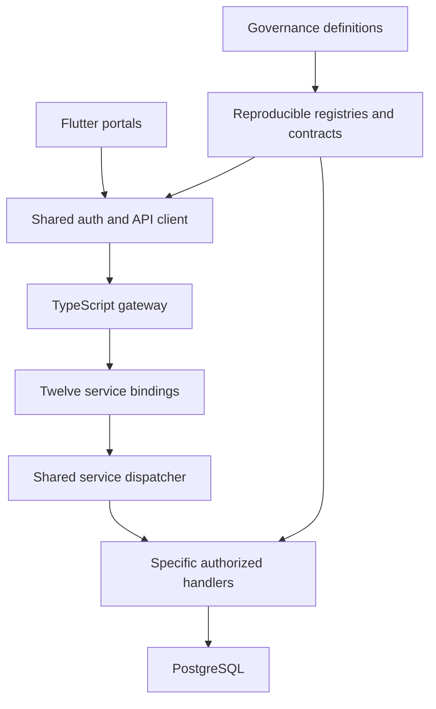

# PrimeCare architecture, interfaces and data integrity

## Evidence and scope

Baseline `3979ed1028c8b7dfdb9acca72b1ea53d4d034127`. Source references below are repository-relative and must be read at this baseline. `project-inventory.json` contains exact tree/blob evidence for current top-level project directories. Inventory proves existence, not deployability. The source snapshot is partial; deployed bindings, migrations, credentials and runtime capabilities require separate environment evidence.

Architecture constraints are required by `.agents/AGENTS.md`: governance is the implementation source of truth; presentation contains no business rules, SQL, hardcoded permissions or API URLs; artifacts reproduce from governed definitions; dependency injection, repository boundaries and shared UI apply. This document records observed topology and required integrity checks; it does not approve a rewrite.

## Actual directory inventory

| Layer | Inventory at baseline | Interpretation |
|---|---|---|
| Flutter app directories | `primecare_business_development`, `primecare_client`, `primecare_clinic`, `primecare_corporate`, `primecare_enterprise_blueprint`, `primecare_franchise`, `primecare_governance`, `primecare_marketing`, `primecare_support` under `apps/` | Nine app directories with manifest evidence. Their names identify intended portal areas; screen and workflow completeness must come from governance and tests. |
| Additional app directory | `apps/primecare_governance_worker` | Worker project; do not count as a tenth Flutter portal. |
| Service directories | `api_gateway`, `auth_api`, `billing_api`, `client_api`, `compliance_api`, `franchise_reporting_api`, `governance_api`, `notes_api`, `notification_api`, `provider_api`, `scheduling_api`, `verification_api`, `visit_api` under `services/` | Thirteen service directories including the gateway. Twelve business service bindings are observed in the TypeScript gateway. Deployment count must be independently checked. |
| Shared packages | `contracts`, `database`, `database_client`, `domain`, `factory_system`, `flutter_core`, `infrastructure`, `messaging`, `primecare_ui`, `security`, `worker-api` under `packages/` | Eleven package directories. Names do not prove every package is on the active dependency path. |
| TypeScript deployment/runtime source | `cloudflare/workers/src/` | Inspected gateway, shared service dispatcher, auth and specific owned-record workflows. |
| Additional website tree | `websites/typescript` | Identified tree; executable websites and manifests require their own inventory. |

The older 17/19-project estimate is not a verified count. The current inventory is 34 immediate project directories across apps/services/packages, plus the separately identified website tree. These are not 34 independently deployed products. Manifest SDK ranges, locked tool versions and active build commands must be recovered before a clean-room build. Do not infer Flutter or Node versions solely from CI's previous test environment.

## Runtime request topology

Observed gateway: `cloudflare/workers/src/gateway.ts`. Binding names: `AUTH`, `CLIENT`, `PROVIDER`, `VISIT`, `NOTES`, `BILLING`, `SCHEDULING`, `NOTIFICATION`, `VERIFICATION`, `COMPLIANCE`, `GOVERNANCE`, `FRANCHISE_REPORTING`. These are code-required bindings; deployment configuration must prove their actual service destinations and environment. Prefix aliases `providers`, `visits`, `notifications` share canonical service bindings. The gateway matches `/v1/<service>` or `/api/<service>`, rewrites hostname to `service`, strips the service prefix and forwards the original request. Specific compatibility mappings run first.

Observed shared dispatcher: `cloudflare/workers/src/service.ts`. It applies its own origin checks; responds to health with a database `SELECT 1`; dispatches explicit handlers in source order; returns 501 for matched but unimplemented screen business-data/actions; returns 404 for unknown routes; catches exceptions and returns a generic 500. A service-root `status:ok` response is not a business workflow success or readiness certificate.

### Gateway/interface invariants

| ID | Boundary | Required invariant and evidence |
|---|---|---|
| ARC-INT-001 | Public route to canonical handler | Exact method and path must agree with governance and caller; wrong method rejects rather than rerouting to a semantically different operation. |
| ARC-INT-002 | Compatibility aliases | Each alias has canonical target, method, version and retirement policy. Observed read aliases reject non-GET; approved client booking submission aliases require POST. |
| ARC-INT-003 | Forwarded context | Subject/tenant must still be verified by handler; gateway route selection is not authentication or authorization. User headers cannot establish trusted privileges. |
| ARC-INT-004 | Response | Gateway currently adds `cache-control:no-store` and gateway identification. Preserve security headers and approved correlation/retry metadata through wrapping. |
| ARC-INT-005 | Health | Gateway evaluates all twelve unique service health responses and returns 503 for degradation. Separate database availability from business-contract readiness and external-delivery readiness. |
| ARC-INT-006 | CORS | Gateway allows a Pages-origin pattern; service also contains a `primecare.ca` pattern. Actual origin acceptance differs across boundaries; reconcile with approved origins and test OPTIONS plus authenticated requests. |
| ARC-INT-007 | Unsafe retries | Transport cannot retry a business mutation merely because network outcome is unknown. Use approved idempotency semantics and recovery lookup. |

## Logical bounded contexts

The following are review boundaries grounded in existing handlers and model modules, not proposals for new APIs or permission scopes.

| Context | Existing evidence | Ownership responsibility and exclusions |
|---|---|---|
| Identity/access | `auth.ts`, `account-admin.ts`, `account-policy.json`; platform User/Tenant models | Verify active subject, session, applicable grants and tenant. Role-to-screen policy is not automatically endpoint record authority. |
| Client care | `client-self.ts`, `client-records-registry.json`, care/client modules | Client-profile binding, owned retrieval, approved booking lifecycle. Excludes unspecific family consent and cross-client visibility. |
| Provider/workforce | Provider self/records/timesheet handlers; scheduling models | Provider ownership, assignments, availability, timesheet item integrity. Excludes invented payroll approval or clinical privilege. |
| Clinical records | Clinical/PSW models and form registries | Care-subject identity, sensitive fields, professional scope and approved lifecycle. Model/schema presence is not workflow implementation. |
| Billing/accounting | Billing models and `billing_service.ts` | Exact money semantics, invoice/payment relationships, approved accounting transitions. External-provider references require verified configuration. |
| Governance/presentation | `governance-api.ts`, workspace registries, UI/domain registries | Controlled definitions, generated UI metadata and exact traceability. Governed metadata does not supply absent business data. |
| Notifications/integrations | Messaging, webhook, communication models | Delivery attempts, identity, tenant, signatures and retry evidence. Database commit cannot claim successful email/webhook delivery. |
| Reporting/automation | Reporting, AI and analytics model groups | Approved inputs, formulas, provenance and disclosure boundary; no inferred automated write authority. |

Boundary contract ownership requires one named maintainer per canonical workflow. Client and gateway changes cannot independently redefine persistence policy. Shared packages may expose typed contracts and transport, but not unverified permission defaults.

## Two distinct databases of responsibility

**Governance database:** `.agents/governance/governance.db` is the declared design source of truth. Its records define APIs, roles/grants, screens, sections, elements, localization, tokens and implementation evidence. Inspect actual schema and linked records before migration; do not assume table names from this conceptual list. Generated contract artifacts reference source hashes and exact declaration IDs. A governance snapshot is a design authority, not proof that operational data is present or that production is healthy.

**Operational PostgreSQL:** Prisma model files under `packages/database/prisma/schema/` describe operational entities. TypeScript auth/source handlers use parameterized PostgreSQL queries. Their actual SQL, current migrations and deployed tables must reconcile; the generated Prisma client schema is an artifact, not proof that every live table/constraint is up to date. `auth_sessions` appears in inspected SQL; its migration and store configuration must be included in identity verification even where not present in the selected Prisma module.

Observed credential contract in `auth.ts`: opaque 43-character base64url tokens; an explicit invalid Authorization header does not fall back to cookies; cookie authentication requires exactly one `session_token`; stored session lookup uses SHA-256 of the token. This inspected flow is not evidence of JWT issuance. `Env` declares `DB_URL` and `SERVICE_NAME`; `withDb` creates a PostgreSQL client, connects, executes the operation and closes in `finally`. Connection limits, pooling, TLS and Worker compatibility must be checked against actual deployment configuration and load tests; do not call this connection wrapper a verified pool.

Never copy real production clinical records into governance examples or developer fixtures. Never erase or rebuild production tables to align a documentation draft. Migrations require explicit mapping, tested rollback/recovery and approved compatibility behavior.

## Data model evidence and integrity constraints

| Source module | Observed entities or fields | Integrity obligations to verify |
|---|---|---|
| `01_platform.prisma` | User `email` unique, `tenantId`, `roles` string, active status; Tenant slug unique, hierarchy, device/VPN settings, CORS JSON; AuditLog, ApiKey, UserDevice | Global email uniqueness versus tenant login policy must agree. Delimited/string roles require actual parser policy. Tenant hierarchy grants no automatic inheritance. Configuration schema must reject malformed values. |
| `02_care.prisma` | ClientProfile, ProviderProfile, Visit, Booking, ProviderAvailability, VisitNote, Incident, ProviderDocument | Session-to-profile binding; patient/provider/visit tenant agreement; assignment authority; document storage and disclosure policy. |
| `03_scheduling.prisma` | ShiftAssignment status default `offered`; Timesheet draft status/totalMinutes/reviewer; TimesheetItem links timesheet and visit; ShiftHandover tenant/provider/visit; AvailabilityOverride | Child items lacking direct tenant column must authorize through all parent relations. Check provider and visit share tenant and ownership. Default status does not define all allowed transitions. |
| `04_clinical.prisma` | CarePlan, ClinicalRecord, ClinicalAssessment, MedicationRecon, ConsentForm, Prescription, MAR_Entry, EVVRecord | Patient authorization and consent; clinical field validation; sign/amend policy; immutable attribution; record versioning. |
| `05_billing.prisma` | Invoice monetary fields Decimal(20,4), optional CAD currency; Payment belongs to Invoice; Claim amount Float; ledger, journal/reconciliation models | Decimal serialization and rounding contract; child payment tenant via invoice; avoid Float arithmetic for monetary decisions without approved conversion. Schema difference is a risk to review, not authorization to change stored values. |
| `06_extensions.prisma` | FamilyMember, Referral, TrainingAssignment, WebhookEndpoint/Delivery, AIInference, CommunicationLog, AppNotification | Delegation/consent, enrollment scope, webhook signature and retry semantics, model provenance, delivery-versus-enqueue distinction. |
| `09_psw_forms.prisma` | ProviderShiftLog, AdlCareLog, ProviderVitalSign, BehaviorNote, NutritionRecord, MobilityLog, NarrativeProgressNote | Approved provider assignment, patient record scope, valid units/time, professional authority and clinical record lifecycle. |
| `d_*` and `16_remaining_portals.prisma` | Portal/reporting nodes, support tickets, finance records and metrics | Detect duplicate concepts, disconnected reporting stores and undefined source-of-truth formulas. Node existence does not establish real metrics or data lineage. |

### Invariant catalogue

- **DATA-001 Subject:** every record access identifies a verified actor and authorized target; body/header user IDs are input to validate, not trusted identity.
- **DATA-002 Tenant:** parent and child rows used together belong to the authorized tenant. Filtering only the top-level ID is insufficient if joined rows can cross boundaries.
- **DATA-003 Ownership:** self-service targets resolve from session-to-profile relationships; a same-tenant nonowner must still be denied unless an explicit grant exists.
- **DATA-004 State:** permitted transitions are operation-specific; reject stale or terminal state mutations and preserve defined history.
- **DATA-005 Time:** store/compare instants consistently; document source timezone for date-only scheduling and intervals; no inferred timezone or rounding rule.
- **DATA-006 Money:** currency, scale, rounding and tax decisions are explicit; maintain exact values and approved ledger semantics.
- **DATA-007 Audit:** actor/tenant/target/outcome are recorded without credentials or unnecessary clinical content; audit failure behavior follows the operation contract.
- **DATA-008 Replay:** idempotency key includes approved actor/tenant/operation scope and payload binding; same key with different payload cannot masquerade as replay success.
- **DATA-009 Referential integrity:** foreign keys and deletion policy agree with authorized parent ownership; application checks supplement rather than replace constraints.
- **DATA-010 Derived data:** dashboard/report numbers cite source query, time window and formula; denied/unavailable sources remain unavailable, never synthetic zero or success.

## Transaction and concurrency review protocol

For each write, document the actual current query sequence before changing it: credential validation; target lookup; authorization; expected-state check; idempotency reservation; writes; audit; commit; external dispatch; response. Determine which reads must be locked and which uniqueness constraints settle races. A read outside the transaction can be stale before a write; using a lock name alone does not prove correct scope.

Observed auth source uses transactions, user/session locks and tenant-scoped advisory-lock keys for some administrative mutations. Preserve existing tested behavior while verifying exact operation semantics. Do not apply one transaction template to every workflow without checking foreign keys, lock ordering, isolation and retries.

Required tests use two independent real database connections where applicable: same idempotency key simultaneously; different payload same key; concurrent update to same record; revocation concurrent with privileged mutation; tenant mismatch before any write; failing secondary write; failing audit; external provider timeout after commit. Record committed rows, rollback absence, returned status and audit events. The finite checklist currently has no operation-specific PostgreSQL evidence mapped; these tests must close that gap explicitly.

External side effects require approved durable delivery semantics. If the transaction commits but delivery fails, report a persisted pending/delivery outcome according to its contract, not an invented total rollback. Outbox or queue use is a proposed design option until approved and configured; do not claim an existing outbox merely because a webhook-delivery model exists.

## Presentation and dependency rules

`packages/flutter_core/lib/auth_service.dart` stores actor/session state and coordinates initialization/navigation. `packages/flutter_core/lib/src/network/api_client.dart` supplies shared transport. Screen code must render governed metadata and controller state; contracts and URLs belong in approved service/registry layers. Shared `primecare_ui` components expose accessibility/test hooks and design tokens. Localization keys are governed, including error/empty/unavailable text.

For every portal, map entrypoint → shared shell → governed screen → controller → repository/transport → exact API → authorized data source. Mark unresolved edges explicitly. A portal directory, scaffolded screen, button callback, successful static analysis or configured Worker binding does not prove that this chain works.

## Configuration and environment inventory

For each runnable project record: manifest and lockfile hash; entrypoint; SDK/compiler range and installed version; build/test command; Worker or Pages configuration; actual environment names; public base URL; service binding target; database connection strategy; secret identifiers only; origin allowlist; mail/webhook integrations; observability sink; migrations; owner; release/rollback procedures. Never print secret values in documentation.

Separate developer, CI, staging and production configurations. Assert forbidden cross-environment bindings and database destinations before tests or migrations. Public frontend configuration must never contain privileged API tokens or PostgreSQL credentials. Existing source names a runtime service environment; obtain deployment configuration before asserting active services or production URLs.

## Architecture decisions and migration controls

Decisions must carry ID, context, source evidence, alternatives, chosen owner-approved rule, compatibility impact and tests. Initial architecture review subjects: canonical whoami method; CORS mismatch; session store versus Prisma reconciliation; duplicate portal/reporting model lineage; Decimal versus Float financial semantics; tenant qualification of child-only tables; definition of each service deployment; secure client credential persistence; metrics and automation provenance.

Before migration: snapshot source and schema versions; map consumers; verify restore procedure in nonproduction; add schema/contract changes using backward-compatible phases where approved; test old and new callers; deploy ordered artifacts; monitor actual release signals; retire compatibility only with evidence. Do not treat this checklist as authorization to execute a production migration.
