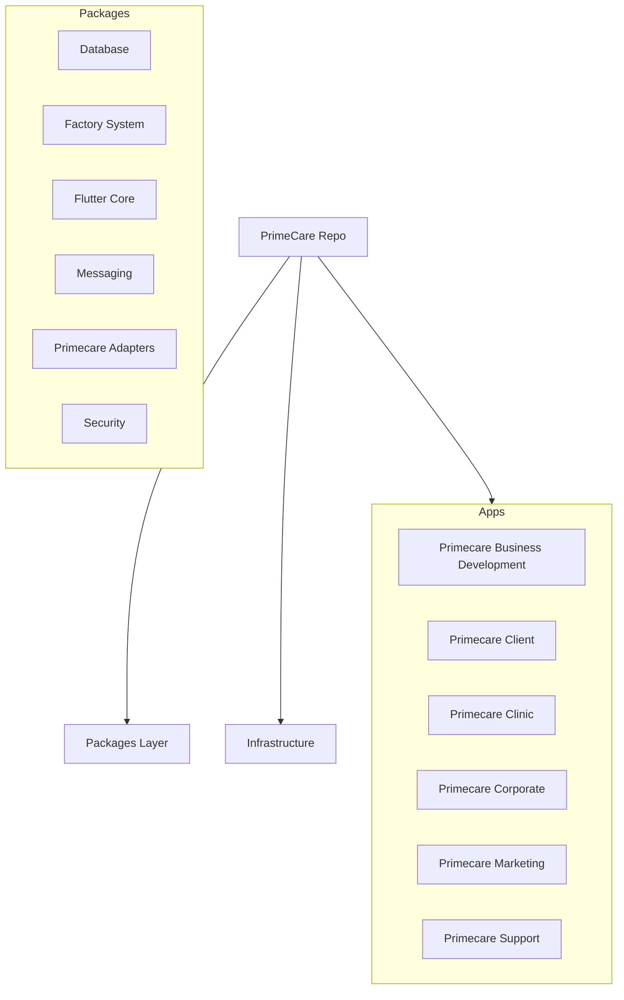

# 🌐 PrimeCare: Full Codebase Picture

## 🚀 Platform Vitality Overview
- **Total Scale**: 5909 Files | **579,219** Lines of Code
- **Total Volume**: **154.58 MB** on Disk
- **Mapping Maturity**: 318 Hardened Sectors | 1005 Infrastructure Units

## 🗺️ Architectural Landscape

## 📊 Language Volume Distribution
| Language | File Count | Total LOC | Total Size (KB) |
| :--- | :--- | :--- | :--- |
| `.ts` | 584 | 431,257 | 18030.1 |
| `.dart` | 2315 | 107,709 | 3470.7 |
| `.js` | 50 | 14,434 | 3093.3 |
| `.md` | 710 | 11,599 | 602.5 |
| `.prisma` | 22 | 7,301 | 254.6 |
| `.py` | 70 | 5,573 | 222.2 |
| `.yaml` | 25 | 1,346 | 45.0 |
| `no-ext` | 59 | 0 | 83.0 |
| `.json` | 1057 | 0 | 3438.4 |
| `.ps1` | 13 | 0 | 13.2 |
| `.yml` | 1 | 0 | 1.1 |
| `.mjs` | 36 | 0 | 67.9 |
| `.cjs` | 10 | 0 | 27.3 |
| `.db` | 1 | 0 | 676.0 |
| `.sh` | 1 | 0 | 0.2 |
| `.zst` | 110 | 0 | 876.9 |
| `.xlsx` | 1 | 0 | 12.4 |
| `.txt` | 24 | 0 | 8936.1 |
| `.iml` | 10 | 0 | 8.6 |
| `.lock` | 10 | 0 | 272.9 |
| `.xml` | 46 | 0 | 35.1 |
| `.png` | 246 | 0 | 87048.5 |
| `.html` | 12 | 0 | 101.7 |
| `.log` | 19 | 0 | 56.8 |
| `.toml` | 2 | 0 | 0.4 |
| `.sql` | 3 | 0 | 74.9 |
| `.node` | 1 | 0 | 18810.5 |
| `.wasm` | 1 | 0 | 2080.4 |
| `.css` | 16 | 0 | 37.2 |
| `.tmp` | 1 | 0 | 5.5 |
| `.pyc` | 1 | 0 | 8.3 |
| `.mts` | 1 | 0 | 1.6 |
| `.ico` | 2 | 0 | 29.5 |
| `.ttf` | 2 | 0 | 163.5 |
| `.woff2` | 5 | 0 | 501.3 |
| `.svg` | 23 | 0 | 3572.1 |
| `.woff` | 1 | 0 | 18.2 |
| `.jpg` | 137 | 0 | 4890.4 |
| `.gif` | 2 | 0 | 47.2 |
| `.tsx` | 263 | 0 | 614.4 |
| `.scss` | 16 | 0 | 56.7 |

## 📦 Package Density & Capacity
| Package/App | Total LOC | Total Size (MB) | Density (LOC/File) |
| :--- | :--- | :--- | :--- |
| `database` | 406,378 | 39.75 | 4369.7 |
| `flutter_core` | 62,108 | 10.23 | 24.3 |
| `factory_system` | 34,591 | 1.48 | 83.0 |
| `root` | 30,623 | 96.99 | 13.3 |
| `domain` | 30,086 | 4.32 | 242.6 |
| `primecare_adapters` | 7,165 | 0.27 | 56.4 |
| `infrastructure` | 3,017 | 0.13 | 73.6 |
| `verification-service` | 1,680 | 0.06 | 84.0 |
| `primecare_corporate` | 1,011 | 0.61 | 24.1 |
| `primecare_clinic` | 678 | 0.11 | 16.5 |
| `primecare_franchise` | 377 | 0.10 | 13.5 |
| `primecare_business_development` | 337 | 0.21 | 12.5 |
| `primecare_marketing` | 299 | 0.09 | 12.0 |
| `primecare_support` | 276 | 0.09 | 11.0 |
| `security` | 234 | 0.01 | 29.2 |
| `primecare_client` | 188 | 0.11 | 6.1 |
| `messaging` | 135 | 0.00 | 22.5 |
| `contracts` | 36 | 0.00 | 6.0 |
| `Excel data.xlsx` | 0 | 0.01 | 0.0 |

## 🚩 Orphan Risk Assessment
| Path | LOC | Size (KB) | Age (Days) |
| :--- | :--- | :--- | :--- |
| apps\primecare_corporate\lib\routes\groups\corporate_routes.dart | 0 | 19.4 | 0 |
| apps\primecare_franchise\lib\routes\groups\franchise_routes.dart | 0 | 10.9 | 0 |
| packages\primecare_adapters\lib\src\models\core\02_M_dashboard_models.dart | 0 | 10.4 | 0 |
| apps\primecare_business_development\lib\routes\groups\business_development_routes.dart | 0 | 10.3 | 0 |
| packages\flutter_core\lib\features\administrative_forms\domain\models\administrative_forms_state.freezed.dart | 0 | 10.1 | 0 |
| packages\flutter_core\lib\features\system_verification\domain\models\system_verification_state.freezed.dart | 0 | 10.1 | 0 |
| packages\flutter_core\lib\features\intake_coordinator\domain\models\intake_coordinator_state.freezed.dart | 0 | 10.1 | 0 |
| packages\flutter_core\lib\features\developer_samples\domain\models\developer_samples_state.freezed.dart | 0 | 10.0 | 0 |
| packages\flutter_core\lib\features\quality_assurance\domain\models\quality_assurance_state.freezed.dart | 0 | 10.0 | 0 |
| packages\flutter_core\lib\features\physiotherapist\domain\models\physiotherapist_state.freezed.dart | 0 | 10.0 | 0 |
| packages\flutter_core\lib\features\franchise_owner\domain\models\franchise_owner_state.freezed.dart | 0 | 10.0 | 0 |
| packages\flutter_core\lib\features\local_marketing\domain\models\local_marketing_state.freezed.dart | 0 | 10.0 | 0 |
| packages\flutter_core\lib\features\territory_sales\domain\models\territory_sales_state.freezed.dart | 0 | 10.0 | 0 |
| packages\flutter_core\lib\features\clinical_forms\domain\models\clinical_forms_state.freezed.dart | 0 | 9.9 | 0 |
| packages\flutter_core\lib\features\family_member\domain\models\family_member_state.freezed.dart | 0 | 9.9 | 0 |
| packages\flutter_core\lib\features\chiropractor\domain\models\chiropractor_state.freezed.dart | 0 | 9.9 | 0 |
| packages\flutter_core\lib\features\common_forms\domain\models\common_forms_state.freezed.dart | 0 | 9.8 | 0 |
| packages\flutter_core\lib\features\hr_manager\domain\models\hr_manager_state.freezed.dart | 0 | 9.8 | 0 |
| packages\flutter_core\lib\features\crm_forms\domain\models\crm_forms_state.freezed.dart | 0 | 9.7 | 0 |
| packages\flutter_core\lib\features\hr_forms\domain\models\hr_forms_state.freezed.dart | 0 | 9.7 | 0 |
